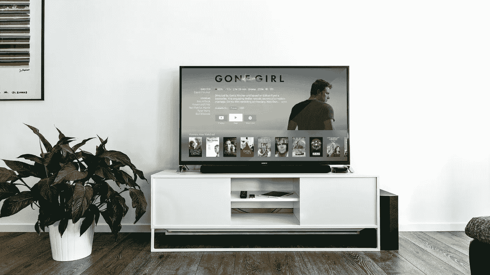
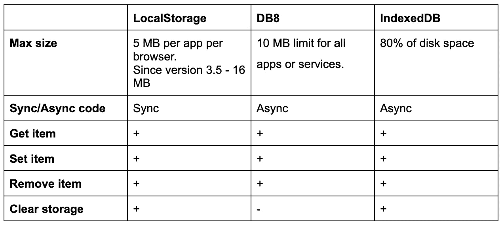

# 如何在 LG WebOS 上使用 DB8 而不是 LocalStorage 和 indexedDB

> 原文：<https://itnext.io/how-to-use-db8-on-lg-webos-instead-of-localstorage-and-indexeddb-bfee6979094b?source=collection_archive---------1----------------------->

照片由 [Unsplash](https://unsplash.com/?utm_source=unsplash&utm_medium=referral&utm_content=creditCopyText) 上的[延斯·克罗伊特](https://unsplash.com/@jenskreuter?utm_source=unsplash&utm_medium=referral&utm_content=creditCopyText)拍摄

# DB8 是什么？

“DB8 是 webOS 电视的一种存储方式。DB8 旨在满足强大、高性能应用的需求。DB8 是 Luna Bus 上提供的服务，与嵌入式 JSON 数据库接口。—[https://webostv . developer . lge . com/develop/app-developer-guide/db8/webos-db8-basics/](https://webostv.developer.lge.com/develop/app-developer-guide/db8/webos-db8-basics/)

DB8 的主要特性包括:

-支持高速访问和查询。

-存储 JSON 对象。

-应用感知访问控制。

-对一次最多可以检索 500 个对象的查询的分页支持。

-支持变更通知。

-通过模式实施进行数据对象验证。

# 为什么我们应该使用 DB8 而不是 LocalStorage？

智能电视上的应用程序(Tizen，WebOS)可以与 LocalStorage 一起工作，因为它是一个浏览器(Chromium)，没有任何问题。但是这里有一个细微的差别。当您从电视上移除应用程序，然后在 WebOS 6.0 上再次安装时，localStorage 将保持与之前的状态相同(移除应用程序之前)。您无法处理这种行为并手动清除它。

现实生活中的例子:如果你在 app 中登录你的帐户，并想出售电视，你从这台电视上删除应用程序，新客户再次安装此应用程序，他会看到什么？是的，不幸的是，他看到了你的登录账户。

在 Tizen 上，当你删除应用程序时，它也会清除本地存储信息。

DB8 允许使用保存的数据更新应用程序，但在删除后，它会清除所有应用程序信息。

此外，DB8 可以用作 NoSQL 数据库

# 比较 DB8、LocalStorage 和 indexedDB

如你所见，DB8 与 indexedDB 最为相似，我们只用清晰的数据解决了最重要的问题。

# 在 DB8 中实现 getItem

为了获取物品，我使用了 **find** 方法。

# 在 DB8 中实现 setItem

在 DB8 中，我们不能直接更新数据。这就是为什么我删除了 prev 值，并使用 **putKind** 创建了一个新类型，并使用 **put** 方法保存了一个新值。

# 在 DB8 中实现 removeItem

为了删除数据，我们应该使用方法 **delKind。**

# 清理存储

您不能清除所有存储，您只能按 id 删除记录。但是你也拿不到身份证的清单。记录与所有者连接的应用程序内，在应用程序删除后，它会自动清除所有记录。

# 结论

我不知道为什么 LG 决定为 WebOS 6 开发人员的复杂生活，但我们应该使用 DB8:)

一般来说，我们可以使用 indexedDB，它允许我们做类似的事情，但我们不能在删除应用程序后清除数据。

从性能上来说，它的工作速度相当快，但对于用户的期望来说，它的工作速度与 indexedDB 和 localStorage 相同。

您可以在[文档](https://webostv.developer.lge.com/develop/code-samples/db8/)中找到更多示例