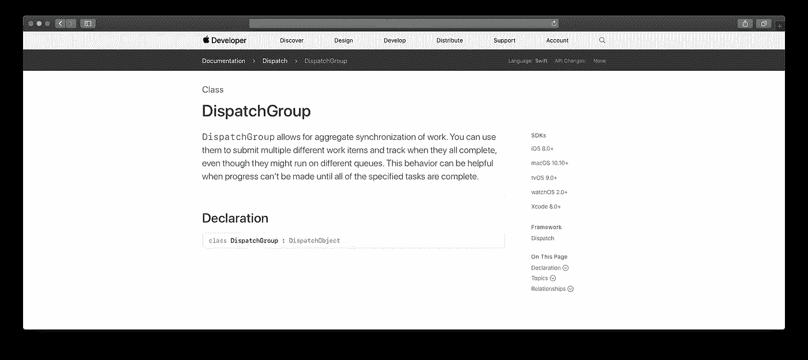
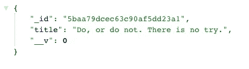
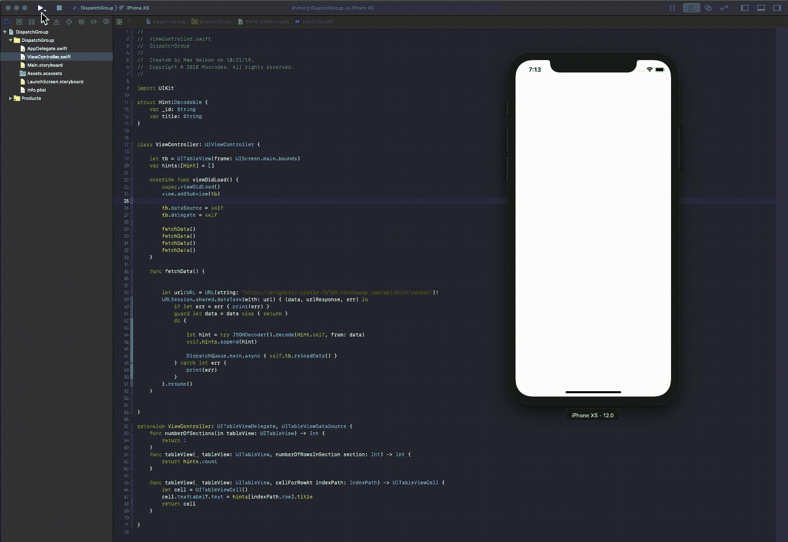
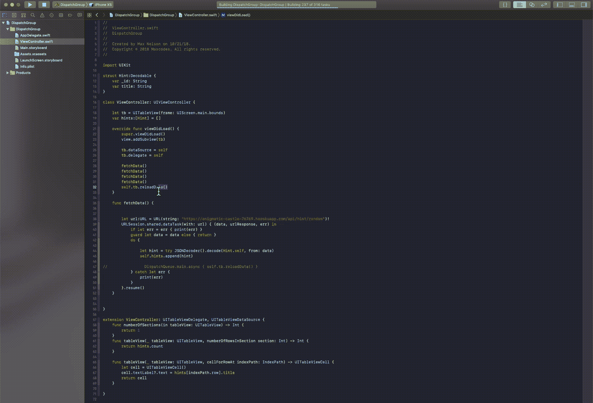
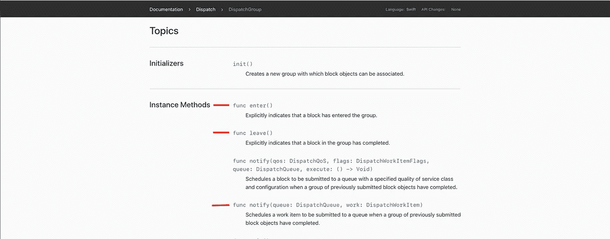
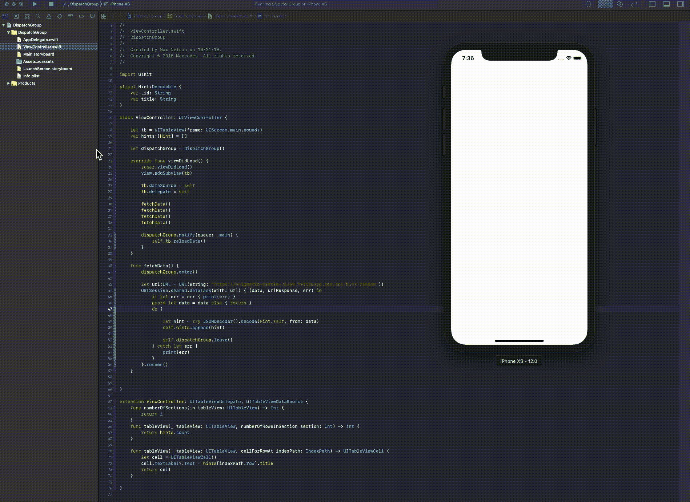
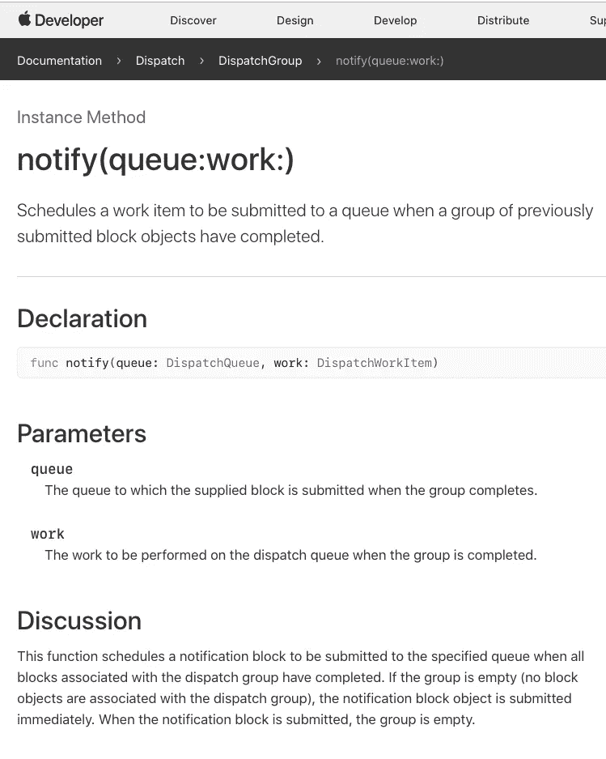
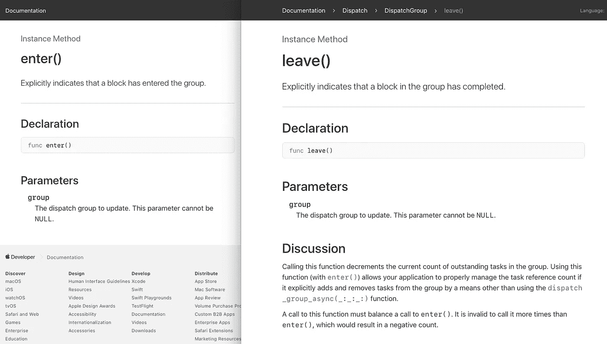

# 如何在 Swift 4.2 中使用 DispatchGroup(类似于 JavaScript 中的 async await)

> 原文：<https://itnext.io/how-to-use-dispatchgroup-in-swift-4-2-similar-to-async-await-in-javascript-62a2ff04e51e?source=collection_archive---------0----------------------->

DispatchGroup 将解决以下三种场景中的问题，等等。

## 场景:

1.  在下一行代码执行之前，您正在获取一段您需要的数据，比如一个 apple music 开发者令牌。
2.  您正在获取需要在您的 UI 中结束的数据— UICollectionView、UITableView 等—但从未进入您的 UI，因为您的视图甚至在您获取数据之前就被重新加载— view.reloadData。
3.  你正在获取需要在你的集合视图、表格视图等中结束的数据，你必须执行多次重新加载，这使得你的应用看起来不连贯，给它一个糟糕的用户体验。

好吧，如果这些场景都不适合你的情况，我仍然强烈推荐阅读这篇文章，因为这是一个可靠的工具，我希望我自己早点了解它，如果你继续编写代码，你会发现它很有用，因为这些是上面列出的非常常见的问题。

很快的，我录了一段视频，内容和本文中的一样。

# **好了，我们终于开始了。**

这将是快速和容易的。[源代码可以在 GitHub](https://github.com/Maxnelson997/DispatchGroup) 上找到

如果你有一个 JSON 格式化程序 chrome 扩展，它看起来会像这样。如果不这样做，它看起来就像纯文本。

我将使用一个提供随机提示的小 API。我已经上传到这里的 [Heroku 了。这个 URL 会用一个随机提示](https://enigmatic-castle-76769.herokuapp.com/api/hint/random)来响应。

好了，这里的目标是获取五个左右的提示，并将它们显示在我们的 UITableView 中。我创建了一个新的 Xcode 项目，这是我的视图控制器和模拟器。

这段代码简单地将一个 tableview 放在屏幕大小的视图上，使用我们编写的 fetchData 函数从我们在 heroku 上的端点获取数据四次。每次获取数据时，它都会在主线程上重新加载 tableview(注意第 47 行)。

好了，这段代码的问题很小，但是在我们有很多单元格和好看的用户界面的应用程序中很明显。波涛汹涌。注意每个单元格标题出现的时间不同吗？是的，我们想避免这种情况。不如我们等待所有数据加载完毕，然后重新加载我们的 tableview，这样会很好。让我们试一试

好了，这是我们修改并运行的代码。我们已经注释掉了第 47 行，并在第 32 行的 viewDidLoad 中的四个 fetchData 调用下面添加了一行。

但是你会看到一旦模拟器弹出，什么也没发生。我们的数据永远不会进入我们的表格视图。这是因为第 32 行是在我们收到 fetchData get URLSession get 请求中的数据之前运行的。所以我们可以实现回调，换句话说，一个我们作为参数传递的函数，然后在收到数据后调用。但是光是想想就很困惑。我们会有一堆讨厌的嵌套函数。

# 调度组化险为夷

好了，我们终于说到重点了。通过使用 DispatchGroup，我们可以避免所有这些讨厌的问题，包括像回调这样讨厌的解决方案。

这是我们将要使用的三种方法。除此之外，我们需要担心的是创建 DispatchGroup 对象。

好了，我们修改了下面的代码。我已经删除了注释行。注意第 21、35–37、41 和 52 行。您将看到我们的数据现在被同步加载到 tableview 中，特别是因为我们现在在应用程序中非常异步地做事情。在 gif 下面再详细说说吧。

好吧，一行一行来。我们开始吧。[在此调度集团单据](https://developer.apple.com/documentation/dispatch/dispatchgroup)

第 21 行—我们声明了 DispatchGroup 的一个实例

第 35 行——我们编写了一个函数，当通知它运行时，它将在主线程上运行。

第 41 行—我们调用 enter [实例方法](https://developer.apple.com/documentation/dispatch/dispatchgroup/1452803-enter)

第 52 行——我们通过调用 leave [实例方法来减少未完成任务的数量。读“讨论”。](https://developer.apple.com/documentation/dispatch/dispatchgroup/1452803-enter)TL；DR——每次我们调用 enter 时，我们必须调用 leave 来完成我们通过调用 enter 开始的任务。

第 36 行—我们重新加载 tableview 数据。我们在这个函数中这样做是因为每次调用 enter()时，我们都会向组提交一个要完成的新项目或任务。直到 leave()平衡了我们调用 enter()的次数，notify 函数才会被执行。

例如:每次我们调用 enter()时，我们需要确保在某个时刻我们调用的 leave()或我们的 notify(queue:work:)函数永远不会被执行，因为在它完成之前还有未完成的任务要完成。

这样做效果很好的原因是，当我们在第 41 行调用 dispatchGroup.enter()时，它会在我们到达调用 dispatchGroup.leave()的第 52 行之前调用所有四个函数。这是因为第 52 行是在 get 请求完成后调用的。

# 结论

DispatchGroup 相当于 JavaScript 中的异步 await 函数。如果我遗漏了什么，并且有更好的解决方案来匹配 async await，请告诉我！这是我发现的不需要外部库的最接近的东西，我非常想找到其他的解决方案，我相信我们都是这样。

# 更多的好东西

如果你想第一个听说有限的免费课程优惠券(每月 10 张)，请随时订阅我的 [**每周开发内容电子邮件列表。**](https://www.maxcodes.io)