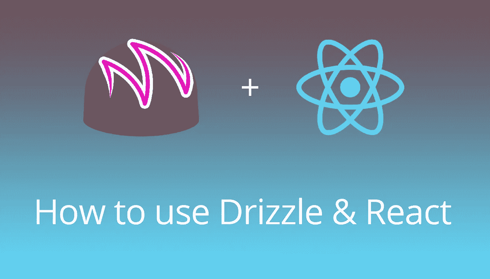

# 如何使用毛毛雨(松露和反应)，使你的以太坊 DApp 最好的前端

> 原文：<https://itnext.io/how-to-use-drizzle-truffle-and-react-to-make-the-best-front-end-for-your-ethereum-dapp-ee09c8e94eae?source=collection_archive---------2----------------------->

我正在做一个 DApp，刚刚开始开发前端。起初，我只是使用 Web3 和 React，但试图连接到 MetaMask 并让一切都变得被动是一场噩梦。

这就是毛毛雨的由来。

毛毛雨是一个负责处理用户提供者(MetaMask，Mist 等)的库。)并让所有传入的数据都能很好地与 React 一起播放。唯一的问题是开始时有点混乱。我花了大约 3 个小时才弄明白毛毛雨在做什么，所以我想确保没有人会经历这些。

# 准备松露和毛毛雨

第一步是设置松露和毛毛雨。Truffle 附带了一组基本上只是模板的“盒子”。[按照以下步骤](http://truffleframework.com/boxes/drizzle)设置你的毛毛雨模板。

这将建立一个简单的契约和一个基本的前端小集合松露。这个项目的主要文件是`Home`布局(`Home.js`)。这就是毛毛雨发挥作用的地方。

这就是令人困惑的地方。

# Home.js，它是怎么获取数据的？

首先，看一下 HomeContainer.js。

`mapStateToProps`将要告诉毛毛你想要得到哪些契约**作为有状态道具**。当您调用`drizzleConnect`时，这些契约状态将作为道具传递给您的组件。

**这些道具只是状态，包含您收到的某个合同的数据。你不能用这些东西打任何电话。**

如果您想要进行任何契约调用，您需要使用通过上下文赋予组件的`drizzle`变量(当我们创建自己的组件时，这将更有意义)。Home 并不要求使用`drizzle`变量，所以它需要一些帮助来获取数据。

让我们看看 Home.js 中的一行代码

契约`SimpleStorage`有一个名为`storedData`的方法，它简单地返回契约中存储的任何数据。

ContractData 是`drizzle-react-components`给我们的一个组件。

[你可以在这里查看 ContractData 的源代码。](https://github.com/trufflesuite/drizzle-react-components/blob/master/src/ContractData.js)

ContractData 是它自己的毛毛雨连接组件，它将调用合同并将数据显示为文本。这对测试来说很好，但是如果我们想用另一种方式呈现数据呢？

# 创建我们自己的毛毛雨组件

首先，让我们制作容器。我将把这个组件称为 GetTokens，因为它将简单地从`TutorialToken`合同中获取当前用户的余额。

在`mapStateToProps`中，我告诉毛毛我想从`TutorialToken`合同中得到数据作为道具。然后我调用 drizzleConnect 来创建容器，使用 GetTokens 作为组件。

首先看一下**第 31–33 行**。我确保我指定了这个组件应该在上下文中接收`drizzle`变量。这是保存我的合同的所有实际对象并允许我调用的东西。

现在看第 9 行和第 10 行。我从上下文中获取`drizzle`变量，然后进行`balanceOf` **cacheCall** ，它将**返回数据**的键，并且**将结果**缓存在 TutorialToken 属性中。

我们现在需要使用这个键来获取数据。

在**第 21 行**中，我们现在看到合同道具是如何使用的。作为道具传递的`TutorialToken`对象对于每个方法都有一个对象。当对一个方法进行调用时，属性将被反应性地用结果更新。

然后，我们使用从`cacheCall`中获得的`dataKey`来获取值。

# 结论

我知道我没有把它写好，但是希望这个从契约中接收数据的组件的简单例子会有所帮助！

总之，您需要获得一个契约的状态作为道具，而且还需要获得毛毛雨变量以便进行调用。

如果还有什么困惑，请在评论中告诉我，我很乐意帮忙！