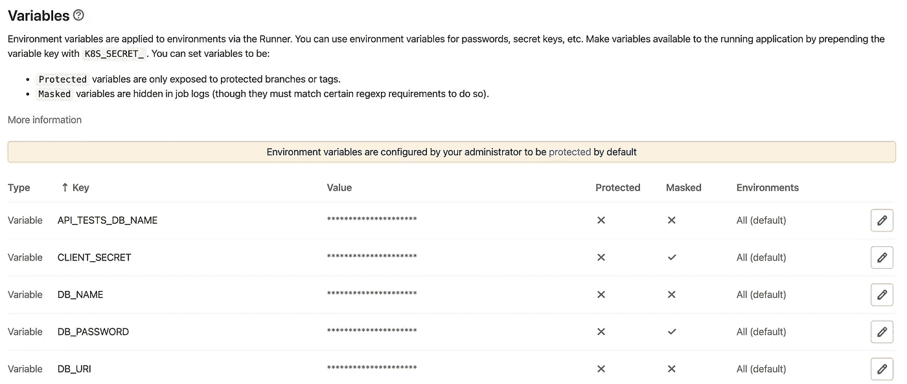

# 如何在 Node.js 中使用环境变量

> 原文：<https://itnext.io/how-to-use-environment-variables-in-node-js-cb2ef0e9574a?source=collection_archive---------0----------------------->


## 什么是环境变量，为什么它们有用？

环境变量在软件开发中很有帮助。许多程序和应用程序设置或获取环境变量。让我快速解释一下为什么您可能需要环境变量。

## 为什么我们需要环境变量？

*   **安全性**:像 API 密匙这样的东西不应该放在代码中的纯文本中，从而直接可见。
*   **灵活性**:您可以将条件语句简化为“*如果生产服务器，则执行 X else，如果测试服务器，则执行 Y else，如果本地主机，则执行 Z …* ”。
*   **采用**:git lab 或 Heroku 等流行服务支持环境变量的使用。

除了默认的环境变量，您还可以设置自己的环境变量。如果你想使用自定义的环境变量，你需要创建一个`*.env*` 文件。

## . env 文件看起来像什么？

**一个. env 文件**或多或少是一个纯文本文档。它应该放在项目的根目录中。您可以指定键值对，并且可以使用#编写单行注释。以下是一个. env 文件的示例:

```
# API
API_TOKEN=myUniqueApiToken# Database
DATABASE_NAME=myDatabaseName
```

## 如何在 Node.js 中获取和设置环境变量

```
// get an environment variable
export const token = process.env['API_TOKEN'];// set an environment variable at runtime
process.env['RANDOM_ID'] = Math.random();
```

如您所见，环境变量需要是一个字符串。如果您想要存储的不仅仅是一个简单的字符串(例如一个对象)，您可以将内容字符串化，并在需要检索时解析它:

```
// set an environment variable at runtime which holds a user object
process.env['USER'] = JSON.stringify({
		user: {email: 'someEmail@gmail.com'}
});// get an environment variable which holds a user object
const testUser = JSON.parse(process.env['USER'])
```

但是，不要过度:不要使用环境变量来代替数据库。我使用这种方法来存储一些测试数据，这些数据在所有测试的运行过程中都应该是可用的。

让我们看看如何在 Node 中使用自定义环境变量。我可以推荐`[dotenv](https://www.npmjs.com/package/dotenv)`模块，它使得从`.env`文件加载环境变量变得容易。

## 如何在节点中使用自定义环境变量

1.  **创建 an。环境文件**。该文件应该放在项目的根目录下
2.  **安装 *dotenv* 库** : `npm install dotenv`。
3.  **尽早要求*dotenv***(例如在*app . js*)`require('dotenv').config({path: __dirname + '/.env'})`。
4.  只要你需要使用环境变量(例如在 [GitLab](https://docs.gitlab.com/ee/ci/variables/) ，在 [Jenkins](https://wiki.jenkins.io/display/JENKINS/Building+a+software+project#Buildingasoftwareproject-belowJenkinsSetEnvironmentVariables) ，在 [Heroku](https://devcenter.heroku.com/articles/config-vars) ，…)你就需要**添加你的环境变量**。方式取决于平台，但通常很容易做到。
5.  可选:创建一个在服务器启动时运行的函数。它应该**检查是否设置了所有需要的环境变量，否则抛出一个错误**。



您的应用程序和工作流要使用的环境变量的定义(例如:GitLab)

## 结论

感谢阅读这篇文章。如您所见，在 Node.js 中使用环境变量很容易。您是如何使用环境变量的呢？请在评论中告诉我。