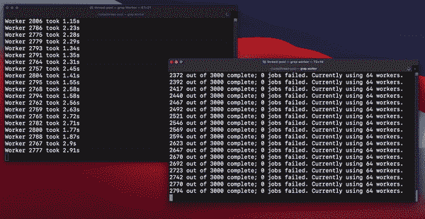
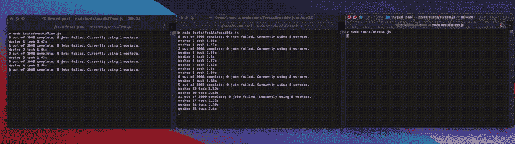

# 我在编写 NPM 包时的并发体验

> 原文：<https://itnext.io/how-to-use-every-core-on-your-machine-using-nodejs-c8083e498f9d?source=collection_archive---------1----------------------->

## 如何使用 NodeJS 来使用机器上的每个内核

每项工作都需要几秒钟才能完成，从长远来看，这是非常昂贵的。现在 3000 份工作不到一分钟！这是最后的结果。



决赛成绩

# 背景

您可能使用过其他语言，这些语言具有开发人员友好的方式来多任务处理复杂的任务。不幸的是，用 JavaScript 实现这一点总是很复杂。

在很长一段时间里，JavaScript 和 NodeJS 都受到事件循环的限制。代码异步执行，但不是真正的并行方式。然而，随着 NodeJS 中工作线程的发布，这种情况发生了变化。

发现这个概念后，我立即想测试它的全部能力。不幸的是，现有的库过于复杂和/或缺乏真正的并行能力。

# 目标

我想要一个非常适合小项目的包。它提供了一个不依赖于数据库或文件系统的作业队列，同时证明了明显的性能优势。

# 问题

许多包是并发的半生不熟的实现。例如，一些包的代码看起来像这样。

并发但有致命缺陷

上述代码是不正确的，因为它忽略了一些常见的边缘情况:

*   如果池必须终止会发生什么？
*   如果作业数量少于线程数量，会发生什么情况？
*   如果一项工作比另一项工作花费的时间长得多，该怎么办？

最后一个问题是棺材上的钉子。如果大多数作业需要 2 秒钟来处理，但一个需要 3 小时，那么整个池必须等待 3 小时，直到所有工作线程都被释放。

一些库通过产生额外的工人来解决这个问题，但这意味着开发人员缺乏对工人数量的完全控制。该池应该是确定的。

# 初始解决方案

既然`Promise.all`是阻塞的，我立刻想到`Promise.any`或者`Promise.race`一定是真并行的答案，但是我错了。实际上，对于多任务处理来说，没有一个`Promise`方法是足够的。

没有你想的那么简单

就这么定了，`Promise.race`很可能是解决方案，而`Promise.any`是有缺陷的，因为`Promise.any`必须成功完成至少一个承诺，否则就等着全部失败。

如果除了一个耗时 3 小时的作业以外，所有作业都失败了，会发生什么？同样，在作业完成或导致`Aggregate Error`之前，整个池必须等待 3 个小时。

不幸的是，`Promise.race`也不是正确的解决方案。当然，它解决了悬挂工人的问题，但还有另一个边缘情况。如果最快的承诺是唯一得到处理的，那么如何从多个工作人员那里检索结果呢？毕竟，快速并不总是正确的。

# 作业控制着线程

解决`Promise.race`问题的办法是工人自己。承诺何时解决并不重要，因为工人在后台运行。

我的解决方案是，每个工人从池中取一个线程 id。当工作者完成执行时，它返回 id。这允许池动态分配线程。

控制一次允许多少工人

# 跛的

最后一个目标是停止所有的池执行。即使有一个长达 3 小时的作业正在运行，它也会立即停止。老实说，这比承诺的其他问题更难解决。

如何创造僵尸

我的第一直觉是拒绝承诺，但这是有问题的。我注意到通过`reject`调用传递`reasons`意味着`Promise.race`只能解决**一个**。然而，承诺所有的理由让我回到了绘图板。

更糟糕的是，拒绝承诺会使主事件循环终止，但工人会变成僵尸！3 个小时后——工作人员的输出仍然堵塞着您的终端！

承诺终止以解决主事件循环

谢天谢地，我有了这个发现。线程必须显式终止工作线程。这使得终止过程完全确定，因此不会损害数据。承诺在工作承诺竞赛结束后解决。

# 项目成功！

所有的测试都通过了，我达到了我的目标！工人池在没有任何外部工具的情况下异步执行作业。它在 NPM。如果你对如何使用图书馆感兴趣，请继续阅读！

```
npm install jpool
```

# 特征

线程的数量是可变的，所有的状态都是确定的。作业要么通过，要么失败，要么停止。这允许池在没有僵尸或失控进程的情况下优雅地关闭或突然退出。

# 基本示例(Main.js)

创建 30 个作业，一次运行 8 个

# 续示例(Job.js)

查找随机数的效率很低，但是异步作业的一个很好的例子

# 看出区别了吧！

每个终端窗口都在处理同一组作业。从左到右，程序分别使用 1、8 和 256 个工作线程。线程增加了内存使用，但是好处是值得的！



# 结束了

文档需要工作，否则，该软件包似乎对 1.0.0 版稳定。如果你想帮助，我接受 PRs。感谢您的阅读！

[](https://github.com/wadez/jpool) [## 瓦德兹/jpool

### 所有好的软件包名称都被采用。这个软件包允许你通过指定…

github.com](https://github.com/wadez/jpool)