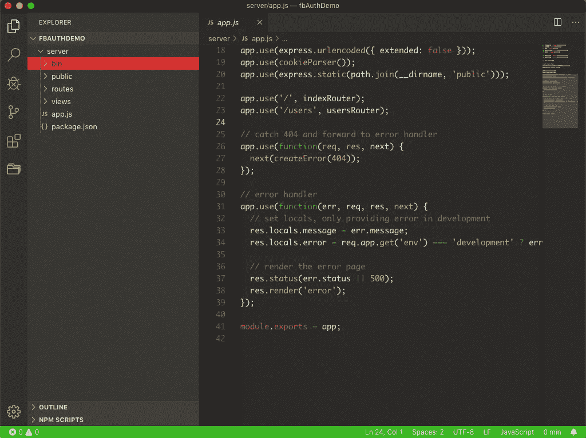
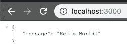
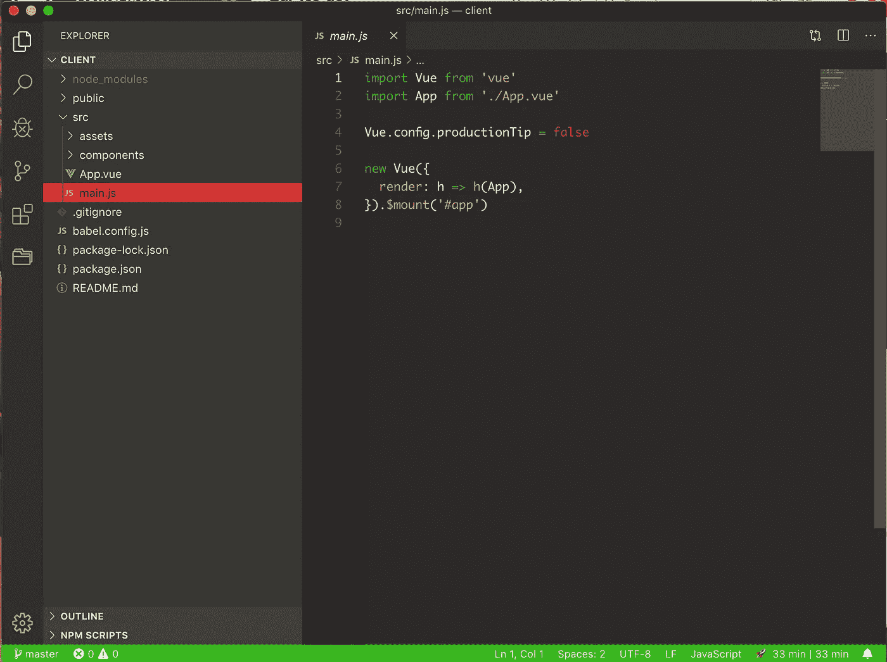
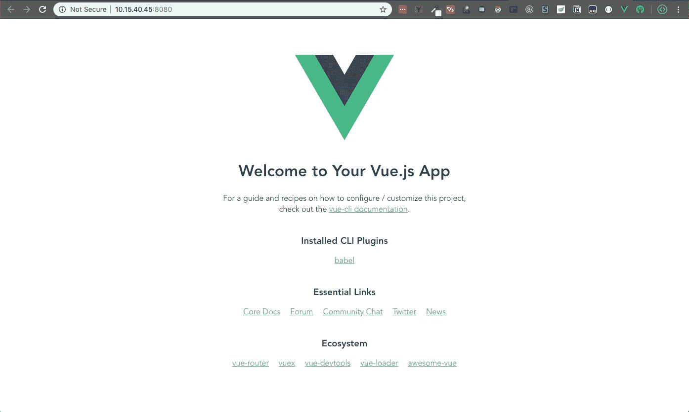
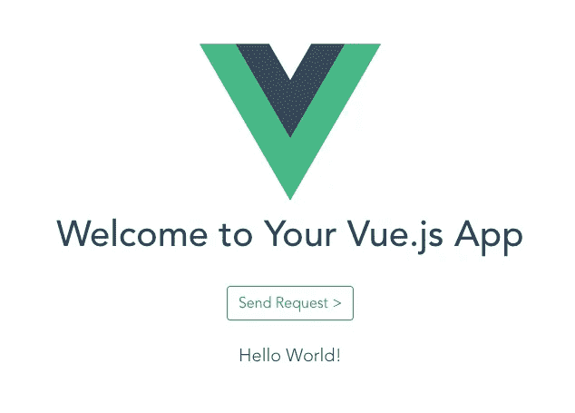
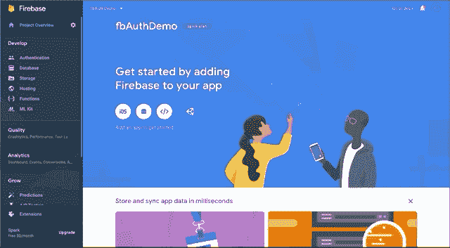
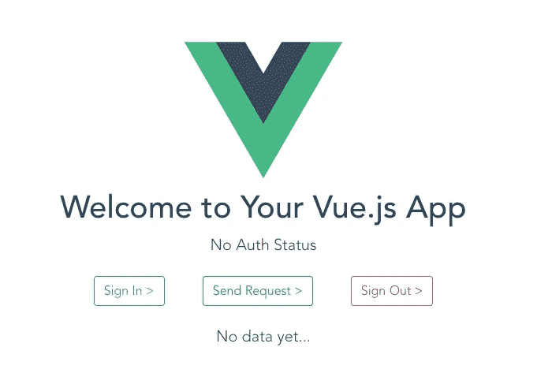
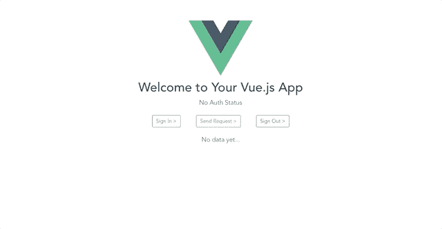

# 如何在自定义(节点)后端使用 Firebase Auth

> 原文：<https://itnext.io/how-to-use-firebase-auth-with-a-custom-node-backend-99a106376c8a?source=collection_archive---------0----------------------->

我将经历一个非常基本的应用程序设置。带有 vue 前端的节点后端。如果您已经有了后端和前端设置，只需要 Firebase Auth 部分，[跳到这里。](#36c6)

如果你只是想要代码示例，嘿，我明白了。给你。

# Node.js 后端

您需要安装节点和 npm。如果你没有，你可以在这里做:【https://nodejs.org/en/ 

我们将从 express-generator 创建我们的基本应用程序。打开您的终端，用`npm i -g express-generator`进行安装。现在创建一个文件夹，`mkdir fbAuthDemo`并进入它，`cd fbAuthDemo`。现在使用 express-generator 创建我们的节点后端`express server`。现在打开你的文本编辑器，给我`code .`。您应该会看到类似这样的内容:



香草快递应用程序

马上，让我们删除`public/`、`routes/`和`views/`文件夹，我们不需要它们。您还可以删除`app.use(<route>, <func>)`调用，以及错误处理程序、查看引擎设置调用和所有现在未使用的导入。您的 app.js 现在应该看起来像这样:

现在我们将添加一条基本路线:

我们可以通过运行我们的应用程序来测试这一点(如果你还没有运行`npm install && npm i nodemon`，然后运行`DEBUG=server:* nodemon start`。然后通过点击`[http://localhost:3000/](http://localhost:3000/)`路线来点击 Postman、curl 或您的浏览器中的端点。你应该回去:



我们的第一反应

最后，让我们添加一个用于授权的虚拟函数，稍后我们将使用 Firebase 的逻辑来填充它。我们将添加一个虚拟的`authorized`布尔值，并在一些定制的中间件中使用它来检查认证。如果用户被授权，我们将继续，如果没有，我们将发回一个`403: Unauthorized`。以上`app.get(..)`:

你现在应该可以在`authorized = true`时进入路线，在`authorized = false`时被阻挡。

在我们移动到前端之前，最后一件事是，我们需要添加 [cors](https://www.npmjs.com/package/cors) 以便我们的前端能够与后端对话。很简单，就`npm i cors`，然后把这两行加到你的 app.js 里:

我们最终的 app.js 文件应该是这样的:

# Vue.js 前端

请随意使用任何前端，但由于 Vue 的工作更愉快，我将使用它。

我们将以与后端类似的方式开始。在你的终端进入我们创建的`fbAuthDemo/`文件夹。我们将使用 vue cli 来实例化我们的项目，所以如果你没有它，`npm i -g @vue/cli`。然后就可以`vue create client`了。为了简单起见，我手动选择选项，通常只选择 Babel，并将其放在 package.json 中。在 vue cli 完成后，我们将进入客户端文件夹`cd client`，并在我们的代码编辑器`code .`中打开它。它应该看起来像这样



我们的香草 Vue 项目

我们可以使用`npm run serve`在终端中运行这个程序，并检查默认页面



默认的 vue 项目页面

我们不需要所有这些链接，所以让我们去`src/components/HelloWorld.vue`把它们去掉。我们将去掉主标签`<h1>{{ msg }}</h1>`下面的`<div>`中的所有内容。然后让我们添加一个按钮和我们自己的 p 标签

您应该注意到两件事:我们正在使用 bootstrap 类，并且我们正在引用一个尚未定义的变量`response`。让我们先定义变量，然后将 bootstrap 添加到我们的项目中，这样事情看起来就好办了。

要添加响应变量，我们需要给我们的 Vue 组件一个`data`属性。现在记住，它需要是一个函数(我在这上面花了太长时间)。

现在转到`public/index.html`，将 [Bootstrap 的 CDN 链接](https://getbootstrap.com/)添加到标题中:

```
<link rel="stylesheet" href="https://stackpath.bootstrapcdn.com/bootstrap/4.3.1/css/bootstrap.min.css" integrity="sha384-ggOyR0iXCbMQv3Xipma34MD+dH/1fQ784/j6cY/iJTQUOhcWr7x9JvoRxT2MZw1T" crossorigin="anonymous">
```

现在一切都应该看起来不错，我们有所有的变量来显示我们的数据。但是发送请求按钮呢？让我们在 Vue 组件中创建一个方法，并将其绑定到按钮上。这个方法能做什么？当然是发请求啦！让我们使用 [axios](https://github.com/axios/axios) 来完成这项工作。前进到您的项目，然后在 Vue 组件的脚本标签中，我们可以导入 axios 并使用它创建一个客户端。

然后我们将在我们的视图组件中创建一个方法，使用这个客户端向`/`空白路由发送一个默认的 get 请求。该方法应该在成功时将来自 axios 调用的消息存储到我们的 Vue 组件的`response`数据变量中，而不是在失败时存储错误。

现在我们将它绑定到我们的按钮:

```
<button @click="sendRequest" class="btn btn-outline-success my-4">Send Request ></button>
```

我们最终的`HelloWorld.vue`文件此时应该是这样的:

现在，如果我们像以前一样运行我们的服务器`DEBUG=server:* nodemon start`，像以前一样运行我们的客户端`npm run serve`，我们应该看到我们得到‘Hello World！’从我们的服务器返回并向我们展示:



如果您得到“错误:请求失败，状态代码为 403！”相反，这是因为您将服务器中的哑变量`authorized`设置为`false`。因此，切换回来，并测试它的工作。或者，将其切换到 false，并查看伪 authCheck 函数是否工作。不管怎样，我们现在已经准备好在自定义后端实现 Firebase 身份验证了！

# 将 Firebase Auth 添加到我们的自定义后端

如果您遵循了前两个部分，您应该有一个连接到您的工作前端的工作后端。或者，如果您有自己的后端和前端设置和连接，那也可以，只要 Firebase 在您以前使用的语言中受支持。(很可能是)你可能只需要稍微改变这些指令(也许你使用的是 pip，而不是 npm，你的代码看起来会不同，只要检查一下[文档](https://firebase.google.com/docs)等)

首先，去 firebase 创建一个新项目。叫它你喜欢的，我建议不要使用谷歌分析，这个项目没有意义。一旦完成，我们需要将它添加到我们的 Vue 和后端。为什么都是？嗯…

为了测试这一点，我们必须使用 Firebase Auth 将一个用户登录到我们的前端，为该用户获取一个 AuthToken，然后将该令牌发送到我们的服务器，并使用 Firebase Admin 来验证该令牌。所以前端和后端都需要使用 Firebase。因此，让我们先将它添加到我们的前端，并让一个虚拟用户登录。

# 前端的 Firebase Auth

首先，`npm i firebase`在我们的 Vue 项目中。然后转到`main.js`，用`import firebase from 'firebase'`导入。

点击 firebase 应用程序首页的>图标，创建一个客户端项目。



首先添加一个客户端项目

完成后，您应该会看到一个配置文件。继续复制看起来类似于

```
{
  apiKey: "AIzaSyBqLUasFAKEBvY94anzYi1P1o19DKs",
  authDomain: "fbauthdemo-2a451.firebaseapp.com",
  databaseURL: "https://fbauthdemo-2a451.firebaseio.com",
  projectId: "fbauthdemo-2a451",
  storageBucket: "",
  messagingSenderId: "839675573680",
  appId: "1:839675573680:web:b7e921f299469934659275"
}
```

然后转到我们的 Vue 项目，转到我们导入 firebase 的`main.js`文件，我们可以用

```
firebase.initializeApp({
  apiKey: "AIzaSyBqLUXaDFAKEY94anzYi1P1o19DKs",
  authDomain: "fbauthdemo-2a451.firebaseapp.com",
  databaseURL: "https://fbauthdemo-2a451.firebaseio.com",
  projectId: "fbauthdemo-2a451",
  storageBucket: "",
  messagingSenderId: "839675573680",
  appId: "1:839675573680:web:b7e921f299469934659275"
})
```

现在让我们创建这个虚拟用户。回到 Firebase，如果你不在那里，点击“继续控制台”。现在在侧边栏上，选择“认证”，然后在中间点击“设置登录方法”。接下来，您可以选择电子邮件，并启用它(不是电子邮件无密码链接部分)。既然已经启用，请返回“身份验证”页面，并在右侧单击“添加用户”。填写一些虚拟数据并记住它，因为我们将把它硬编码到我们的应用程序中。我将使用“dummy@gmail.com”和“pass123！”。

显然，如果你有自己的前端，或者打算把它变成一个真正的应用，添加实际的用户注册和登录，不要硬编码。但这只是为了演示的目的。

我们转到 Vue 应用程序，添加一种登录方式。首先，进口 firebase。接下来，让我们创建两个方法，`signIn`和`signOut`，以及另一个数据变量和 p 标签来显示该状态。

最后，如果用户已经登录，我们希望将 AuthToken 添加到请求头中。

```
...
firebase.auth().currentUser.getIdToken(true)
  .then((idToken) => {
    client({
    method: 'get',
    url: '/',
    headers: {
      'AuthToken': idToken
    }
...
```

完整的 Vue 应用程序代码



我们完整的 Vue 应用

既然我们的前端已经完成，无论我们是否登录，我们都应该从后端得到相同的响应，这取决于`authorized`虚拟变量是什么。让我们改变这一点，在后端使用真正的 Firebase 管理验证。

# 后端的 Firebase 管理

现在终于可以进入教程的正题了！让我们去掉虚拟数据，使用 firebase 来检查请求的授权！首先，让我们来看一下`npm i firebase-admin`的服务器项目。然后导入到我们的 app.js `const admin = require('firebase-admin')`。

接下来，我们的项目需要一个服务帐户。进入你的 firebase 控制台，点击左边的设置图标，然后选择“项目设置”。然后转到“服务帐户”选项卡。在那里，我们将单击“生成新的私钥”，并将其存储在我们的客户端项目中的`config/fbServiceAccountKey.json`下。**注意:不要把这个上传到 github，或者公开分享。**

接下来，我们可以复制他们给我们的代码来初始化管理应用程序，用我们存储密钥的真实路径替换虚拟路径。

```
const serviceAccount = require("config/fbServiceAccountKey.json");admin.initializeApp({
  credential: admin.credential.cert(serviceAccount),
  databaseURL: "https://fbauthdemo-2a451.firebaseio.com"
});
```

你的应用应该略有不同，因为你的应用不是我的应用。因此您的数据库 URL 将会不同。

现在，让我们使用 firebase 来检查请求头中的 AuthToken，而不是检查我们的`checkAuth()`函数中的虚拟变量。首先，我们检查它是否存在，如果存在，我们使用 Firebase Admin 来验证它。如果它被验证，我们继续，否则我们返回一个“403:未授权”。

我们的代码是完整的！我们最终的 app.js 应该是这样的:

现在，如果我们像以前一样运行我们的服务器`DEBUG=server:* nodemon start`，像以前一样运行我们的客户机`npm run serve`，我们就可以测试认证检查了！如果我们点击前端的“登录>”，然后点击“发送请求>”，我们就可以成功收到 Hello World 消息了！如果我们点击“注销>”，然后尝试点击“发送请求>”，我们将得到 403:未授权！



成功！

如果你成功了，恭喜你，我希望这有所帮助。这是我的第一篇媒体文章，花费的时间比我想象的要长！我猜掌声是受欢迎的，如果你需要源代码，请查看我的 [github](https://github.com/djpeach/fbAuthDemo) 中的“fbAuthDemo”。我可能会在这里添加一个视频教程！直到下一次…