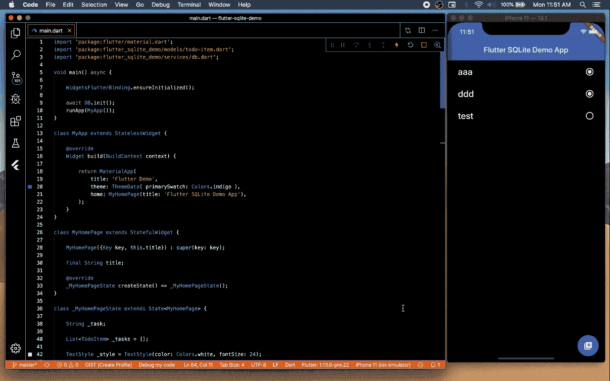

# 如何在 SQLite 中使用 Flutter

> 原文：<https://itnext.io/how-to-use-flutter-with-sqlite-b6c75a5215c4?source=collection_archive---------0----------------------->

## 如何使用 sqflite 插件在 Flutter 中存储应用数据

Flutter / SQLite

## 介绍

在本文中，我们将了解如何在 Flutter 中使用 SQLite 和`sqflite`包来本地存储应用程序数据。SQLite 自 2000 年以来一直存在，是在本地应用程序中嵌入数据库的流行选择。对于示例项目，我们将构建一个非常简单的“TODO”应用程序，它可以从一个基本界面创建、更新和删除 TODO 项目。

如果你还没有 Flutter，你可以从[安装页面](https://flutter.dev/docs/get-started/install)获得一份拷贝。本文中使用的源代码可以从 GitHub 上的[处获得。](https://github.com/kenreilly/flutter-sqlite-demo)

## 项目配置

要在 Flutter 应用程序中使用 SQLite，第一步是将`sqflite`包包含在项目的 **pubspec.yaml** 中，如下所示:

这里我们指定了`sqflite`版本`1.2.0`或更高版本，以及`path_provider`版本`1.6.0`或更高版本。除此之外，项目保持精简，以便于工作和理解。

## 创建简单的模型

为了存储数据，一个简单的数据模型类将提供必要的方法，用于在 SQLite 友好的数据格式和可以在应用程序中使用的对象之间进行转换。首先，一个名为 **Model** 的抽象类将作为数据模型的基类。这个文件在 **lib/models/model.dart** 中:

**Model** 类非常简单，是为了方便起见而创建的，用来定义数据模型可以预期的属性/方法，比如上面显示的`id`。这使得能够创建一个或多个符合这个基本设计模式的特定数据模型。对于这个示例应用程序，在**lib/models/TODO-item . dart**中创建一个 TODO item 模型类:

**TodoItem** 类包含了`task`和`complete`的属性，并且有一个简单的构造函数来创建一个新的 TODO 项目。为了在数据库使用的 TodoItem 和 Map 对象的实例之间进行转换，定义了方法`toMap`和`fromMap`。请注意，`id`只有在不是`null`时才会添加到地图中。

## 数据库类

为了方便和易于维护，主数据库处理方法放在 **lib/services/db.dart** 中，而不是在整个应用程序中随机混合数据库逻辑:

这个类是`abstract`,因为它不应该被实例化，并且在内存中只需要它的一个副本。在内部，它在`_db`属性中保存对 SQLite 数据库的引用。数据库版本号已经被硬编码为`1`，但是在更复杂的应用程序中，数据库版本可以用于在版本中向上或向下迁移数据库模式，以允许推出新功能，而不必擦除数据库并从头开始。

在`init`方法中创建 SQLite 数据库的一个实例，使用这个项目的`example`数据库名。如果`example`数据库尚不存在，则自动调用`onCreate`。这是放置用于创建表结构的查询的地方。在本例中，我们有一个`todo_items`表，其中有一个`id`的主键，以及与上面的`TodoItem`类的属性相匹配的字段。

定义`query`方法以及`insert, update,` 和`delete`是为了在数据库上执行标准的 CRUD 操作。这些提供了简单的抽象，并允许在该类中包含数据库逻辑，这在重构或对应用程序执行其他维护时非常有用，而不是例如必须在多个文件中搜索和替换字符串或修复简单更改时出现的奇怪错误。

## 主应用文件

最后但同样重要的是，我们在 **lib/main.dart** 中有主应用程序逻辑和 UX:

这个文件对于任何 Flutter 应用程序来说都是相当标准的，它定义了应用程序的基本外观和感觉以及它的交互。在初始化期间，行`WidgetsFlutterBinding.ensureInitialized()`将确保在用`await DB.init().`初始化数据库时，Flutter 应用程序正确初始化

当应用程序启动并且呈现出`MyHomePage`小部件时，对`refresh()`的调用从`todo_items`表中拉出待办事项列表，并将其映射到`TodoItem`对象的`List`。这些将通过`_items`访问器呈现在应用程序的主 ListView 中，该访问器接受`TodoItem`对象的`List`并将其格式化为一个小部件列表，该列表包含 todo 项目文本和一个指示项，指示项是否已完成。

可以通过按下浮动操作按钮并输入任务名称来添加任务。当按下`Save`时，新创建的待办事项列表项被添加到数据库中，其中`DB.insert.` 单击列表中的任务将通过翻转`complete`布尔值在完成/未完成状态之间切换，并通过`DB.update,`将修改的对象存储回数据库，水平滑动任务将通过将其提供给`DB.delete`方法来删除待办事项项。每当列表发生变化时，调用`refresh()`和后续的`setState()`将确保列表被正确刷新。

## 结论

SQLite 提供了一种在应用程序中本地保存数据的方便的行业标准方法。这个例子展示了如何实现基本的 CRUD 操作来创建和操作 SQLite 数据库中的简单记录。有关`sqflite`插件及其支持的各种特性的更多信息，请参见[本资源](https://pub.dev/packages/sqflite)。

感谢您的阅读，祝您的下一个颤振项目好运！

> 肯尼斯·雷利( [8_bit_hacker](https://twitter.com/) )是 [LevelUP](https://lvl-up.dev) 的 CTO