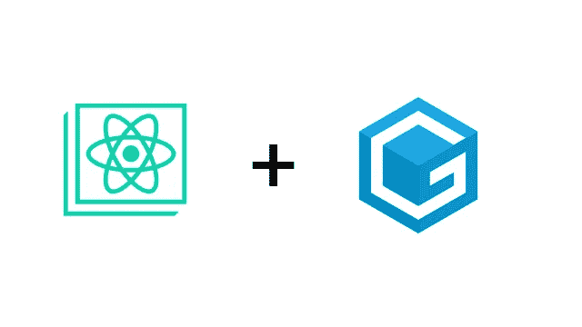
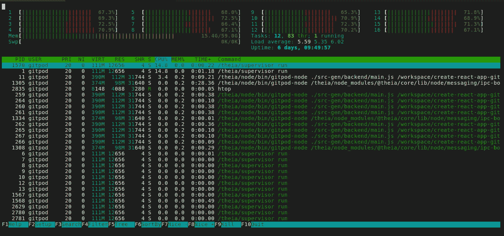
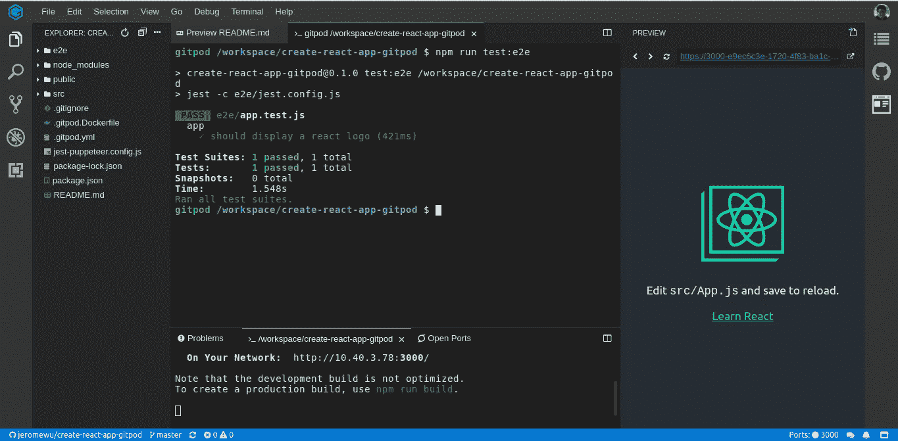

# 如何在基于 create-react-app 的项目中使用 Gitpod

> 原文：<https://itnext.io/how-to-use-gitpod-in-your-create-react-app-based-project-dd4d0b33ce77?source=collection_archive---------5----------------------->

日文版(翻译[田边龙一](https://medium.com/u/9724aaf6be6b?source=post_page-----dd4d0b33ce77--------------------------------)):[https://qiita.com/baby-degu/items/bacf20f657625ae8747b](https://qiita.com/baby-degu/items/bacf20f657625ae8747b)

Gitpod 是一个很棒的在线 IDE，下面是你如何在基于 create-react-app 的项目中使用它。

# 为什么是 Gitpod？

有时候我们就是不想花时间去准备开发环境，尽快开始编码。Gitpod 是一个集成了 Github 的每月 100 小时免费使用的在线 IDE，它提供了使用`.gitpod.yml`定制工作空间的灵活性。

强大的动态环境(16 个内核+ 59 GB 内存)

在这个故事中，我们将讨论当你有一个基于 create-react-app(或任何 react 项目)的项目时，如何利用 Gitpod。

# 基本配置

在基本配置中，我们希望实现以下项目:

1.  `npm install`当我们创造工作空间时
2.  `npm start`每次我们启动工作空间
3.  每次更新代码时查看预览

要实现所有功能，您只需添加一个包含以下内容的`.gitpod.yml`:

这是相当自我解释，你可以很容易地使用它的大多数项目。

> [正式文件中的更多选项](https://www.gitpod.io/docs/44_config_start_tasks/)

# 高级配置

一个高级场景是在你的 create-react-app 中使用 puppeteer 进行端到端测试，默认情况下，puppeteer 使用的一些依赖项没有安装在 Gitpod 默认工作空间映像(gitpod/workspace-full)中。所以我们需要扩展 Docker 图像来使它工作。

将`.gitpod.Dockerfile`添加到您的存储库中:

并更新`.gitpod.yml`以使用我们的`.gitpod.Dockerfile`

你还需要在 jest-puppeter 中使用`--no-sandbox`，完整的设置可以在这里找到:

存储库:[https://github.com/jeromewu/create-react-app-gitpod](https://github.com/jeromewu/create-react-app-gitpod)

git pod:[https://git pod . io/# https://github . com/jeromewu/create-react-app-git pod](https://gitpod.io/#https://github.com/jeromewu/create-react-app-gitpod)

通过完全配置，现在您可以拥有如下所示的工作环境:

# 还有一点

如果你和我一样是 VIM 用户，这里有一个小技巧(可能不是最好的)可以最省力地使用你在 Gitpod 中的 VIM 配置。

这里的概念是压缩一个现有的 VIM 配置，下载并解压到容器中，这样可以节省大量的安装时间，但是如果你需要经常更新你的 VIM 配置，这可能不是一个好的选择。

总之，将 Gitpod 用于您的 Github 项目为您提供了一个随时随地轻松开发项目的强大环境。希望你发现这个故事有用和快乐的编码。😃