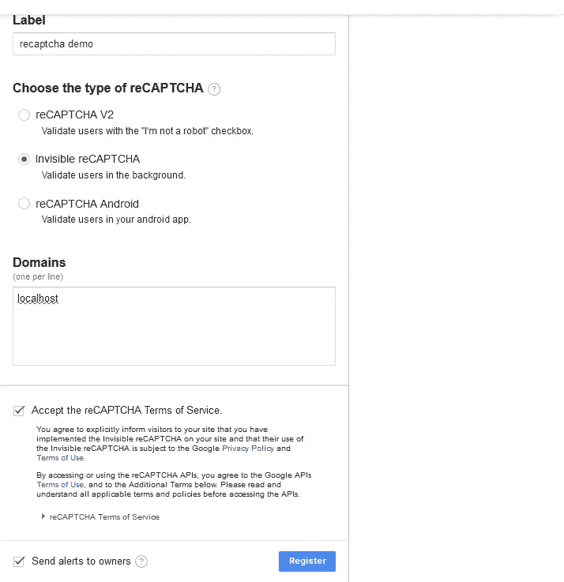

# 如何在 Vuejs 中使用 Google reCaptcha

> 原文：<https://itnext.io/how-to-use-google-recaptcha-with-vuejs-7756244400da?source=collection_archive---------0----------------------->

这里是最终产品的演示。

[*点击这里在 LinkedIn*](https://www.linkedin.com/cws/share?url=https%3A%2F%2Fitnext.io%2Fhow-to-use-google-recaptcha-with-vuejs-7756244400da) 上分享这篇文章

谷歌 reCaptcha 是一个很好的方法来检查你的应用程序/网站上的垃圾邮件和虚假账户。在本教程中，我们将了解如何将 reCaptcha 添加到 vuejs 应用程序的*register*/*sign**up*页面，以确保注册的人确实是人。流程如下。

1.  用户填写注册表单并提交。
2.  Google reCaptcha 开始判断用户是否不是机器人。我们将使用一个[不可见的 reCaptcha](https://developers.google.com/recaptcha/docs/invisible) ，这意味着用户的验证可以在他们不知道的情况下发生。如果 reCaptcha 不能不引人注目地确定他们是否是人类，则可能会向用户提出一个挑战来完成。
3.  一旦验证完成，reCaptcha 将发出一个带有令牌的事件，表明用户已经过验证。在用户通过验证之前，不会触发此事件。
4.  我们将把这个令牌和注册表单一起提交给我们的服务器。我们做的第一件事是验证令牌是否正确。为此，我们需要调用 reCaptcha API。

我们将把前端和后端分成一个客户端和 API。让我们从客户开始。

# 前端

首先我们需要[创建一个 reCaptcha 实例](https://www.google.com/recaptcha/admin#list)。你需要一个谷歌帐户。前往[https://www.google.com/recaptcha/admin#list](https://www.google.com/recaptcha/admin#list)。您将看到以下表格:



填写表格:你可以使用任何你想要的标签。选择*隐形验证码*选项*，*输入你的应用将被托管的域——我刚刚为这个演示选择了 localhost。接受条款和条件并点击*注册*。在下一页，记下站点密钥和机密，我们稍后会用到它们。

前端将有 3 个依赖项:

*   Google reCaptcha—[https://www.google.com/recaptcha/api.js](https://www.google.com/recaptcha/api.js)
*   vue JS—[https://UNP kg . com/vue-recaptcha @ latest/dist/vue-recaptcha . min . JS](https://unpkg.com/vue-recaptcha@latest/dist/vue-recaptcha.min.js)
*   vue-recaptcha—[https://unpkg.com/vue@latest/dist/vue.js](https://unpkg.com/vue@latest/dist/vue.js)(github[https://github.com/DanSnow/vue-recaptcha](https://github.com/DanSnow/vue-recaptcha))

*//index.html*

完整 gist 在[https://gist . github . com/sellomkantjwa/14d a 94687 ba 8759152 AC 807d 8 a4b 837 c](https://gist.github.com/sellomkantjwa/14da94687ba8759152ac807d8a4b837c)

我们给我们的根 div 一个 app 的 id。我们将用它来让 Vue 知道我们的应用程序的根目录在哪里。在底部，我们有 3 个依赖脚本 Vue，Vue-re-raptcha 和 Google reCaptcha。此外，我们包含了 *index.js，*它保存了我们应用程序的核心逻辑。除了`vue-recaptcha`标签之外，这个表单非常标准，它是 reCaptcha 的 vue 组件包装器。我们向组件传递两个处理程序:

*   验证—一旦验证了用户，就调用
*   expired —当 reCaptcha 过期时调用。过期的 reCaptcha 必须重新加载才能再次工作。

我们还传入了注册 reCaptcha 实例时获得的 *sitekey* 和一个 *invisible* 的大小，用于 reCaptcha 的不可见变体。

我们应用的核心位于 *index.js*

当用户按下注册按钮时，调用*提交*方法。我们设置了`this.status=submitting`,这样我们就可以禁用注册按钮。这样我们可以避免多次点击，从而避免多次提交。同样在*提交*方法中，我们调用`**this**.$refs.recaptcha.execute(),` ，这告诉 reCaptcha 开始检查用户是否确实是人类。在这个阶段，有两种情况可能发生。reCaptcha 确信用户是人类，并且不要求用户完成挑战
2。reCaptcha 怀疑有不法行为，并要求用户完成一项挑战，以证明他们是人类。

一旦 reCaptcha 确信用户是人类(有或没有挑战)，它将调用在我们的 *vue-recaptcha* 组件上指定的*验证*处理程序。在这种情况下，我们的处理程序是*oncaptchaaverified*方法。在 onCaptchaVerified 方法中，我们知道用户已经被验证为人类，我们可以继续向服务器提交表单。

一个 *recaptchaToken* 被传入到我们的*oncaptchaeverified*方法中，我们可以将该令牌与我们的注册表单一起发布，以在服务器上再次验证用户已经证明他们不是机器人。重置我们的 reCaptcha ( `**this**.$refs.recaptcha.reset()`)非常重要，因为如果服务器出现错误(例如，电子邮件已被使用)，我们将需要再次验证服务器上的用户。我们可以尝试将令牌保存到我们的状态，并在用户重新提交时再次发送到服务器进行验证，但是 reCaptcha 允许令牌只能用于服务器验证一次，所以这种方法行不通，我们必须重置 reCaptcha。我们还在到期时重置 reCaptcha，否则当我们试图执行它时会得到一个错误。

# 后端

一旦我们在后端收到令牌，我们需要在注册用户之前验证它是否有效。这相对简单，我们只需要将令牌(作为*响应*参数发布在主体中)发布给 reCaptcha API 进行验证。除了令牌之外，我们还必须通过我们的 reCaptcha secret 发布(告诉您您会需要它，请注意，在下面的示例中，我们已经将它设置为环境变量)。让我们来看看我们的服务器:

服务器上的令牌验证码令牌验证([https://gist . github . com/sellomkantjwa/27 f 69 ADB 806 B3 FB 75 a9 BD 3914 c 297893](https://gist.github.com/sellomkantjwa/27f69adb806b3fb75a9bd3914c297893))

如果一切顺利，我们将得到一个类似如下的 JSON 响应:

```
{
  "success": true|false,
  "challenge_ts": timestamp,  
  "hostname": string,         
  "error-codes": [...]        // optional
}
```

更多信息见[https://developers.google.com/recaptcha/docs/verify](https://developers.google.com/recaptcha/docs/verify)。对我们来说最重要的领域是`success`领域。它指示令牌验证是否成功。如果是，那么我们可以继续添加注册我们的用户，如果不是，我们拒绝用户，并返回一个错误到前端。

就是这样！我们现在可以确信我们的用户是合法的。

如果你错过了，这里的是一个带有[源代码](https://github.com/sellomkantjwa/vue-recaptcha-demo)的现场演示。