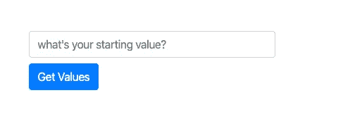
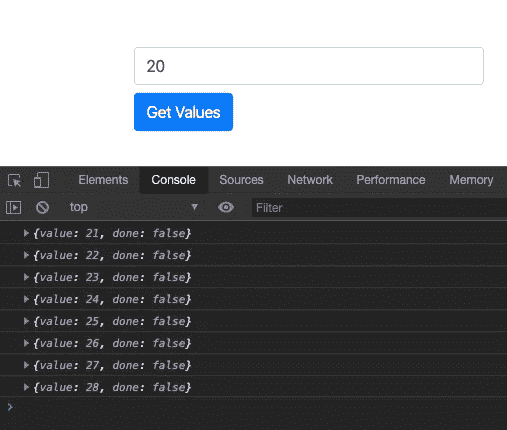
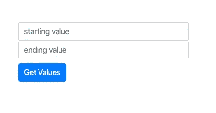

# 如何使用 JavaScript 生成器

> 原文：<https://itnext.io/how-to-use-javascript-generators-e0381c9ac897?source=collection_archive---------4----------------------->

科林·阿姆斯壮在 [Unsplash](https://unsplash.com?utm_source=medium&utm_medium=referral) 上的照片

生成器函数生成值序列。他们是基于每个请求来这样做的。这意味着每次消费者请求一个值时，生成器都会返回一个值。这种情况会持续下去，直到没有其他值可以返回为止。

生成器使用 *yield* 关键字返回值。当这种情况发生时，生成器*会无阻塞地挂起*的执行，返回值并耐心等待，直到收到另一个请求。

如果您有一个需要某种全局计数器变量的应用程序，查看生成器函数可能是一个不错的选择。

出于本文的目的，让我们假设我们有一个需要某种 id 的应用程序。我们的生成器会产生一个自动递增的数字。业务规则规定用户能够指定起始值。让我们深入一点代码，看看如何使用生成器创建一个简单的解决方案。

这是我们简单的用户界面。我已经使用 [Bootstrap](http://www.getbootstrap.com) 让它看起来像样。

提供起始值的简单用户界面

HTML。

以及让它运行的代码。

这个代码示例使用显示模块模式，并利用闭包来模拟私有变量。[我已经在这篇文章中讨论过这些话题。](https://levelup.gitconnected.com/using-closures-in-javascript-to-create-private-variables-c0b358757fe0)

首先要注意的是，我们使用了一个 IIFE(立即调用的函数表达式),这样当页面加载时，我们就可以自动获得挂在窗口对象上的 testGen 变量。我们可以通过 Chrome dev 工具打开控制台选项卡并输入 window.testGen 来确认这一点。

开发工具中 window.testGen 的输出

Dev tools 确认 window.testGen 是一个对象，并且它公开了 nextVal()函数。还要注意，通过使用 IIFE，我们已经创建了一个闭包，它列在开发工具的 Scopes 部分下面。

因为 testGen 在 window 对象上是可用的，所以我们用它来设置简单表单上按钮的 onclick 动作。

按钮 HTML

当按钮被点击时，nextVal()被执行。

nextVal()

首先，我们检查私有变量 _myIterator 是否为真。如果不是，我们调用两个函数来设置我们的执行环境:getStartingValue()和 createIterator()。

在第 8 行，调用 myGen()函数，并将返回值保存到 _myIterator 变量中。到底什么是 _myIterator，我们为什么需要它？我以为这个帖子是关于发电机的？

让我们暂停一下，更详细地讨论一下生成器。

## 生成器和迭代器

生成器是一种全新的函数。如上所述，发生器函数是产生一系列值的函数，但它不像常规函数那样一次产生所有的值。我们必须显式地请求一个值，如果生成器有值，它将返回一个值。返回的每个值都是一个*新对象*,它包含一个用于检索序列中下一个值的 next()方法和一个 done 属性，该属性告诉消费者是否有任何其他值。如果生成器没有任何额外的值，它会通过返回 undefined for a value 和将 it done 属性设置为 true 来告诉我们这一点。

每次我们请求一个值时，生成器“*会记住*”上次请求时我们在哪里，并从上次我们请求值时停止的地方继续。

当我们调用生成器时，并不意味着生成器函数的主体将要执行。相反，创建并返回一个迭代器对象。作为消费者，我们使用这个新创建的迭代器作为我们和生成器之间的“中间人”。这就是代码示例的第 8 行发生的情况。对 myGen()的调用返回一个迭代器，我们用它与生成器进行通信。

眼尖的读者可能已经注意到 myGen()函数定义在 function 关键字旁边包含一个星号(*)。这是向运行时指定这是一个生成器函数。

## 回到代码

有了这些新知识，让我们完成对代码的审查。

在 getStartingValue()中，我们简单地使用 document.getElementById()来获取用户在表单的文本框中输入的值。如果没有传递值，则 _counter 变量被初始化为 0。

createIterator()然后做它的名字所暗示的事情。它检查迭代器是否已经定义，如果没有，调用 myGen()返回一个新的迭代器。

在 myGen()的主体中，我们设置了一个无限循环，只要页面存在，它就会继续返回值。如果需要，我们可以在这里设置某种上限，但是对于这个例子，我们使用无限婴儿！

> 顺便提一下，通常在编程时，我们喜欢避免无限循环，但是当使用生成器时，它们就很好了。

最后，在 nextVal()中，我们调用迭代器上的 next()方法，并将值写入控制台。

如果我们在文本框中输入值 20，单击几次按钮后，我们会在控制台中得到以下输出。

我们的发电机工作得非常好！

在这个例子中，每当按钮上发生 click 事件时，生成器都会被要求输入一个新值。很容易想象这样一种情况，我们将循环使用来自生成器的值。在这种情况下，JavaScript 现在提供了专门用于生成器的 *for-in* 语法。让我们快速看一下这种方法。

我已经更新了 UI，允许用户输入开始和结束值。下面是 UI 和更新后的 HTML。

更新的用户界面

下面是更新后的代码:

大部分代码是相同的，但有一些变化。首先，我们从 UI 中获得开始和结束值。这些值在 getStartingValue()函数中捕获，并分别保存到 _start 和 _end 变量中。

然后，当我们在 myGen()函数中创建迭代器时，我们使用这些 _start 和 _end 变量。

最后，我们在第 38 行使用新的 ***for-of*** 循环语法来循环这些值并将它们写入控制台。

你可能会想:为什么我不能用 while 循环来做这件事呢？嗯，答案是可以。使用 while 循环的缺点是，在每次循环中，您都要负责调用迭代器上的 next()方法。 ***for-of*** 语言特性为您做到了这一点。这是我们免费得到的一点语法魔法。

## 包裹

在这篇文章中，我们讨论了 ES6 中新的生成器功能。生成器与迭代器一起工作，为调用代码提供一系列值。生成器的独特之处在于，它们在返回值时暂停执行，并在再次被调用时从停止的地方继续执行。与新的 for-of 语法结合使用，可以轻而易举地生成数据序列，我们可以一次从一个项目中提取数据。

尝试一下，并在代码中利用这一新功能。

[点击此处](https://developer.mozilla.org/en-US/docs/Web/JavaScript/Reference/Global_Objects/Generator)查看 MDN 中关于发电机的文件。

感谢阅读！