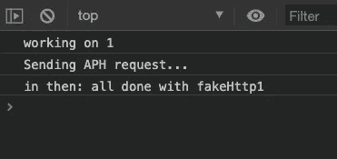
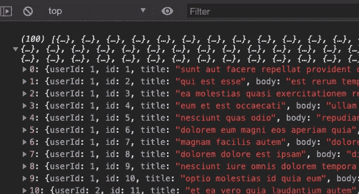
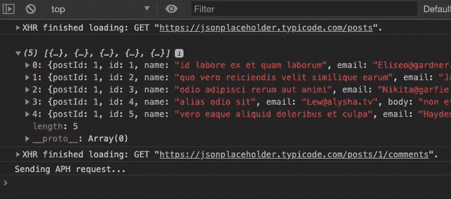
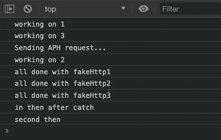
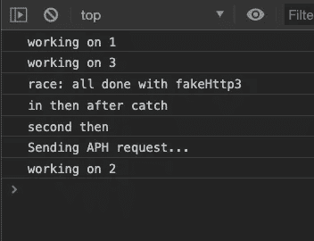

# 如何使用 JavaScript 承诺

> 原文：<https://itnext.io/how-to-use-javascript-promises-82e0a0ba8aa5?source=collection_archive---------7----------------------->

## 关于这个伟大的 JS 特性，你需要知道什么


作者照片

## 介绍

JavaScript 承诺为开发人员提供一种优雅的方法来处理异步代码或执行某种冗长计算的代码。在使用 JavaScript 时，我们经常会遇到这种代码。

一个典型的例子是对远程服务器的 HTTP 调用。我们期望服务器发回一个响应，但是我们不知道确切的时间，我们不希望我们的代码等待它。

## 我如何创造一个承诺？

创造承诺很容易。你这样调用 Promise 构造函数。

```
let myFirstPromise = new Promise((resolve, reject) => {
  // now we do some work if(WorkCompletedSuccessfully){
    resolve('everything worked');
  } else {
    reject('There was a problem.');
  }})
```

我们传递给 Promise 构造函数的函数称为 ***executor 函数。*** 这个代码给了我们一个新创建的承诺。一旦我们有了承诺，我们可以使用配置它接受解决或拒绝状态。然后接着。

```
myFirstPromise
  .then(response => console.log(response) <--called for resolve()
  .catch(err => console.log(err));        <--called for reject()
```

如果你使用过像 [Axios](https://github.com/axios/axios) 这样的 HTTP 库，基于 Promise 的浏览器和 node.js 的 HTTP 客户端，这些代码可能看起来很熟悉。每次在 Axios 中调用一个函数，都会得到一个承诺。

让我们看看另一个代码示例。

这里我们将模拟一个耗时一秒半的 HTTP 调用。第 1 行到第 8 行设置了我们的承诺。请注意，fakeHttpOne()函数会立即返回一个新的承诺。这给了我们链接方法的能力。然后()和。抓住承诺。在浏览器中运行这段代码会产生以下输出。



耶！它工作了。

那就好！现在让我们看一个实际的 HTTP 调用，以及我们如何将数据从一个 HTTP 调用传递到下一个。

在这个例子中，第 1 行到第 24 行只是设置了一个名为 getJSON 的函数。注意，我们在第 2 行做的第一件事是 ***返回一个新的承诺。***

然后，我们设置使用浏览器的本地 XMLHttpRequest 对象发出 HTTP 请求。你可以在这里阅读所有关于 XMLHttpRequest 的内容。

这里要注意的行是我们调用 resolve()或 reject()的地方，这取决于我们从服务器得到的响应。

我们唯一一次调用 resolve 是在第 9 行，当时我们得到一个状态代码 200，这意味着一切正常。然后我们使用 JSON.parse 来解析从服务器返回的 JSON。如果在任何时候抛出一个异常，我们在第 14 行捕捉它并调用 reject()。

最后，在第 26 行，我们设置了 baseUri 变量并调用了 getJSON 函数。

[***jsonplaceholder.typicode.com***](https://jsonplaceholder.typicode.com/guide.html)***非常适合测试的东西，顺便说一句。看看这个。***

当我们运行这段代码时，下面是我们在控制台中得到的结果。



从 jsonplaceholder 返回的数据

太好了！我们收到了 100 条回复。

## 让我们做一些链接！

我们有柱子。现在让我们假设我们想要获得与 id 为 1 的帖子相关联的所有评论。我们对 getJSON 的调用需要如何改变？方法如下:

给我评论或者给我一个 404！

这里发生了什么？在第 3 行，我们从服务器获得第一个响应，并将其传递给变量*数据*中的箭头函数。然后，我们使用*数据*创建正确的 Uri 来获取评论，并将其传递给另一个 getJSON()调用，该调用反过来发送第二个 HTTP 请求。

*有趣的是，当你调用。然后()它隐式返回一个新的承诺。*

*这样我们就可以打电话了。然后又()。*

> 亲爱的读者，这就是连锁承诺的魔力！

这在控制台中给了我们什么？让我们来看看。



我们得到了 5 条评论

我们得到了与该帖子相关的 5 条评论。非常酷，非常有用，而且非常容易做到。

但是，就像[罗布·波佩尔](https://en.wikipedia.org/wiki/Ron_Popeil)常说的那样:

> 但是等等，还有呢！

## 依赖的承诺

如果我们正在开发一个应用程序，在继续之前需要完成一堆 HTTP 请求，该怎么办？

我们应该举手告诉老板他疯了吗？

不。这个很简单。我们可以用 [Promise.all()](https://developer.mozilla.org/en-US/docs/Web/JavaScript/Reference/Global_Objects/Promise/all) 。看一看。

promise.all 和假 HTTP 调用

对于这个例子，我已经切换回虚假的 HTTP 调用。

我创建了 3 个 fakeHttp()函数，每个函数都使用不同持续时间的 setTimeout 来模拟真实 Http 调用的延迟。

然后在第 30 行，我调用 Promise.all()并传递给它一个 ***函数数组*** 。有了这些，代码将不会继续，直到我们得到所有的响应，或者直到出现问题并调用 reject()为止。

想着没有承诺我会怎么做这个. all()真的让我头疼，所以这个很牛逼。这是我们在控制台上看到的。



promise.all 的输出()

请注意，中的 console.log()语句。然后()不运行，直到 ***所有的响应*** 都返回。

> 承诺给了我们超能力！算是吧。


[王唇](https://unsplash.com/@king_lip?utm_source=medium&utm_medium=referral)在 [Unsplash](https://unsplash.com?utm_source=medium&utm_medium=referral) 上拍照

## 就一个怎么样？

当老板看到你穿着蓝色紧身衣在办公室里蹦蹦跳跳的时候，他回来对你说，等待所有 HTTP 呼叫的回复是个问题。你在想什么？

应用程序应该接受它得到的第一个响应，然后继续前进。

你微笑着向他竖起大拇指。

没问题，老板！。

过了一会儿，你回到了你的办公椅上。调整 cape 后，将代码更改如下。

我们在第 1 行用 Promise.race()替换了 Promise.all()。现在，我们的代码将只等待一个响应，或者一个对 reject()的调用，然后继续。

和输出。



赛车！！轰鸣！

请注意，fakeHttp3 首先完成，尽管 fakeHttp1 在它之前开始。另外，请注意，您可以添加额外的。就像我在第 6 行和第 7 行所做的那样。这些。无论成功还是失败，then()函数都将运行。

这就是了。快速浏览 JavaScript 承诺以及它们如何在处理异步代码时简化您的生活。

## 关键要点

1.  在使用 JavaScript 时，我们必须经常处理长时间运行的计算和异步代码。
2.  承诺提供了一种优雅的处理代码的方式，它将在未来的某个时候为我们提供一个价值。
3.  通过调用 Promise 构造函数，创建 Promise 很容易。
4.  调用 resolve()或 reject()从承诺返回结果。
5.  一旦你有了一个承诺对象，配置。然后()和。catch()方法来处理承诺的结果。
6.  。then()隐式返回一个新的承诺。
7.  当您有许多相互依赖的长时间运行的操作时，请使用 Promise.all()。代码执行将不会继续，直到所有承诺都已解决或一个承诺已被拒绝。
8.  当您只关心对许多操作获得单个响应时，请使用 Promise.race()。

## 资源

[](https://developer.mozilla.org/en-US/docs/Web/JavaScript/Reference/Global_Objects/Promise) [## 承诺

### Promise 对象表示异步操作的最终完成(或失败),及其结果…

developer.mozilla.org](https://developer.mozilla.org/en-US/docs/Web/JavaScript/Reference/Global_Objects/Promise) 

一如既往，感谢您的阅读，如果您喜欢这篇文章，请查看我在 Medium 上的其他作品。

[](https://medium.com/@aritzcovan) [## 亚历克斯·里茨科万-中等

### 阅读 Alex Ritzcovan 在媒体上的文章。高级软件顾问、作家、丈夫和父亲。我喜欢编码…

medium.com](https://medium.com/@aritzcovan)