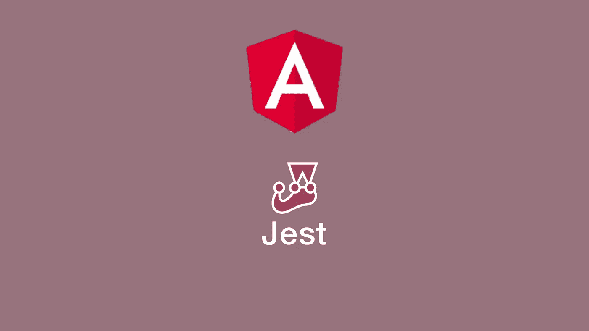

# 如何在 Angular aka 中使用 Jest 使单元测试变得伟大(再次)

> 原文：<https://itnext.io/how-to-use-jest-in-angular-aka-make-unit-testing-great-again-e4be2d2e92d1?source=collection_archive---------0----------------------->



## 用 Jest，这位来自脸书的出色的测试者，再次让单元测试变得有趣

Angular 是创建 web 应用程序的强大框架。Angular 团队非常重视提供良好的测试体验。事实上，我不仅喜欢为简单的功能编写单元测试，也喜欢为整个组件编写单元测试。在较少依赖的较小项目中，我可以很容易地遵循 TDD 风格的方法。

然而，当项目相当大时，测试体验对我(和其他人，只是谷歌一下)来说要糟糕得多:

*   (初始)构建时间很慢
*   重新编译通常不可靠
*   生产率低于应有的水平。特别是对于导入大量其他组件和模块的组件，运行这些测试变得很麻烦。

脸书创建了一个伟大的测试框架，叫做 [**Jest**](https://jestjs.io/) 。Jest 使用了[***jsdom***](https://github.com/jsdom/jsdom)*，从而支持测试 web 应用程序所需的大部分 DOM API。通过并行测试，Jest 应该比其他测试运行程序更快。致命的特性是 CLI，它极大地改善了测试体验。与 Jasmine 或其他 JavaScript 框架相比，配置工作大大减少了。此外，您可以生成现成的代码覆盖率。*

*幸运的是，Jest 不仅可以在 React 项目中使用，还可以在 Angular、Vue.js 和基本上所有 js 框架中使用。在本教程中，我想展示如何用 Jest 替换默认的角度测试。*

## *如何在角度项目中设置 Jest*

1.  *如果尚未创建 Angular CLI 项目，请创建一个。*
2.  *我们需要**安装笑话**和打字:`npm install jest @types/jest --only=dev`。*
3.  *为了让 Jest 知道如何在有角度的环境中工作，我们需要安装以下 NPM 包:`npm install jest-preset-angular`。*
4.  ***将 Jest 配置**添加到您的 **package.json** 中。或者，您可以创建一个 JavaScript 文件来配置 Jest。*
5.  *调整你的测试脚本:用 Jest 命令替换任何`ng test`用法。*
6.  *将`tsconfig.json`文件中的`"jasmine"`替换为`"jest"`。*
7.  ***去除茉莉**及其类型:`npm uninstall jasmine @types/jasmine`。*
8.  ***删除任何** ***因果*** 相关包和 **test.ts** 如果不需要在真实浏览器中测试。*

*这里有一个示例 **package.json** ，它包括 Jest 的脚本和告诉 Jest 在哪里可以找到我们的配置的方法。*

```
*{
 "name": "my-package",
 "version": "0.0.1",
 "license": "MIT",
 "scripts": {
  "test": "jest",
  "test:watch": "jest --watch",
  "test:cc": "jest --coverage"
 },
 "dependencies": {
  "[@angular/common](http://twitter.com/angular/common)": "7.2.1",
  "[@angular/compiler](http://twitter.com/angular/compiler)": "7.2.1",
  ...
 },
 "devDependencies": {
  "[@types/jest](http://twitter.com/types/jest)": "^24.0.6",
  "jest": "^24.1.0",
  "jest-preset-angular": "^6.0.2",
  "ts-node": "~7.0.1",
  "typescript": "3.2.4"
 },
 "jest": {
  "preset": "jest-preset-angular",
  "setupTestFrameworkScriptFile": "<rootDir>/setupJest.ts"
 }
}*
```

***setupJest.ts** (在 *package.json* 中导入，可以换个名字)可以简单到:*

```
*import 'jest-preset-angular';*
```

## *Jest 的优势(与 Karma + Jasmine 相比)*

*   ***CLI** :按文件名或测试名正则表达式模式过滤(减少对[*fdescripe*](https://jasmine.github.io/2.1/focused_specs.html)的需求)并重新运行测试*
*   *执行测试而不构建整个应用程序允许更快地运行我们的测试*
*   ***低配置**需要入门*
*   *清晰的文档使 Jest 很容易适应你的需要*
*   *测试是稳定的:在编写测试时，不再有突然的测试运行失败*
*   *您可以 [**保留大部分 Jasmine 语法**](https://jestjs.io/docs/en/migration-guide) ，因为 Jest 除了包含自己的 API 之外，还包含了大部分 Jasmine API*
*   *[**快照测试**](https://jestjs.io/docs/en/snapshot-testing) ，Jasmine 中没有的有用特性*
*   *更活跃的社区会让 Jest 变得更好*

**

## *从因果报应+茉莉切换到笑话时的陷阱*

*   ***有些属性或函数是** [**jsdom**](https://github.com/jsdom/jsdom) 中不存在的。例如:jsdom 中不支持 [*innerText*](https://developer.mozilla.org/en-US/docs/Web/API/HTMLElement/innerText) 属性。主要问题是 innerText(像其他一些属性和函数一样)依赖布局引擎来指导，而 jsdom 没有布局引擎。相反，您可以使用[*text content*](https://developer.mozilla.org/en-US/docs/Web/API/Node/textContent)*并可选地调用 [trim()](https://developer.mozilla.org/en-US/docs/Web/JavaScript/Reference/Global_Objects/String/Trim) 来消除空白。**
*   **像 [jQuery](https://jquery.com/) 这样的第三方库的导入可能会很棘手。如果您使用 jQuery 并希望它在全球范围内可用，您需要将 jQuery 添加到[窗口](https://developer.mozilla.org/en-US/docs/Web/API/Window)对象中。您可以在您的 *setupJest.ts* 文件中这样做。**
*   ****Jest**目前还不太支持跨浏览器测试。如果你想进行跨浏览器单元测试，你可以保留所有与 Karma 相关的文件，因为 Jest 目前不支持在浏览器中运行(除了 Chrome 使用 [*木偶师*](https://github.com/GoogleChrome/puppeteer) )。**
*   **如果你使用 [**类型脚本路径**](https://netbasal.com/sexier-imports-in-typescript-e3c645bdd3c6) **进行更干净的导入，而 Jest 不理解你的导入**，那么你需要提供 Jest 一个[路径映射](https://kulshekhar.github.io/ts-jest/user/config/#paths-mapping)。**

## **额外收获:使用你的 IDE 运行 Jest 测试**

****Jetbrains**(**IntelliJ/web storm**…)的开发者创建了一个 [**Jest 插件**](https://www.jetbrains.com/help/idea/running-unit-tests-on-jest.html) ，它允许你直接从你的 IDE 运行测试。如果你使用的是 **Visual Studio 代码**，你可以很容易地**创建一个启动配置**，你可以在其中执行。你需要做的就是在你的**中创建一个 [**launch.json**](https://code.visualstudio.com/docs/editor/debugging#_launch-configurations) 文件。vscode** 文件夹，并添加以下配置:**

```
**{
      "type": "node",
      "request": "launch",
      "name": "Jest: Run all",
      "program": "${workspaceFolder}/node_modules/.bin/jest",
      "args": [],
      "console": "integratedTerminal",
      "internalConsoleOptions": "neverOpen",
      "disableOptimisticBPs": true
    },
    {
      "type": "node",
      "request": "launch",
      "name": "Jest: Run current File",
      "program": "${workspaceFolder}/node_modules/.bin/jest",
      "args": [
        "${relativeFile}"
      ],
      "console": "integratedTerminal",
      "internalConsoleOptions": "neverOpen",
      "disableOptimisticBPs": true
    }
}**
```

## **结论**

**感谢阅读这篇关于如何使用 Jest 大幅度提高 Angular 测试体验的文章。无论我使用哪种框架，Jest 都已经成为我最喜欢的 JavaScript 测试解决方案。你对 Jest 和 JavaScript 测试框架有什么体验？请在评论中告诉我。**