# 如何使用 Knative 在 Kubernetes 上部署无服务器应用程序

> 原文：<https://itnext.io/how-to-use-knative-on-kubernetes-to-deploy-a-serverless-application-582d62fa2a9f?source=collection_archive---------1----------------------->

照片由[像素](https://www.pexels.com/photo/business-cargo-cargo-container-city-262353/)的[皮克斯拜](https://www.pexels.com/@pixabay)拍摄

容器还是无服务器？这个问题随着 [Knative](https://cloud.google.com/knative) 的使用而变得相关。开源项目 Knative 由 Google 与 Pivotal、IBM、Red Hat 和 SAP 共同开发，为基于 Kubernetes 和 [Istio](https://istio.io) 的无服务器容器应用程序提供中间件组件。基于故事"[使用 Kubespray](https://medium.com/@Robert.N/deploy-a-kubernetes-cluster-on-openstack-using-kubespray-39b230b13d62) 在 OpenStack 上部署 Kubernetes 集群"，我们安装了 Knative 并展示了如何使用它。

# 技巧介绍

Knative 是一个开源框架，它提供了一组扩展 Kubernetes 的组件。目前，Knative 提供了三个组件:[服务](https://github.com/knative/serving)、[构建](https://github.com/knative/build)和[事件](https://github.com/knative/eventing)。

这三个组成部分可以描述如下:

**服务**基于 Kubernetes 和 Istio，提供部署和服务功能和无服务器应用的可能性。它包括自动调零功能。

**Build** 提供了从源代码创建容器映像的构建块。源代码可以由不同的来源提供(git，gce，custom)。

事件提供了消费和生产事件的模块，将事件源绑定到服务。

Knative 是为不同的目标群体开发的，下图给出了一个概述:

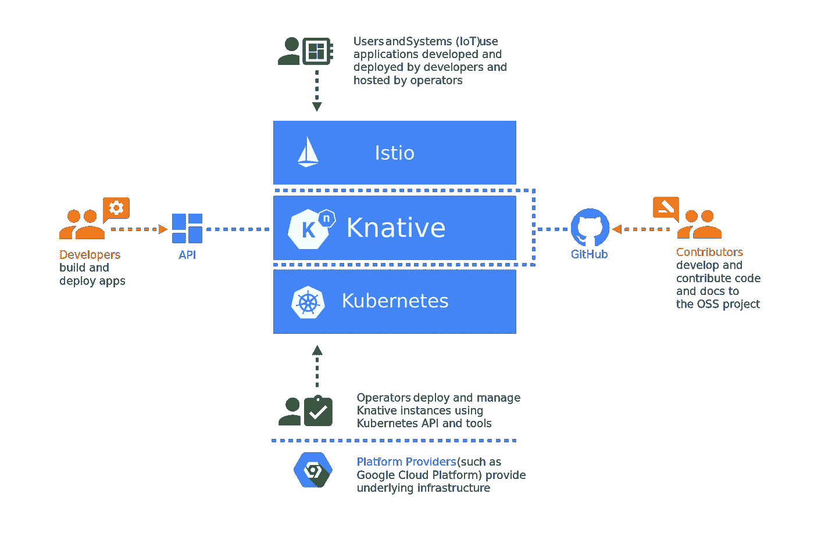

由 [Knative](https://github.com/knative/docs/blob/9910b8a9ac57eb9cf642747b774c24077e7f156c/docs/images/knative-audience.png) 绘制的图表

## 开发商

> Knative components 为开发人员提供了 Kubernetes-native API，用于将无服务器风格的功能、应用程序和容器部署到自动伸缩运行时。

## 经营者

> Knative 组件旨在集成到更完善的产品中，然后云服务提供商或大型企业的内部团队可以操作这些产品。任何企业或云提供商都可以在他们自己的系统中采用创新组件，并将好处传递给他们的客户。

## 贡献者

> 有了清晰的项目范围、轻量级的治理模型以及可插拔组件之间清晰的分界线，Knative 项目建立了一个高效的贡献者工作流。

# 伊斯迪奥

云平台的使用是多样的，并为公司提供了深远的机会。但这可能会导致这样一种情况，即云的运营给开发人员和运营人员都带来了负担。这导致复杂的微服务架构，运营必须管理广泛的混合和多云实施。在这种情况下，Istio 帮助控制、保护、连接和监控服务。

# 安装 Istio

简单介绍之后，我们可以开始在我们的 Kubernetes 集群上安装 Knative，这是我们在我的上一篇 [Kubernetes 故事](https://medium.com/@Robert.N/deploy-a-kubernetes-cluster-on-openstack-using-kubespray-39b230b13d62)中部署的。安装基于[技术文件](https://www.knative.dev/docs/install/knative-with-any-k8s/)。

首先我们需要安装 [Istio](https://istio.io) 。这将通过以下命令来完成。将所有服务置于运行状态需要几秒钟时间。

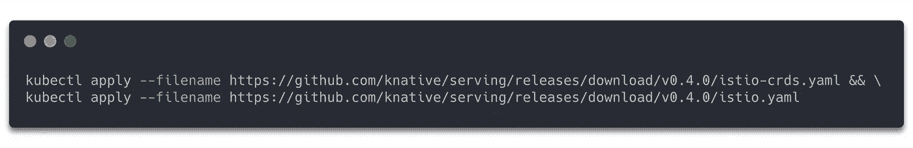

接下来，我们需要用`istio-injection=enabled`标记默认名称空间。这将激活“默认”Kubernetes 名称空间上的 Istio，并将一个 Istio 代理 sidecar 容器自动注入到部署到该名称空间的所有 pod 中。

要检查是否所有 Istio 组件都处于运行状态，请执行以下命令。

启动所有组件需要几分钟时间。

# 安装 Knative

在这个阶段，我们的 Istio 服务网格正在运行，我们准备安装 Knative。以下命令必须正确执行。

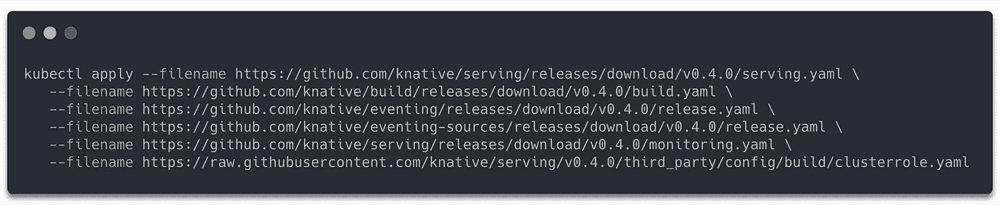

我们可以使用以下命令监控组件安装。在继续之前，所有这些必须指示运行状态。

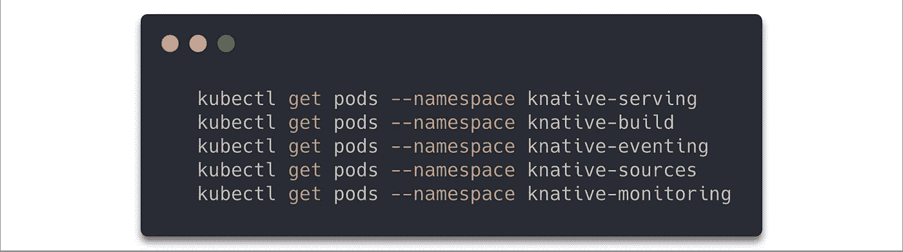

如果一切看起来不错，我们准备部署我们的第一个应用程序与 Knative。

# 使用 Knative 部署应用程序

安装完 Istio 和 Knative 之后，我们就可以开始部署无服务器应用程序了。在这种情况下，我们将通过使用服务组件来部署一个 go hello-world 示例。

对于我们的例子，我们将使用 Kubernetes 集群中的“默认”名称空间。如果您想使用另一个名称空间，您可以通过下面的命令创建一个名称空间，并在下面的示例文件中编辑元数据。

我们需要用以下内容为我们的应用程序创建 yaml 文件。

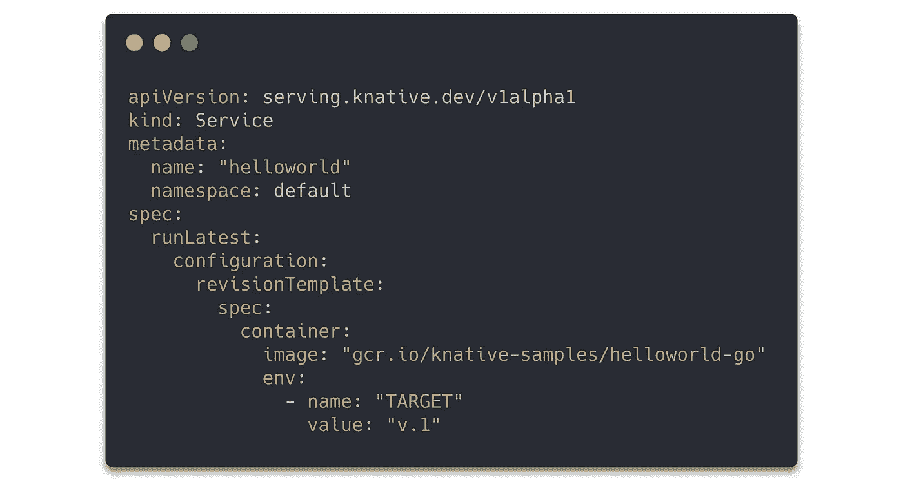

内容来源 [Knative](https://www.knative.dev/docs/install/getting-started-knative-app/)

有了创建的名称空间和 yaml 文件，我们就可以使用 kubectl apply 部署我们的应用程序了。

我们的服务已经准备好进行交互，我们需要找到网关的公共 IP 地址。我们使用 kubectl get service 命令，在我们没有外部负载平衡器的情况下，我们将使用节点端口。

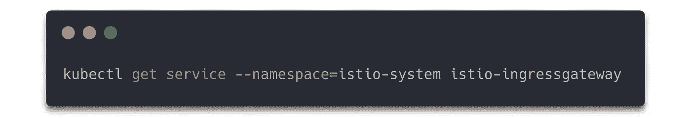

建议设置一个环境变量“IP-ADDRESS”。

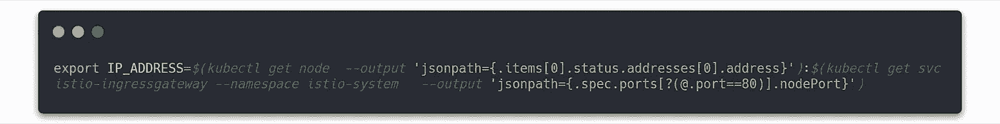

我们需要我们服务的主机 URL:

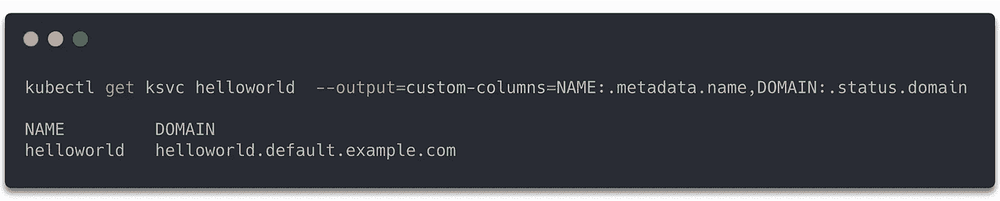

有了所有收集到的信息，我们就可以与 curl 用户的服务进行交互了。输出应该类似于下面的行。

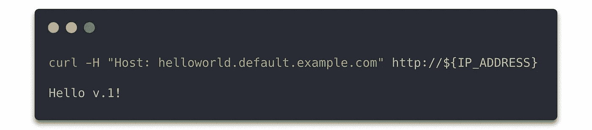

我们的服务是可用的，我们可以与之互动。下一步是更改应用程序的版本。我们必须编辑 yaml 文件，如下所示。

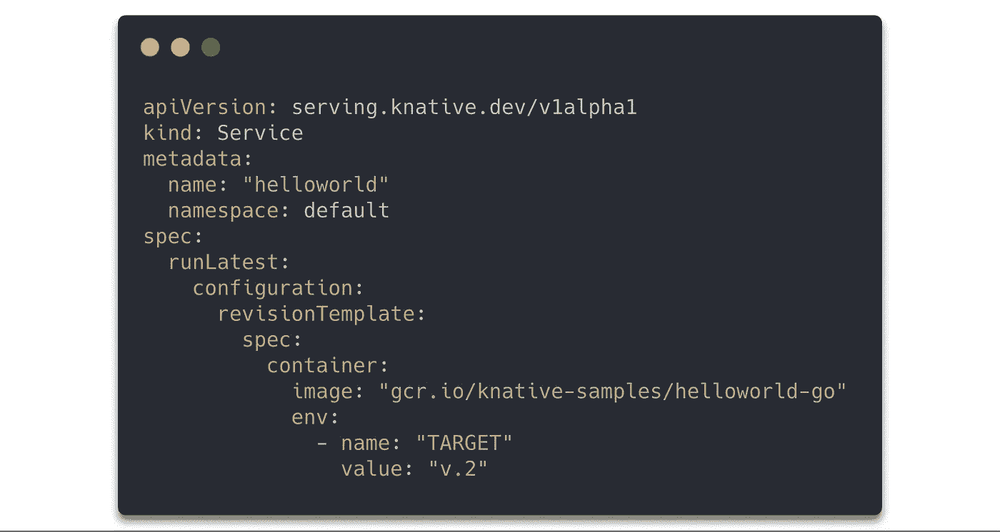

内容来源 [Knative](https://www.knative.dev/docs/install/getting-started-knative-app/)

再次申请服务后。它的结构会改变。我们将看到我们服务的另一个版本。

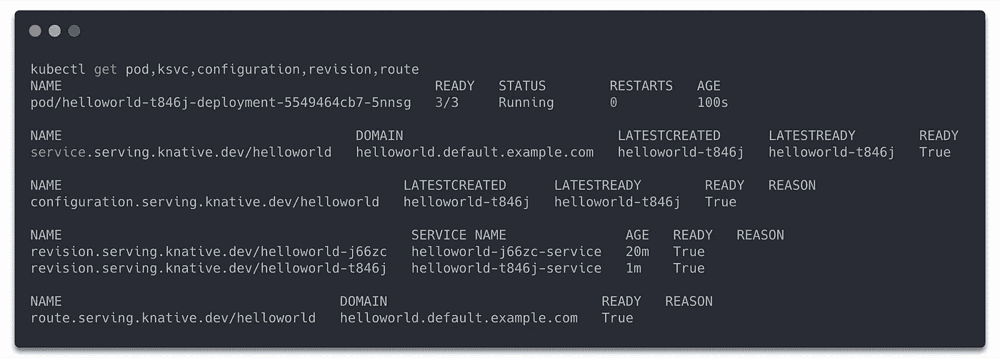

curl 命令也将显示新的修订版 v.2 作为响应。

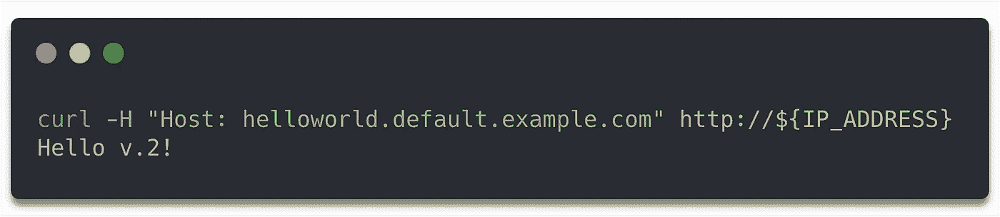

为了演示零扩展特性，我们不向我们的服务发送请求。我们会看到豆荚会消失。

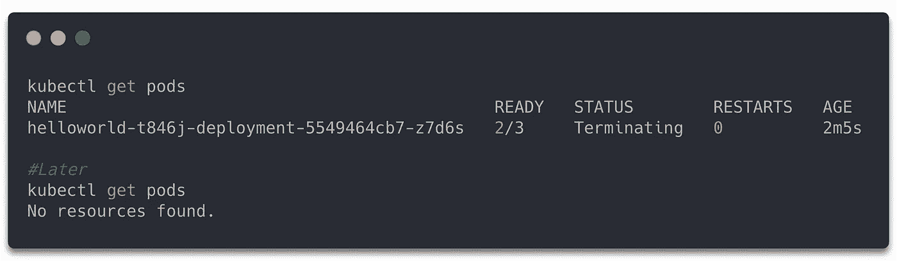

当我们再次发送请求时，需要几秒钟才能得到响应，因为 pod 必须再次启动。

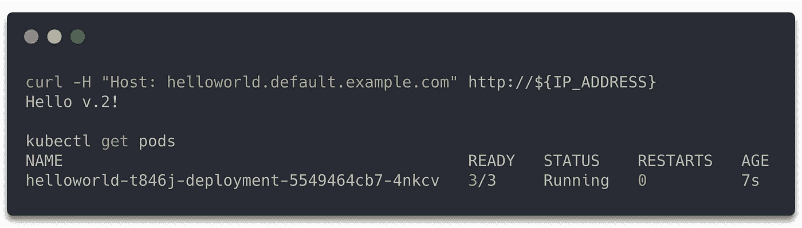

## 服务资源

服务组件提供四种资源服务、路由、配置和修订。这些被定义为一组对象，如 Kubernetes 自定义资源定义(CRDs ),用于定义和控制集群上无服务器工作流的行为。

*   [服务](https://github.com/knative/serving/blob/master/docs/spec/spec.md#service):`service.serving.knative.dev`资源自动管理您工作负载的整个生命周期。它控制其他对象的创建，以确保您的应用程序具有路由、配置和服务每次更新的新版本。可以将服务定义为始终将流量路由到最新版本或固定版本。
*   [Route](https://github.com/knative/serving/blob/master/docs/spec/spec.md#route):`route.serving.knative.dev`资源将一个网络端点映射到一个或多个版本。您可以通过多种方式管理流量，包括部分流量和命名路由。
*   [配置](https://github.com/knative/serving/blob/master/docs/spec/spec.md#configuration):`configuration.serving.knative.dev`资源维护您的部署所需的状态。它在代码和配置之间提供了一个清晰的分离，并遵循十二因素 App 方法。修改配置会创建新版本。
*   [修订](https://github.com/knative/serving/blob/master/docs/spec/spec.md#revision):`revision.serving.knative.dev`资源是对工作负载所做的每次修改的代码和配置的时间点快照。修订是不可变的对象，只要有用就可以保留。

下图显示了它们之间的相互作用。

图由 [Knative](https://github.com/knative/serving/raw/master/docs/spec/images/object_model.png)

本教程可以适用于任何其他应用程序，在 Kubernet 集群上部署 Knative。Knative 文档还为许多其他编程语言提供了不同的[示例](https://www.knative.dev/docs/serving/samples/hello-world/)。进一步的主题是 Knative Eventing-和 Build-component，将在以后的故事中讨论。

[1]: Knative。*Knative Personas*:[https://github . com/Knative/docs/blob/9910 b 8 a9 AC 57 EB 9 cf 642747 b 774 c 24077 e 7f 156 c/docs/build/Personas . MD](https://github.com/knative/docs/blob/9910b8a9ac57eb9cf642747b774c24077e7f156c/docs/build/personas.md)

[2]: Knative。*Knative Serving*:*[https://github . com/Knative/docs/blob/01 D4 ba 31 EC 3 EDA 00169 C3 b 54 CAC 9 d0d 36651281/docs/Serving/readme . MD](https://github.com/knative/docs/blob/01d4ba31ec3eda00169c3b54ccac9d0d36651281/docs/serving/README.md)*