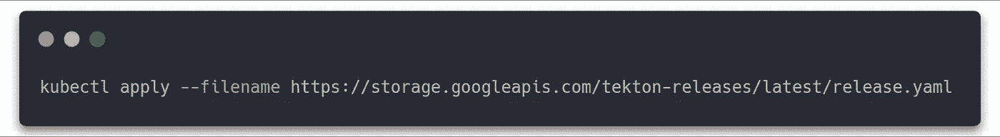
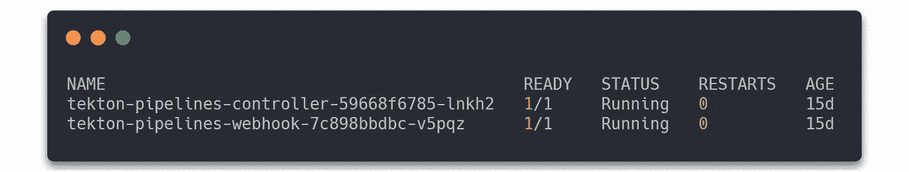
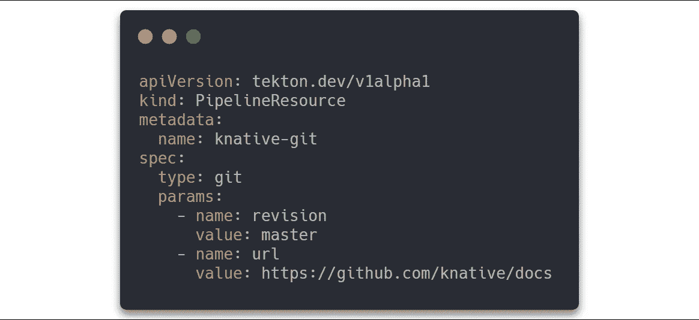
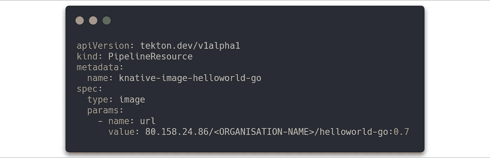
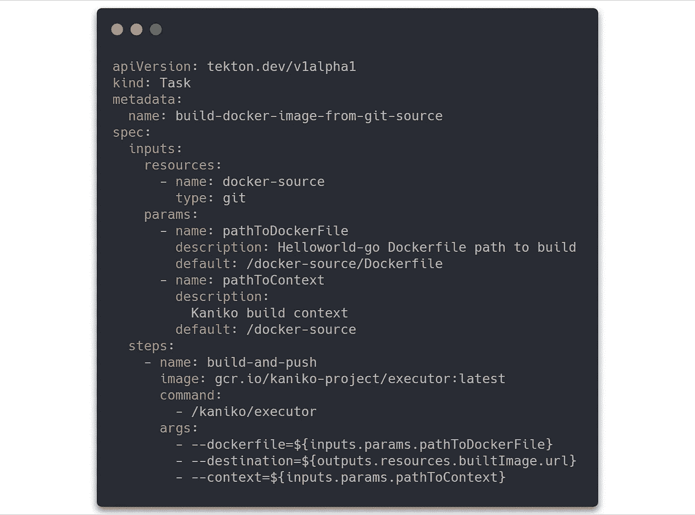
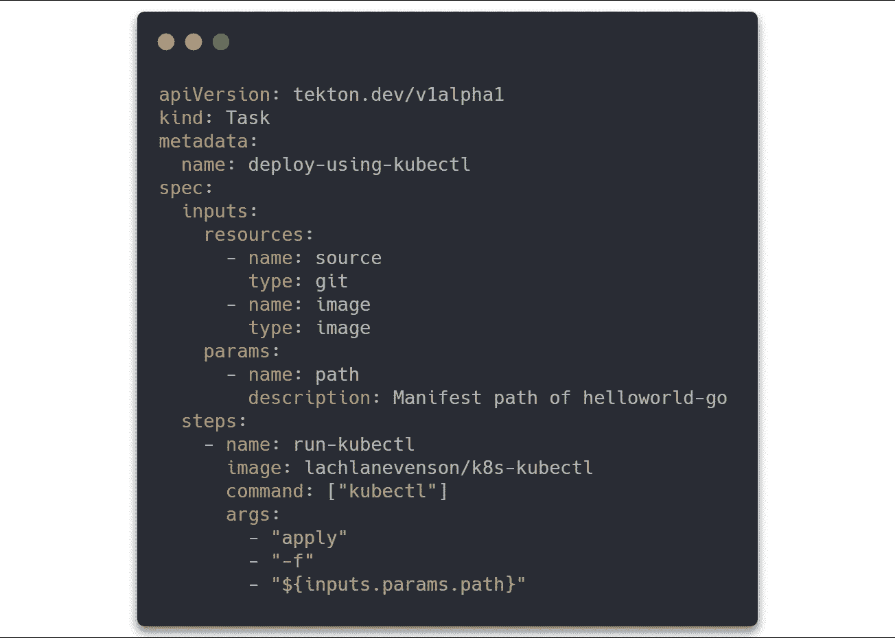
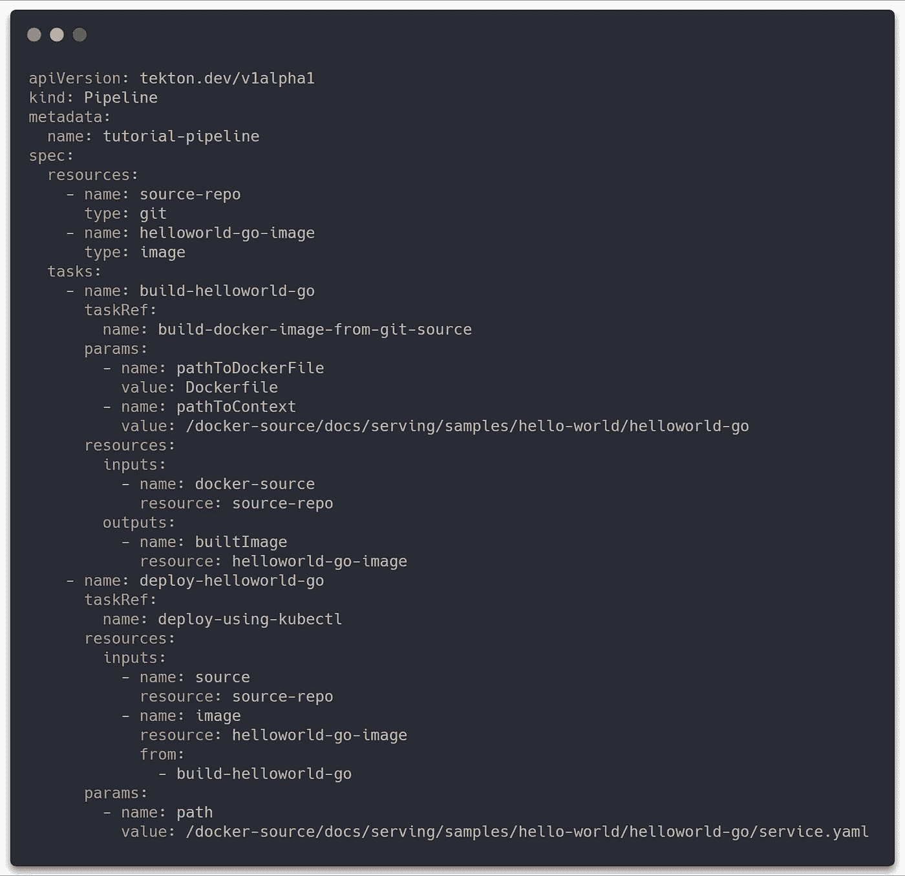
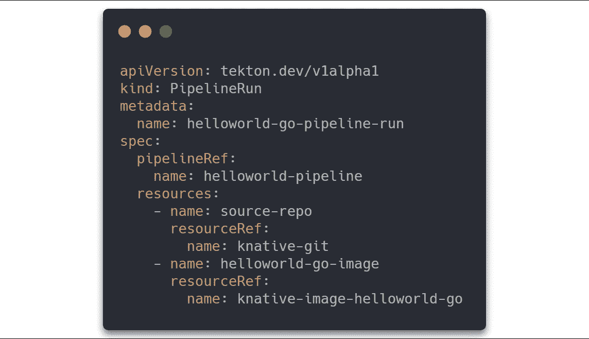

# 如何使用 Knative 管道组件在 Kubernetes 上自动构建和部署应用程序

> 原文：<https://itnext.io/how-to-use-knative-pipelining-component-to-automate-an-application-build-and-deployment-on-442b0b1bebf?source=collection_archive---------6----------------------->

来自 [Pixabay](https://pixabay.com/de/photos/person-wandern-rohrleitung-rohr-731319/) 的[自由照片](https://pixabay.com/de/users/free-photos-242387/)的照片

现代应用程序的生命周期管理的特点是使用持续集成和持续交付(CI/CD)构建链。这些通过标准化和明确定义的流程实现了应用程序的加速部署。

Knative 提供流水线组件 [Tekton](https://github.com/tektoncd/pipeline) 构建模块，用于提供 CI/CD 系统。Tekton 框架包括所有必要的模块构建、测试和部署。通过将它集成到 Knative 中，还可以在多云环境中运行管道。

在本文中，我展示了如何使用 Tekton 基于我以前的文章构建一个完全自动化的容器映像。

# Tekton 基础知识

Tekton Pipeline 项目通过五个额外的自定义资源定义(CRD)扩展了 Kubernetes API:

*   `tasks`
*   `taskrun`
*   `pipeline`
*   `pipelinerun`
*   `pipelineresource`

`Tasks`描述可以有输入和输出的单个作业，即所谓的`pipelineresources`。使用`taskrun`可以执行单个任务。它也将任务的输入和输出绑定到`pipelineresources`。一个`pipeline`描述了一个`tasks`的列表，也可以由`pipelinerun`执行。输入和输出也绑定到`pipelineresources`。

# 要求

根据我以前的文章[使用 Kubespray](/deploy-a-kubernetes-cluster-on-openstack-using-kubespray-39b230b13d62) 在 OpenStack 上部署 Kubernetes 集群和[如何使用 Knative 在 Kubernetes 上部署无服务器应用](/how-to-use-knative-on-kubernetes-to-deploy-a-serverless-application-582d62fa2a9f)我们将向集群添加 Tekton Pipelines 组件。

# 安装 Tekton 管道组件

组件的安装非常简单，我们需要用当前版本的 yaml 文件运行`kubectl apply`命令。

安装创建了两个 pod，可通过如下的`kubectl get`命令进行检查。

等待 pod 处于运行状态很重要，如下图所示。

# 任务和管道准备

在这个例子中，我们使用了前面文章中已经使用过的[kna tive“hello world-go”](https://github.com/knative/docs/tree/master/docs/serving/samples/hello-world/helloworld-go)例子。为此，我们需要创建两个管道资源。首先，Git 资源定义了 Helloworld 源文件所在的 Git 存储库。

并且还需要图像资源。这描述了构建后将提供图像的注册表。对于这个例子，我使用了开放的 Telekom 云图像注册表。

图像注册中心的凭证将由 ServiceAccount 提供，在[如何使用 Knative 在 Kubernetes](/how-to-use-knative-to-automate-an-application-build-on-kubernetes-904034341f9f) 上自动构建应用程序的文章中的“构建准备”一节中有描述。

## 任务内容

准备工作完成后，我们可以定义映像构建和上传任务。它包括两个主要部分。首先是输入，它描述了构建所需的输入类型以及相关的参数。第二，步骤。这些都包括 Kaniko 图像的路径、Executor 命令和要传递的参数。

第二个任务描述构建映像的部署过程。

## 管道定义

下面的 YAML 文件定义了包括 PipelineResources 和上面的任务的管道。

## 管道运行

运行管道需要 PipelineRun。这将为各个任务创建必要的任务运行。并作为任务结果的收集点。

要启动管道，必须使用以下命令按照文章的顺序执行所有创建的 YAML 文件。

最后，以下命令显示了 PipelineRun 的输出。单个任务的状态类型“成功”应该是“真”，这表明任务被成功执行。

# 结论

本文展示了如何使用 tecton 构建一个容器映像，使其在映像注册中心可用并进行部署。Tekton 目前正在开发中，并在不断扩展。2019 年的路线图包括用 Git 事件触发管道等功能，以及工作流的扩展。由于这些原因，不时访问项目网站是值得的。

[1]泰克顿。 *Tekton 管道*:[https://github . com/tek toncd/pipeline/blob/master/docs/readme . MD](https://github.com/tektoncd/pipeline/blob/master/docs/README.md)

[2]泰克顿。 *Tekton 教程*:[https://github . com/tektoncd/pipeline/blob/master/docs/Tutorial . MD](https://github.com/tektoncd/pipeline/blob/master/docs/tutorial.md)

[3]泰克顿。 *Tekton 路线图 2019*:[https://github . com/tek toncd/pipeline/blob/master/Roadmap-2019 . MD](https://github.com/tektoncd/pipeline/blob/master/roadmap-2019.md)