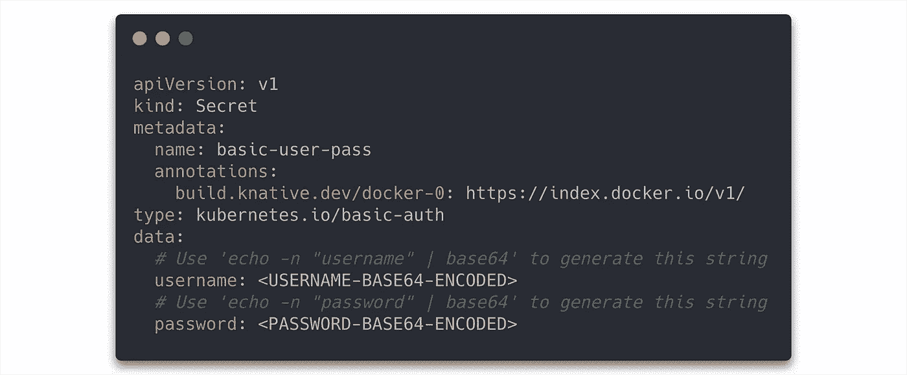
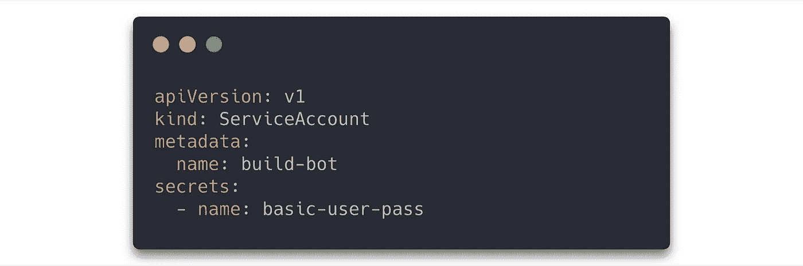
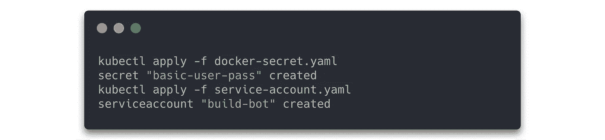
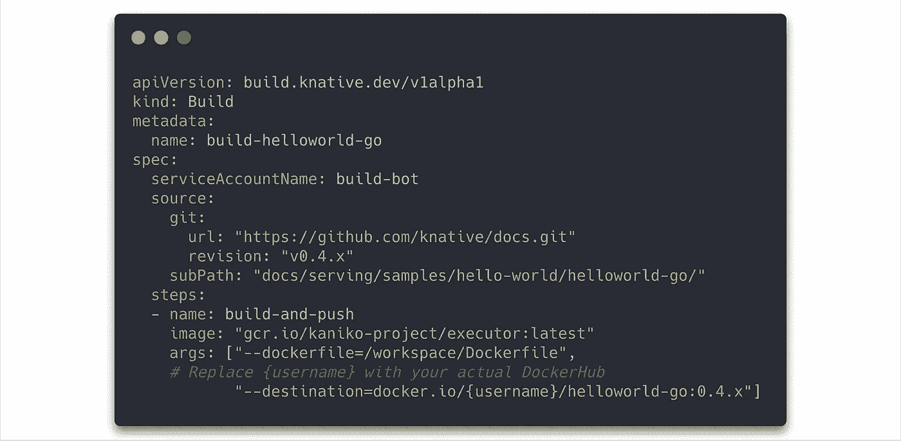
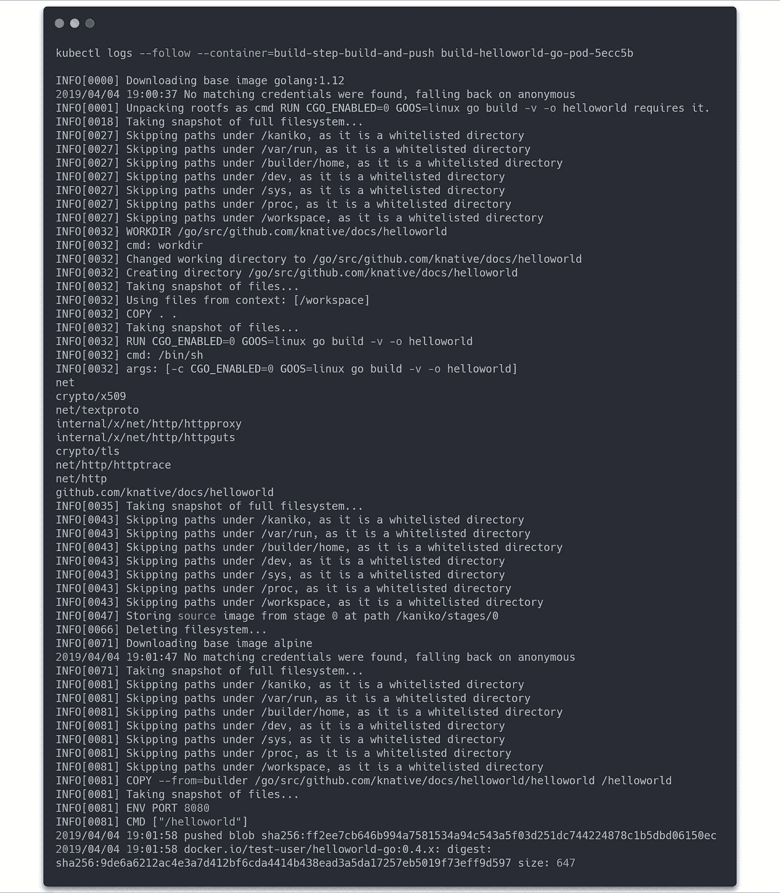

# 如何使用 Knative 在 Kubernetes 上自动构建应用程序

> 原文：<https://itnext.io/how-to-use-knative-to-automate-an-application-build-on-kubernetes-904034341f9f?source=collection_archive---------3----------------------->

照片由 [Pixabay](https://pixabay.com/de/photos/hafen-terminal-kr%C3%A4ne-2668402/) 的 [Inproperstyle](https://pixabay.com/de/users/inproperstyle-617761/) 拍摄

近年来，没有其他技术像应用程序容器一样对它产生如此大的影响。但是它们是如何建造的呢？我将在本文中使用 Knative Build 组件回答这个问题，并展示如何从中受益。

基于我以前的文章，我们使用了 [Kubernetes 集群](/deploy-a-kubernetes-cluster-on-openstack-using-kubespray-39b230b13d62)和 [Knative 安装](/how-to-use-knative-on-kubernetes-to-deploy-a-serverless-application-582d62fa2a9f)。

# Knative Build

Knative Build 组件允许您基于源代码构建容器映像。构建的图像可以由 Kubernetes 集群使用，例如在 Knative 服务组件中。它运行在集群上，由 Kubernetes 自定义资源定义(CRD)实现。容器映像的设计具有优化的大小，并提供更好的运行时性能。Knative Build 不是一个全面的 CI/CD 解决方案，但允许提供可以集成到现有 CI/CD 解决方案中的构造块。

Knative 构建 API 提供了以下三种主要类型:

*   **构建**表示一个容器映像的构建。构建由一个源和一组步骤组成。步骤可以挂载卷以在它们之间共享数据。可以通过实例化 BuildTemplate 来创建构建。
*   **BuildTemplate** 是一个可以用来在一个名称空间内轻松创建构建的模板。
*   **ClusterBuildTemplate** 是一个模板，可以用来轻松地创建在整个 Kubernetes 集群中可用的构建。

目前，可以从以下三个来源获取构建数据:

*   `git` -一个 Git 仓库。
*   `gcs` -一个归档的 Google 云存储。
*   `custom`——一个容器形象。

为了安全使用源代码，Knative Build 系统提供了两种[身份验证类型](https://www.knative.dev/docs/build/auth/):

*   `kubernetes.io/basic-auth`通过用户名和密码。
*   `kubernetes.io/ssh-auth`通过 SSH-私钥。

# 要求

在这个例子中，我们将基于[hello world“Golang”示例](https://github.com/knative/docs/tree/master/docs/serving/samples/hello-world/helloworld-go)构建一个容器图像。

建造的另一部分将是[卡尼科](https://github.com/GoogleContainerTools/kaniko)。要从标准 docker 文件创建映像，通常需要交互访问 docker 守护进程，而守护进程本身需要机器上的 root 访问权限才能运行。这使得在不访问 Docker 守护进程的情况下，很难在 Kubernetes 集群上构建映像。为了解决这个问题，谷歌开发了 Kaniko 工具。它提供了一个执行器，可以在 Kubernetes 集群上运行的容器中构建容器映像。想要深入了解 Kaniko 技术，请点击 [Kaniko 文档链接](https://cloud.google.com/blog/products/gcp/introducing-kaniko-build-container-images-in-kubernetes-and-google-container-builder-even-without-root-access)。

我们的映像构建的第二部分是访问容器注册中心，如 [Docker Hub](https://hub.docker.com) 。您需要创建一个帐户并向 Kubernetes 提供凭据。要创建帐户，您可以点击链接到 [Docker Hub 文档](https://docs.docker.com/docker-id/)。

# 构建准备

现在我们可以开始为我们的 Knative build 提供 Docker Hub 凭证和服务帐户。我们必须创建两个 yaml 文件`docker-secret.yaml`和`service-account.yaml`。

`docker-secret.yaml`的内容，需要生成一个 base64 字符串作为用户名和密码。

来自 [Github](https://github.com/meteatamel/knative-tutorial/blob/master/docs/10-dockerbuild.md) 的 [Mete Atamel](https://github.com/meteatamel) 的配置示例

要创建服务帐户，请在`service-account.yaml`中添加以下内容:

来自 [Github](https://github.com/meteatamel/knative-tutorial/blob/master/docs/10-dockerbuild.md) 的 [Mete Atamel](https://github.com/meteatamel) 的配置示例

现在我们准备在 Kubernetes 上应用文件。

来自 [Github](https://github.com/meteatamel/knative-tutorial/blob/master/docs/10-dockerbuild.md) 的 [Mete Atamel](https://github.com/meteatamel) 的配置示例

在应用之后，我们准备好查看我们构建的 yaml 文件。

# 容器映像构建

为了创建容器映像构建，我们需要一个额外的 yaml 文件`build-helloworld-go.yaml`,包含以下内容。我们使用 Knative API 端点`build.knative.dev/v1alpha1`和种类类型“Build”。yaml 文件的另一个重要部分是“spec”。它包括我们之前创建的服务帐户“build-bot”的 serviceAccountName。除此之外，我们还可以看到 helloworld-go 示例的 github 源代码以及描述如何使用 Kaniko 执行器的构建步骤。在执行程序执行后，图像被推送到 Docker Hub。

yaml-file 可以用下面的命令执行。

在应用命令后，我们可以通过`kubectl get pods`检查 pod。

您还可以观察到容器映像构建的日志输出以及到 Docker Hub 注册表的上传。

最后两行显示，我们的形象建设是成功的，这是推到 Docker 枢纽。`kubectl get pods`也表明我们的构建已经完成。

# 结论

这个例子展示了在 Kubernetes 集群上使用 Knative Build 和 Kaniko 构建容器映像并将其推入映像注册中心是多么容易。为了测试，我还使用了 Open Telekom Cloud 的图像注册中心，在那里需要为图像推送向 yaml 文件添加一个参数。下面可以看到一个改编的 yaml 文件。所有其他命令都不需要更改。

通过将 image build 与 Knative Build 集成，可以在 Kubernetes 集群上简单明了地映射完整的工作流。由于其模块化，构建也可以很容易地集成到现有的 CI/CD 管道中。在以后的文章中，我将讨论 Kantive 事件和流水线。

[1] Knative。 *Knative 构建组件*:*[https://github . com/Knative/docs/blob/release-0.5/docs/reference/Build . MD # Build](https://github.com/knative/docs/blob/release-0.5/docs/reference/build.md#build)*

*[2] Knative。 *Knative 构建组件*:*[https://github . com/Knative/docs/blob/release-0.5/docs/reference/Build . MD # Build template](https://github.com/knative/docs/blob/release-0.5/docs/reference/build.md#buildtemplate)**

**[3] Knative。 *Knative 构建组件*:*[https://github . com/Knative/docs/blob/release-0.5/docs/reference/Build . MD # clusterbuildtemplate](https://github.com/knative/docs/blob/release-0.5/docs/reference/build.md#clusterbuildtemplate)***