# 如何利用机器学习建立一个神奇宝贝搜索引擎— pt。一

> 原文：<https://itnext.io/how-to-use-machine-learning-to-build-a-pok%C3%A9mon-search-engine-pt-1-2db1f8551426?source=collection_archive---------1----------------------->

## 机器学习/项目

## 或者:如何在一个项目中结合对神奇宝贝和机器学习的热情——从零开始！


我和丹尼尔·卡维尼，意大利 2022 初学者日的两位老师

这篇文章是对我和 Daniele Convertini 作为 [Datamasters.it](https://datamasters.it/) 的一部分，在 2022 年的 [Pycon Italia](http://pycon.it/) 上组织的研讨会的合理忠实(但略有缩短)的改编，这是专门讨论 Python 语言的技术会议的意大利版。我们负责初学者日，这是专门为那些想第一次接触 Python 世界的人举办的研讨会，这真的是一种荣誉和乐趣。我们已经等不及下一版了！

顺便说一下，我们决定挑战 Python 新手的项目是从头开发一个神奇宝贝搜索引擎，内部使用了 [KNN](https://en.wikipedia.org/wiki/K-nearest_neighbors_algorithm) 机器学习算法，也是从头实现的。概括地说，我们的搜索引擎将按照以下步骤工作:

*   首先要求用户输入
*   接受这些输入并*寻找哪个口袋妖怪最像那个输入*
*   最后向用户显示搜索结果。

很简单，对吧？嗯，事情比这个稍微复杂一点。对我们的搜索引擎如何工作的描述是超级通用和超级模糊的。它可以指字面上的*任何*软件(毕竟，经典的程序流程是:请求一个输入，*用那个输入做一些事情*，返回一些结果)。

在我们开始设计和开发一些东西之前，我们首先要了解一些事情。这些是我们必须回答的问题:

1.  神奇宝贝到底是什么？
2.  用户将插入什么输入？
3.  预期输出是什么？
4.  我们怎样才能理解用户输入的神奇宝贝*是什么样子的*？
5.  我们想向用户展示什么？我们如何根据相似度对结果进行排序？

在我们开始编写搜索引擎代码之前，让我们每次回答一个问题，让我们寻找第一个问题的答案:

# 神奇宝贝到底是什么？

在你从未听说过神奇宝贝的遥远假设中，这里有他们的[维基百科](https://en.wikipedia.org/wiki/Pok%C3%A9mon)页面，他们的[粉丝](https://pokemon.fandom.com/wiki/Pok%C3%A9mon_Wiki)主页，他们的官方[网站](https://www.pokemon.com/)和他们的官方脸书页面(拥有超过 750 万粉丝)。

简而言之，如果你想阅读的话，网上确实有很多东西。你知道神奇宝贝的可能性更大，因为它是一部动画或神奇的游戏男孩视频游戏(我花了几个小时度过了我现在已经逝去的和心爱的青春期*唉*)。无论如何，重点是神奇宝贝是一种怪物，你可以捕捉、训练、进化(最重要的是)并与其他神奇宝贝战斗以变得更强大。更强，是吧？多少钱？当我们说“一个神奇宝贝*进化*”时，我们指的是什么？我们再深入一点。点击他们官方网站的链接后，我们会看到一个包含所有可用神奇宝贝信息的数据库。我们点击一个随机的神奇宝贝(例如[妙蛙种子](https://www.pokemon.com/us/pokedex/bulbasaur))，它会显示出一个神奇宝贝与诸如体重、身高、类型(草、土、精神、火、战斗等)等数据相关联；许多神奇宝贝也有次要类型)，以及分数:

*   HP(健康点)
*   攻击点
*   防御点
*   特殊攻击点
*   特殊防御点
*   速度

一瞥之后，原来 Pokédex 中的**每只神奇宝贝**都有这些数据。很好！现在我们对神奇宝贝有了更好的理解，它们的基本属性是什么，最重要的是，它们的得分是多少。在这一点上，我们可以问自己:*好，但我们在哪里可以找到关于* ***所有现存神奇宝贝*** *(它们超过 800 个)*的数据？我们可以想象一只可爱的小猴子点击官方网站上的每一个 Pokédex 项目，但是——嘿——我们现在是在 2022 年，感谢上帝更快的解决方案确实存在。在 [Kaggle](https://www.kaggle.com/) 这个连机器学习初学者都非常熟悉的平台上，我们可以很容易地找到数十个包含我们正在寻找的数据的免费下载数据集。你会在 Kaggle 上找到的最常见的文件格式是 [CSV](https://en.wikipedia.org/wiki/Comma-separated_values) (逗号分隔值，一个简单的文本文件——你用记事本创建的文件)。我们选择其中一个数据集:[这个](https://www.kaggle.com/datasets/abcsds/pokemon)。数据集中的列(*特征*，在机器学习的世界中)是:

*   #:神奇宝贝 ID(非常重要:它是一个**唯一属性**，每个神奇宝贝都有不同的神奇宝贝 ID)
*   名称:神奇宝贝的名字
*   类型 1:每个神奇宝贝至少有一个主要类型，它决定了弱点或对某些类型攻击的抵抗力
*   类型 2:一些神奇宝贝有两种类型
*   总计:以下所有分数的总和
*   生命值
*   攻击:普通类型攻击的基础调整值
*   防御:抵抗普通类型的攻击
*   特殊攻击的基础修正值
*   SP 防御:抵抗特殊攻击
*   速度:用于决定哪些神奇宝贝先攻击
*   世代:世代数(存在 7 代神奇宝贝)

我们现在可以继续回答下一个问题。

# 用户将插入什么输入？

现在我们知道了神奇宝贝到底是什么，我们可以更好地概述我们的搜索引擎应该如何真正工作。

我们可以询问用户信息，如名称或类型，并让我们的搜索引擎返回与用户输入的名称相似的神奇宝贝，或者可能是属于某个类别的所有神奇宝贝；相反，我们决定向用户询问 6 个数字。这些数字将代表与每个神奇宝贝已经拥有的分数相对应的值，并且这些值在不同的神奇宝贝之间是不同的:HP、攻击、防御、特殊攻击、特殊防御和速度。然后，搜索引擎将搜索得分**与用户输入的 6 个值**最接近的神奇宝贝。我们将这一系列分数称为“**搜索查询**”。

# 预期输出是什么？

搜索引擎可能会输出一系列有序的结果。你拿到了吗？**的有序序列**产生，这提出了一个新的问题:在我们的例子中，结果到底是什么？原来，一个结果实际上可能是一个神奇宝贝及其所有数据。如果是这样，我们的搜索引擎基本上会返回一系列神奇宝贝。很有道理，不是吗？用户在搜索查询中插入一些数字(搜索查询的一个例子是:HP = 40，Attack = 45，Defense = 56，等等)，并得到一系列神奇宝贝，最类似于插入的搜索查询。我们正在处理整数，所以第一个结果将是**最相似的神奇宝贝**，第二个结果将是第二个最相似的神奇宝贝，以此类推。其他问题:我们想要多少结果？我们想向用户展示多少个神奇宝贝？全部 800？不，坏主意。如果我们这样做，我们的搜索引擎将会不方便使用:没有足够的空间显示 800 个神奇宝贝的电脑屏幕。如果我们给结果数一个界限会更好。我们的搜索引擎将返回 K 个神奇宝贝的列表，其中 K 当然是一个整数。例如，如果 K = 5，情况如下:

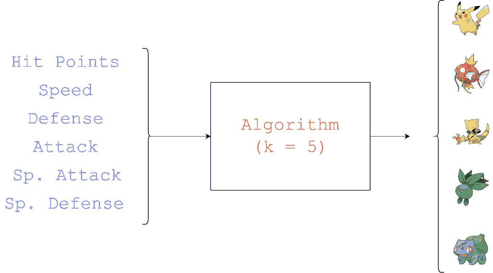

K = 5 的搜索引擎。图片由作者提供。

很简单，不是吗？用户插入一些包含 6 个数字的搜索查询，我们的算法*do stuff*，搜索引擎返回 K 个神奇宝贝的列表。我们很好。我们继续吧。

# 如何才能理解用户输入的神奇宝贝是什么样子的？

现在有趣的事情来了。回答这个问题基本上就是**设计我们的搜索引擎算法**。不用说，这是我们项目中最重要的部分，所以我们不妨马上开始。我们现在有什么？让我们来回顾一下。我们有:

*   由 6 个数字组成的输入
*   *做 stuff*的算法
*   由一系列有序的神奇宝贝组成的输出

或者，如果我们愿意，我们可以说我们的用户插入了一个**虚构的神奇宝贝**的数据，由于与作者的名字完全一致，我们将它称为 **Pepposaur** ，一个野生的神奇宝贝，这里有一张罕见的照片:


图片由作者提供。哦，还有图像中的*作者。*

我们的算法到目前为止只是*做 stuff*因此变成:“我们如何找到与 Pepposaur 最相似的 K 神奇宝贝？”

这就是我们之前提到的算法发挥作用的地方，而且非常奇怪的是，这似乎是为了回答这些问题而故意制造的 : **KNN** 。KNN 代表 K 近邻。

## k-最近邻

在机器学习中，KNN 是一种监督学习算法，用于回归(即预测连续值)和分类(即预测输出类或标签)。它是基于一个非常简单，但非常有效的概念。假设我们有一个人的列表，并且假设我们知道每个人的体重和臀围(我们称之为**特征**的连续数值)。假设对于每个人，我们都有一个“是/否”指标，告诉我们这个人是否肥胖。现在，假设我们用这些信息构建一个图表，例如，将臀部的周长放在 X 轴上，将体重放在 Y 轴上，并根据这个人是否肥胖(红点)将这些点涂上不同的颜色(浅蓝色点)。我们将得到如下图表:

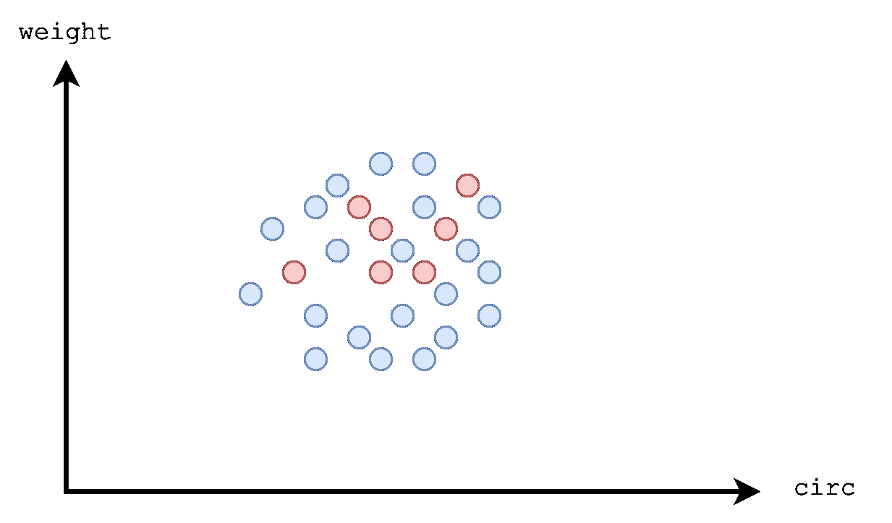

KNN 进行分类。图片由作者提供。

现在，假设我们有另一个观察结果，我们知道两个特征值(周长和体重)，我们希望**预测**肥胖/非肥胖标志。假设新的观察值像这样放在图中(绿点):

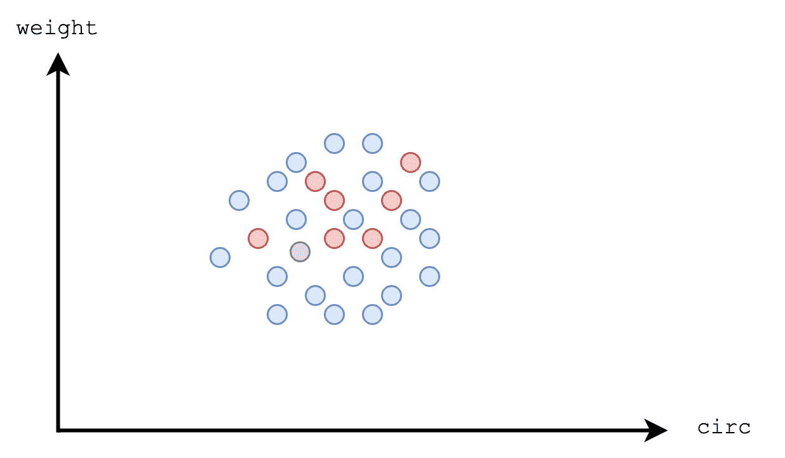

KNN 进行分类。图片由作者提供。

KNN 算法基于新的观察特征做出决定，只需选择最近的 K 个邻居，并查看在这 K 个邻居中哪个类最具代表性。在我们的例子中，如果 K = 5:

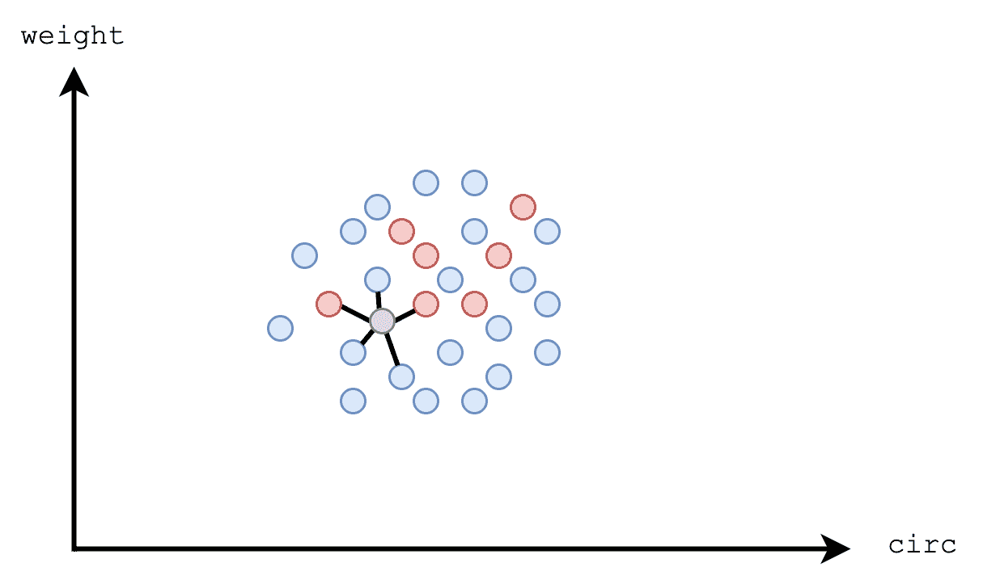

新观察邻居。图片由作者提供。

最接近的 5 个邻居是天体大多数(不肥胖)。因此，新的观察预测了“非肥胖”类别。仅此而已。很简单，不是吗？嗯，在这种情况下，我们使用直线作为点之间的距离测量，而原始算法可以使用不同的和更复杂的距离测量，但这只是*KNN 如何工作*:做出一个决定，寻找一个新观察的邻居的类(或值，在回归的情况下)。

现在:让我们将 KNN 应用到我们的用例中。让我们解决问题的关键是替换一个词:从“神奇宝贝更像 Pepposaur”开始，我们的搜索引擎将不得不搜索“Pepposaur 的**邻居**神奇宝贝”。

我们一方面有 Pepposaur 的特征，另一方面有我们的神奇宝贝数据集。为简单起见，假设我们只考虑一个特性，HP，假设用户输入数字 67 作为 Pepposaur 的 HP 值。让我们尝试绘制(一维的，因为我们只考虑一个特征)Pepposaur 和我们数据集中的神奇宝贝的 HP。我们会得到这样的结果:


单轴图。图片由作者提供。

理解 Pepposaur 的邻居是什么样的神奇宝贝非常简单。例如，如果我们想了解哪两个神奇宝贝最接近粉红猪小妹(即，如果 K = 2)，很明显这两个是妙蛙草和 Charmeleon。如果 K = 3，我们也应该把 Charizard 包括在列表中。如果 K = 4，我们还应该包括 Venusaur 等等。但是，如何才能正式达成这个解决方案呢？我们可以使用的一个简单的数学公式就是 Pepposaur 的 HP 和其他神奇宝贝的 HP 的绝对值之差:

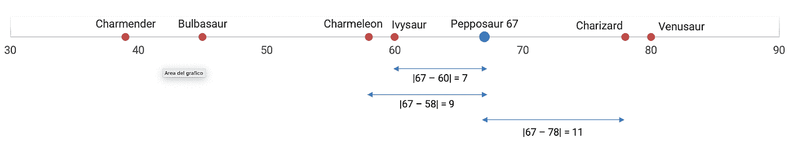

图片由作者提供。

这是一个与众不同的问题:

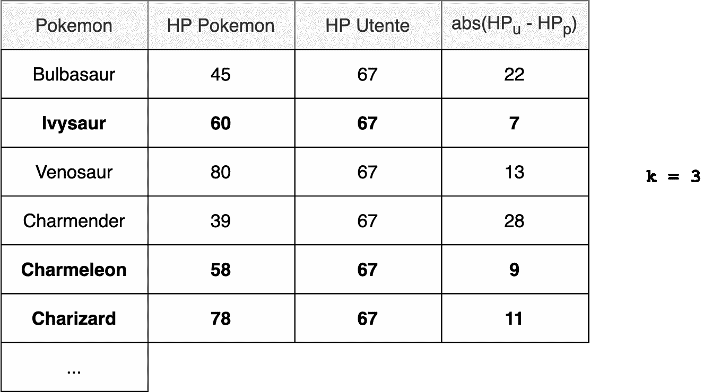

图片由作者提供。

粗体显示的是距离较短的神奇宝贝，即距离粉红猪小妹最近的**(因此也是最像**)神奇宝贝。注意一件事:我们可以计算距离的**平方**的**平方根**，而不是计算距离的绝对值。它会给出和绝对值一样的结果:****

****

**图片由作者提供。**

**好了，现在我们来添加一个轴。我们只是再加一个分数，比如说**攻击点**，做和之前一样的事情，就是我们建一个图。假设这次用户输入 54 和 55 作为 Pepposaur 分数，分别是 HP 和攻击点。这次的图表将是二维的，因为我们只考虑两个特征，两个轴:**

**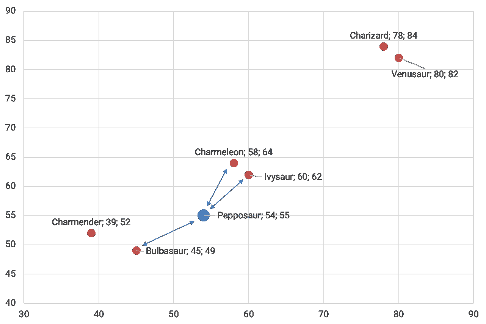**

**图片由作者提供。**

**对剧情的一瞥告诉我们，这一次，最接近的 3 个神奇宝贝是妙蛙种子、妙蛙草和 Charmeleon，但是我们如何用数学的方法来告诉它呢？好了，我们在一个二维图形中:我们可以使用勾股定理并应用欧几里得距离公式来计算两点之间的距离:**

**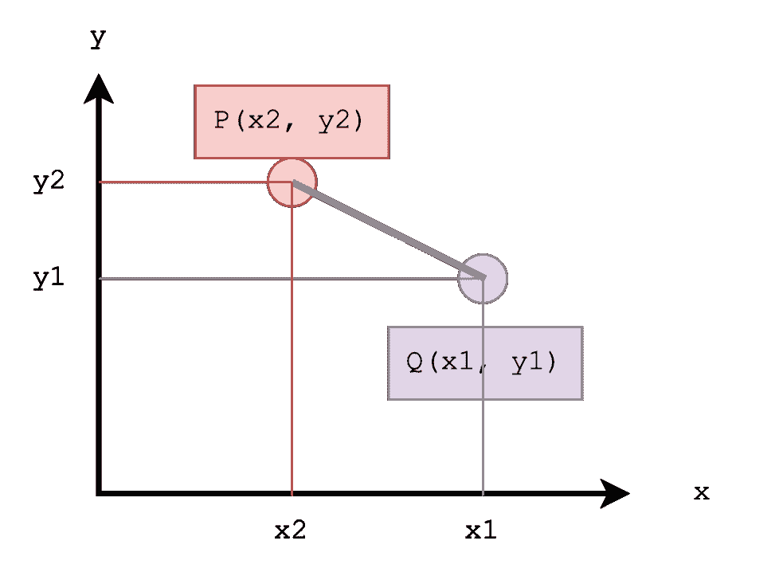**

**图片由作者提供。**

**我们将使用的公式如下:**

**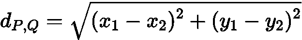**

**图片由作者提供。**

**在这种情况下，我们也有可能在笛卡尔图上形式化两点之间的“接近”程度，然后计算数据集中每对 Pepposaur / Pokemon 的距离:**

**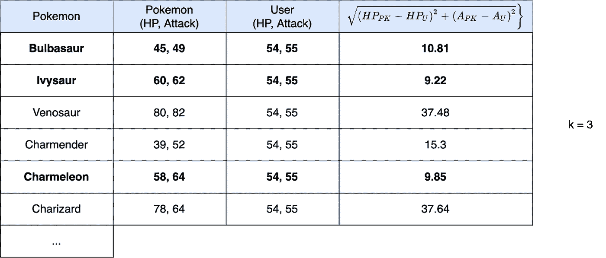**

**图片由作者提供。**

**粗体字是粉红猪小妹的 3 个神奇宝贝邻居。**

**好，让我们把它变得更难(和完整)。让我们添加另一个轴，包含防御点分数。在这种情况下，我们将构建一个三维图形(x: HP，y: Attack，z: defense)，但要点不会改变:三维上下文中的欧几里德距离公式将是:**

**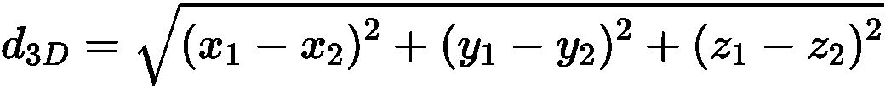**

**图片由作者提供。**

**然后，我们可以建立一个普通的表，显示 Pepposaur 和各种神奇宝贝之间的距离。**

**欧几里德距离的美妙之处在于它可以与任意数量的轴一起工作，甚至是那些超出可见范围的轴。如果我们继续添加轴，即使我们不能“可视化”数据(因为我们的感知仅限于 3 维)，我们仍然能够计算欧几里得距离。欧几里德距离的概括是:**

**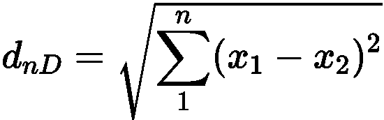**

**欧几里德距离。图片由作者提供。**

**有了这个公式，我们可以计算出任何一个维的*中两点之间的欧几里德距离。当然，这两个点必须有相同的维数。让我们尝试一个清晰的例子:***

```
#            HP  At  Df  SA  SD  Sppepposaur = [54, 55, 60, 42, 49, 25]bulbasaur = [45, 49, 49, 65, 65, 45]
```

**让我们应用这个公式:**

**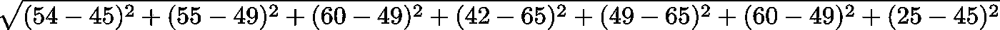**

**图片由作者提供。**

**这让我们想到:**

**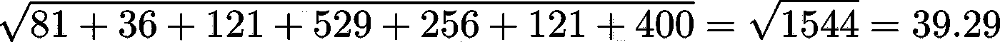**

**图片由作者提供。**

**这是 Pepposaur 和妙蛙种子之间的欧几里得距离。我们需要将这个公式应用于数据集中的 800 多个神奇宝贝来**计算用户作为搜索查询输入的神奇宝贝与数据集中所有神奇宝贝之间的欧氏距离**。**

# **我们想向用户展示什么？我们如何根据结果的“相似性”进行排序？**

**我们现在拥有的是用户为虚拟神奇宝贝输入的值，以及虚拟神奇宝贝和每个数据集神奇宝贝之间的欧几里德距离(即一个*数字*)。现在是时候向用户展示我们搜索引擎的结果了。我们之前说过，搜索引擎按照相关性的顺序显示结果。首先是最相关的结果，然后逐渐是不太相关的结果。在我们的案例中，我们认为什么是“结果”？我们如何订购它们？**

**第一个问题的答案很简单。只是一个从数据集中提取内容的字符串:Pokédex ID、名称、代、类型、分数。例如:**

```
1 — Bulbasaur, type Grass, scores: …24 — Entei (legendary), type Fire, scores: …425 — Drifloon, type Ghost, Flying, scores: …
```

**好吧。但是我们如何对它们进行排序呢？我们有一个数据结构，其中每个神奇宝贝都有与用户虚构的神奇宝贝的距离；到目前为止所做的计算，就像我们在我们的数据集中添加了一列，即“与粉红龙的距离”列；我们还可以利用每个神奇宝贝在数据集中的位置(即 CSV 文件中的行号，从 0 开始计数)，这对每个神奇宝贝来说都是唯一的，因此可以用来区分各个神奇宝贝。**

**然后，我们可以将我们的结果存储在一个数据结构中，对于每个神奇宝贝，我们在数据集中存储行的位置以及到 Pepposaur 的距离。我们真的不需要其他任何东西:**

**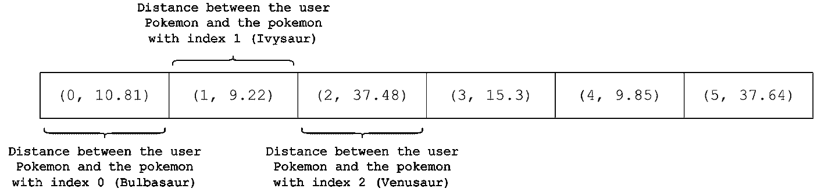**

**图片由作者提供。**

**为了显示我们的搜索引擎的正确输出，我们只需要根据我们在数据结构的每个元素中可以找到的距离对这个数据结构进行排序。该排序过程的输出将是:**

**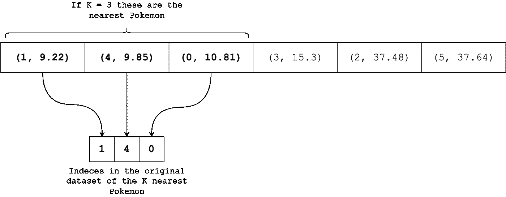**

**图片由作者提供。**

**瞧啊。此时，我们有可能访问最接近 Pepposaur 的 K(在这种情况下 K = 3)个元素，然后搜索引擎将返回 3 个结果(总是因为 K = 3)，**按接近度**排序:**

*   **排名第一的是指数为 1 的神奇宝贝，妙蛙草**
*   **排名第二的是指数为 4 的神奇宝贝，查曼德**
*   **排名第三的是指数为 0 的神奇宝贝，妙蛙种子**

**因此，总而言之，我们的搜索引擎将这样工作:**

*   **该程序将要求用户输入值**
*   **用户将输入 6 个值作为搜索查询，然后这些值将与一个虚构的神奇宝贝(我们称之为 Pepposaur 的神奇宝贝)相关联**
*   **该程序将使用 KNN 算法来搜索最接近 Pepposaur 的 K 神奇宝贝；特别是:
    将使用欧几里得距离计算每个神奇宝贝和 Pepposaur 之间的距离
    将在一个单独的列表中记住每个神奇宝贝:每个神奇宝贝的行号我们用 Pepposaur 计算距离，距离本身
    将按距离对新创建的列表进行排序**
*   **该程序将显示，最后，前 K 个结果，按距离排序，作为结果。**

**现在，我们已经清楚地了解了我们的程序将如何工作，是时候动手编写一些 Python 代码了——在下一篇文章中:)。**

***psst*，[下面是](/how-to-use-machine-learning-to-build-a-pokémon-search-engine-pt-2-lets-code-f44cd22c912f)第二部分——实际代码！**