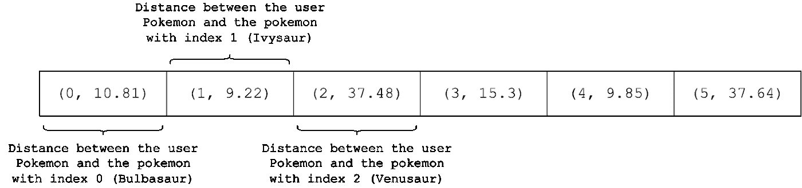
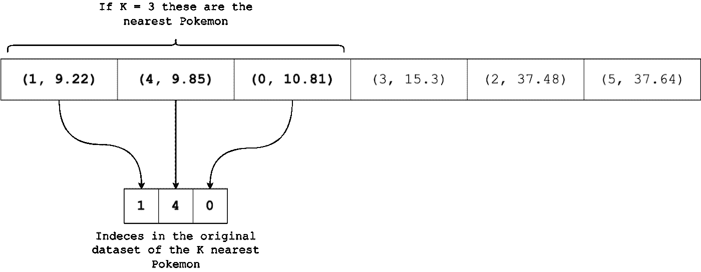

# 如何利用机器学习建立一个神奇宝贝搜索引擎— pt。2 —我们来编码吧！

> 原文：<https://itnext.io/how-to-use-machine-learning-to-build-a-pok%C3%A9mon-search-engine-pt-2-lets-code-f44cd22c912f?source=collection_archive---------2----------------------->

## 机器学习/项目

## 神奇宝贝、机器学习、Python:胜利三重奏


在我的上一篇文章中，我介绍了我们在 [Datamasters](https://datamasters.it/) 为 Pycon 22 准备的研讨会的算法部分。TLDR:提出了一个使用机器学习 KNN 算法的神奇宝贝搜索引擎。你可以在这里阅读文章。让我们快速回顾一下:

1.  从用户那里拿 6 个数字，然后把它们分配给一个“假的”神奇宝贝
2.  计算假神奇宝贝和存储在[的每个神奇宝贝之间的欧几里德距离，你可以在 Kaggle 上轻松找到许多数据集](https://www.kaggle.com/datasets/abcsds/pokemon)
3.  在一个新的数据结构中存储一个长度为 N(数据集中神奇宝贝的数量)的列表，其中每个元素存储 2 个数字:
    数据集中神奇宝贝的索引
    第 I 个神奇宝贝和我们的假神奇宝贝之间的欧几里德距离
4.  我们现在有了一个长度等于数据集中神奇宝贝数量的数据结构；每个元素包含一个唯一的索引和一个表示距离的数字；我们希望按照每个元素的“距离”值对这个结构进行排序
5.  在输出中只显示这个排序的数据结构的前 K 个元素(例如，如果 K = 3，我们只取最接近的 3 个神奇宝贝，因此最类似于用户插入的神奇宝贝)

就是这样。这个想法并不难。如果你遗漏了什么，再读一遍这篇文章。

在本文中，我们将使用 Python 实现我们的搜索引擎。作为名为“初学者日”的研讨会的一部分，我们决定不使用任何第三方库，甚至不使用 Python 臭名昭著的超级常用和超级酷的机器学习库(pandas，matplotlib，numpy 等)。我们从零开始构建这个搜索引擎**。我们唯一使用的包是 CSV，它是 Python 标准库的一部分；这意味着你不需要安装任何东西就可以使用这个包。一旦你安装了 Python，你就可以使用这个包了。让我们从导入这个包并使用它来读取数据集开始，数据集(不出所料)是一个 CSV 文件。注意:数据集的第一行包含列名，而不是实际的神奇宝贝数据:**

```
import csvcolumns **=** []
pokemon_dataset **=** []
**with** open('pokemon.csv') **as** file:
    print(type(file))
    reader **=** csv**.**reader(file)
    columns **=** next(reader)
    **for** row **in** reader:
        pokemon_dataset**.**append(row)
```

**我们在这几行代码中所做的就是读取 CSV 文件的内容，并将读取的值存储在两个列表中。第一个将包含列名(#、name、type 1、type 2 等)，而后者将保存实际的数据集。请注意，`columns`是一个一维列表，而`pokemon_dataset`是一个**二维列表**，也称为**矩阵**或者如果你喜欢**表**:访问一个神奇宝贝我们将使用单个索引，而如果我们想要访问一个神奇宝贝的属性，我们将使用 2 个索引:**

```
print(pokemon_dataset[0]) # Prints the row with Bulbasaur data, the first Pokémon of the dataset
print(pokemon_dataset[0][1]) # Prints the name(index 1) of the Pokémon with index 0 (always Bulbasaur)
```

**让我们通过打印第一个神奇宝贝妙蛙种子的所有可用字段、字段类型和值来探索数据集:**

```
**for** k, v **in** zip(columns, pokemon_dataset[0]):
    print(f"{k:10} -> {v:15} ({type(v)})")#          -> 1               (<class 'str'>)
Name       -> Bulbasaur       (<class 'str'>)
Type 1     -> Grass           (<class 'str'>)
Type 2     -> Poison          (<class 'str'>)
Total      -> 318             (<class 'str'>)
HP         -> 45              (<class 'str'>)
Attack     -> 49              (<class 'str'>)
Defense    -> 49              (<class 'str'>)
Sp. Atk    -> 65              (<class 'str'>)
Sp. Def    -> 65              (<class 'str'>)
Speed      -> 45              (<class 'str'>)
Generation -> 1               (<class 'str'>)
Legendary  -> False           (<class 'str'>)
```

**注意所有字段都是**字符串(类型** `**str**` **)，甚至是包含数值的字段**(分数列、代、总数)。当然，将欧几里德距离应用于字符串是不可能的，除了完全是无意义的；我们需要做的是将我们感兴趣的数值存储在另一个数据结构中，但是使用`float`类型:**

```
num_indexes **=** [5, 6, 7, 8, 9, 10]numerical_data **=** []
**for** i **in** range(len(pokemon_dataset)):
    row **=** pokemon_dataset[i]
    num_row **=** []
    **for** col **in** num_indexes:
        num_row**.**append(float(row[col])) numerical_data**.**append(num_row)**for** k, v **in** zip(columns[5:11], numerical_data[0]):
    print(f"{k:10} -> {v:5} ({type(v)})")# the last for loop would print:
HP         ->  45.0 (<class 'float'>)
Attack     ->  49.0 (<class 'float'>)
Defense    ->  49.0 (<class 'float'>)
Sp. Atk    ->  65.0 (<class 'float'>)
Sp. Def    ->  65.0 (<class 'float'>)
Speed      ->  45.0 (<class 'float'>)
```

**在`numerical_data`中，我们现在可以找到**和**包含我们将用来计算欧几里德距离的数据的列。最后，为了确保我们做得好，让我们打印数据集中第一个神奇宝贝的值和类型，仔细检查它们是`float`。**

**现在:让我们编写将成为我们的 KNN 版本的真正核心的函数。首先，N 维两点间的欧氏距离:**

```
**def** euclidean_distance(p1, p2):
  dim **=** len(p1)
  distance **=** 0
  **for** d **in** range(dim):
    distance **+=** abs(p1[d] **-** p2[d]) ****** 2

  distance **=** distance******(1**/**2) **return** distance
```

**`p1` e `p2`是列表，两者具有相同数量的元素(即具有相同的*长度*)。欧几里德距离起作用的强制性要求是:点*必须*属于同一个**欧几里德空间**；这是一个有趣的说法，如果我们有二维的点，我们将计算平面中的欧氏距离。如果我们有一个三维的点，我们将计算在空间中的欧几里德距离。计算 2D 点和 3D 点之间的欧几里德距离是没有意义的，不是吗？回到代码:在`for`循环中，我们遍历这些点的坐标，我们计算它们的差的绝对值，我们对其求平方，并将其添加到一个名为`distance`的变量中，该变量最初设置为 0。在循环之外，我们将`distance`提升到 0.5 的幂，这意味着(我想提醒你)计算`distance`的平方根。**

**下一个函数将完成算法的剩余部分，即数据结构的创建和排序:**

```
**def** get_k_neighbors(k, dataset, fake_pokemon):

    distances **=** [] **for** i **in** range(len(dataset)):
        row **=** dataset[i]
        d **=** euclidean_distance(fake_pokemon, row)
        distances**.**append((i, d)) distances**.**sort(key**=lambda** tup: tup[1]) **return** distances[:k]
```

**该函数有三个参数:**

*   **`k`，一个数字，代表返回给用户的结果数**
*   **`dataset`，包含所有神奇宝贝数值的表格**
*   **`fake_pokemon`，填充了用户值的列表**

**接下来，该函数创建一个名为`distances`的空数据结构，对于数据集中由`i`索引标识的每个神奇宝贝，使用前面定义的函数计算`fake_pokemon`和第 I 个数据集行之间的欧几里德距离。对于每个计算的距离，一个新的元组被插入到`distances`结构中:元组的第一个元素是变量`i`，而第二个(也是最后一个)元素是计算的距离。在循环之后，这是我们将得到的数据结构:**

****

**未排序的数据结构。作者图片**

**我们所要做的就是**整理**这个数据结构。在 Python 中对一个列表进行排序相当容易:我们可以在我们想要排序的列表上使用`.sort`方法，所有数据将立即按升序排序。这种方法速度很快，并且适用于**一维列表**，而在这种情况下，我们有一个`Nx2`结构，其中 N 是神奇宝贝的数量。但是不要害怕！我们可以使用 sort 方法，作为第一个参数传递一个**回调函数**，其中我们可以**指定我们想要用来对我们的原始数据结构**进行排序的元素。这个函数将在列表的每个元素上被调用，并且只有一个参数:数据结构的第 I 个元素。为了简洁起见，我们使用了一个 **lambda 函数**，但是我们可以使用一个老式的函数来获得相同的结果，就像这样:**

```
def which_element(tup):
    return tup[1]distances.sort(which_element)
```

**注意返回值(在 lambda 函数和传统函数中)仅仅是元组索引为 1 的值，即我们的数据结构的第二列:距离。**

**下面是整理后的`distances`:**

****

**包含神奇宝贝索引和与用户神奇宝贝的距离的有序列表**

**现在我们可以使用**切片**来返回第一个 **k 个**元素，距离**最短的 k 个元素**，或者如果你喜欢的话，**与用户神奇宝贝**最相似的 k 个神奇宝贝。**

**最后，我们创建了一个函数来打印神奇宝贝的信息。**

```
**def** print_pokemon_info(i):
    s **=** f"{pokemon_dataset[i][0]} - {pokemon_dataset[i][1]}, of type {pokemon_dataset[i][2]} (gen. {pokemon_dataset[i][**-**2]})"
    **if** pokemon_dataset[i][**-**1] **==** "True":
        s **+=** f"\n - LEGENDARY"
    **return** s
```

**该函数只接受一个输入参数:Pokémon 数据集中该行的索引。我们只是使用一个 Python f 函数:**

*   **神奇宝贝指数**
*   **神奇宝贝名称**
*   **神奇宝贝类型**
*   **神奇宝贝世代(为了检索世代，我们使用 index -2 来获取**倒数第二个**元素)**
*   **如果神奇宝贝是传奇的消息(为了检索“传奇”字段，我们使用 index -1 来获取行的最后一个元素)**

**最后，我们返回生成的字符串。**

**最后，我们使用创建的函数编写代码行，要求用户输入:**

```
user_row **=** []k **=** 5**for** i **in** range(len(num_indexes)):
    col_index **=** num_indexes[i]
    v **=** input(f"Inserisci il tuo valore di {columns[col_index]}\n")
    user_row**.**append(float(v))**for** k, v **in** zip(columns[5:11], user_row):
    print(f"{k:10} -> {v:15} ({type(v)})")print("Looking for the most similar Pokémon...")l **=** get_k_neighbors(k, numerical_data, user_row)
print(l)**for** p **in** l:
    print(print_pokemon_info(p[0]))
```

**我们创建一个对应于我们的假神奇宝贝的空列表；我们将 k 设置为 5(我们将获得距离最短的 5 个神奇宝贝)，并向用户询问 6 个数字(我们还将使用我们在第一个单元格中创建的`columns`列表，向用户显示分数名称)；我们打印这些值是为了提高程序的可用性；我们调用函数得到 K 个最相似的神奇宝贝；我们使用最后一个函数来显示我们的算法返回了哪些神奇宝贝。下面是程序输出的一个例子:**

```
Insert a HP value
40
Insert a Attack value
40
Insert a Defense value
40
Insert a Sp.Attack value
40
Insert a Sp.Defense value
40
Insert a Speed value
40
HP         ->            40.0 (<class 'float'>)
Attack     ->            40.0 (<class 'float'>)
Defense    ->            40.0 (<class 'float'>)
Sp. Atk    ->            40.0 (<class 'float'>)
Sp. Def    ->            40.0 (<class 'float'>)
Speed      ->            40.0 (<class 'float'>)Looking for the most similar Pokémon...236 - Tyrogue, of type Fighting (gen. 2)
300 - Skitty, of type Normal (gen. 3)
29 - Nidoran♀, of type Poison (gen. 1)
504 - Patrat, of type Normal (gen. 5)
412 - Burmy, of type Bug (gen. 4)
```

**就在那里！我们可以插入我们想要的任何值，我们的软件将使用前面实现的 KNN 算法来返回与用户插入的数字最相似的神奇宝贝。很简单，不是吗？通常，一旦你有了一个好的设计，编码就不会那么难了。**

**我们的存储库，可在[这个 URL](https://github.com/Datamasters-it/pycon-22-beginners-day) 找到，你可以找到一个 Jupyter 笔记本，上面有神奇宝贝图像的可视化，取自[一个有神奇宝贝数据的网站](https://veekun.com/dex/downloads)。**

**稍后见，还有其他 ML 文章和教程！**