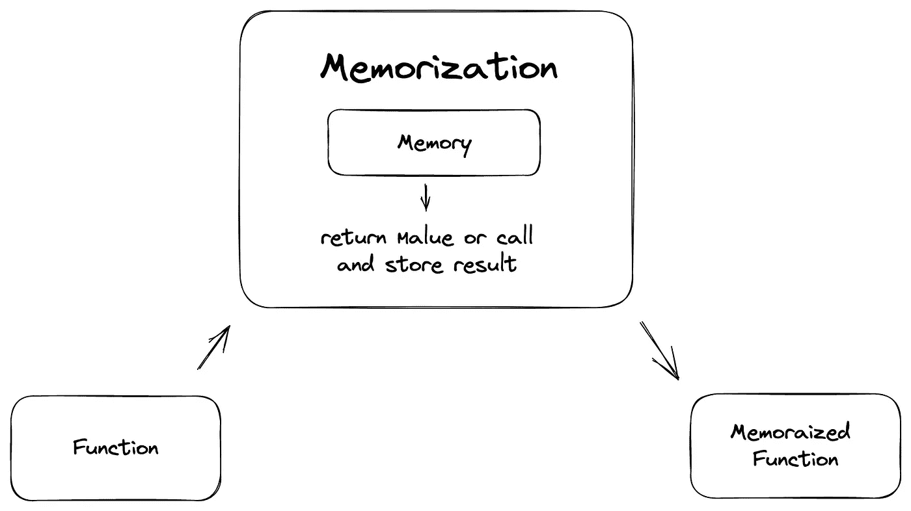

# 反应记忆的准确性

> 原文：<https://itnext.io/how-to-use-memorization-in-react-applications-8ba3f11b2984?source=collection_archive---------2----------------------->

## 如何在 react 应用程序中使用备忘录

感谢来自[unsplash.com](https://unsplash.com/)的[法鲁拉米](https://unsplash.com/@fahrulazmi)的图片

返回已经存储的数据的想法并不新鲜，但是理解它是如何工作的对于所有开发人员来说都是非常重要的。

备忘录是内存，开发技术有助于优化昂贵函数的计算过程。记忆的使用是一个非常重要的实践，并被作为发展的关键知识。React 有很好的记忆工具。但是它是如何工作的，为什么它很重要，以及如何使用它？让我们在这篇文章中用实际例子来详细了解一下。

# 什么是识记？

记忆是刚刚有了存储的功能。闭包有助于存储数据，并通过键从那里获取数据以获得结果。非常简单的想法:键和值。

记忆图式

假设我们有一个函数，它有两个参数，结果是这两个参数的和。我们该怎么办？我们将把它作为参数传递给 memo 函数。

使用下面的函数，我们将创建一个`memory`属性作为一个空对象，然后返回一个需要参数的新函数。我们将使用这些参数作为存储和返回记忆函数结果的密钥。

记忆功能

你可以看到，在对记忆的函数进行其他调用之后，有一种情况，我们基于字符串参数中的键来检查现有的结果。如果结果已经存在，我们只返回结果本身。

# 怎么用？

首先，让我们在函数中放一些`console.log`来更好地理解状态变化。

结果日志

现在让我们为 memo 创建一个函数:

备忘录功能

记住它并多次重复使用该函数，并检查记住的函数实际被调用了多少次。

来自记忆功能的日志

我们创建了记忆的函数并调用了`console.log`五次，但是在三次调用中传递了相同的参数。

记忆功能的结果

记忆的函数将只被调用三次，因为如果结果已经知道，则不需要再次调用该函数，在这种情况下，结果将从内存中返回。

# 应用于反应组件

如果我们将此应用于 react 组件，会发生什么？

让我们在 React 应用程序中创建一个非常简单的组件，使用`yarn create vite`而不使用`React.StrictMode`。

严格模式不是我们的目标。它只是为了突出继承的 API 的潜在问题而进行额外的渲染，例如，一些导入的组件。我们不会使用任何库。相反，我们将关注渲染过程。

钥匙控制台

让我们将另一个`console.log`放到我们的`memorize`函数中，然后运行这个应用程序。

块组件

然后使用`memorize`函数记住我们的`Block`组件:

记忆块

让我们试着多次使用同一个`MemorizedBlock`组件，以确保`Block`只被调用一次。

反应应用程序

让我们来看看`console.log`的结果:

记忆反应成分的结果

你可以看到`MemorizedBlock`被使用了很多次，但是所有时间的结果都是一样的，这意味着我们只计算了一次。其他迭代来自内存。React 提供了同样的记忆功能。

## React .备忘录

现在，让我们创建更多的组件，以便使用所有这些组件，并检查更新了什么以及在什么时间更新的。

成分

在每一个组件里，我们放上`console.log`，为了看看都渲染了什么。最后，总结我们应用程序中的所有内容:

应用

运行应用程序，您会在控制台中看到以下输出:

控制台中的输出

现在，如果您点击按钮，您将看到所有组件都将被渲染。为什么会这样？因为那些组件(功能)其实并没有记住。让我们将`Footer`包装到`React.memo`，以便存储属性，并像前面所描述的那样，只从内存中计算存储的结果。

页脚

再次渲染应用程序，你可以看到点击按钮后只有两个组件`Header`和`Content`被更新，除了`Footer`，因为`Footer`在道具上没有变化。让我们对`Content`组件做同样的事情。

满足于备忘录

点击按钮后，你会发现只重新渲染`Header`，因为`Header`没有被记忆。但是如你所见，我们在`Content`中获得了一些值，它没有被重新呈现，因为值总是相同的。

内容组件的值

如果检查文件`react.development.js`中的`memo`功能，将会出现该功能:

React 开发文件中的备忘录

并且通过以下条件进行比较:

React 开发文件中的比较函数

它与`memo`函数的附加参数中的两个`prevProps`和`nextProps`参数一起工作，如下所示:

道具比较的用法

因此，您可以针对组件更新微调 props 比较。现在向内容添加以下值:

内容值

并记住`Header`组件:

备忘录标题

现在点击按钮后，你发现只有`Content`被渲染。这是因为`setCount`的功能与`useState`相同，反应过来关心它。但是，如果我们将为句柄状态创建自己的函数，如下所示:

带有函数处理程序的应用程序

并更新 props 中函数的`Header`:

从 props 更新函数的标题组件

通过更新状态，组件`Header`和`Content`也更新。这是因为函数`setCountHandler`有一个[参照完整性](https://en.wikipedia.org/wiki/Referential_integrity)问题。为了对函数有相同的引用，让我们进入下一部分。

## 使用回调

为了解决引用完整性问题，React 有一个特殊的钩子— `useCallback`。让我们将处理程序更新为

useCallback 的用法

现在只更新`Content`，因为对于`setCountHandler`参考相同的。但是如果提供给依赖项的空对象是这样的:

useCallback 的依赖关系

这个问题会再次出现，因为每个对象在每次渲染时都有不同的引用。要解决这个问题，让我们转到以下部分。

## 使用备忘录

这个钩子解决了带有引用的值的问题。从字面上看，它返回记忆的值。钩子也依赖于更新规则。

使用备忘录的用法

`useMemo`和`useCallback`的区别在于`useMemo`返回记忆值，而`useCallback`返回记忆功能。例如，如果您像这样向`Context`提供值:

内容的价值

即使有静态计数值，组件也会保持更新。在这种情况下，`useMemo`也将有助于解决那个问题。

使用备忘录中的值

现在数值被存储起来，点击按钮后没有任何反应，因为数值总是相同的。如果在`useMemo`钩子中使用状态`count`会发生什么？

useMemo 中来自 useState 的值

更新之后，什么都不会改变，状态`Content`也不会更新。这是因为没有提供依赖关系`useMemo`来更新该值。要解决这个问题，请将 count from state 添加到 dependency:

更新了 useMemo 的相关性

现在一切正常。相关性更新`useMemo`校正，并且值更新更新`Content`组件。

## 结论

请记住，记忆不应该发生在轻，简单的功能。如果没有昂贵的计算，问题不大。只有对于繁重的功能，如果保持记忆和避免昂贵的不必要的重新计算是公平的。

# 资源

*   `React.**memo**`:[https://reactjs.org/docs/react-api.html#reactmemo](https://reactjs.org/docs/react-api.html#reactmemo)
*   `React.**useCallback**`:[https://reactjs.org/docs/hooks-reference.html#usecallback](https://reactjs.org/docs/hooks-reference.html#usecallback)
*   `React.**useMemo**`**:**[https://reactjs.org/docs/hooks-reference.html#usememo](https://reactjs.org/docs/hooks-reference.html#usememo)