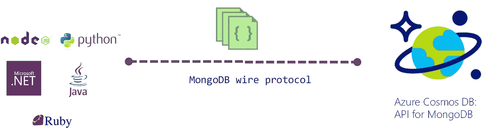

# 如何使用 MongoDB 变更流[第 1 部分]

> 原文：<https://itnext.io/how-to-use-mongodb-change-streams-part-1-da9a5e94ba2?source=collection_archive---------4----------------------->

这篇博文演示了如何将`MongoDB`中的`[Change Streams](https://docs.mongodb.com/manual/changeStreams/)`与[官方 Go 驱动程序](https://pkg.go.dev/go.mongodb.org/mongo-driver/mongo)一起使用。我将使用`[Azure Cosmos DB](https://docs.microsoft.com/azure/cosmos-db/introduction?WT.mc_id=medium-blog-abhishgu)`，因为它有对 MongoDB API (服务器版本 3.6)的[有线协议支持，其中也包括变更流。](https://docs.microsoft.com/azure/cosmos-db/mongodb-feature-support-36?WT.mc_id=medium-blog-abhishgu)



和我的其他一些博客一样，我打算把它分成两部分，只是为了更容易消化这些材料。第 1 部分(本文)将提供变更流处理器服务的介绍和概述，并引导您如何运行该应用程序，以便您可以见证变更流的运行。

在第 2 部分中，我将检查代码并解释事情是如何在幕后工作的。

> *代码在* [*GitHub*](https://github.com/abhirockzz/mongodb-changestreams-processor) 上有

通过这些博客，在实际应用的帮助下，您将了解到:

*   `Change Streams`及相关概念
*   了解应用程序及其如何使用变更流 API
*   设置 Azure Cosmos DB 并完成端到端示例
*   了解一些你应该知道的极限情况/限制/约束

# 什么是变更流？

[MongoDB 更改流](https://docs.mongodb.com/manual/changeStreams/)特性为应用程序提供了对数据更改(创建、更新、删除)的即时访问。他们可以通过在全局(部署)、数据库或集合范围订阅这些更改来对这些更改做出反应。这可以用于各种解决方案，从传统的 ETL 作业到基于`[CQRS](https://docs.microsoft.com/azure/architecture/patterns/cqrs?WT.mc_id=medium-blog-abhishgu)` [(命令和查询责任分离)](https://docs.microsoft.com/azure/architecture/patterns/cqrs?WT.mc_id=medium-blog-abhishgu)的架构、实时流处理、缓存失效等等！

> *这将开发者从使用 MongoDB* `*oplog*`的复杂性中抽象出来

## 它们为什么有用？

您可以利用变更流的许多方式之一是构建一个定制的解决方案，该解决方案可以侦听 MongoDB 数据库变更事件，并将它们推送到一个可扩展的数据接收平台，例如用于 Kafka 的[Azure Event Hubs](https://docs.microsoft.com/azure/event-hubs/event-hubs-for-kafka-ecosystem-overview?WT.mc_id=medium-blog-abhishgu)。然后，您可以构建传统的 Kafka 客户端应用程序(消费者、流 API)或使用 [Azure 函数](https://docs.microsoft.com/azure/azure-functions/?WT.mc_id=medium-blog-abhishgu)(类似于这个)利用无服务器处理

我可能会在博客上发表其他场景及其各自的解决方案，作为后续文章。

> *在撰写本文时，Azure Cosmos DB 支持与* [*Azure 函数*](https://docs.microsoft.com/azure/azure-functions/?WT.mc_id=medium-blog-abhishgu) *的变更流集成，用于其* `[*SQL API*](https://docs.microsoft.com/azure/azure-functions/functions-bindings-cosmosdb?toc=/azure/cosmos-db/toc.json&bc=/azure/cosmos-db/breadcrumb/toc.json&tabs=csharp&WT.mc_id=medium-blog-abhishgu)`

# 变更处理器服务的快速概述

该应用程序是使用变更流功能的变更处理器服务。这是一个使用官方 MongoDB Go 驱动程序的`[Go](https://golang.org/)`应用程序，但是其概念应该适用于任何其本地驱动程序支持变更流的其他语言。

它使用`[Watch](https://godoc.org/go.mongodb.org/mongo-driver/mongo#Collection.Watch)` [API](https://godoc.org/go.mongodb.org/mongo-driver/mongo#Collection.Watch) 来订阅特定`Collection`中的变更事件提要，以便在创建、更新和删除文档时得到通知。它从变更事件有效负载(即受影响的文档)中提取相关信息，并将其保存到本地文件中。它还演示了如何使用`Resume Tokens`来保存处理进度。

> *虽然这个应用程序只是将变更事件保存到一个本地文件中(为了简单起见)，但是正如前面提到的，你显然可以做更多的事情！*

## 简历代币真的很重要…

变更流是潜在的无限系列的记录。更改流[恢复令牌](https://docs.mongodb.com/manual/changeStreams/#change-stream-resume-token)允许您“从您停止的地方继续处理”——将其视为`checkpointing`

> *与阿帕奇卡夫卡等系统中的* `*offset*` *概念非常相似。*

如果处理应用程序停止(或崩溃)，可能不希望错过在此期间发生的数据库更改。您可以使用令牌(下一节将详细介绍)来确保应用程序从它离开的地方启动，并且能够在它不运行的时间段内检测到更改事件。除此之外，如果您有一个 resume 令牌的历史/changelog，您可以灵活地选择其中的任何一个(就像回到过去)并从该时间点开始(重新)处理数据。

## 有几件事你应该知道

请注意以下变更流行为与标准`MongoDB`不同的情况:

*   [您需要为变更流程提供具体的选项](https://docs.microsoft.com/azure/cosmos-db/mongodb-change-streams?WT.mc_id=medium-blog-abhishgu#current-limitations)
*   [删除操作](https://docs.microsoft.com/azure/cosmos-db/mongodb-change-streams?WT.mc_id=medium-blog-abhishgu#current-limitations)目前不被支持——尽管有一个针对该的[解决方法](https://docs.microsoft.com/azure/cosmos-db/mongodb-change-streams?WT.mc_id=medium-blog-abhishgu#examples)
*   (目前)您只能观察集合(不是数据库或部署)

让我们试用一下该应用程序，以便更好地理解变更流！

# 设置 Azure Cosmos DB

## 先决条件

*   一个[微软 Azure 账户](https://docs.microsoft.com/azure/?WT.mc_id=medium-blog-abhishgu)—[注册一个免费账户吧！](https://azure.microsoft.com/free/?WT.mc_id=medium-blog-abhishgu)
*   `Azure CLI`或`Azure Cloud Shell` -如果你还没有安装 [Azure CLI](https://docs.microsoft.com/cli/azure/install-azure-cli?view=azure-cli-latest&WT.mc_id=medium-blog-abhishgu) ，你可以选择安装它(应该很快！)或者直接从浏览器使用 [Azure 云壳](https://azure.microsoft.com/features/cloud-shell/?WT.mc_id=medium-blog-abhishgu)。
*   `[Go](https://golang.org/dl/)`已安装[已安装](https://golang.org/dl/)

您需要创建一个启用了 MongoDB API 支持的 Azure Cosmos DB 帐户以及一个数据库和集合。按照以下步骤使用 Azure 门户设置 Azure Cosmos DB:

*   [创建一个 Azure Cosmos DB 帐户](https://docs.microsoft.com/azure/cosmos-db/create-mongodb-java?WT.mc_id=medium-blog-abhishgu#create-a-database-account)
*   [添加数据库和集合](https://docs.microsoft.com/azure/cosmos-db/create-mongodb-java?WT.mc_id=medium-blog-abhishgu#add-a-collection)并获取连接字符串

> *了解有关如何在 Azure Cosmos DB* 中使用数据库、容器和项目的更多信息[](https://docs.microsoft.com/azure/cosmos-db/databases-containers-items?WT.mc_id=medium-blog-abhishgu)

*如果你想使用 Azure CLI 或云 Shell，下面是你需要执行的命令序列:*

*[创建一个 Azure Cosmos DB 帐户](https://docs.microsoft.com/cli/azure/cosmosdb?view=azure-cli-latest&WT.mc_id=medium-blog-abhishgu#az-cosmosdb-create)(注意`--kind MongoDB`)*

```
*az cosmosdb create --resource-group <RESOURCE_GROUP> --name <COSMOS_DB_NAME> --kind MongoDB*
```

*[创建数据库](https://docs.microsoft.com/cli/azure/cosmosdb/mongodb/database?view=azure-cli-latest&WT.mc_id=medium-blog-abhishgu#az-cosmosdb-mongodb-database-create)*

```
*az cosmosdb mongodb database create --account-name <COSMOS_DB_ACCOUN> --name <COSMOS_DB_NAME> --resource-group <RESOURCE_GROUP>*
```

*最后，[在数据库中创建一个集合](https://docs.microsoft.com/cli/azure/cosmosdb/mongodb/collection?view=azure-cli-latest&WT.mc_id=medium-blog-abhishgu#az-cosmosdb-mongodb-collection-create)*

```
*az cosmosdb mongo collection create --account-name <COSMOS_DB_ACCOUNT> --database-name <COSMOS_DB_NAME> --name <COSMOS_COLLECTION_NAME> --resource-group-name <RESOURCE_GROUP> --shard <SHARDING_KEY_PATH>*
```

*获取连接字符串并保存它。你以后会用到它*

```
*az cosmosdb list-connection-strings --name <COSMOS_DB_ACCOUNT> --resource-group <RESOURCE_GROUP> -o tsv --query connectionStrings[0].connectionString*
```

# *尝试更换处理器服务*

*你需要做的就是克隆 GitHub repo，构建并运行服务*

## *启动服务*

```
*git clone [https://github.com/abhirockzz/mongodb-changestreams-processor](https://github.com/abhirockzz/mongodb-changestreams-processor)go build -o change-processor*
```

*运行应用程序之前，导出环境变量:*

```
*export MONGODB_URI=[enter the Azure Cosmos DB connection string]
export MONGODB_DATABASE=[name of the Azure Cosmos DB database you created]
export MONGODB_COLLECTION=[name of the Azure Cosmos DB collection you created]
export WITH_RESUME=[use false if you don't want to use resume tokens. this is true by default]*
```

*例如*

```
*export MONGODB_URI="mongodb://my-mongodb:<primary access key for cosmosdb>@my-mongodb.mongo.cosmos.azure.com:10255/?ssl=true&replicaSet=globaldb&retrywrites=false&maxIdleTimeMS=120000&appName=@my-mongodb@"export MONGODB_DATABASE=test_db
export MONGODB_COLLECTION=test_collection
export WITH_RESUME=false*
```

> **请确保* `*""*` *【双引号】* `*MONGODB_URI*`*

*启动程序*

```
*./change-processor*
```

*程序启动并运行，输出如下:`started change stream...`*

## *创造一些记录*

*连接 Azure Cosmos DB 执行数据库操作的方式有很多种。很明显，您可以使用您最喜欢的 MongoDB 语言支持以编程方式实现这一点，但是为了测试该服务，请尝试以下选项:*

*   *Azure Cosmos DB 数据浏览器(web 界面)*
*   *[Robo 3T 采用 Azure Cosmos DB 的 API for MongoDB](https://docs.microsoft.com/azure/cosmos-db/mongodb-robomongo?WT.mc_id=medium-blog-abhishgu)*
*   *[MongoDB Compass 连接到 Azure Cosmos DB 的用于 MongoDB 的 API](https://docs.microsoft.com/azure/cosmos-db/mongodb-compass?WT.mc_id=medium-blog-abhishgu)*
*   *[使用 Studio 3T 连接到 Azure Cosmos 帐户](https://docs.microsoft.com/azure/cosmos-db/mongodb-mongochef?WT.mc_id=medium-blog-abhishgu)*

*创建记录后，您应该会在程序终端中看到以下输出:*

```
*saved change event to file: 'change_events'*
```

*您应该会看到`change_events`文件，其中包含已创建的文档。例如，在 Azure Cosmos DB 中创建的以下记录....*

```
*{
    "name" : "foo55",
    "email" : "foo55@bar.com",
    "status" : "offline"
}*
```

*….将用一个`_id` (MongoDB 对象 ID)保存在`change_events`文件中:*

```
*{
  "_id": {
    "$oid": "5e8eec7712f1891a100bd449"
  },
  "name": "foo55",
  "email": "foo55@bar.com",
  "status": "online"
}*
```

*这只是更改事件的一部分，完整的有效负载如下所示:*

> **变更流事件文档的顶级* `*_id*` *字段充当恢复令牌(下面将详细介绍)**

```
*{
  "_id": {
    "_data": {
      "$binary": {
        "base64": "W3sidG9rZW4iOiJcIjY5XCIiLCJyYW5nZSI6eyJtaW4iOiIiLCJtYXgiOiJGRiJ9fV0=",
        "subType": "00"
      }
    }
  },
  "fullDocument": {
    "_id": {
      "$oid": "5e8eec7712f1891a100bd449"
    },
    "name": "foo56",
    "email": "foo56@bar.com",
    "status": "online"
  },
  "ns": {
    "db": "test_db1",
    "coll": "test_coll1"
  },
  "documentKey": {
    "name": "foo56",
    "_id": {
      "$oid": "5e8eec7712f1891a100bd449"
    }
  }
}*
```

## *更新记录*

*例如，如果我将上述记录从`"status":"online"`更改为`"status":"offline"`，这将与更新的文档一起记录在`change_events`中*

## *使用恢复令牌的检查点*

*要尝试这种方法，请停止您的应用程序(按下`ctrl+c`)。在程序终止之前，您应该会看到以下输出*

```
*^Cexit signalled. cancelling context
saved token to file*
```

> **检查一个名为* `*token*` *的文件。它的内容并不重要——只要理解它就在那里，并且它包含二进制形式的 resume 令牌。**

*现在，在变更流处理器没有运行的时候创建一些记录。一旦你这样做了，重启处理器，你应该看到你添加的记录被检测，处理并保存在`change_events`文件中。*

## *删除记录*

*`[Delete](https://docs.microsoft.com/azure/cosmos-db/mongodb-change-streams?WT.mc_id=medium-blog-abhishgu#current-limitations)` [尚不支持](https://docs.microsoft.com/azure/cosmos-db/mongodb-change-streams?WT.mc_id=medium-blog-abhishgu#current-limitations)操作。这里建议的处理删除[的方法之一](https://docs.microsoft.com/azure/cosmos-db/mongodb-change-streams?WT.mc_id=medium-blog-abhishgu#examples)是将 is 视为一个`update`操作，使用一个附加属性(例如`deleted`并将其设置为`true`)并为特定文档设置一个`TTL`(生存时间)——这样，您可以将变更事件作为变更流的一部分*

*如果我要对样本记录进行这样的尝试，那么在`change_events`文件中应该有这样一个条目:*

```
*{
  "_id": {
    "$oid": "5e8eec7712f1891a100bd449"
  },
  "name": "foo55",
  "email": "foo55@bar.com",
  "status": "offline",
 ** "deleted": true**
}*
```

> **通知**

*好吧！目前就这些。我将在后续的博客文章(第 2 部分)中介绍一些实现细节*