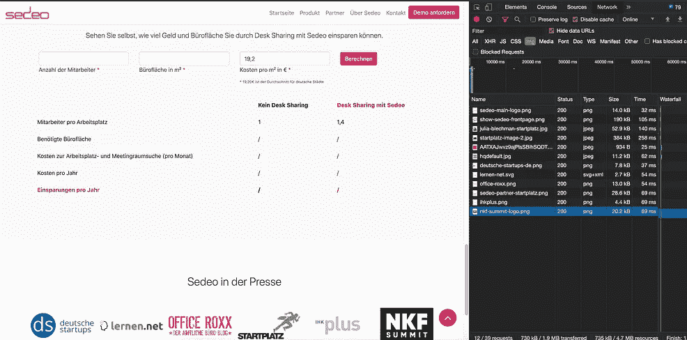

# 如何在网站中使用原生图像和 Iframe 延迟加载

> 原文：<https://itnext.io/how-to-use-native-image-and-iframe-lazy-loading-in-website-2109d577f7b1?source=collection_archive---------2----------------------->


查尔斯·德鲁维奥在 [Unsplash](https://unsplash.com?utm_source=medium&utm_medium=referral) 上拍摄的照片

## 通过延迟加载提高你的网站加载速度

作为 web 和移动开发人员，我们经常试图交付这些应用程序的最终包大小。这包括缩小 HTML、样式表、字体和脚本等东西，这对交付快速应用程序和网站有很大帮助。像 Lighthouse 这样的工具可以用来审计网站。

另一方面，图片占了网站的很大一部分。根据 [HTTP Archive](https://httparchive.org/reports/page-weight) 的说法，图片可以占到网页总权重的 50%。对于某些站点，这个数字可能更高。想想亚马逊或易贝这样的电子商务平台和脸书或 Twitter 这样的社交媒体平台:如果你提供产品或让人们分享图片，那么图片将对页面大小和加载性能产生很大影响。


易贝上的商品通常有好看的图片来增加销量

并非所有的图像都同样重要。虽然网站顶部的网站徽标应该立即出现在页面加载中，但页面底部的图像不一定需要立即加载。想想易贝上提供的大量产品:如果你只看易贝向你展示的前 10 条建议，你真的需要加载所有交易的图片吗？

即使你不在这些图像密集型行业工作，增加网站的加载时间也是非常容易的。我们可以优化和压缩我们的脚本和字体，但如果营销部门的人在你的网站上随意放一些高分辨率的未压缩图像，而不问后果，这一切都是徒劳的。这就是你的好的[灯塔](https://developers.google.com/web/tools/lighthouse)排名(如果你一开始就有)。

有多种方法可以减少图片对网站性能的负面影响:

*   有一些服务或软件库可以压缩图像以减小尺寸
*   您可以以多种分辨率存储同一幅图像，并根据网络速度或屏幕大小等因素提供合适的图像
*   可以缓存图像和其他资源。这不会改善初始加载时间，但后续加载时间会更好，因为缓存的图像会被提供。请小心，因为您可能不想对所有内容都进行缓存！
*   您可以使用无限滚动或虚拟滚动等技术。这最适合基于列表或网格的布局。因为用户需要进一步滚动才能看到更多的内容，所以你永远不要一次渲染超过两张图片。然而，这些方法也有缺点(例如易访问性问题)，它们不能适用于所有情况。
*   你可以告诉浏览器只在用户将要看到图片的时候加载图片。例如:如果用户访问你的网站，从来没有向下滚动到页面的末尾，那么你的网站末尾的图片将永远不会被加载！

让我们仔细看看上面提到的最后一个建议，以及我们如何应用它来减少网站的加载时间。

## 嗯，解决起来不会那么难吧？

对于图像的延迟加载，已经提出了多种解决方案。如果您简单地思考一下，这个问题一开始似乎很容易解决:

*   像图片这样的资源，如果有`src`属性，浏览器会自动下载。因此，在元素上设置了一个值为 URL 的自定义 HTML 属性(如`data-src`)。代替指定一个
*   添加一个事件侦听器来侦听滚动事件。
*   如果用户将要滚动到图像:使用自定义 HTML 属性设置 HTML 元素的`src`属性，让浏览器知道它应该请求图像

然而，一些缺点可以立即被注意到。如果不去抖滚动事件监听，该功能将被触发很多次，这可能导致更差的性能。当然，也有一些开源库，比如 [vanilla-lazyload](https://github.com/verlok/vanilla-lazyload) 承诺可以轻松地在所有浏览器中运行。

最近，现代浏览器开始支持一个易于使用和向后兼容的解决方案，我觉得很有趣。

## 如何延迟加载只有一个 HTML 属性的图像

有一个`[loading](https://developer.mozilla.org/en-US/docs/Web/API/HTMLImageElement/loading)` HTML 属性。通过设置`loading="lazy"`，只有当用户在图片附近滚动时，图片才会被下载。没有比这更容易的了。如果图像立即可见(例如，因为它在顶部导航栏中)，图像仍将照常显示。

看看下面的例子。我使用了 Chrome 开发者工具，这样你就能看出区别了。如果没有延迟加载，那么在加载页面时所有的图像都会被请求。但是对于延迟加载，我们只加载我们实际上可以看到的图像。只有当我们进一步向下滚动到接近页面末尾时，底部的图像才会被请求。



左:初始页面加载。右:向下滚动到页面末尾。

目前，这种方法并不适用于所有的浏览器(看看你，IE11)。然而，最近版本的 Chrome、Firefox 和基于 Chrome 的 Edge 已经支持它了。这就是渐进增强的概念:使用现代网络浏览器的用户正从这一功能中受益，而网站仍然适用于尚不支持它的浏览器。

为了支持尽可能多的浏览器，你也可以使用第三方的解决方案来支持不支持本地延迟加载的浏览器。

```
if(!('loading' in HTMLImageElement.prototype)) {
  // apply fallback solution for older browsers
}
```

Pro 提示:为惰性加载的元素提供`width`和`height`是有意义的。即使你不知道确切的尺寸，至少提供一些`min-height`和`min-width`也是一个好主意，以避免加载图像时出现大的布局偏移。Chrome Developer Tools 或 Firefox DevTools 允许您模拟较慢的网络速度，这可以帮助您在不太理想的条件下测试您的网站。

## 如何实现 iframes 的延迟加载

除了图片，许多网站使用`[iframe](http://iframe)`在你的网站上嵌入外部网站。例如，一个 Twitter feed 或者你在谷歌地图上的办公室位置可以很容易地嵌入到任何使用`iframe`的网站上。你实际上是在你的网站中加载一个网站。

iframe 的本地延迟加载会延迟屏幕外 iframe 的加载，直到用户滚动到它们附近。这样可以保存数据，加快页面其他部分的加载速度，并减少内存使用。

```
<iframe src="https://example.com"
        loading="lazy"
        width="600"
        height="400"></iframe>
```

## 结论

感谢您阅读这篇短文。如您所见，现代浏览器允许延迟加载图像和 iframes，而没有任何明显的缺点。由开发人员决定是否应该延迟加载特定的图像或 iframe。你是如何在你的网站中实现延迟加载的？请在评论中告诉我。