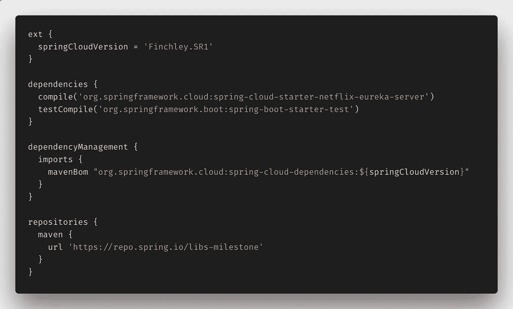
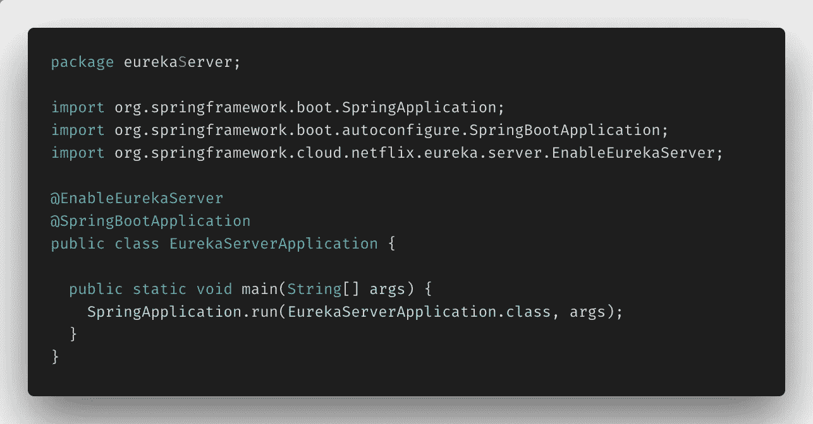
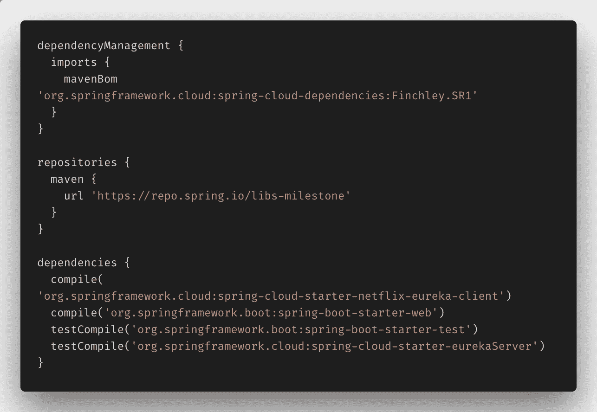
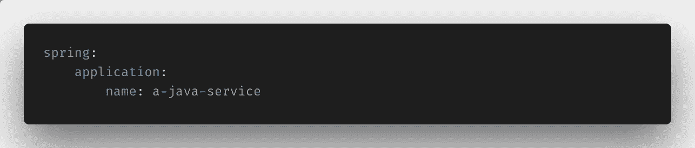
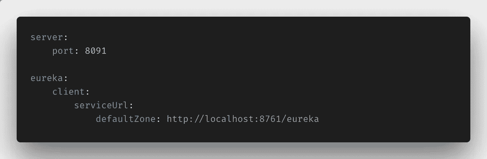
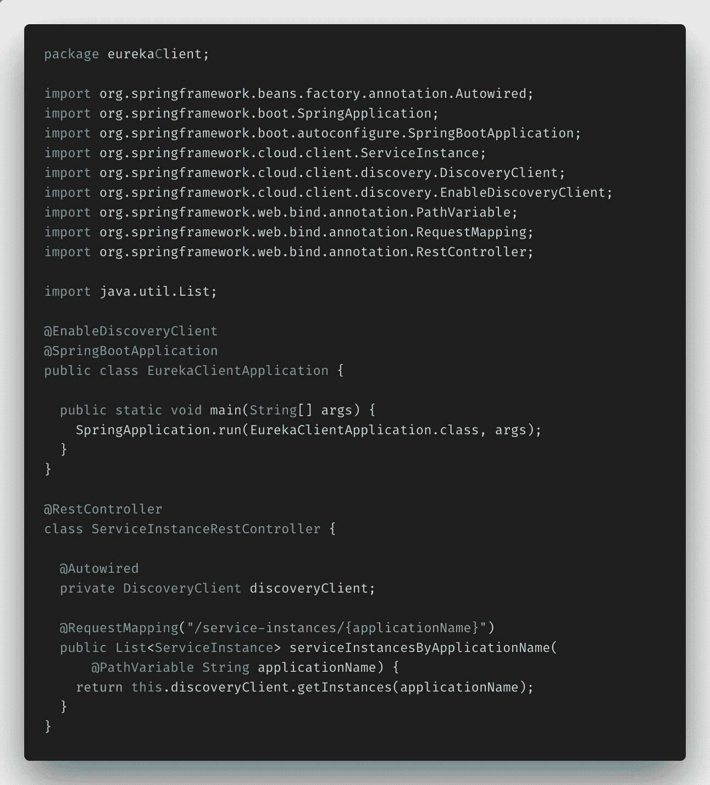
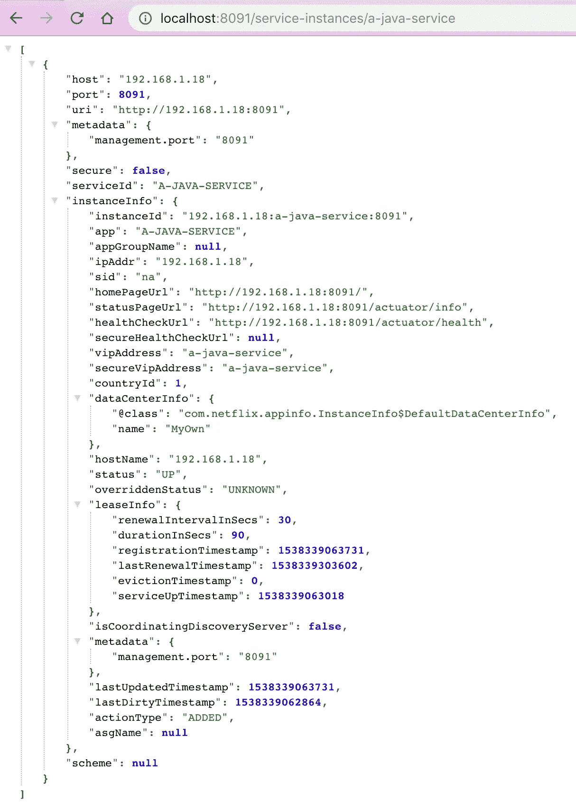
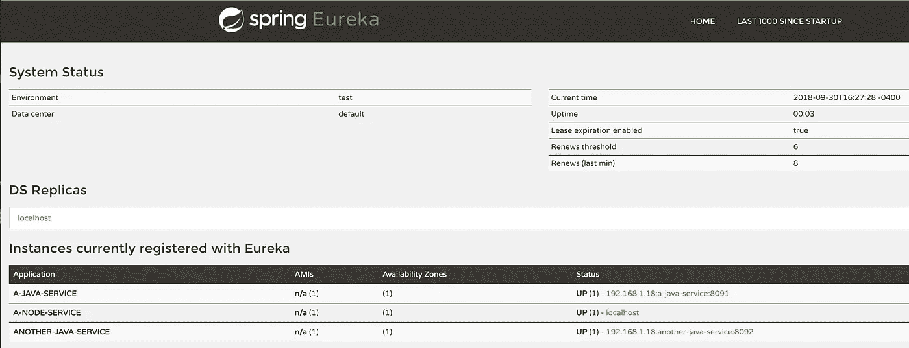
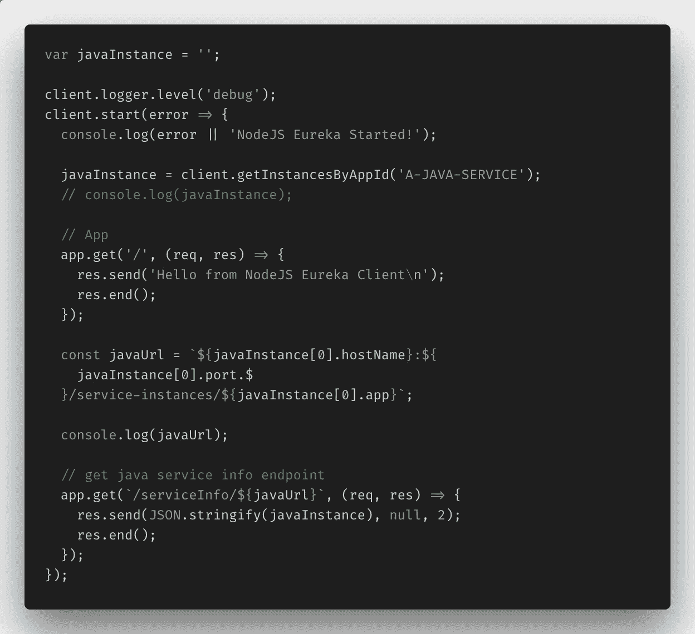
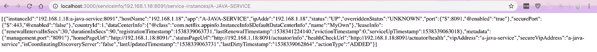

# 如何使用网飞的 Eureka 和 Spring Cloud 进行服务注册

> 原文：<https://itnext.io/how-to-use-netflixs-eureka-and-spring-cloud-for-service-registry-8b43c8acdf4e?source=collection_archive---------0----------------------->


O[微服务架构模式](https://microservices.io/patterns/microservices.html)的主要原则之一是，一组松散耦合的协作服务一起工作，形成一个内聚的整体应用程序。通过这种方式，它不是关于单个服务，而是关于确保服务之间的交互保持可靠和容错。

实际上，这意味着删除硬编码的信息，用动态更新的环境变量替换它们，为每个服务建立单独的数据库，尽可能删除服务之间的依赖关系(因此，如果需要，需要更多实例的服务可以在不影响其对应服务的情况下轻松扩展)，并通过增加每个服务的复杂性来降低管理整体的复杂性。

这听起来是一个不错的策略，但是跟踪整体的所有较小部分会给客户管理所有这些带来负担。

这让我想到了我今天博客的主题:网飞尤里卡服务注册中心——以及如何与 Spring Cloud 一起使用它来更有效地管理这种复杂性。

正如网飞尤里卡注册中心的 Github repo 所说:

> “Eureka 是一种基于 REST(表述性状态转移)的服务，主要用于 AWS 云中定位服务，以实现中间层服务器的负载平衡和故障转移。”—网飞:尤里卡一瞥，Github

听起来不错？很好。事不宜迟，让我们开始设置这个 Eureka 服务注册中心和几个服务，看看它的实际应用。

## 设置尤里卡服务器

设置一个基于 Spring 的 Eureka 服务器实际上非常简单。Spring.io 本身有一个很棒的演练[这里](https://spring.io/guides/gs/service-registration-and-discovery/)，它帮助我快速启动并运行了一个 Eureka 服务器和一个样本 Spring Boot 项目。

我不会一步一步来，因为你可以用我链接的教程来做，或者你可以在这里下载我的工作示例。但是我将强调服务器设置中包含的重要内容。

`**Build.gradle**` **文件**



Eureka 服务器安装所需的依赖项的一个片段。

在您的`build.gradle`文件中，您必须包含上面的依赖关系:`spring-cloud-starter-netflix-eureka-server`和`spring-cloud-dependencies`。这就完成了，接下来是`resources`文件夹中的`application.yml`文件。

`**Application.yml**` **文件**


要在 application.yml 文件中指定的配置

这个文件也不需要太多。它需要一个指定的服务器端口，这样服务就不会在端口 8080 上自动启动，这将在本地运行时与我们的其他 Spring Boot 客户端服务冲突。

为了方便起见，还指定了几个配置。Eureka 客户机被指示在启动时不要注册*本身*(`eureka.client.register-with-eureka: false`)，并被告知不要搜索要连接的其他注册表节点，因为没有节点(至少在本地运行时没有)(T7)。列出了一个默认的 URL，并关闭了 Eureka 的详细日志记录和任何后续的服务发现。

好了，现在在主类路径上还有最后一步。

`**EurekaServerApp.java**`文件**文件**



要添加到 Eureka 服务器的 Spring 注释。

主文件唯一需要的额外内容是`@EnableEurekaServer`注释，它告诉 Spring Boot 服务启用服务器。简单。

好了，我们现在可以继续讨论服务了——这是事情开始变得更有趣的地方。

## 设置要注册的 Java 服务

再一次，Spring.io，这里的预排，在设置第一个 Spring Boot 服务器和客户端项目方面做得非常好，所以我将再次强调你必须包含的内容。

`**Build.gradle**`文件**文件**



客户端服务所需的依赖关系

对于客户端服务的`build.gradle`文件，只要确保包含`spring-cloud-starter-netflix-eureka-client`和`spring-cloud-dependencies`即可。包含了`spring-boot-starter-web`依赖项，因此可以在服务中创建一个 web 端点，它将向我们显示与 Eureka 服务器相关的服务信息。

`**Bootstrap.yml**` **&** `**Application.yml**` **文件**



这里设置了客户机服务的名称，供 Eureka 服务器发现。

同样，`boostrap.yml`和`application.yml`文件需要一些小的配置。上图是`bootstrap.yml`，它是 Spring 在`application.yml`文件之前获取的，所以这是我们设置服务名称的地方。我为这个项目选择了最原始的`spring.application.name: a-java-service`。这就是尤里卡服务器将如何参考它前进。



这个服务器的端口号和默认 URL 在这里

然后`application.yml`文件的配置类似于 Eureka 服务器的设置。Eureka 服务器的端口号和默认 URL。

`**EurekaClientApplication.java**`文件**文件**



最后，服务在主类路径文件中用`@EnableDiscoveryClient`进行了注释，它告诉 Spring Boot 服务激活网飞尤里卡`DiscoveryClient`实现，并向尤里卡服务器注册它自己的主机和端口。

REST 控制器上下面定义的 REST 端点可以用来查看在 Eureka 注册中心的`[http://localhost:8091/service-instances/a-java-service](http://localhost:8091/service-instances/a-java-service)` URL 上注册的所有服务实例。

JSON 看起来像这样:



## 设置要注册的节点服务

现在，这是一个好的开始，但是为了更加真实，我决定也向 Eureka 服务器注册一个 Node.js 服务，这被证明更具挑战性。

幸运的是，有一个方便的小 NPM 包可以满足这样的需求，叫做`[eureka-js-client](https://www.npmjs.com/package/eureka-js-client)`，它被宣传为

> 网飞 OSS 服务注册中心 Eureka(https://github . com/网飞/eureka)客户端的 JavaScript 实现。

文档必须通读一遍，因为在 Eureka 中使用 Spring 实现时有一些特殊的问题，但我通过一些尝试和错误成功地让它工作了。下面是启动并运行一个示例 Node.js 项目所需的内容。

`**Package.json**` **文件**


再说一次，我的简单 Node.js 应用程序的依赖性很小。

对于这个 Node.js 服务，我们只需要安装`eureka-js-client`，我添加了`express`和`nodemon`，这样我就可以轻松地对应用程序进行一些 REST 调用，并在我对系统进行调整时让节点服务器自动重新加载。

`**Server.js**` **文件**


唯一的 server.js 文件，包含所有的 Eureka 客户机配置。

为了方便，我只使用了一个`server.js`文件，因为这个项目一开始就很小。

重要的是`new Eureka()`的设定。对于 Spring Boot 项目，我们在`bootstrap.yml`和`application.yml`中设置应用程序配置，而对于 JavaScript 项目，这个配置在`server.js`文件中设置或注入一个配置文件(对于较大的项目或基于产品生命周期具有多个不同配置的项目)。

这里定义了应用名:`app: 'a-node-service'`，主机名，IP 地址，端口，数据中心信息等。被定义了。直到`registerWithEureka`和`fetchRegistry`选项的每个参数都是必需的，否则服务器将崩溃，但是`vipAddress`和`dataCenterInfo`字段可以完全按照它们在`eureka-client-js`文档中的写法进行归档。它们只是需要被填写。

最后但并非最不重要的一点是，一旦客户机服务设置好了，它就用`client.start()`命令启动，如果启动失败，我就在控制台记录`error`消息，如果连接到 Eureka 注册中心成功，就记录`‘Node.js Eureka Started’`消息。

## 运行 Eureka 服务注册表

现在让我们启动并运行这个服务注册中心。在这里我已经获得了运行我的示例项目[的`README.md`中所有服务的全部细节，但这里也是。](https://github.com/paigen11/eureka-services-example)

如果你有一个类似于 Sping.io 入门教程中描述的文件结构，我们将`cd`进入一个主项目文件夹中包含的每个服务。下面是我的样子供参考:

```
root/
├── eureka-client-java/ 
| ├── build.gradle 
| ├── src/ 
| | | ├── main/ 
| | | | ├── java/ 
| | | | ├── resources/ 
| | | | | ├── application.yml 
| | | | | ├── bootstrap.yml
├── eureka-client-node/ 
| ├── server.js
| ├── package.json
| ├── node-modules/
├── eureka-service/
| ├── build.gradle 
| ├── src/ 
| | | ├── main/ 
| | | | ├── java/ 
| | | | ├── resources/ 
| | | | | ├── application.yml
```

如我所说，`cd`进入每个回购`eureka-client-java`、`eureka-client-node`和`eureka-service`，并为两个 Spring Boot 项目运行`gradle clean build`然后`gradle bootRun`。对于 Node.js 项目，运行`npm start`。给它一分钟让所有的项目旋转起来并被注册服务找到，然后转到`[http://localhost:8761](http://localhost:8761)`，这就是你应该看到的。



如果您仔细查看“当前在 Eureka 注册的实例”部分，您会看到我们的应用程序。

这是 Eureka 服务器主页，如果您查看页面下方的第二部分，您会看到“Instance currently registered with Eureka”，以及我们构建的两个注册了它的服务。

太好了，成功了。要验证这些服务是否真的在运行，您可以转到[http://localhost:8091/service-instances/a-Java/service](http://localhost:8091/service-instances/a-java/service)和 [http://localhost:3000/](http://localhost:3000/) 来查看每个服务的信息。

现在，让我们更进一步，因为拥有一个服务注册中心的全部目的是使在那里注册的客户更容易询问关于如何与其他可用服务连接和通信的问题:

> “每个服务都向服务注册中心注册自己，并告诉注册中心它的位置(主机、端口、节点名称)以及其他特定于服务的元数据——其他服务可以使用这些信息做出明智的决定。客户可以询问有关服务拓扑的问题(“是否有任何‘履行服务’可用，如果有，在哪里？”)和服务能力(“你能处理 X、Y、Z 吗？")."— Spring，通过 Spring Cloud 和网飞的 Eureka 进行微服务注册和发现

## 为服务通信设置额外的端点

我想采取的下一步是创建它，这样我就可以通过 Node.js 服务中的端点获得 Java 服务提供的服务实例 JSON 数据——这只能通过与 Eureka 服务注册中心提供的信息进行通信来获得。

下面是要做的事情。

`**Server.js**`文件**文件**



就在`server.js`文件中的`client.start()`命令之前，我定义了一个名为`javaInstance`的变量，然后使用`eureka-client-js`插件`getInstancesByAppId()`提供的方法调用注册为`a-java-service`的 Spring Boot 服务来获取其服务信息。

这样，我就可以重建由 Spring Boot REST 端点提供的 URL 信息，以获取该服务的信息。简而言之，我能够从 Eureka 服务器提供的 Java 实例中解析出所有必要的信息，以便通过 Node.js 端点到达它。

一旦获得了主机名、端口号和应用程序名，URL 就会变成这样:[http://localhost:3000/SERVICE info/192 . 168 . 1 . 18:8091/SERVICE-instances/A-JAVA-SERVICE](http://localhost:3000/serviceInfo/192.168.1.18:8091/service-instances/A-JAVA-SERVICE)。

如果 Node.js 和 Java 服务都在运行并向 Eureka 服务器注册，您会看到以下内容:



Spring Boot 服务数据由 Node.js 服务端点提供

瞧。上面的 JSON(格式不正确)是针对`a-java-service`的，通过 Node.js 服务上的一个端点来访问。只需确保在`client.start()`命令中对 Spring Boot 服务进行 URL 调用，否则您将无法访问从对 Eureka 服务器的`getInstancesByAppId()`调用中提供的所有实例信息。

在这一点上，Eureka 正在做它被设计来做的事情:它注册服务并从一个服务向另一个服务提供信息，减去了开发人员过去必须负责记忆和手动实现的硬编码的复杂性。

## 结论

正如我在开始时所说的，根据微服务架构模式构建应用程序意味着管理单个服务更加复杂，但是应用程序作为一个整体具有更高的容错能力和可靠性。

像网飞的 Eureka server 这样的服务注册有助于管理这种额外的复杂性，当与 Spring 的云技术结合时，它变得非常容易使用。之后的下一步将是使用类似 Zuul 的东西来协助动态路由、实例之间的负载平衡、处理安全性等等。但那是另一篇博文。

感谢您的阅读，我希望这证明是有帮助的，并让您更好地了解如何在 Spring Cloud 的帮助下使用网飞的 Eureka 服务器，并发现 Java 和 Node.js 服务。非常感谢鼓掌和分享！

**如果你喜欢读这篇文章，你可能也会喜欢我的其他一些博客:**

*   [邮递员 vs .失眠:比较 API 测试工具](https://medium.com/@paigen11/postman-vs-insomnia-comparing-the-api-testing-tools-4f12099275c1)
*   [为什么云配置服务器对良好的 CI/CD 渠道至关重要以及如何设置(第 1 部分)](https://medium.com/@paigen11/why-a-cloud-config-server-is-crucial-to-a-good-ci-cd-pipeline-and-how-to-set-it-up-pt-1-fa628a125776)
*   [Jib:在没有任何 Docker 知识的情况下获得专家 Docker 结果](https://medium.com/@paigen11/jib-getting-expert-docker-results-without-any-knowledge-of-docker-ef5cba294e05)

**参考资料和更多资源:**

*   微服务架构:[https://microservices.io/patterns/microservices.html](https://microservices.io/patterns/microservices.html)
*   尤里卡服务注册中心 Github Repo 示例:[https://github.com/paigen11/eureka-services-example](https://github.com/paigen11/eureka-services-example)
*   https://github.com/Netflix/eureka/wiki 网飞尤里卡 Github:
*   Spring:服务注册和发现:[https://spring . io/guides/GS/Service-Registration-and-Discovery/](https://spring.io/guides/gs/service-registration-and-discovery/)
*   尤里卡客户端 JS:[https://www.npmjs.com/package/eureka-js-client](https://www.npmjs.com/package/eureka-js-client)
*   Spring:使用 Spring Cloud 和网飞的 Eureka 进行微服务注册和发现:[https://Spring . io/blog/2015/01/20/Microservice-Registration-and-Discovery-with-Spring-Cloud-and-网飞-s-eureka](https://spring.io/blog/2015/01/20/microservice-registration-and-discovery-with-spring-cloud-and-netflix-s-eureka)