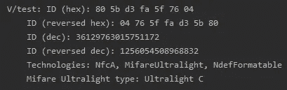
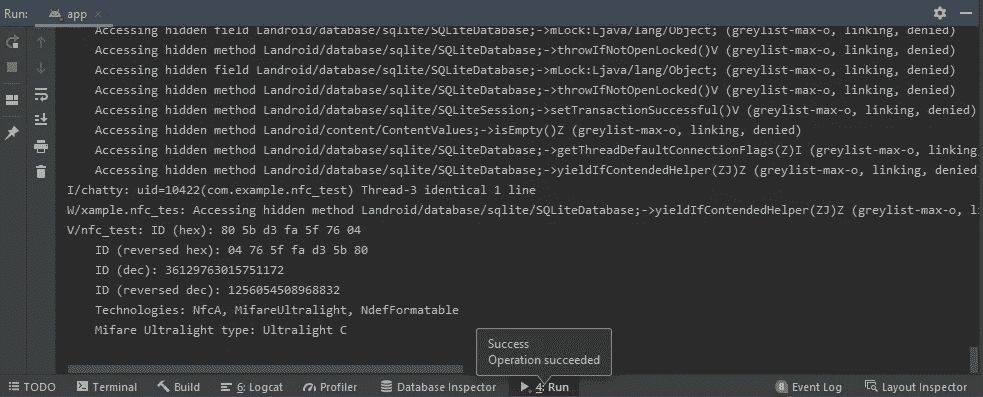
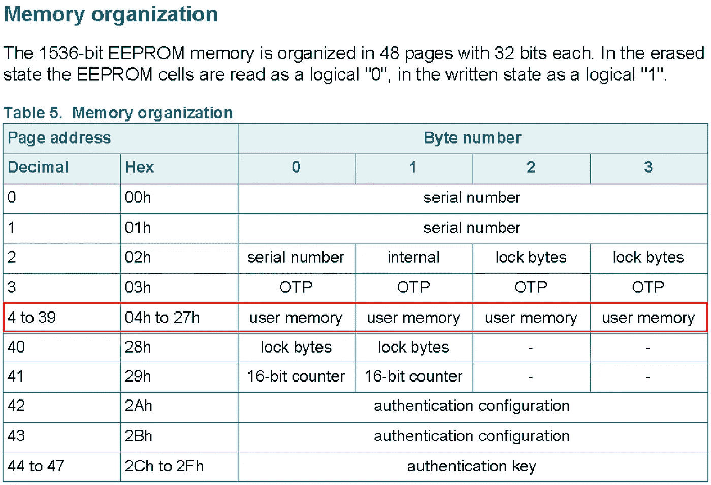

# 如何使用 NFC 标签:用 Android Studio 检测、读取和写入 NFC

> 原文：<https://itnext.io/how-to-use-nfc-tags-with-android-studio-detect-read-and-write-nfcs-42f1d60b033?source=collection_archive---------1----------------------->

## 用这个简单的指南和入门代码启动你的 NFC 项目。


# 介绍

近场通信(NFC)并不是新技术。随着 Covid 19 事件的发生，非接触式 NFC 的使用量激增，这可以从 Google Pay 和 Apple Pay 等移动支付的新趋势中看出。这与其众所周知的兄弟二维码相似。

它走过了漫长的道路。1997 年首次用于孩之宝星球大战玩具，这是一项高度可及的技术，目前存在于约 73%的智能手机中，是一个尚未开发的创新来源。

类似于我之前关于为树莓派安装 TF lite 的文章，寻找有用的 NFC 材料是一件苦差事。这旨在为 NFC 的一般使用案例提供快速而清晰的指南。

**我的 Github 上的完整代码:** [**首发代码**](https://github.com/Cawinchan/nfc_starter_code)

# 先决条件

*   Android Studio —安装指南[此处](https://developer.android.com/training/basics/firstapp/creating-project)。
*   一部有 NFC 功能的安卓手机([如何检查我有没有 NFC？](https://beebom.com/how-check-nfc-support-android-smartphone/#:~:text=Checking%20NFC%20Support%20Natively&text=Go%20to%20Settings.,does%20not%20have%20NFC%20capabilities.))
*   NFC 设备(注:我用的是 NFC 卡)

# NFC 检测



我们先来检测一下 NFC 设备信息:
1。NFC id
2。NFC 技术
3。NFC 类型(Mifare Classic/ultra light)
**注意:**我们将在本指南中使用 Mifare Ultralight C。

**第 0 步:AndroidManifest.xml，允许我们应用的 NFC 权限**

```
<uses-permission android:name="android.permission.NFC" />
<uses-feature android:name="android.hardware.nfc" android:required="true" />
```

**步骤 1: onCreate，初始化 NFC 适配器并定义待定意向**

```
public class MainActivity extends AppCompatActivity { //Intialize attributes 
    NfcAdapter nfcAdapter;
    PendingIntent pendingIntent; final static String *TAG* = "nfc_test"; @Override
    protected void onCreate(Bundle savedInstanceState) {
        super.onCreate(savedInstanceState);
        setContentView(R.layout.*activity_main*); //Initialise NfcAdapter
    nfcAdapter = NfcAdapter.getDefaultAdapter(this); //If no NfcAdapter, display that the device has no NFC 
    if (nfcAdapter == null){
       Toast.makeText(this,"NO NFC Capabilities",
                      Toast.LENGTH_SHORT).show();
       finish();
    } //Create a PendingIntent object so the Android system can 
    //populate it with the details of the tag when it is scanned. //PendingIntent.getActivity(Context,requestcode(identifier for 
    //                           intent),intent,int) 
      pendingIntent = PendingIntent.getActivity(this,0,new Intent(this,this.getClass()).addFlags(Intent.FLAG_ACTIVITY_SINGLE_TOP),0);
}
}
```

**步骤 2: onResume()，启用前台调度监听 NFC 意图(等待 NFC 卡被点击)**

`enableForegroundDispatch`允许您的当前(前台)活动拦截我们的 NFC 意图，并要求优先于该应用程序和其他应用程序 s 内的所有其他活动 ***。***

```
@Override
protected void onResume() {
    super.onResume();
    assert nfcAdapter != null;
  //nfcAdapter.enableForegroundDispatch(context,pendingIntent,
  //                                    intentFilterArray,
  //                                    techListsArray)
  nfcAdapter.enableForegroundDispatch(this,pendingIntent,null,null);
}
```

**第三步:onPause()，禁用前台调度(停止监听 NFC 标签)**

```
protected void onPause() {
    super.onPause();
    //Onpause stop listening
    if (nfcAdapter != null) {
        nfcAdapter.disableForegroundDispatch(this);
    }
}
```

**步骤 4: onNewIntent()，处理我们的新 NFC 意图(检测到卡)**

在获得意图之后，您必须解析意图来检测 card:这里是外部助手函数的代码。

这些是我们的 NFC 意图过滤器
`nfcAdapter.ACTION_TAG_DISCOVERED` —发现的 NFC 标签。
`nfcAdapter.ACTION_TECH_DISCOVERED` —发现 NFC 标签，并针对标签上的特定技术注册活动。
`nfcAdapter.ACTION_NDEF_DISCOVERED` —发现 NFC 标签，发现 NDEF 有效载荷。

如果没有应用程序可以处理`TECH_DISCOVERED`和`NDEF_DISCOVERED`，那么`TAG_DISCOVERED`就是一个后备。对于`TECH_DISCOVERED`来说也是如此，它是`NDEF_DISCOVERED`的后备。

对于我们的例子，我们不需要任何滤波器，因此我们将使用`TAG_DISCOVERED`和`TECH_DISCOVERED`进行 NFC 的全局检测。

```
@Override
protected void onNewIntent(Intent intent) {
    super.onNewIntent(intent);
    setIntent(intent);
    resolveIntent(intent);
}

private void resolveIntent(Intent intent) {
    String action = intent.getAction();
    if (NfcAdapter.*ACTION_TAG_DISCOVERED*.equals(action)
            || NfcAdapter.*ACTION_TECH_DISCOVERED*.equals(action)
            || NfcAdapter.*ACTION_NDEF_DISCOVERED*.equals(action)) {
            Tag tag = (Tag) intent.getParcelableExtra(NfcAdapter.*EXTRA_TAG*);
            assert tag != null;
            byte[] payload = detectTagData(tag).getBytes();
        }
}
```

**步骤 5:辅助函数，用于检测和解析我们的 NFC 标签数据**

```
private String detectTagData(Tag tag) {
    StringBuilder sb = new StringBuilder();
    byte[] id = tag.getId();
    sb.append("ID (hex): ").append(toHex(id)).append('\n');
    sb.append("ID (reversed hex): ").append(toReversedHex(id)).append('\n');
    sb.append("ID (dec): ").append(toDec(id)).append('\n');
    sb.append("ID (reversed dec): ").append(toReversedDec(id)).append('\n');

    String prefix = "android.nfc.tech.";
    sb.append("Technologies: ");
    for (String tech : tag.getTechList()) {
        sb.append(tech.substring(prefix.length()));
        sb.append(", ");
    }

    sb.delete(sb.length() - 2, sb.length());

    for (String tech : tag.getTechList()) {
        if (tech.equals(MifareClassic.class.getName())) {
            sb.append('\n');
            String type = "Unknown";

            try {
                MifareClassic mifareTag = MifareClassic.*get*(tag);

                switch (mifareTag.getType()) {
                    case MifareClassic.*TYPE_CLASSIC*:
                        type = "Classic";
                        break;
                    case MifareClassic.*TYPE_PLUS*:
                        type = "Plus";
                        break;
                    case MifareClassic.*TYPE_PRO*:
                        type = "Pro";
                        break;
                }
                sb.append("Mifare Classic type: ");
                sb.append(type);
                sb.append('\n');

                sb.append("Mifare size: ");
                sb.append(mifareTag.getSize() + " bytes");
                sb.append('\n');

                sb.append("Mifare sectors: ");
                sb.append(mifareTag.getSectorCount());
                sb.append('\n');

                sb.append("Mifare blocks: ");
                sb.append(mifareTag.getBlockCount());
            } catch (Exception e) {
                sb.append("Mifare classic error: " + e.getMessage());
            }
        }

        if (tech.equals(MifareUltralight.class.getName())) {
            sb.append('\n');
            MifareUltralight mifareUlTag = MifareUltralight.*get*(tag);
            String type = "Unknown";
            switch (mifareUlTag.getType()) {
                case MifareUltralight.*TYPE_ULTRALIGHT*:
                    type = "Ultralight";
                    break;
                case MifareUltralight.*TYPE_ULTRALIGHT_C*:
                    type = "Ultralight C";
                    break;
            }
            sb.append("Mifare Ultralight type: ");
            sb.append(type);
        }
    }
    Log.*v*("test",sb.toString());
    return sb.toString();
}
private String toHex(byte[] bytes) {
    StringBuilder sb = new StringBuilder();
    for (int i = bytes.length - 1; i >= 0; --i) {
        int b = bytes[i] & 0xff;
        if (b < 0x10)
            sb.append('0');
        sb.append(Integer.*toHexString*(b));
        if (i > 0) {
            sb.append(" ");
        }
    }
     return sb.toString();
}

private String toReversedHex(byte[] bytes) {
    StringBuilder sb = new StringBuilder();
    for (int i = 0; i < bytes.length; ++i) {
        if (i > 0) {
            sb.append(" ");
        }
        int b = bytes[i] & 0xff;
        if (b < 0x10)
            sb.append('0');
        sb.append(Integer.*toHexString*(b));
    }
    return sb.toString();
}

private long toDec(byte[] bytes) {
    long result = 0;
    long factor = 1;
    for (int i = 0; i < bytes.length; ++i) {
        long value = bytes[i] & 0xffl;
        result += value * factor;
        factor *= 256l;
    }
    return result;
}

private long toReversedDec(byte[] bytes) {
    long result = 0;
    long factor = 1;
    for (int i = bytes.length - 1; i >= 0; --i) {
        long value = bytes[i] & 0xffl;
        result += value * factor;
        factor *= 256l;
    }
    return result;
}
```

**第六步:编译并运行 app →进入 Logcat/Run**



# NFC 读写



来自我们的 Mifare Ultralight C NFC 标签规格:[https://www.nxp.com/docs/en/data-sheet/MF0ICU2.pdf](https://www.nxp.com/docs/en/data-sheet/MF0ICU2.pdf)

我们只能使用第 4 页的**到第 39 页的**地址。每页 4 字节，因此，我们最多有 140 字节的存储页。

由于 UTF-8 中的每个字符串字母占用大约 1 个字节，假设没有使用任何用户内存页面，我们最多只能处理 140 个单词。在我的例子中，我们的卡只有 137 字节。一些人已经尝试用 gzip 压缩这些数据。

每个`readPages` **读取 4 页** (16 个字符/16 个字节)。要阅读第 4-12 页，我们必须阅读第(4)页[第 4-7 页]和第(8)页[第 8-11 页]和第(12)页[第 12-15 页]。然后，我们必须从字符串中删除额外的 3 页(12 个字符/12 个字节)。

每个`writePage` **写 1 页** (4 个字符/4 个字节)。

```
public void writeTag(MifareUltralight mifareUlTag) {
    try {
        mifareUlTag.connect();
mifareUlTag.writePage(4, "get ".getBytes(Charset.*forName*("US-ASCII")));
mifareUlTag.writePage(5, "fast".getBytes(Charset.*forName*("US-ASCII")));
mifareUlTag.writePage(6, " NFC".getBytes(Charset.*forName*("US-ASCII")));
mifareUlTag.writePage(7, " now".getBytes(Charset.*forName*("US-ASCII")));
    } catch (IOException e) {
        Log.*e*(*TAG*, "IOException while writing MifareUltralight...", e);
    } finally {
        try {
            mifareUlTag.close();
        } catch (IOException e) {
            Log.*e*(*TAG*, "IOException while closing MifareUltralight...", e);
        }
    }
}
public String readTag(MifareUltralight mifareUlTag) {
    try {
        mifareUlTag.connect();
        byte[] payload = mifareUlTag.readPages(4);
        return new String(payload, Charset.*forName*("US-ASCII"));
    } catch (IOException e) {
        Log.*e*(*TAG*, "IOException while reading MifareUltralight message...", e);
    } finally {
        if (mifareUlTag != null) {
            try {
                mifareUlTag.close();
            }
            catch (IOException e) {
                Log.*e*(*TAG*, "Error closing tag...", e);
            }
        }
    }
    return null;
}
```

接下来，只需更改我们之前的 detectTagData(Tag 标签)。

```
private String detectTagData(Tag tag) {
    StringBuilder sb = new StringBuilder();
    byte[] id = tag.getId();
    sb.append("NFC ID (dec): ").append(toDec(id)).append('\n');
    for (String tech : tag.getTechList()) {
        if (tech.equals(MifareUltralight.class.getName())) {
            MifareUltralight mifareUlTag = MifareUltralight.*get*(tag);
                readTag(mifareUlTag);
                writeTag(mifareUlTag);
            }
        }
    }
    Log.*v*("test",sb.toString());
    return sb.toString();
}
```

了解更多关于读写的信息:[https://developer . Android . com/guide/topics/connectivity/NFC/advanced-NFC #读写](https://developer.android.com/guide/topics/connectivity/nfc/advanced-nfc#read-write)

# **全球 NFC 使用情况**

如果您希望能够在后台或应用程序外部读写您的 NFC，只需在您的 AndroidManifest.xml 中添加这个意图过滤器。

全球使用的想法是让 NFC 出现在手机的任何地方。

```
<intent-filter>
    <action android:name="android.nfc.action.TAG_DISCOVERED" />
    <action android:name="android.nfc.action.TECH_DISCOVERED" />
    <category android:name="android.intent.category.DEFAULT" />
</intent-filter>
```

**我的 Github 上的完整代码:** [**首发代码**](https://github.com/Cawinchan/nfc_starter_code)

支持我的工作，看看吧！

[](https://cawin-chan.medium.com/membership) [## 通过我的推荐链接加入媒体-陈嘉文

### 作为一个媒体会员，你的会员费的一部分会给你阅读的作家，你可以完全接触到每一个故事…

cawin-chan.medium.com](https://cawin-chan.medium.com/membership) 

# **参考文献:**

*   [Android 开发人员指南— NFC 基础知识](https://developer.android.com/guide/topics/connectivity/nfc/nfc#tag-dispatch)
*   [NFC 数据交换格式(NDEF)](https://www.dummies.com/consumer-electronics/nfc-data-exchange-format-ndef/)
*   [YouTube——为 Android 创建一个 NFC 阅读器应用程序](https://www.youtube.com/watch?v=TPR2FnrJHz4)
*   [YouTube — NFC 教程](https://www.youtube.com/c/NFCTutorials/videos)
*   [GitHub——适用于 Android 的简单 NFC 阅读器](https://github.com/nadam/nfc-reader)
*   [Stackoverflow —检测 NFC](https://stackoverflow.com/questions/12313596/how-to-read-nfc-tag/28565383#28565383)

特别鸣谢[米卡·鲍梅斯特](https://unsplash.com/@mbaumi)在 [Unsplash](https://unsplash.com/s/photos/nfc?utm_source=unsplash&utm_medium=referral&utm_content=creditCopyText) 上的图像！