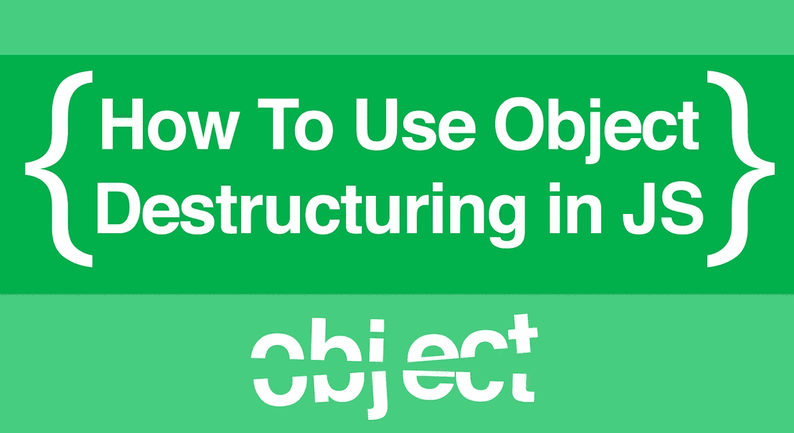

# 如何在现代 Javascript 中使用对象析构

> 原文：<https://itnext.io/how-to-use-object-destructuring-in-modern-javascript-59758ebfb778?source=collection_archive---------2----------------------->



“JavaScript ES2015 的对象析构”可能听起来很吓人，但它真的很简单:它让你更容易地访问对象的键。在我们深入了解它之前，让我们解释一下*为什么*它如此有用。

# 使用嵌套对象

假设我们有一个大的`user`对象，它有几层其他对象。在我们假设的程序中，我们将继续使用他们的姓名、年龄和级别，但实际上没有太多其他的。为了节省时间，我们希望将这些值存储在变量中。请记住，我们希望编写枯燥的代码，而不是重复自己，我们将如何实现这一点？让我们来看看一些选项:

我们到底在这里做什么？我们实际上是把嵌套的键赋值给一个局部变量。就是这样。选项 1 让我们按照它们在原始`user`对象中的样子逐一检查和定义它们，但这感觉像是“治疗比疾病更糟糕”的情况。

选项 2 更好一点，我们将不得不创建一个本地的`description`变量作为捷径。这将让我们每次键入“描述”而不是“用户.属性.描述”。但是感觉还是需要大量的输入。

# 摧毁它

从 ES2015 开始，我们需要做的就是:

有了新的语法，我们可以跳过定义新对象的部分来使用它的键。相反，我们*只是*定义键，因为我们实际上并不关心对象。等号左边的`{}`看起来很奇怪，但是把它想象成我们只是直接进入旧的`description`对象内部，拔出钥匙，然后扔掉无用的`description`。

这些关键的名字仍然和以前一样重要；在`user.attributes.description`对象中必须有一个`name`、`age`和`level`键才能工作。不要忘记用`let`或`const`将它们定义为变量！(我们不说`var`，但从技术上来说这也是可行的……)

```
// yes
let {name, age, level} = user.attributes.description// no
{name, age, level} = user.attributes.description
// you wouldn't intentionally do this,
// it's just a common mistake
```

另一件要考虑的事情:不可能的变量名。当对象的键名不是有效的 JS 变量名时，该怎么办？这在使用 API 时很常见，您会在许多键名中发现“-”:

```
let data = {
  /* more keys*/
  "name": "tommy",
  "obj-id": 2
}
```

幸运的是，这很简单。只需将有问题的键名放在引号中，然后用冒号给它一个可用的名称。这有点像创建另一个迷你对象来重新分配关键点:

```
let data = {
  /* more keys*/
  "name": "tommy",
  "obj-id": 2
}
const {name, "obj-id": objId} = dataconsole.log(name)  // "tommy"
console.log(objId) // 2
```

还有，有趣的事实是，你可以[析构数组](https://developer.mozilla.org/en-US/docs/Web/JavaScript/Reference/Operators/Destructuring_assignment)，当你创建对应于原始对象不同层次的变量时，事情变得更加[有趣](https://medium.com/@pyrolistical/destructuring-nested-objects-9dabdd01a3b8)。

# 与 React 一起使用

虽然我上面的例子只是稍微有点做作的*，但是在使用库、框架或 API 时处理深度嵌套的对象并不少见。尤其是 [React](https://reactjs.org/) ，将深度嵌套的数据放在[状态](https://reactjs.org/docs/state-and-lifecycle.html)和[道具](https://reactjs.org/docs/components-and-props.html)对象中。但是不要混淆，**对象析构是纯粹的，香草 JS** ，你**不需要**一个框架什么的来使用它。这只是我们几年前更新时得到的另一个巨大改进。*

希望这个简洁的小工具能对你下一个编码项目有所帮助。您可以随意将代码复制到控制台中，并在这段时间内随意使用它。

大家编码快乐，

迈克