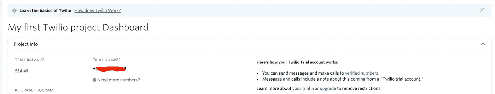

# 如何在 Selenium Web 驱动程序的自动化脚本中使用 OTP 服务。

> 原文：<https://itnext.io/how-to-use-otp-service-in-your-automation-scripts-with-selenium-web-driver-fe81607232b5?source=collection_archive---------0----------------------->


有时我们会面临使用用户名密码和一次性密码的组合来执行授权的任务。

由于我们需要使用 web 界面和 Selenium WebDriver 工具来输入数据，这项任务变得复杂了。

动作的算法大致如下:

*   在身份验证页面上，我们输入您的用户名、密码和电话号码。
*   服务器向我们发送请求，要求我们输入**一次性密码**。
*   收到代码后，我们将其输入到身份验证表单中。

一次性密码(OTP)是仅对一次认证会话有效的密码。

与静态密码相比，一次性密码的优势在于不能重复使用。因此，从成功的认证会话中截取数据的攻击者不能使用复制的密码来访问受保护的信息系统。

当在存储用户信息的任何站点上注册时，用户被要求创建认证密码。许多人认为唯一的密码可以安全地保护信息。但是用户密码的唯一性被高估了。在创建大多数密码时，我们使用逻辑:密码是日期、电话号码和姓氏。这个认证码很容易被发现、窃取或计算。但是，还有一种替代的数据保护系统——一次性密码，使用它，信息将得到安全的保护，因为临时密码只有效一次。最后，您决定通过实现基于一次性密码的身份验证来确保项目的最大安全性。很自然，问题出现了—我如何获得一次性代码？为此，您需要一个专门设计的一次性密码生成器“令牌”。令牌可以是专门设计的设备，也可以是您经常使用的小工具。因此，要开始使用 OTP 密码，您需要:在 Protectimus 站点上注册，选择适当的令牌，并为每次身份验证获取一次性密码。令牌或一次性密码生成器是一种设备或应用程序，当用户请求时，它使用特定的 OTP 生成算法来创建一次性密码。令牌是生成一次性密码的非常方便的解决方案，因为它们是无需访问网络即可工作的自主设备。基于一次性密码进行身份验证的硬件令牌可以使用不同的算法，例如基于时间的 TOTP 身份验证算法等等。有各种方法可以一次性得到。

认证过程:

*   在授权期间，除了用户名和密码之外，还将请求一次性密码，用户必须在使用我们的一个令牌生成密码后在表单中输入该密码。
*   一次性密码通过 API 发送。
*   实时检查 OTR 和用户，并立即向您的应用程序返回肯定或否定的响应。
*   您的应用程序会根据收到的响应来响应身份验证尝试。

不幸的是，Selenium WebDriver 不能与 API 一起工作。在软件开发的开源世界中，有大量使用 API 的框架。你可以在这篇[文章](/testing-apis-using-advanced-rest-client-29edc785bfb1)中读到更多关于他们的信息。我个人更喜欢 T2 的 HTTP 客户端 Apache T3。

让我们假设您的任务是在 web 服务中为用户认证组织服务测试。示例案例如下所示:

*   用户输入他们的电话号码，然后收到一条带有代码的短信。
*   用户从短信中输入代码，应用程序对其进行验证和授权。

如何组织一次模拟刺杀来使用我在这篇[文章](/how-to-create-a-stub-for-testing-a-one-time-password-service-68e0de6f6641)中写的一次性密码服务。

但是在本文中，我们将看一个使用服务 [Twilio](https://www.twilio.com/) 的例子

Twilio 是一个创建短信、电话和其他通信的平台。你可以使用它来设置自动邮件列表和接收响应消息，进行语音通话和视频通话，在各种门户网站上获得授权的验证码，创建呼叫中心和聊天机器人。

要开始使用该服务，您需要注册。注册后，转到仪表板并创建一个电话号码。



您可以使用这个电话号码来获取一次性密码。

为了能够使用 Twilio 服务，您需要添加自己的项目依赖项:

对于 Maven:

```
<dependency>
<groupId>com.twilio.sdk</groupId>
<artifactId>twilio</artifactId>
<version>7.54.0</version>
<scope>runtime</scope>
</dependency>
```

对于格雷尔:

```
runtime group: **'com.twilio.sdk'**, name: **'twilio'**, version: **'7.54.0'**
```

为以下对象创建基类:

```
*/**
 * Sets up.
 */* @BeforeClass
**public static void** start() {
    **final** DesiredCapabilities capabilities = **new** DesiredCapabilities().*chrome*();
    **final** Chrome chrome = **new** Chrome();
    **Twilio.init(ACCOUNT_SID, AUTH_TOKEN);**
    DriverHolder.*setDriverThread*(chrome.createDriver(capabilities));
    DriverHolder.*getDriverThread*().manage().timeouts().implicitlyWait(***DELAY***, TimeUnit.***SECONDS***);
    DriverHolder.*getDriverThread*().manage().timeouts().pageLoadTimeout(***DELAY***, TimeUnit.***SECONDS***);
    DriverHolder.*getDriverThread*().manage().timeouts().setScriptTimeout(***DELAY***, TimeUnit.***SECONDS***);
    *navigateWebBrowser*().to("***Add your url***");
}
```

让我们根据页面对象模式来描述注册页面:

```
*/**
 * The method enterRegisterData.
 *
 ** ***@return*** *RegisterPage.
 */* 
**public** RegisterPage enterRegisterData() {

**final** WaitCondition waitCondition = **new** WaitCondition();
    waitCondition.waitForVisibilityOfElementLocatedBy(***PHONE***).clear();
    waitCondition.waitForVisibilityOfElementLocatedBy(***PHONE***).sendKeys( "**Add phone number for registration**");

    waitCondition.waitForVisibilityOfElementLocatedBy(***VERIFY***).click();

    waitCondition.waitForVisibilityOfElementLocatedBy(***FIRST_NAME***).clear();
    waitCondition.waitForVisibilityOfElementLocatedBy(***FIRST_NAME***).sendKeys("**Any name**");

    waitCondition.waitForVisibilityOfElementLocatedBy(***PASSWORD***).clear();
    waitCondition.waitForVisibilityOfElementLocatedBy(***PASSWORD***).sendKeys("**qwerty123456**");

    waitCondition.waitForVisibilityOfElementLocatedBy(***CODE***).clear();
    **try** {
        waitCondition.waitForVisibilityOfElementLocatedBy(***CODE***).sendKeys(*getVerificationCode*(getVerificationCode()));
    } **catch** (URISyntaxException | IOException ex) {
        **if** (***LOGGER***.isLoggable(Level.***INFO***)) {
            ***LOGGER***.info(**"The method getVerificationCode is down."** + ex.getMessage());
        }
    }

waitCondition.waitForVisibilityOfElementLocatedBy(***REGISTER***).click();

    **return this**;
}
```

创建使用服务一次性密码 API 的方法:

```
*/**
 * The method getVerificationCode.
 *
 ** ***@param phone*** *the phone.
 ** ***@return*** *String. verification code.
 ** ***@throws*** *URISyntaxException the uri syntax exception
 ** ***@throws*** *IOException        the io exception
 */* **public static** String getVerificationCode(**final** String phone) **throws** URISyntaxException, IOException {
    **final** URIBuilder uri = **new** URIBuilder("**Add url for API"**);
    uri.setPath("**Add endpoint for get OTP code**");
    uri.addParameter(**"token"**, **your token**);
    uri.addParameter(**"phone"**, **your phone**);
    **final** String codes = *getHtml*(uri.toString());
    **final** JSONObject jsonObj = **new** JSONObject(codes);
    **final** Object returnCode = jsonObj.get(**"code"**);
    **return** String.*valueOf*(returnCode);
}
//Sometimes the API message doesn't mention the **word CODE or OTP**.
// Our task is to find the digital code from the text and return it.
// You can solve this problem using regular expressions.// **final** String codes = *getHtml*(uri.toString());
// **final** String OTPCode = codes.replaceAll("[^-?0-9]+"); 
```

get Html 方法:

```
*/**
 * The method getHtml.
 *
 ** ***@return*** *String.
 */* **private static** String getHtml(**final** String urlToRead) **throws** IOException {
    **final** StringBuilder result = **new** StringBuilder();
    **final** URL url = **new** URL(urlToRead);
    **final** URLConnection connection = url.openConnection();
    **if** (connection == **null**) {
        **throw new** TypeCastException(**"null cannot be cast to non-null type java.net.HttpURLConnection"**);
    } **else** {
        **final** HttpURLConnection conn = (HttpURLConnection) connection;
        conn.setRequestMethod(**"GET"**);
        **final** BufferedReader bufferedReader = **new** BufferedReader((Reader) (**new** InputStreamReader(conn.getInputStream())));
        **final** Ref.ObjectRef line = **new** Ref.ObjectRef();
        **while** (**true**) {
            **final** String lines = bufferedReader.readLine();
            line.**element** = lines;
            **if** (lines == **null**) {
                bufferedReader.close();
                **final** String resultLines = result.toString();
                Intrinsics.*checkExpressionValueIsNotNull*(resultLines, **"result.toString()"**);
                **return** resultLines;
            }
            result.append((String) line.**element**);
        }
    }
}
```

和自动化脚本可能看起来像这样:

```
 @Test
**public void** testRegister() {
    **new** RegisterPage()
            .openLoginForm()
            .cliclRegisterPage()
            .enterRegisterData()
            .checkApproveRegistration();
}
```

我希望这篇文章对您有用，它提供了关于 Selenium Web 驱动程序和 API 交互的信息。

如果你已经读完这篇文章，我真的希望得到你的反馈。订阅我并为我鼓掌。

