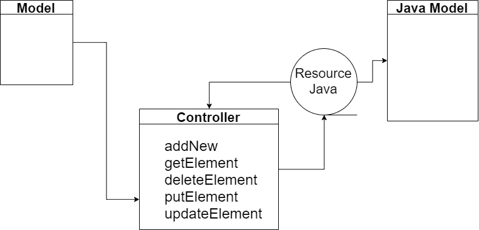

# 如何放心使用模式中介器和数据提供器？

> 原文：<https://itnext.io/how-to-use-patterns-mediator-and-dataprovider-with-rest-assured-d430ffcfb137?source=collection_archive---------2----------------------->


Artem Sapegin 在 [Unsplash](https://unsplash.com/@sapegin) 上拍摄的照片

T 控制器方法本质上是一种实现中介模式的方法。也叫介体。

中介模式是一种行为设计模式，它允许您通过将这些关系转移到一个中间类来减少许多类之间的连接。中介模式使得对象之间不直接通信，而是通过一个独立的中介对象进行通信，该中介对象知道将特定的请求重定向给谁。正因为如此，系统的组件将只依赖于中介，而不依赖于许多其他组件。



换句话说，主要目的是控制任何设施或油田的资源和转移。
因此，中介器隐藏了程序的各个组件的类之间的所有复杂关系和依赖性。类的关系越少，修改、扩展和重用它们就越容易。

**示例**:

降落或起飞飞机的飞行员不与其他飞行员直接沟通。相反，他们与调度员交流，调度员同时协调几架飞机的行动。如果没有控制器，飞行员将不得不时刻保持警惕，并独自监控周围的所有飞机，这将导致天空中频繁发生灾难。
了解在整个飞行过程中不需要控制器是很重要的。它只涉及机场的区域，当你需要协调许多飞机的相互作用时。

P ros:

*   消除组件之间的依赖关系，允许它们被重用。
*   简化组件之间的交互。
*   将管理集中在一个地方。

C ons:

*   中间人可以膨胀很多。

接下来，我们结合放心考虑中介模式的实现。
最初，我们需要为模型创建一个控制器。
在该控制器中，将有执行一些操作的方法。本质上，如果我们谈论一个已经实现了方法 **GET、POST、PUT、UPDATE、OPTIONS、DELETE** 等的标准化资源，他们将对资源执行操作。在一个课程中，将会有这些方法的便捷操作。

换句话说，我们创建了一个与模型和资源一起工作的中介。

**创建控制器类:**

```
**public class** Controller { **public** Model addNew(Model newModel) {
        **return** *given*().body().when().post().as(Model.**class**);
    }
}
```

它将拥有的型号是**型号**，因为我们想得到回应并测试它。

这个例子实现了一个将方法反序列化为模型的方法。

在控制器的参与下，我们还可以重新配置测试的基本设置。

通常，这样的设置或者在控制器本身中进行，或者在抽象控制器类中进行。

**示例控制器:**

```
**public class** Controller { **private** RequestSpecification **requestSpecification**;
    **private** Model **model**; **public** Controller(Model testModel) {
        **requestSpecification** = **new** RequestSpecBuilder()
                .addHeader(**"Content-type"**, **"application/json; charset=UTF-8"**)
                .setBaseUri(**"some base url"**)
                .setBasePath(**"some base path"**)
                .setContentType(ContentType.***JSON***)
                .log(LogDetail.***ALL***).build();
        RestAssured.*responseSpecification* = **new** ResponseSpecBuilder()
                .expectContentType(ContentType.***JSON***)
                .expectResponseTime(Matchers.*lessThan*(15000L))
                .build();
        RestAssured.*defaultParser* = Parser.***JSON***;
        **this**.**model** = testModel;
    }
}
```

**抽象控制器的例子:**

```
**public abstract class** AbstractController {
 **static** {
        RestAssured.*requestSpecification* = **new** RequestSpecBuilder()
                .addHeader(**"Content-type"**, **"application/json; charset=UTF-8"**)
                .setBaseUri(**"some base url"**)
                .setContentType(ContentType.***JSON***)
                .log(LogDetail.***ALL***).build(); RestAssured.*responseSpecification* = **new** ResponseSpecBuilder()
                .expectContentType(ContentType.***JSON***)
                .expectResponseTime(Matchers.*lessThan*(15000L))
                .build();
        RestAssured.*defaultParser* = Parser.***JSON***;
    }
}
```

**自动化脚本如下所示:**

```
@Test(description = "The automation script for added new model")
**public void** testAddNew(){
        Model model=**new** Model();
        Controller controller=**new** Controller(model);
        controller.addNewElement(model);
```

使用@DataProvider 进行测试。


在测试中，经常需要对不同的数据集进行操作。在某些情况下，数据可能是甜言蜜语，一些来自外部来源的阻力。在大多数情况下，对于代码优化和参数化，我使用数据驱动。

测试中一个很重要的功能就是实现数据驱动。数据驱动允许您使用不同的数据集多次运行相同的测试方法。

在 framework TestNG 中，这个功能是使用`dataProvider`实现的。在 JUnit `Parameterized.class`

要在测试中使用 DataProvider 函数，您必须用 [@DataProvider](http://twitter.com/DataProvider) 注释声明一个方法，然后在测试方法中使用 test 注释中的“DataProvider”属性来使用该方法。

我们就当是个例子[https://rest countries . eu](https://restcountries.eu/)

还有法[https://restcountries.eu/rest/v2/aplha/{**C**颂}](https://restcountries.eu/rest/v2/aplha/{CODE)

**代码—** 这是端点。按 ISO 3166 搜索–1 个 2 个字母或 3 个字母的国家代码。

自动化脚本的示例代码可能如下所示:

```
@Test(dataProvider = **"verifyCountry"**, dataProviderClass = DataProviders.**class**)
**public void** testRequestWithSeveralCountries(String name, String alpha2Code, String alpha3Code) { **final** String resultApiJson = getAllCountry(GET_ALPHA_CODE, alpha2Code);
    **final** ApiJson apiJson = ApiJson.from(resultApiJson);
    **final** CountryCode result = apiJson.getCountryCode(); assertEquals(result.getName(), name);
    assertEquals(result.getAlpha2Code(), alpha2Code);
    assertEquals(result.getAlpha3Code(), alpha3Code);
}
```

方法 **getAllCountry** 可能如下所示:

```
*/**
 * Country get all country with alpha2code request string.
 *
 ** ***@param url*** *the url.
 ** ***@param alpha2Code*** *alpha2Code value.
 ** ***@return*** *the string
 */* **public static** String getAllCountry(**final** String url, **final** String alpha2Code) {
    **final** String json = RestAssured
            .given()
            .then()
            .statusCode(SUCCESS)
            .log().all().when().get(url + alpha2Code).getBody().asString(); **return** json;
}
```

方法 **ApiJson** 可能如下所示:

```
*/**
 * From api json.
 *
 ** ***@param json*** *the json
 ** ***@return*** *the api json
 */* **public static** ApiJson from(**final** String json) {
    **return new** ApiJson(json);
}
*/**
 * Gets country.
 *
 ** ***@return*** *the post
 */* **public** CountryCode getCountryCode() { **return** jsonPath.getObject(JSON_PATH, CountryCode.**class**);
}
```

生成后的类 **ContryCode** 如下所示:

```
@Generated(**"com.robohorse.robopojogenerator"**)
    **public class** CountryCode{
        ..........
        **public** List<CurrenciesItem> getCurrencies(){
            **return** currencies;
        }
    }
```

通过@ **DataProvider** 得到的测试参数如下所示:

```
*/**
 * Verify country object [ ] [ ].
 *
 ** ***@return*** *the object [ ] [ ]
 */* @DataProvider(name = **"verifyCountry"**)
**public static** Object[][] verifyCountry() {
    **return new** Object[][]{
            {**"Estonia"**, **"EE"**, **"EST"**},
            {**"Germany"**, **"DE"**, **"DEU"**},
            {**"Afghanistan"**, **"AF"**, **"AFG"**}
    };
}
```

如您所见，测试方法运行了 3 次。测试方法运行的次数取决于 DataProvider 方法提供的数据集的数量。在我们的例子中，这个方法分别返回了 3 组数据，测试方法被执行了三次。

**重要的**！DataProvider 方法应该以对象类的二维数组的形式返回数据(Object[][])。第一个数组是一组数据，第二个数组包含参数值。

dataProvider 的大减号是 Object[][]。鉴于我们生活在 2018 年，用支持 Stream API 并且有很好的集合 API 的 Java 8 写。二维数组的对象并不严重。它仍然接受和编写不正确的代码。

但事实上，这种情况可以在[测试数据供应商](https://github.com/sskorol/test-data-supplier)库的帮助下得到纠正。它的作者是谢尔盖·科罗尔。

想象一下，如果您可以使用下面的语法来提供一些过滤和排序的数据到测试方法的签名中:

```
@DataSupplier
**public** Stream<User> getData() {
    **return** Stream.of(
            **new** User(**"Petya"**, **"password2"**),
            **new** User(**"Virus Petya"**, **"password3"**),
            **new** User(**"Mark"**, **"password1"**))
            .filter(u -> !u.getName().contains(**"Virus"**))
            .sorted(comparing(User::getPassword));
}

@Test(dataProvider = **"getData"**)
**public void** shouldSupplyStreamData(**final** User user) {
    *// ...* }
```

比二维数组或者迭代器好的多，灵活的多，不是吗？