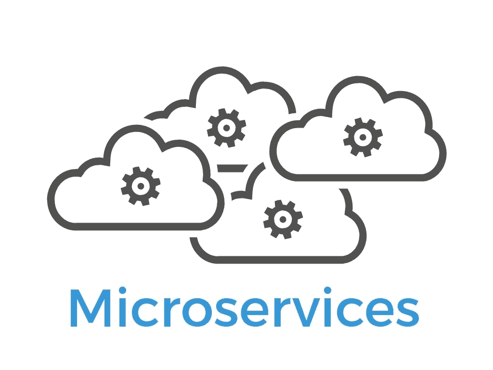
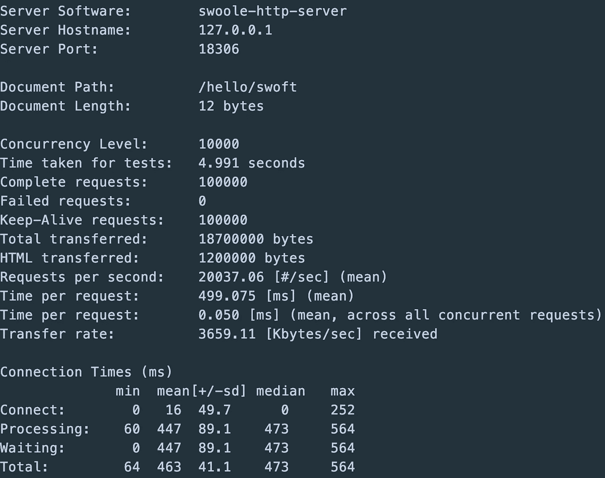
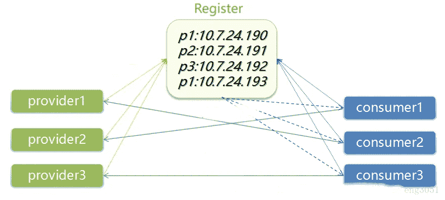

# 如何用 PHP 搭建微服务？

> 原文：<https://itnext.io/how-to-use-php-to-implement-microservice-94957206abc6?source=collection_archive---------0----------------------->



在本文中，我们主要介绍如何使用 PHP 构建一个微服务架构。要知道 PHP 也是与时俱进的，也是有能力支持大型系统的微服务架构的。

# 服务化的挑战

Php 使用`traditional framework` ( `laravel`、`yii`、`symfony`)实现微服务，效果很差。

为什么？

在`fpm`的开发模式中，由于无法提供常驻内存，每个请求都必须通过开始加载一个进程来退出进程，从零开始，增加了很多无用的开销。

此外，数据库连接不能被重用和保护，因为`fpm`是基于进程的，而`fpm`进程的数量也决定了并发的数量。这些都是`fpm`开发的简单给我们出的问题。

它与 docker 等微服务工具不够友好，必须依赖 nginx 提供服务。

所以，这些就是为什么`Java`比`PHP`更受欢迎的原因。除了`PHP non-memory resident`，还有很多其他问题需要解决。

我们来看看 Swoft 是如何实现微服务的。

# 什么是 Swoft？

Swoft 是一个基于 Swoole 扩展的 PHP 微服务协程框架。像 Go 一样，Swoft 有一个内置的协程 web 服务器和一个公共的协程客户端，驻留在内存中，独立于传统的 PHP-FPM。

还有类似 Go 的语言操作，类似 Spring 的云框架灵活的注解，强大的全局依赖注入容器，全面的服务治理，灵活强大的 AOP，标准的 PSR 规范实现等等。

# Swoft Github

*   [https://github.com/swoft-cloud/swoft](https://github.com/swoft-cloud/swoft)

# 我们需要什么来建立一个微服务？

*   高性能应用框架
*   服务注册和发现
*   服务断路器
*   服务限制
*   配置中心

哦，一切都准备好了

# Swoft 的高性能

你可以想象常驻记忆给我们带来的好处。

*   **仅启动框架初始化一次**我们可以专注于处理请求，因为框架只能在启动时在内存中初始化一次，用于常驻内存
*   **连接复用**，一些工程师无法理解如果不使用连接池，为每个请求建立连接的后果是什么？它会导致连接中的后端资源过多。对于一些基本服务，如 Redis、数据库，连接是一种昂贵的消耗。

那么，有没有好的解决办法呢？答案是肯定的，很多人都在用这个叫做`Swoft`的框架。`Swoft`是一个具有`Service Governance`特性的 [RPC](https://en.swoft.org/docs/2.x/en/rpc-server/index.html) 框架。`Swoft`是第一个 PHP 常驻内存协程全栈框架，基于`Spring Boot`的核心概念，约定大于配置。

`Swoft`提供了一种更优雅的方式来使用`RPC`服务，如`Dubbo`和`Swoft`具有类似于`Golang`的出色性能。下面是`Swoft`性能发生在我的`PC`上的压力测试结果。



在`ab`压力测试中处理速度非常惊人。使用`i7 generation 8` CPU 和`16GB`内存，`100000`请求仅使用`5s`。时间在`fpm`开发模式下基本不可能达到。

测试也足以证明`Swoft`的高性能和稳定性。

# [服务注册和发现](https://en.swoft.org/docs/2.x/en/ms/govern/register-discovery.html)

在微服务治理过程中，经常会涉及到向第三方集群(如 consul/etcd)发起的服务注册。本章使用 swoft 框架中的 swoft-consul 组件来实现服务注册和发现。



实现逻辑

# [服务断路器](https://en.swoft.org/docs/2.x/en/ms/govern/breaker.html)

在基本断路器模式中，为了确保在断路器处于打开状态时不会调用供应商，但我们还需要额外的方法在供应商恢复服务后重置断路器。

一种可能的解决方案是断路器周期性地检测供应商的服务是否恢复。一旦恢复，状态将设置为关闭。断路器重试时，状态为半开状态。


保险丝的使用简单且功能强大。可以用一个`@Breaker`来注释。`Swoft`的熔丝可以用在任何场景，比如一个服务被调用。当请求第三方服务时，它可以被降级或不被呼叫。

# [服务限制](https://en.swoft.org/docs/2.x/en/ms/govern/limiter.html)

流量限制、断路器、服务降级这些可以反复强调，因为它们真的很重要。当服务不起作用时，它一定是坏了。限流是一种自我保护的工具。如果没有自我保护机制，不管有多少个连接都被接收，那么当流量非常大时前端肯定会挂起，而后端无法处理所有的连接。

流量限制是在访问稀缺资源，如闪购商品时，限制并发数和请求数，从而有效削峰平滑流量曲线。

流量限制的目的是限制并发访问和并发请求的速率，或者在一个时间窗口内限制请求的速度，以保护系统。一旦达到或超过速率限制，请求就会被拒绝或排队。

`Swoft`的流量限制底层使用令牌桶算法，底层依靠`Redis`实现分布式流量限制。

Swoft 流限制不仅限制控制器，还限制任何 bean 中的方法，并控制方法的访问速率。下面的例子是详细的解释。

```
<?php declare(strict_types=1);namespace App\Model\Logic;use Swoft\Bean\Annotation\Mapping\Bean;
use Swoft\Limiter\Annotation\Mapping\RateLimiter;/**
 * Class LimiterLogic
 *
 * @since 2.0
 *
 * @Bean()
 */
class LimiterLogic
{
    /**
     * @RequestMapping()
     * @RateLimiter(rate=20, fallback="limiterFallback")
     *
     * @param Request $request
     *
     * @return array
     */
    public function requestLimiter2(Request $request): array
    {
        $uri = $request->getUriPath();
        return ['requestLimiter2', $uri];
    }

    /**
     * @param Request $request
     *
     * @return array
     */
    public function limiterFallback(Request $request): array
    {
        $uri = $request->getUriPath();
        return ['limiterFallback', $uri];
    }
}
```

这支持了`symfony/expression-language`的表达方式。如果速度受限，将调用`fallback`中定义的`limiterFallback`方法。

# [配置中心](https://en.swoft.org/docs/2.x/en/ms/govern/config.html)

在讨论配置中心之前，我们先来讨论一下配置文件。我们对它并不陌生。它为我们提供了动态修改程序的能力。引用某人的话来说:

> *系统运行时飞行姿态的动态调整！*

对于单机版，我们称之为配置(文件)；对于分布式集群系统，我们称之为配置中心(系统)；

本章以`Apollo`为例，从远程配置中心获取配置和安全重启服务。如果对`Apollo`不熟悉，可以先看看`Swoft`扩展`[Apollo](https://en.swoft.org/docs/2.x/en/extra/apollo.html)`组件，阅读`Apollo` 官方文档。

本章以`Swoft`中的`Apollo`为例。当`Apollo`配置改变时，重启服务(http-server/RPC-server/ws-server)。以下是一个代理的示例:

```
<?php declare(strict_types=1); namespace App\Model\Logic;use Swoft\Apollo\Config;
use Swoft\Apollo\Exception\ApolloException;
use Swoft\Bean\Annotation\Mapping\Bean;
use Swoft\Bean\Annotation\Mapping\Inject;/**
 * Class ApolloLogic
 *
 * @since 2.0
 *
 * @Bean()
 */
class ApolloLogic
{
    /**
     * @Inject()
     *
     * @var Config
     */
    private $config; /**
     * @throws ApolloException
     */
    public function pull(): void
    {
        $data = $this->config->pull('application');

        // Print data
        var_dump($data);
    }
}
```

以上是简单的阿波罗配置拉，除了这个方法，`[Swoft-Apollo](https://en.swoft.org/docs/2.x/en/extra/apollo.html)`提供了更多的使用方法。

# 结论

至此，我们简单的微服务框架已经构建完成。如果使用传统的 PHP 框架，是很难实现的。但是使用 Swoft 非常简单。

[](https://github.com/swoft-cloud/swoft) [## 软件云/软件

### PHP 微服务协程框架 Swoft 是一个基于 Swoole 扩展的 PHP 微服务协程框架…

github.com](https://github.com/swoft-cloud/swoft)