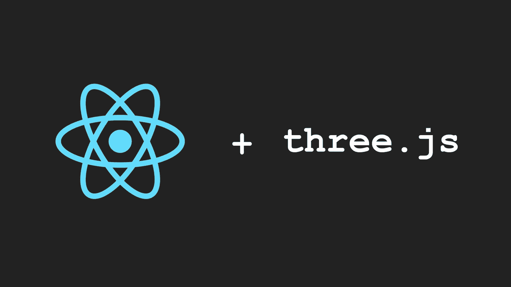

# 如何在 React 应用中使用普通的 Three.js

> 原文：<https://itnext.io/how-to-use-plain-three-js-in-your-react-apps-417a79d926e0?source=collection_archive---------2----------------------->



## 在 React 应用程序中集成 Three.js 代码，而不使用 React 绑定

[*点击这里在 LinkedIn* 上分享这篇文章](https://www.linkedin.com/cws/share?url=https%3A%2F%2Fitnext.io%2Fhow-to-use-plain-three-js-in-your-react-apps-417a79d926e0)

在这篇文章中，我将展示 plain Three.js 和 React.js 之间集成的一个简单示例。我不会对 Three.js 使用 React 绑定，它们很好，但我认为 plain Three.js 允许更大的灵活性，并且更容易使用。

我将按照*实体/组件模式*构建 Three.js 代码，这里的[是](https://medium.com/@soffritti.pierfrancesco/how-to-organize-the-structure-of-a-three-js-project-77649f58fa3f)，但是你不需要知道它是如何工作的才能理解这篇文章。

React 应用程序中 Three.js 代码的工作示例在[本报告](https://github.com/PierfrancescoSoffritti/pierfrancescosoffritti.com/tree/master/src/components/home/header)中提供。

[](https://github.com/PierfrancescoSoffritti/pierfrancescosoffritti.com/tree/master/src/components/home/header) [## PierfrancescoSoffritti/PierfrancescoSoffritti . com

### React 应用程序中 Three.js 的示例。

github.com](https://github.com/PierfrancescoSoffritti/pierfrancescosoffritti.com/tree/master/src/components/home/header) 

您可以[从 npm](https://www.npmjs.com/package/three) 下载 Three.js，并使用 *npm 安装三个*或 *yarn 添加三个*(如果您使用 yarn 而不是 npm) *将其添加到您的应用程序中。*

## 反应组分

首先，我们需要创建 React 组件来托管画布和 Three.js 应用程序。

```
import React, { Component } from 'react';
import threeEntryPoint from './threejs/threeEntryPoint';export default class ThreeContainer extends Component { componentDidMount() {
    threeEntryPoint(this.threeRootElement);
  } render () {
      return (
        <div ref={element => this.threeRootElement = element} />
      );
  }
}
```

*div* 元素将是*画布*的容器(我更喜欢用 Javascript 创建*画布*，这样更灵活。但是您可以在这里轻松地创建它，而不是创建 *div* 元素)。
我使用 [*ref* 属性](https://www.reactenlightenment.com/basic-react-components/6.9.html)来获取对 *div* 元素的引用。

我正在将 *this.threeRootElement* (对 *div* 的引用)传递给函数 *threeEntryPoint()* 。当组件被挂载时，React 自动调用函数 *componentDidMount()* 时，调用该函数。

现在让我们看看三个入口点到底是什么。

## 离开反应世界

*threeEntryPoint* 是活在 React 之外，不关心它的函数。据它所知，可以从任何 web 应用程序调用它，可以用任何框架构建，也可以根本不用框架。

*threeEntryPoint* 是一个以 dom 元素为参数的函数，这个元素将是*画布*的容器。

功能*三个入口点*负责:

1.  创建画布
2.  绑定事件
3.  创建 Three.js 对象
4.  开始渲染循环

```
import SceneManager from './SceneManager';export default containerElement => {
  const canvas = createCanvas(document, containerElement);
  const sceneManager = new SceneManager(canvas);

  bindEventListeners();
  render(); function createCanvas(document, containerElement) {
    const canvas = document.createElement(‘canvas’);
    containerElement.appendChild(canvas);
    return canvas;
  } function bindEventListeners() {
    window.onresize = resizeCanvas;
    resizeCanvas();
  } function resizeCanvas() {
    canvas.style.width = ‘100%’;
    canvas.style.height= ‘100%’; canvas.width = canvas.offsetWidth;
    canvas.height = canvas.offsetHeight; sceneManager.onWindowResize();
  } function render(time) {
    requestAnimationFrame(render);
    sceneManager.update();
  }
}
```

*SceneManager* 是负责 Three.js 逻辑的对象。是 app 的 Three.js 部分的入口(可以在我的 [*实体/组件帖子*](https://medium.com/@soffritti.pierfrancesco/how-to-organize-the-structure-of-a-three-js-project-77649f58fa3f) *中了解更多关于 *SceneManager* )。*

你可以在 *resizeCanvas()* 中看到*画布*有 100%的宽度和高度。这样做的话*画布*将填充它的容器元素。使用 CSS 可以很容易地调整容器的大小，就像您通常在处理任何元素时所做的那样。

## 三. js

*SceneManager* 是一个包含实际 Three.js 代码的函数。

正如您在下面的代码片段中看到的，该函数(在本例中，该函数没有名称，但它是一个场景管理器)接收一个*画布*并返回一个对象。该对象公开了必须在外部可见的函数，即公共函数。

(我没有复制粘贴所有的 Three.js 代码，因为它相当基础，通过阅读它的名称很容易理解每个函数是做什么的。如果你对细节感兴趣，你可以在我的 [*实体/组件帖子*](https://medium.com/@soffritti.pierfrancesco/how-to-organize-the-structure-of-a-three-js-project-77649f58fa3f) *中找到完整的实现和解释。)*

```
import * as THREE from 'three';export default canvas => {
  const scene = buildScene(); 
  const renderer = buildRender(screenDimensions);
  const camera = buildCamera(screenDimensions); 
  const sceneSubjects = createSceneSubjects(scene); function buildScene() { //... } function buildRender({ width, height }) { //... } function buildCamera({ width, height }) { //... } function createSceneSubjects(scene) { //... } function update() { //... } function onWindowResize() { //... } return {
    update,
    onWindowResize
  }
}
```

这种公私职能的模式只是个人的选择。也许看下面的片段会更容易理解:

```
export default params => { function publicMethod() { //... } function privateMethod() { //... }return {
    publicMethod
  }
}
```

如果你愿意，你可以使用[类](https://developer.mozilla.org/en-US/docs/Web/JavaScript/Reference/Classes)(或者任何你个人喜欢的)来拥有私有和公共方法。你甚至可以把一切都公开。

## 结论

通过这种方法，您可以获得可移植的 Three.js 代码，这些代码可以在任何框架下使用，也可以不使用框架。您可以继续使用 Three.js，就像您习惯使用常规 HTML 页面一样，同时享受 React 为您的 web 应用程序提供的清晰性和结构。

你能在哪里找到我？

在 Twitter 上关注我:[https://twitter.com/psoffritti](https://twitter.com/psoffritti)
我的网站/作品集:[pierfrancescosoffritti.com](http://pierfrancescosoffritti.com)
我的 GitHub 账号:[https://github.com/PierfrancescoSoffritti](https://github.com/PierfrancescoSoffritti)
我的 LinkedIn 账号:[linkedin.com/in/pierfrancescosoffritti/en](https://www.linkedin.com/in/pierfrancescosoffritti/en)