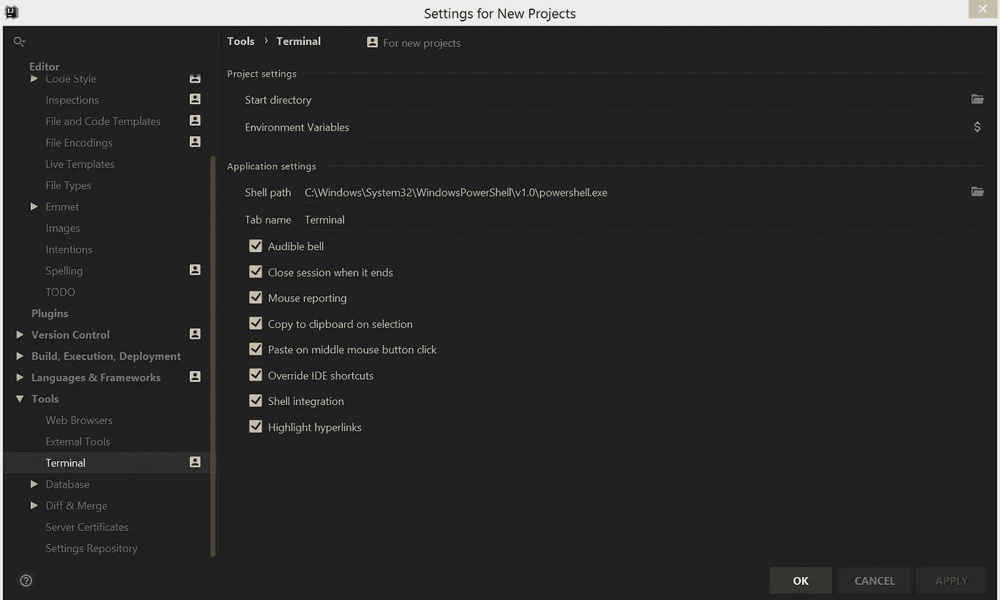
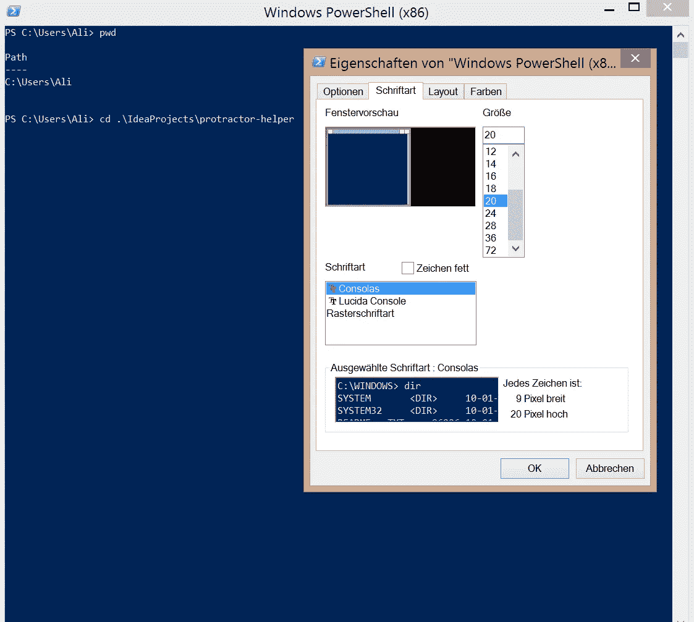
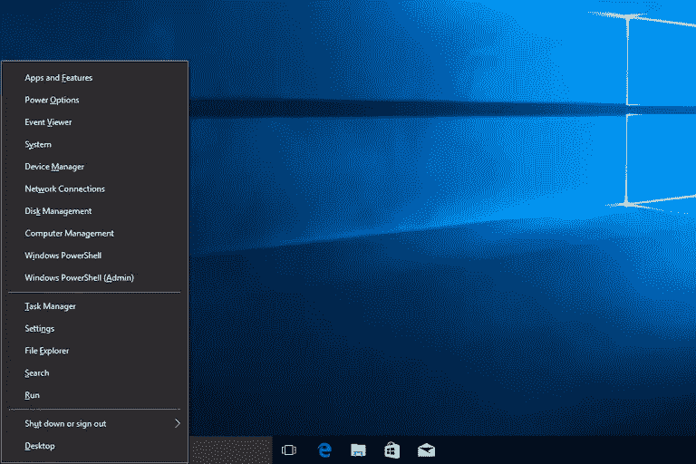

# 如何在 IntelliJ、VSCode 和 Windows Power 用户菜单中将 PowerShell 用作默认终端

> 原文：<https://itnext.io/how-to-use-powershell-as-default-terminal-in-intellij-vscode-windows-power-user-menu-ba512e68b566?source=collection_archive---------2----------------------->

大多数开发人员在某些时候都需要使用终端。如果你在 Windows 上开发，你有两个现成的选择:传统的**命令提示符(CMD)** 和 **Windows PowerShell** 。不过，几乎没有任何理由使用 CMD，因为自从 PowerShell 在 Windows 7 中首次推出以来，微软一直在不断改进它。另一方面，CMD 明显不如 UNIX 上可用的 PowerShell 和 Shell，并且被认为是一种非常传统的工具。从 Windows 10 开始，微软甚至将 PowerShell 作为默认终端。

在这篇文章中，我想向您展示如何更改您的默认终端来使用 PowerShell(或任何其他第三方 Shell)。

我对 CMD 的一个常见抱怨是有限的导航。如果您习惯于 UNIX shells，您会习惯于在一个命令中改变目录，而在 CMD 中这更麻烦。幸运的是，一些工具(例如 IntelliJ IDEA/WebStorm/PHP storm/py charm 之类的 ide)允许您选择使用哪个终端。

## 如何在 IntelliJ 中启用 PowerShell 作为默认终端

1.  打开 IntelliJ 设置。
2.  转到“*工具*部分。
3.  按下*端子*选项。
4.  为 PowerShell EXE 文件设置正确的 Shell 路径。在 Windows 8.1 的情况下，路径为:`**C:\Windows\System32\WindowsPowerShell\v1.0\powershell.exe**`。您应该使用最新的 PowerShell 版本！
5.  在 IntelliJ 中创建新的终端会话。或者，您可以重启 IntelliJ 来应用更改。

同样，您也可以在流行的 VSCode 编辑器中设置默认终端。

## 如何在 VSCode 中启用 PowerShell 作为默认终端

1.  打开*用户设置*(例如通过打开命令面板)。
2.  添加新的“*terminal . integrated . shell . windows*”设置，并指定 PowerShell 的路径。
3.  保存以应用更改。

## PowerShell 样式:如何改变字体大小等等

在 Windows 8.1 上，我最初遇到的问题是 PowerShell 窗口字体太小，无法阅读。我打开设置并更改了字体，但它并不像预期的那样工作。以下是在 PowerShell 中更改字体大小的方法:

1.  以管理员身份打开 Windows PowerShell。否则，可能不会应用更改。
2.  右击标题栏，点击“*属性*”。
3.  切换到“*字体*选项卡，设置所需的字体大小并确认您的更改。

Windows 8 中引入的 **Windows 高级用户菜单**包含许多有用的快捷方式，如:

*   打开任务管理器
*   关掉你的电脑
*   显示桌面
*   打开命令提示符

在 Windows 10 之前，你会看到 CMD 而不是 PowerShell。以下是如何将其更改为 PowerShell 的方法。

## 如何在 Windows 高级用户菜单中启用 PowerShell

1.  右键单击 Windows 任务栏。
2.  点击*属性*选项。
3.  转到“*导航*选项卡。
4.  当我右击开始按钮或按 Windows 键+ X 时，启用菜单中的*用 Windows PowerShell 替换命令提示符。*
5.  同时按下两个 **Windows 键+ X** 打开超级用户菜单，其中应包含一个选项“ *Windows PowerShell* ”。

## 结论

感谢您阅读这篇关于如何启用和设计 Windows PowerShell 的文章。PowerShell 比 CMD 好得多，并且已经包含在现代 Windows 系统中。请在评论中告诉我您使用 Windows PowerShell 的体验。