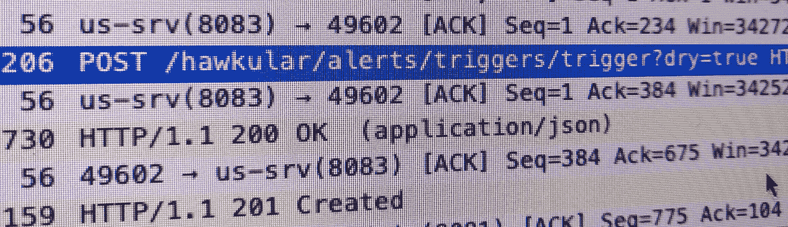

# 如何在 MicroProfile Rest-Client 中使用查询参数

> 原文：<https://itnext.io/how-to-use-query-parameters-with-microprofile-rest-client-16a72be073b9?source=collection_archive---------2----------------------->

正如我在之前写的那样，我使用微文件 [Rest-Client](https://github.com/eclipse/microprofile-rest-client) 通过 HTTP 与另一个服务对话。自从我写了另一篇文章后，后端发生了一些变化，现在我需要传递一个查询参数来告诉后端这是否是一次演习。



带有查询参数的 HTTP Post 请求

规范文档提到所有种类的参数都可以被传递，但是没有查询参数的例子，所以我们开始:

```
@Path("/some/path")
public interface VerifyEngine {

  @POST
  @Consumes("application/json")
  @Produces("application/json")
  Msg **verify**(FullTrigger trigger,  // **(1)** 
             **@QueryParam("dry")** boolean isDryRun);   // **(2)**
```

像以前一样， *verify()* (1)是我们调用来完成远程调用的方法。是否通过*？dry=true* 在完整的 URL 中，我们用 **@QueryParam** 注释(2)指定一个布尔参数。参数的名称用作 URL 中的 query-param。

现在，在调用代码中设置这个查询参数就像传递一个方法参数一样简单(如下 3 所示):

```
FullTrigger trigger = new FullTrigger(policy);
engine.**verify**(trigger, **true**);  // **(3)** 
```

## 其他种类的参数

同样的机制也适用于其他类型的参数，如@HeaderParam，用于设置 HTTP 头:

```
Msg **verify**(FullTrigger trigger,
           @QueryParam("dry") boolean isDryRun,
           **@HeaderParam**("Hawkular-Tenant" ) String customerId
);
```

在调用方，这只是添加了另一个方法参数:

```
FullTrigger trigger = new FullTrigger(policy);
engine.**verify**(trigger, true, **customerId**);
```