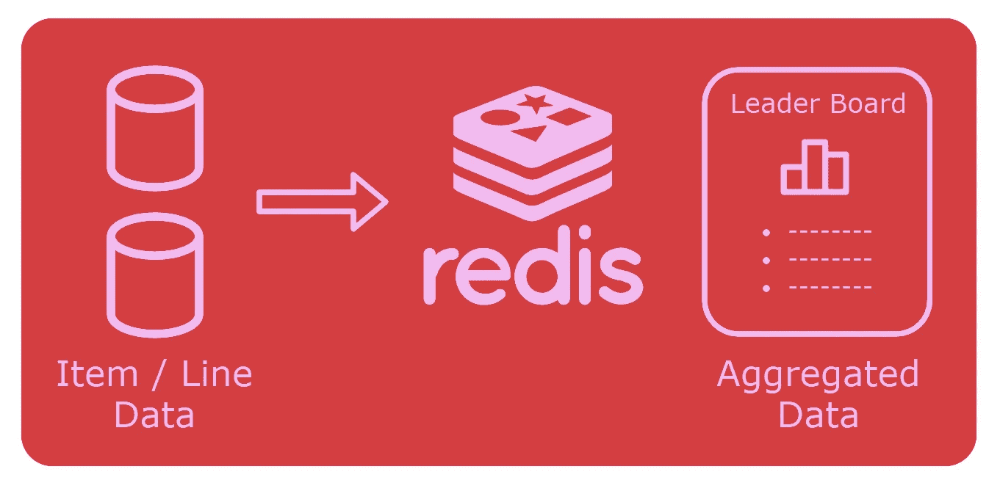

# 如何在 C # ASP.NET 核心微服务架构中使用 Redis 和 Lua 脚本

> 原文：<https://itnext.io/how-to-use-redis-and-lua-scripts-in-a-c-asp-net-core-microservice-architecture-e12dc8846707?source=collection_archive---------0----------------------->

## 使用 StackExchange。Redis 并在 Docker 中运行 Redis 来缓存一个可伸缩的 C#应用程序的聚合数据库数据



**Redis 有许多很棒的用例**，比如会话或整页**缓存**、**队列**、**发布/订阅**和**排行榜/计数**等。可用于您的应用和微服务架构。

在本文中，我将向您展示如何使用 [**StackExchange。ASP.NET 核心**中的 Redis](https://stackexchange.github.io/StackExchange.Redis/)和**访问 Docker** 中运行的 **Redis 服务器。**

[**示例应用**](/how-to-use-database-sharding-and-scale-an-asp-net-core-microservice-architecture-22c24916590f) **让用户按类别**写文章。它使用 Redis**缓存顶级类别和用户的聚合数据**，而**数据库存储项目/行数据作为“真实来源”**。

本文从一个**简单的第一个用例**开始，然后通过 Lua 脚本和**收件箱模式**推进到一个更加复杂的用例**。**

## 内容

1.  在 Docker 中设置 Redis 并准备。网络核心项目
2.  实施顶级类别
3.  顶级用户、收件箱模式和原子性的 Lua 脚本
4.  最后的想法和展望

# 1.在 Docker 中设置 Redis 并准备。网络核心项目

**安装** [**Docker 桌面**](https://hub.docker.com/editions/community/docker-ce-desktop-windows)

创建 Redis 容器:

```
C:\dev>docker run --name redis -d redis
```

**使用** [**Visual Studio 社区**](https://visualstudio.microsoft.com/en/vs/community/) (是免费的)配合 ASP.NET 和 web 开发工作量。用 EntityFramework 打开一个 ASP.NET Core 5 Web API 项目。

**安装以下 NuGet 包**:

*   微软。实体框架工作核心工具
*   StackExchange。雷迪斯

**创建以下实体:**

# 2.实施顶级类别

## 添加热门类别

插入新帖子时，增加类别的数量。

*   第 1 行:连接一个 Redis 复用器
*   第 7–11 行:插入文章并更新事务中的类别计数
*   第 13–15 行:读取类别的最新计数，并添加/更新 Redis [排序集](https://redislabs.com/ebook/part-2-core-concepts/chapter-3-commands-in-redis/3-5-sorted-sets/)"*categories by post count*中的条目

> [ZADD](https://redis.io/commands/ZADD) 命令有一个可选的 *GT* 参数:该值只有在大于当前值时才会更新。这防止了另一个线程也增加和更新计数的竞争情况。

## 阅读热门类别

*SortedSetRangeByRankWithScore*是 Redis [ZRANGE](https://redis.io/commands/zrange) 命令的包装器。它读取类别和计数。使用*开始*和*结束*参数进行分页。

# 3.顶级用户、收件箱模式和原子性的 Lua 脚本

对于用户，我将向您展示如何计算 Redis 而不是 DB 中的帖子数。这例如在用户的帖子分散在所有碎片上的碎片化环境中是需要的。

## 使用 Lua 脚本自动添加帖子

方法向 Redis 发送新的帖子。它使用 inbox 模式和一个 [Lua 脚本](https://redislabs.com/ebook/part-3-next-steps/chapter-11-scripting-redis-with-lua/)来使操作“等幂”。

*延伸阅读:* [*发件箱、收件箱模式和投递保证解释*](https://event-driven.io/en/outbox_inbox_patterns_and_delivery_guarantees_explained/)

*   第 3–8 行:准备 Lua 脚本
*   第 13 行:从 Redis 中读取最后发送的文章 ID
*   第 15 行:从数据库加载未发送的帖子
*   第 17–21 行:执行 Lua 脚本向用户添加文章
*   第 22 行:在 *UsersByPostCount* 中设置用户的文章数
*   第 25 行:在所有操作完成后更新最后发送的 ID

Lua 脚本试图将文章 ID 和时间戳添加到用户的 *PostsByTimestamp* 排序集合中。

如果可以添加密钥，它还会增加用户的*后计数*。该脚本使 ZADD 和 ZINCRBY 命令成为原子命令。如果文章 ID 已经存在，它返回现有的*文章编号*。

> 每个用户需要一个额外的计数器，以便所有的关键参数映射到同一个 [Redis 散列标签](https://redislabs.com/blog/redis-clustering-best-practices-with-keys/)。因此会放在同一个 Redis 片上。键“{User:5}:PostsByTimestamp”中的花括号是 Redis 散列标签的符号。

## 阅读顶级用户

使用*SortedSetRangeByRankWithScore*读取顶级用户的 id。然后读名字:

# 4.最后的想法和展望

你用了 **StackExchange。Redis 从 C#** 访问 Redis。如果您想**通过 redis-cli 手动访问 Redis**或者想要**关于示例数据模型和用例**的更多信息，请参见[我以前的文章](/how-to-cache-aggregated-data-with-redis-and-lua-scripts-for-a-scaled-microservice-architecture-2b791289e911)。

本文中的代码主要关注与 Redis 相关的部分。代码的**基础可以在我的关于数据库分片的文章** [**的解决方案中找到，如果你想构建和运行服务的话。**](/how-to-use-database-sharding-and-scale-an-asp-net-core-microservice-architecture-22c24916590f)

在您的应用程序中使用 Redis 还有许多其他的用例！

如果您有任何问题、想法或建议，请联系我。