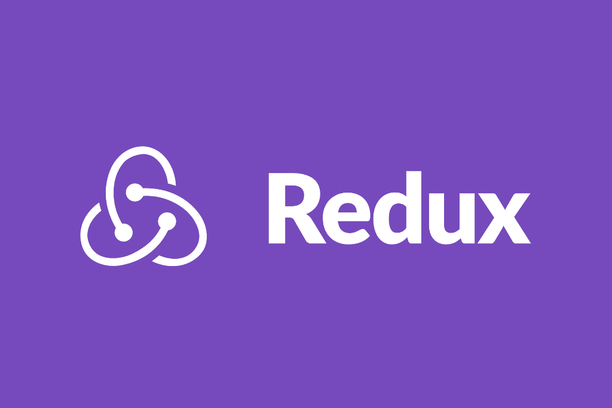

# 如何将 Redux 与 React 一起使用

> 原文：<https://itnext.io/how-to-use-redux-with-react-143de57d0bab?source=collection_archive---------4----------------------->



# **Redux**

Redux 是最流行的状态管理系统之一，它非常容易使用。在开始的时候，redux 的架构可能看起来很复杂，但是当你习惯了之后，在你的应用程序中使用起来会很容易。就个人而言，如果你出于某种原因不喜欢使用 react context 或 mobx，redux 可能是你在 react 应用程序中管理状态的最好工具。

谈论 redux 可能会花很长时间，我会尽量保持简单。

使用 react-props 很容易将一种状态从一个组件传递到另一个组件。如果您在另一个组件中使用它，您可以使用它将组件的状态传递给另一个组件。

【redux 是做什么的？
基本上 Redux 是响应动作发出状态更新的。在 react 应用程序中，我们使用多个组件。在这些组件之间，数据(状态)和功能(动作)需要相互传递。这就是 redux 登场的地方。

您可以这样想，您可以将所有数据和函数存储在一个高阶组件(HOC)中，并从那里访问它的所有状态和操作。

# **Redux 的 3 个主要概念**

Redux 有 3 个主要组件。

*   **商店**
*   **动作**
*   **减速器**

**动作**是将数据从应用程序发送到商店的有效信息负载。您可以使用`[store.dispatch()](https://redux.js.org/api/store#dispatch)`将它们发送到商店

**还原器**响应[发送到商店的动作](https://redux.js.org/basics/actions)改变应用程序的状态。

正如你所猜测的, **Store** 用于保存你的应用程序的所有状态。

*   保存应用程序状态；
*   允许通过`[getState()](https://redux.js.org/api/store#getState)`进入状态；
*   允许通过`[dispatch(action)](https://redux.js.org/api/store#dispatch)`更新状态；
*   通过`[subscribe(listener)](https://redux.js.org/api/store#subscribe)`注册监听器；
*   通过`[subscribe(listener)](https://redux.js.org/api/store#subscribe)`返回的函数处理监听器的注销。


这些是使用 redux 的主要概念。所以让我们开始展示一些例子，以及我们如何使用 **React。**

```
npm install --save reduxnpm install --save react-redux
```

**商店**

让我们创建我们的商店。我添加了他们的 **redux-thunk** 中间件。我现在不会深入研究 redux-thunk，但基本上，它是扩展商店功能的中间件，让您编写与商店交互的**异步逻辑**。

**供应商**

`<Provider />`使得 Redux `store`对任何已经被包装在`connect()`函数中的嵌套组件可用。

**减速器**

在 reducers/index . js**profile**中，为我们在商店中使用的 rootReducer 导入并组合了 reducer。

现在是时候创建 reducer 本身了。这是我们的降剖面仪。当应用程序第一次加载时，它采用初始状态。reducer 将查找动作类型，如果动作像下面的情况那样被分派，它将更新我们的存储状态。

**动作**

这是我们需要在组件中使用的 changeEmail 函数，用于更新存储状态。

在实现了所有这些东西之后，我们将如何在我们的组件中使用它们。

正如你在这里看到的，我们曾经用**连接**来连接我们的组件到商店和我们使用的连接函数内部

**mapStateToProps** 和**mapdispatctoprops**是我们需要用来**向组件传递状态和动作的纯函数。**

正如您所看到的，我们从 actions 导入了 changeEmail 函数来分派事件，并且使用 mapDispatchToProps，我们将它传递到了我们的组件中。

这是 ReactRedux 样板文件的完整报告。

[](https://github.com/hadnazzar/ReactRedux-boilerplate) [## hadnazzar/react redux-样板文件

### 在 GitHub 上创建一个帐户，为 hadnazzar/react redux-boilerplate 开发做出贡献。

github.com](https://github.com/hadnazzar/ReactRedux-boilerplate) 

这就是关于 javascript 中 javascript **Redux 的全部内容**

*如果你觉得这篇文章很有帮助，你可以通过使用我的推荐链接注册一个* [***中级会员来访问类似的文章***](https://melihyumak.medium.com/membership) *。*

***跟我上*** [**推特**](https://twitter.com/hadnazzar)


在 Youtube[上订阅更多](https://www.youtube.com/c/TechnologyandSoftware?sub_confirmation=1)

# 编码快乐！

梅利赫