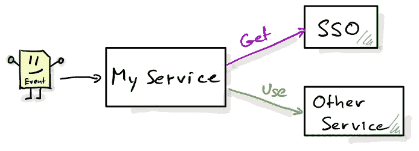

# 如何将请求范围的令牌用于缓存

> 原文：<https://itnext.io/how-to-use-request-scoped-tokens-with-caching-a397ed82998a?source=collection_archive---------2----------------------->

在我从事的一个项目中，我需要从单点登录(SSO)服务器获取令牌，以便能够与另一个服务对话。该令牌的生命周期有限，需要不时刷新。



100000 英尺概述

这里的设置相对简单。理论上*我的服务*甚至可以在每个传入事件上点击 SSO，这在测试时当然是可以的，比如用浏览器点击 http 端点来触发事件。
在生产环境中运行代码时，情况有所不同，因为 a)它给 SSO 服务带来了巨大的负载，而 SSO 服务大多数时候是共享资源。b)每次对 SSO 的调用都会给*我的服务*的用户增加额外的等待时间。

在我运行于 [Quarkus](https://quarkus.io) 的服务内部，我使用 CDI 进一步传递令牌，如下所示

```
@Produces
public Token getToken() {
    Token = sso.getToken(credentials);
}
```

现在，关于 CDI 示波器的问题开始出现了。使用@ApplicationScoped 可以很好地缓存令牌，但是在令牌过期时无法使其失效。另一方面，使用@RequestScoped 会在每次将令牌注入 bean 时调用该方法，因此它是新的，但根本没有缓存。

解决方案是从 CDI 生产流程中间接获取令牌，如下所示:

```
@RequestScoped
@Produces
public Token getToken() {
    Token = getTokenInternal()
}
```

然后使用 Quarkus-Cache 缓存令牌并使其过期:

```
@CacheResult(cacheName = "**token-cache**")
Token getTokenInternal() {
    Token = sso.getToken(credentials);
}
```

通过这段代码，我们告诉 Quarkus 缓存从 SSO 获得的令牌(如果远程调用没有抛出异常)。缓存令牌的时间由 application.properties 中的条目决定:

```
quarkus.cache.caffeine.**token-cache**.expire-after-write=PT120s
```

在这种情况下，缓存中的令牌会在 2 分钟后过期。当然，该值应该随着令牌的到期而调整，并且理想情况下应该稍微短一点，以防止任何竞争情况。

我们可以解析令牌的刷新时间，然后从代码内部调优缓存，但是这个解决方案非常简单，框架完成了所有繁重的工作。

GitHub 上有[的完整代码。](https://github.com/RedHatInsights/notifications-backend/blob/master/common/src/main/java/com/redhat/cloud/notifications/openbridge/BridgeHelper.java#L89-L120)