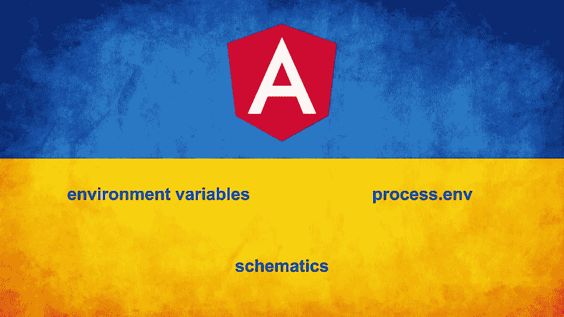

# 如何在 Angular 应用中使用系统环境变量(process.env)？

> 原文：<https://itnext.io/how-to-use-system-environment-variables-process-env-in-angular-application-b9e7104dcc98?source=collection_archive---------0----------------------->

用`@angular/cli`设置的环境变量很棒。除非我们需要向应用程序传递一些我们不想提交给存储库的值。

例如:

*   后端 API URL 是动态的，可以经常更改。
    。如果我们有多个开发环境。
    。在每次部署期间，API URLs 可以是唯一的。
*   我们用的是伐木机。我们想要的只是改变应用程序的日志级别。
    。在这种情况下，我们需要更改我们的`environment.ts`文件中的`LOG_LEVEL`并重新构建。我们不需要将此更改提交给回购。
*   在 CI/CD 流程(管道)中，一些值可以由其他作业提供。
*   以及许多其他使用案例…

要解决它，我们可以找到几种解决方法。

*   使用`fs`库创建/生成动态`environment.ts`文件。
    —需要编写和维护一个脚本，该脚本将实际生成`environment.ts`文件。
*   自定义 webpack 配置。
    —只有当你喜欢玩 webpack 配置时。
*   [@ ngx-env/builder](https://www.npmjs.com/package/@ngx-env/builder)
    —要求对所有环境变量使用`NG_APP_`前缀
*   [ngx-build-plus](https://www.npmjs.com/package/ngx-build-plus) 作者[曼弗雷德·施泰尔](https://medium.com/u/acb3f1945710?source=post_page-----b9e7104dcc98--------------------------------)
    —扩展 Angular CLI 的默认构建行为，不弹出。
    —为您提供一种操作 webpack 配置的简便方法。



在本文中，我想考虑一种使用原生角度功能的方法，比如 builder 和 schematics。

# 天然气处理环境

先说`npm i ng-process-env`

这个库的主要思想是在`angular.json`和相关的`environment.ts`文件中创建一个专用的配置部分。

您可能知道，在每个配置中，都有一个`environment.ts`文件替换的定义:

```
// angular.json
{
  "targets": {
    "build": {
      ...
      "configurations": {
        "myconfig": {
          "fileReplacements": [
            {
              "replace": "apps/myblogs/src/environments/environment.ts",
              "with": "apps/myblogs/src/environments/environment.myconfig.ts"
            }
          ]
        }
      }
    }
  }
}
```

安装之后，我们需要为我们的应用程序创建一个新的配置部分。为此，只需运行`ng generate ng-process-env:process-env --project <projectname> --config <configname>`。
其中`--project`是我们应用程序的名称，`--config`是我们配置的名称。
例如，我们有一个应用程序 **myblogs、**，除了默认配置(*开发*和*生产*)，我们还想添加一个新的应用程序- *部署*。
在这种情况下，我们的命令应该是这样的:`ng generate ng-process-nv:process-env --project myblogs --config deployment`

此命令将对您的代码进行以下更改:

1.  将创建一个新的`environment.deployment.ts`文件。

```
// environment.deployment.ts
export const environment = {
  production: false,
  baseUrl: 'http://localhost:4200',
  envVar: {
    /**
     * Add environment variables you want to retriev from process
     * PORT:4200,
     * VAR_NAME: defaultValue
     */
  }
};
```

2.用新的配置部分`deployment`更新`angular.json`

```
{
  "targets": {
    "build": {
      ...
      "configurations": {
        "production": {
          ...
        },
        "development": {
          ...
        },
        "deployment": {
          "fileReplacements": [
            {
              "replace": "apps/myblogs/src/environments/environment.ts",
              "with": "apps/myblogs/src/environments/environment.deployment.ts"
            }
          ]
        }
      }
    }
  }
}
```

现在我们可以用配置标志
`--configuration deployment`构建/服务我们的应用程序。默认的`environment.ts`文件
将被替换为`environment.deployment.ts`。

# 配置您的配置

此时是向`deployment`部分添加额外所需配置的好时机，或者简单地从`production`配置复制/粘贴。

现在我们需要设置从`process.env`中检索的变量。
打开创建的`environment.deployment.ts`文件，用你需要的变量更新`envVar`部分。

```
// environment.deployment.ts
export const environment = {
  production: false,
  baseUrl: 'http://localhost:4200',
  envVar: {
    endpointUrl: 'http://myapi.com',
    LOG_LEVEL: 'debug',
    version: 0
  }
};
```

# 这是一个构建时间

现在我们准备收集我们的环境变量并构建应用程序(在本地或在 **CI/CD** 期间)。

让我们假设这是我们的环境变量:

```
export endpointUrl='http://otherapi.com'
export LOG_LEVEL='info'
export version=34
```

为了收集变量，我们只需要运行`ng run myblogs:collect-vars`命令。
`environemnt.deployment.ts`文件将改为:

```
// environemnt.deployment.ts
export const environment = {
  production: false,
  baseUrl: "http://localhost:4200",
  envVar: {
    endpointUrl: "http://otherapi.com",
    LOG_LEVEL: "info",
    version: 34 as number
  }
};
```

我们现在需要做的就是用`deployment`配置构建我们的应用程序。
`ng build myblogs — configuration deployment`

# 让我们总结一下

希望有一天`@angular/cli`会原生支持环境变量的使用。可以按照这个[由来已久的特性要求。](https://github.com/angular/angular-cli/issues/4318)

在那之前，你现在知道如何自己做了！

如果你喜欢这篇文章，请按👏拍按钮♾️时报。
在 [Twitter](https://twitter.com/danduh81) 和 [Medium](https://medium.com/@danduh) 上关注我的博客更新。
查看我的[网站](https://danduh.me/)和 [Youtube](https://www.youtube.com/channel/UC6lsCdwzHYQZzudJtKW-00g) 的视频和公开演讲。

请随意提问。

非常感谢你的阅读！