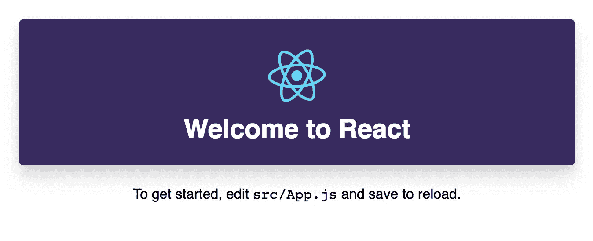

# 如何用 React 使用 Tailwind CSS？

> 原文：<https://itnext.io/how-to-use-tailwind-css-with-react-16e9d478b8b1?source=collection_archive---------1----------------------->

[Tailwind CSS](https://tailwindcss.com/) 是效用优先的 CSS 框架。不像传统的框架，比如 [Bootstrap](http://getbootstrap.com/) 或者 [Foundation](https://foundation.zurb.com/) ，你不会得到默认的主题或者内置组件。相反，Tailwind 为您提供了底层的实用程序类，这使得构建复杂的 UI 组件变得非常容易。



[查看演示](https://landish.github.io/react-tailwindcss-demo/) | [源代码](https://github.com/Landish/react-tailwindcss-demo)

要将 Tailwind 与 [React](https://reactjs.org/) 一起使用，首先让我们用 [create-react-app](https://github.com/facebook/create-react-app) 创建新的 React 应用程序。

```
$ create-react-app react-tailwindcss-demo
```

然后我们需要安装 Tailwind CSS 作为开发依赖。

```
$ cd react-tailwindcss-demo
$ yarn add tailwindcss --dev
```

安装过程完成后，我们需要创建顺风 CSS 配置文件。为此，我们需要运行以下命令:

```
$ ./node_modules/.bin/tailwind init tailwind.js
```

然后我们需要创建顺风 CSS 源文件，**/src/CSS/Tailwind . src . CSS**并编写顺风指令:

```
@tailwind base;
@tailwind components;
@tailwind utilities;
```

然后我们需要在 **package.json** 文件中添加自定义脚本。姑且称之为**顺风:css。**该脚本将从**src/CSS/tailwind . src . CSS .**创建 **src/css/tailwind.css** 文件

```
"scripts": {
  **"tailwind:css":"tailwind build src/css/tailwind.src.css -c  tailwind.js -o src/css/tailwind.css",**
  "start": "**npm run tailwind:css &&** react-scripts start",
  "build": "**npm run tailwind:css &&** react-scripts build"
}
```

> *确定后，你预置* ***启动*** *和* ***构建*** *脚本用* ***顺风:css*** *脚本。*

现在可以运行 **yarn start** 脚本生成 **src/css/tailwind.css** 文件，打开 [http://localhost:3000/](http://localhost:3000) 的 React dev 服务器。

您将在终端中看到以下输出:

```
$ tailwind build src/css/tailwind.src.css -c tailwind.js -o src/css/tailwind.css
Building Tailwind!
Finished building Tailwind!
```

这意味着，Tailwind 成功生成了 css 文件。是时候在 **src/index.js** 中导入了。

```
...
import './index.css';
**import './css/tailwind.css';
...**
```

现在，我们终于可以在 React 应用程序中使用一些来自 Tailwind 的 CSS 类了。

在 **src/App.js** 文件中:

1.将 className=" **App** 改为 className=" **文本中心**。
2。将 className=" **App-header** "改为 class name = "**BG-紫色-较暗 m-6 p-6 圆形阴影-lg** "
3。将 className=" **App-intro** 更改为 className=" **text-base**

您在 **App.js** 文件中的 **render()** 方法应该如下所示:

```
<div className="**text-center**">
  <header className="**bg-purple-darker m-6 p-6 rounded shadow-lg**">
    
    <h1 className="**text-white text-3xl**">Welcome to React</h1>
  </header>
  <p className="**text-base**">
    To get started, edit <code>src/App.js</code> and save to reload.
  </p>
</div>
```

你可以在 Github 查看 [**工作演示**](https://landish.github.io/react-tailwindcss-demo/) 和 [**源代码**](https://github.com/Landish/react-tailwindcss-demo) 。