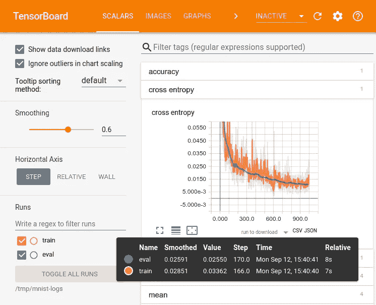
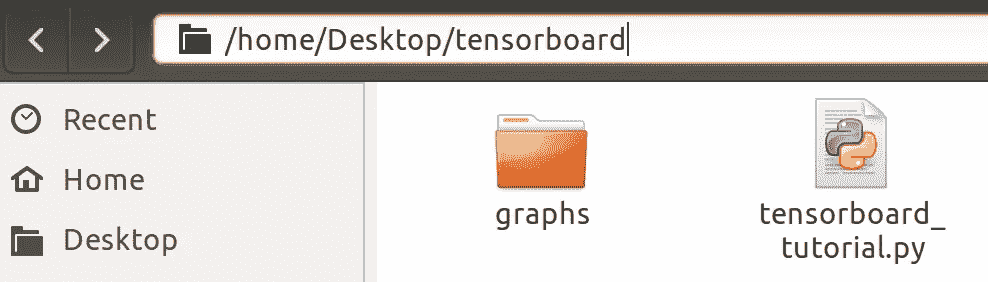
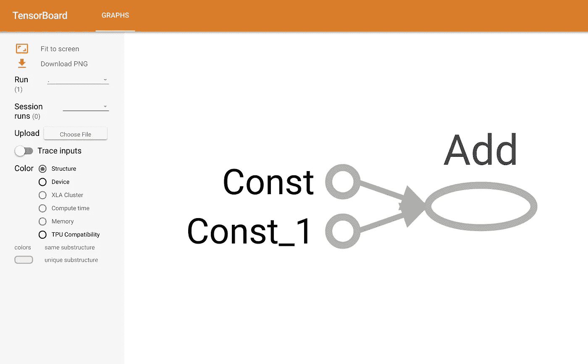
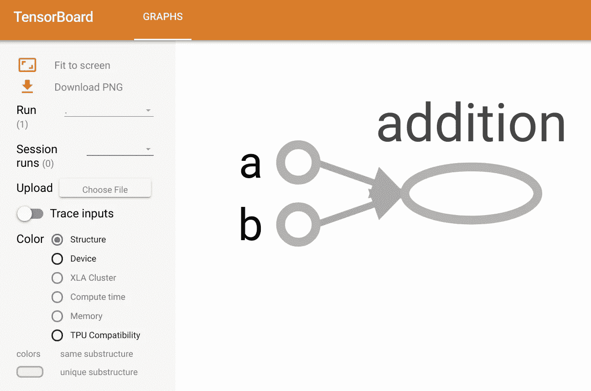
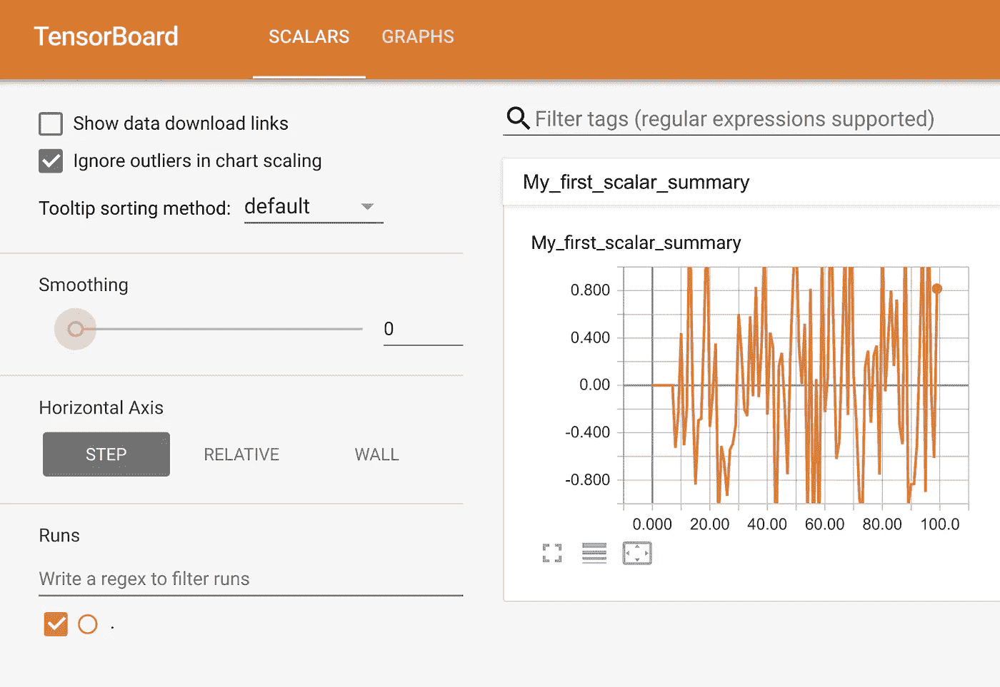
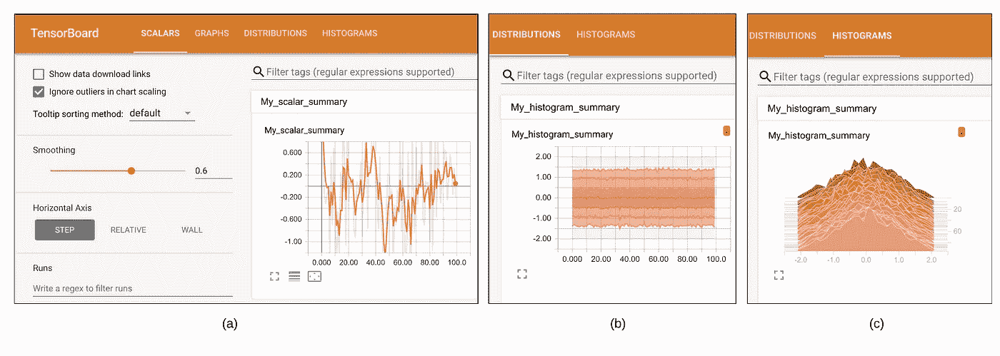
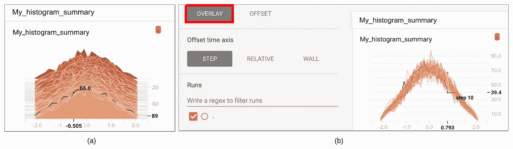
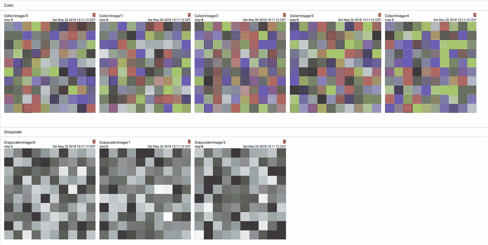

# 如何使用 TensorBoard？

> 原文：<https://itnext.io/how-to-use-tensorboard-5d82f8654496?source=collection_archive---------0----------------------->

TensorFlow 相对于许多其他可用库的两个主要优势是灵活性和可视化。想象一下，如果您可以将代码中发生的事情可视化(在这种情况下，代码代表我们为模型创建的计算图形)，那么深入理解和观察图形的内部工作将会非常方便。不仅如此，它还有助于修复那些不能正常工作的东西。TensorFlow 提供了一种使用 TensorBoard 实现这一点的方法！

**TensorBoard** 是任何标准 TensorFlow 安装都附带的可视化软件。用谷歌的话说:

> “你将在许多事情上使用 TensorFlow 进行计算(如训练大规模深度神经网络)，它们可能会很复杂，令人困惑。为了更容易理解、调试和优化 TensorFlow 程序，我们加入了一套名为 TensorBoard 的可视化工具。”

张量流程序的范围可以从非常简单的问题到超级复杂的问题(使用成千上万的计算)，它们都有两个基本的组成部分，运算和张量。正如前面的教程中所解释的，其思想是创建一个由一组操作组成的模型，将数据输入到模型中，张量将在操作之间流动，直到获得一个输出张量，即您的结果。TensorBoard 为我们提供了一套 web 应用程序，帮助我们检查和理解 TensorFlow 运行和图形。目前，它提供了五种类型的可视化:标量、图像、音频、直方图和图形。

完全配置后，TensorBoard 窗口将类似于:



***图一。*** 张量板出场

创建 TensorBoard 是为了帮助我们理解您的模型中的张量流，以便我们可以调试和优化它。它通常用于两个主要目的:

**1。可视化图表**

**2。撰写总结以可视化学习**

我们将在本教程中介绍 TensorBoard 的主要用法。尽早并经常学习使用 TensorBoard 将使 TensorFlow 的工作变得更加愉快和富有成效。

# 1.可视化图表

虽然功能强大，但张量流计算图可能会变得极其复杂。可视化图形可以帮助我们理解和调试它。这是一个来自 TensorFlow 网站的可视化工作的例子。


***图二。*** 张量流图可视化(来源:张量流网站)

为了让我们的 TensorFlow 程序**被 TensorBoard 激活**，我们需要添加几行代码。这会将张量流操作导出到一个名为**事件文件**(或事件日志文件)的文件中。TensorBoard 能够读取该文件，并给出模型图及其性能的一些见解。

现在让我们写一个简单的 TensorFlow 程序，用 TensorBoard 可视化它的计算图。

## 示例 1:

让我们创建两个常量并将它们相加。常数张量可以简单地用它们的值来定义:

```
**5**
```

为了用 TensorBoard 可视化程序，我们需要编写程序的日志文件。要编写事件文件，我们首先需要使用以下代码为这些日志创建一个**编写器**:

```
**writer = tf.summary.FileWriter([logdir], [graph])**
```

其中**【日志目录】**是我们想要存储那些日志文件的文件夹。我们也可以选择[logdir]作为有意义的东西，比如。/graphs。第二个参数**【图表】**是我们正在编写的程序的图表。有两种方法可以得到图表:

1.  使用 **tf.get_default_graph()** 调用图形，返回程序的默认图形
2.  将其设置为 **sess.graph** ，返回会话的图形(注意，这需要我们创建一个会话)。

让我们在下面的例子中看看这两种方法；然而，第二种方式更常见。无论哪种方式，都要确保仅在定义了图形之后才创建编写器。否则，在 TensorBoard 上可视化的图形将是不完整的。

让我们将作者添加到第一个示例中，并可视化图表。

```
**5**
```

现在，如果我们执行这段代码，TensorFlow 会在您的当前目录(在您的 Python 代码文件旁边)中创建一个包含**事件文件**的目录。



***图 3。*** 创建了包含事件文件的目录

接下来，为了可视化图形，我们需要进入终端并确保当前的工作目录与我们运行 Python 代码的目录相同。例如，这里我们可以使用以下命令切换到目录:

$ CD ~/桌面/tensorboard

然后运行:

$ tensor board-logdir = "。/graphs”—端口 6006

替换。/graphs '与目录的名称，以防您选择将其命名为其他名称。这将在命令行上生成一个链接。控制点击(ctrl+左键)链接以打开 TensorBoard 窗口，TensorBoard 使用 web 浏览器向我们显示可视化效果(或者简单地将其复制到您的浏览器中，或者直接打开您的浏览器并转到 [http://localhost:6006/](http://localhost:6006/) )。该链接会将我们引导到 TensorBoard 页面，它应该类似于:



**图 4*。*** TensorBoard 页面可视化示例 1 中生成的图形

上图中的图表向我们展示了模型的各个部分。图中的“Const”和“Const_1”对应 a 和 b，节点“Add”对应 c，代码中给出的名称(a、b、c)只是 **Python-names** ，它们只是在编写代码时帮助我们进行访问。这些名称对 TensorFlow 和 TensorBoard 没有任何意义。为了让 TensorBoard 理解我们的操作的名称，我们必须明确地命名它们。

让我们再修改一次代码来添加名字:

```
**5**
```



**图五*。*** TensorBoard 页面，可视化示例 1 中生成的带有修改名称的图形

***注意:**如果我们用同一个[logdir]多次运行我们的代码，那么在我们的[logdir]中将会生成多个事件文件。TF 将只显示图形的最新版本，并显示多个事件文件的警告。可以通过删除我们不再需要的事件文件来删除警告，或者我们可以将它们保存在不同的[logdir]文件夹中。

# 2.写总结来形象化学习

到目前为止，我们只关注如何在 TensorBoard 中可视化图形。还记得 TensorBoard 在文章前面提到的其他可视化类型吗(标量、图像和直方图)。在这一部分中，我们将使用一个称为 **summary** 的特殊操作来可视化模型参数(如神经网络的权重和偏差)、度量(如损失或精度值)和图像(如网络的输入图像)。

**Summary** 是一个特殊的操作 TensorBoard，它接受一个常规张量并将汇总的数据输出到你的磁盘(即在事件文件中)。基本上，有三种主要类型的摘要:

**1。tf.summary.scalar:** 用于写入单个标量值张量(如分类损失或精度值)

**2。tf.summary.histogram:** 用于绘制非标量张量所有值的直方图(可用于可视化神经网络的权重或偏差矩阵)

**3。tf.summary.image:** 用于绘制图像(如网络的输入图像，或自动编码器或 GAN 生成的输出图像)

在接下来的部分中，让我们更详细地看一下上面提到的每一种汇总类型。

# 2.1.tf.summary.scalar:

它是用来写一个随时间或迭代而变化的标量张量的值。对于神经网络(例如用于分类任务的简单网络)，它通常用于监控损失函数或分类精度的变化。

让我们运行一个简单的例子来理解这一点。

## 示例 2:

从标准正态分布 *N(0，1)* 中随机选取 100 个值，并一个接一个地绘制它们。

一种方法是简单地创建一个变量，从正态分布(mean=0，std=1)初始化它，然后在会话中运行一个 for 循环，初始化 100 次。代码如下，代码中解释了编写摘要所需的步骤:

```
**Done with writing the scalar summary**
```

让我们拉起 TensorBoard 并检查结果。像以前一样，您需要打开终端并键入:

$ tensor board-logdir = "。/graphs”—端口 6006

此处*”。/graphs"* 是我们保存事件文件的目录名。在 TensorBoard 中，我们发现一个名为**“标量”**的新选项卡，紧挨着前面讨论过的**“图形”**选项卡(比较图 5 和图 6)。整个窗户看起来像:



***图六。*** TensorBoard 页面可视化书写的标量摘要。

在图中，绘图面板的名称为“My_first_scalar_summary ”,与我们在代码中定义的名称相同。x 轴和 y 轴显示了 100 步和相应的值(来自标准法线距离的随机值。)的变量。

# 2.2.tf.summary .直方图:

如果我们想观察一个值随时间或迭代的变化，直方图就派上了用场。它用于绘制非标量张量值的直方图。这为我们提供了张量值的直方图(和分布)如何随时间或迭代而变化的视图。在神经网络的情况下，它通常用于监控权重和偏置分布的变化。这对于检测网络参数的不规则行为非常有用(例如，当我们的权重异常爆炸或收缩时)。

现在让我们回到前面的例子，并添加直方图总结。

## 示例 3:

继续前面的示例，添加一个大小为 30x40 的矩阵，其条目来自标准正态分布。将该矩阵初始化 100 次，并绘制其条目随时间的分布图。

```
**Done writing the summaries**
```

在 TensorBoard 中，顶部菜单增加了两个新标签:“分布”和“直方图”。结果将如下所示:

在 TensorBoard 中，顶部菜单增加了两个新标签:“分布”和“直方图”。结果将如下所示:



**图 7*。*** (a)标量汇总，(100 步内 2D 张量值的分布和直方图

在图中,“Distributions”选项卡包含一个图，该图显示了张量值(y 轴)到步长(x 轴)的分布。你可能会问什么是浅色和深色？

答案是图表上的每一条线代表数据分布中的一个百分点。例如，最下面的线(非常浅的那条)显示了最小值是如何随着时间变化的，中间的线显示了中值是如何变化的。从上到下阅读，各行有如下含义:[最大值，93%，84%，69%，50%，31%，16%，7%，最小值]

这些百分位数也可以被视为正态分布的标准偏差边界:[最大值，μ+1.5σ，μ+σ，μ+0.5σ，μ，μ-0.5σ，μ-σ，μ-1.5σ，最小值]，因此从内向外读取的彩色区域分别具有宽度[σ，2σ，3σ]。

类似地，在直方图面板中，每个图表显示数据的时间“切片”，其中每个切片是给定步骤中张量的直方图。它的组织结构是最旧的时间步长在后面，最近的时间步长在前面。

您可以在任何步骤轻松监控直方图上的值。只需在图上移动光标，查看直方图上的 x-y 值(图 8 (a))。您也可以将直方图模式从“偏移”更改为“叠加”(见图 8- (b))，以查看相互叠加的直方图。



***图 8。*** (a)直方图上的监控值，(b)重叠直方图

正如代码中提到的，我们需要运行每个摘要(例如**sess . run(【scalar _ summary，histogram _ summary】)**)，然后使用我们的 writer 将每个摘要写入磁盘。在实践中，我们可以使用任意数量的汇总来跟踪模型中的不同参数。这使得运行和编写摘要的效率非常低。解决方法是合并图表中的所有摘要，并在您的会话中立即运行它们。这可以用 **tf.summary.merge_all()** 方法来完成。让我们将其添加到示例 3 中，代码更改如下:

```
**Done writing the summaries**
```

# 2.2.tf.summary.image:

顾名思义，这种类型的总结用于将张量写成图像并可视化。在神经网络的情况下，这通常用于跟踪输入到网络的图像(比如每一批)或输出中生成的图像(比如自动编码器中的重建图像；或者由生成性广告系列网络的生成器模型产生的假图像)。然而，一般来说，这可以用来绘制任何张量。例如，我们可以将大小为 30x40 的权重矩阵想象成 30x40 像素的图像。

可以使用以下方式创建图像摘要:

```
**tf.summary.image(name, tensor, max_outputs=3)**
```

其中 **name** 是生成的节点(即操作)的名称，tensor 是要作为图像摘要写入的所需张量(我们稍后将讨论其形状)，max_outputs 是从 **tensor** 生成图像的最大元素数。但是……这意味着什么呢？答案在于**张量**的形状。

我们提供给 tf.summary.image 的**张量**必须是形状为**【batch_size，height，width，channels】**的四维张量，其中 batch _ size 是批中图像的数量，高度和宽度决定图像的大小，最后，通道是:1:对于灰度图像。3:适用于 RGB(即彩色)图像。4:对于 RGBA 图像(其中 A 代表α；参见 [RGBA](https://en.wikipedia.org/wiki/RGBA_color_space) 。

让我们看一个非常简单的例子来理解它的基本思想。

## 示例 4:

让我们定义两个变量:

1.  大小为 30x10 的 3 个**灰度**图像大小为 10x10
2.  尺寸为 50x30 的 5 张**彩色**图像尺寸为 10x10

并在 TensorBoard 中将它们绘制成图像。

```
**Done writing the summaries**
```

现在像以前一样打开 TensorBoard，切换到**图像**选项卡。图像应该类似于:



***图 9。*** 在张量板上生成图像

我们同样可以将任何大小的任何其他图像添加到我们的摘要中，并在 TensorBoard 中绘制它们。

感谢阅读这篇几乎很长的教程。在下一个教程中，我将运行一个简单的神经网络，并使用 TensorBoard 可视化它的图形和性能。

这是我在 Medium 上的第一篇文章。所以请不要犹豫，用你的掌声鼓励我，并通过在下面留下评论给我你的反馈。