# 如何使用 Terraform 创建小规模云基础架构

> 原文：<https://itnext.io/how-to-use-terraform-to-create-a-small-scale-cloud-infrastructure-abf54fabc9dd?source=collection_archive---------0----------------------->


# 介绍

本教程给出并描述了如何使用软件 Terraform 创建各种类型的云基础设施的说明，即基础设施即服务(IaaS)、平台即服务(PaaS)和软件即服务(SaaS)，并使用这些方法来帮助读者了解更多关于 Terraform 和云技术的使用。

本教程文档将为任何不了解 Terraform 和一些云技术，但有兴趣在小规模测试环境中学习更多相关知识的人提供一步一步的指导。

本教程主要面向 IT 学生，将只提供安装、配置和使用 Terraform 所需的最相关的知识，以及侧重于实际解决方案和基准测试的用例。所有这些都要记住，它应该保持对读者的可访问性，以及在学习 Terraform 时要遵循的直观步骤。

如前所述，本指南将涵盖三种类型的云。这将通过使用虚拟机管理程序和服务提供商来实现。本指南将使用以下三个应用程序编程接口:

1.面向 IaaS 的基于内核的虚拟机(KVM)管理程序

2.面向 PaaS 的 Docker 容器平台

3.SaaS 的 Azure 云服务提供商

**目录**

1.[简介](#41cb)

2.[语境](#1795)

第 2 章将提供所有使用的软件的背景。这将描述一些关于 Terraform 和服务提供商的信息，这些信息将用于创建小规模的云基础架构。此外，关于云技术和编排软件的解释将在这里找到。

3.[先决条件](#7292)

将描述一些硬件要求，其中一些是复制指令的先决条件，一些是使某些任务更容易完成的建议。

4.[下载并安装 Terraform](#d791)

给出了在您的系统上安装 Terraform 的必要说明。在我们的例子中，我们使用的是 Ubuntu 18.04。

5.[创建您的第一个 Terraform 项目](#ab32)

本章是一个简单的配置示例，打印“hello world”来验证安装。此外，这里将讨论更多关于 Terraform 语法的用法和资源生命周期管理的功能。

6.[为 libvirt 安装 KVM 和 terra form provider](#407c)

7.[使用 Terraform 和 KVM 创建虚拟机](#e6ed)

8.[供应和编排](#73cd)

第 6 章到第 8 章介绍了通过 Terraform libvirt provider 使用 Linux KVM hypervisor 部署一个示例 SaaS 项目“PiCalc”。此示例还演示了使用多个虚拟机实现负载平衡的方法。

9.[为 docker 安装 Docker 和 Terraform provider】](#debd)

第 9 章将介绍 docker provider 插件的安装，该插件是使用 Go 从源代码中构建的。

10.[使用 Terraform 部署 Docker 示例](#6a3a)

第 10 章演示了通过 Docker provider 提供的容器中示例项目的部署。

11.[为 Windows 安装 Azure CLI 和 Terraform】](#8c22)

12.[使用 Terraform 在 Microsoft Azure 上提供功能应用](#9c85)

第 11 到 12 章将介绍官方平台 Azure 提供者的安装和使用。本章旨在展示 Terraform 提供的远程配置功能，其中相同的典型项目将作为功能应用程序进行部署。

13.[故障排除](#bf8f)

14.[参考书目](#646c)

# 语境

[返回目录](#29e6)

本章将介绍本指南中使用的软件。本章的目标是提供关于软件的基本信息以及云技术的一般含义。所描述的软件主要用于创建和供应虚拟机和容器。在本指南中，它们将用于演示 Terraform 的一些功能和能力。

**云技术** 

如*中所述。T21 格兰斯。t，云计算的 NIST 定义 p2–3”，2011a)* 云计算的定义是:

*云计算是一种支持对可配置计算资源(例如，网络、服务器、存储、应用程序和服务)的共享池进行无处不在、方便、按需的网络访问的模型，可配置计算资源可通过最少的管理工作或服务提供商交互来快速供应和发布。这个云模型由五个基本特征、三个服务模型和四个部署模型组成。*

这需要从存储和计算服务到数据库、网络、软件和分析服务*(“微软——什么是云计算”，2019a)* 。
这些技术可以通过灵活的按需服务流提供给用户/客户。
像这样的技术需要技术配置才能实现功能，并且可以根据特定需求进行精确设置。组合和配置云技术将产生一个功能齐全的云基础设施，最终服务于客户/用户。

作为未来的系统工程师，您将在通过配置实现云基础设施的过程中扮演重要角色。

**Terraform** Terraform 是一款软件，可以帮助用户使用代码*(“hashi corp，Introduction — Terraform”，2019a)* 。这可以在许多流行的云服务上完成，如亚马逊 Web 服务或微软 Azure 服务。然后，可以在选择的服务上构建和管理不同类型的云基础架构。

Terraform 可以使用所谓的“ *Provider* ”插件与各种 API 进行交互。这些提供者是 Terraform 和上述 API 之间的中间人。Terraform 可用于管理所述 API 的各种创建的'*资源'*'的生命周期。资源可以是所有类型的虚拟设备，但也可以是简单的文件或目录。在下图(图 1)中，可以找到 Terraform 软件的插图，其目的是显示提供商与其资源之间的关系，以及 Terraform 如何管理生命周期以及这些资源的创建和销毁。

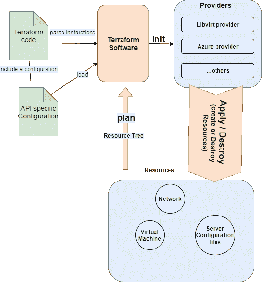

*图 1 — Terraform 软件基于:(“HashiCorp，带 Armon Dadgar 的 HashiCorp Terraform 简介”，2018a)*

为了运行 Terraform 软件，执行命令 ***terraform init*** 。该命令将在当前目录中搜索 Terraform 配置文件并读取它们。这些文件的扩展名是。tf。根据配置，它将搜索所使用的提供者。如前所述，Terraform 可用于管理资源。Terraform 可以通过创建一个资源树来实现这一点，该树描述了它们所依赖的资源。该树是在调用命令 ***地形图*** 时创建的。该命令的结果是对基础设施中将改变(创建或破坏)什么地形的描述。这棵树保存在目录**中 *terraform init* 中**是调用自，否则表示当前目录。要应用更改，使用命令 ***地形应用*** 。这将把配置发送给相应的提供者，以创建代码中定义的资源。然后，用户可以决定他想要在基础设施中改变什么，主要是通过添加代码，并再次运行 *terraform apply* 命令。移除一个基础设施 ***可以称为摧毁*** 。当某个资源要从基础结构中完全删除，或者需要进行重大更改时，这是一个要求。

用户可以对 Terraform 必须构建和管理的基础设施进行编程。这些配置可以用两种格式编写:HashiCorp 配置语言(HCL)或 JavaScript 对象符号(JSON)。HCL 是 HashiCorp 创建的语言，它对机器友好，但易于人类阅读，并将在本文档中使用。它深受 nginx 类型配置*(“HashiCorp，README.md — HCL 是 hashi corp 配置语言”，2019b)* 。

Terraform 主要从命令行使用，也有可能从 GUI 运行 Terraform。但是这些仍处于早期阶段，还不是很容易获得。Terraform 的一个示例 GUI 工具是 Terraform UI*(“glitter labs，terra form UI”，2019a)* 。

**基于内核的虚拟机(KVM)，QEMU 和 Libvirt** KVM 是一个面向 Linux 系统的开源虚拟化系统*(“red hat，KVM 是什么？”，2019a)* 。它是一个虚拟机管理程序，可用于创建虚拟化的硬件加速虚拟机。它可以使用内置的 QEMU 硬件仿真器来仿真处理器，从而实现这一点。QEMU 和 KVM 都使用配置语言 XML 进行配置，*(“lib virt，KVM/QEMU hypervisor driver”，2019a)* 当必须配置许多虚拟设备时，这可能会成为一项繁琐的任务。通常，KVM/QEMU 与一个名为 libvirt 的虚拟化库一起使用。Libvirt 是一个应用程序用户界面，可用于管理 KVM，并可从所有类型的编程语言(如 Python、C#、Go 和许多其他语言)访问。它的一个非常有用的工具是命令行界面，称为“virsh”*(“lib virt，虚拟化 API”，2019b)* 。该工具用于从命令行调用 libvirt API。

Terraform-provider-lib virt
terra form-provider-lib virt 是 terra form 的提供者，用于为虚拟机创建资源。提供者由 Duncan Mac-Vicar P 开发，该软件可在 Github*(“Duncan Mac-Vicar p .，dmacvicar/terraform-provider-lib virt”，2019a)* 。使用 terraform-provider-libvirt 插件，可以从 terraform 代码中访问 libvirt 库，并用于创建和管理各种虚拟机及其计算资源。

**Docker** Docker 是一款在操作系统级虚拟化上提供平台即服务软件的软件。可视化实例被称为容器，基本上是多个软件库和依赖项的包，以便应用程序可以在不同的环境中可靠地运行*(“Docker，什么是容器？”，2019a)* 。许多流行的组织利用容器来完成不同类型的任务。这主要是因为 docker 容器非常轻量级，将减少基础设施所需的管理和开发量*(“Docker，为什么是 Docker？”，2019b)。*一个例子是 PayPal 使用容器管理每秒需要处理的 200 笔交易*(“Docker，PayPal 与 Docker Enterprise 的用例”，2019c)* 。

**Terraform-Provider-docker** 面向 docker 的 terra form 提供商使用 Docker API 来管理容器的图像、网络和生命周期*(“哈希公司，Docker 提供商”，2019c)* 。此外，可以在代码中使用 docker 编排平台 docker swarm 来创建 docker 服务和多个容器池。这些服务可用于部署易于扩展、更新或替换的应用服务。可以在 GitHub 中找到这个提供者，它是由 Terraform 社区开发的。

**Azure** 微软 Azure 是众所周知的云计算服务。它提供不同云服务的使用，包括那些用于计算、分析、存储和网络的服务*(“微软，什么是 Azure”，2019b)* 。我们主要通过 Azure 来使用它，因为可以创建一个学生帐户。学生可以使用“Azure for Students”，他们将获得€100，000 信用点来购买 Azure 资源。

**terra form-Provider-Azure m** terra form 微软 Azure provider 使得在你的订阅内部署和更改资源成为可能*(“HaschiCorp，Azure Provider”，2019d)* 。运行 Terraform 时，将自动下载该提供程序。它不是像 libvirt 那样的第三方提供程序，提供程序必须单独下载。提供者可以通过使用名为 Azure CLI 的工具进行身份验证来访问 Azure 用户*(“HaschiCorp，Azure Provider:Authenticating using the Azure CLI”，2019e)* 。

**示例架构** 为了说明我们将在本教程中使用的所有提供者的有用比较和概述，本教程中显示了各种架构图，以给出理论示例。此外，虚拟化和地形的基础知识也将得到阐述。

这些图是通过由开放组架构框架*(“开放组，欢迎使用 ArchiMate 3.0.1 规范，一个开放组标准”，2019a)* 提供的 Archimate 建模语言创建的。这是一种开源建模语言，被世界各地的行业和大学所使用，以其通用性和易用性而闻名*(“开放集团，Archi 开源 ArchiMate 建模”，2019b)* 。

在第一个图(图 2)中，显示了一个基本设置，其中从主机操作系统环境使用 Libvirt 虚拟化，从而提供 KVM 功能，提供更快和优化的 PC 硬件寻址。

留意下面的建筑。这是一个示例架构(图 2 ),说明了在主机上运行的 KVM 虚拟化；在本指南的上下文中，您自己的笔记本电脑或台式机。

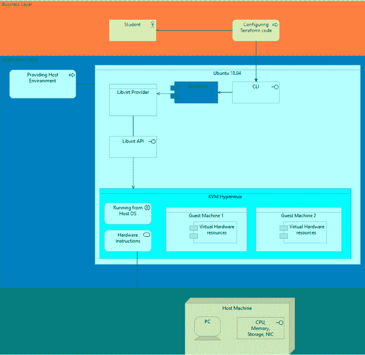

*图 2 —在 PC 上运行的基本架构 KVM(由 Archi 制造)*

用户(学生)使用 Terraform 代码在主机内创建基础设施。此代码包含创建和配置新虚拟机所需的数据。在提供者的帮助下，Terraform 可以用来调用 libvirt 虚拟化 API，Terraform 可以在前面提到的 terraform-provider-libvirt 插件的帮助下做到这一点。然后，libvirt API 将对 KVM hypervisor 进行函数调用，KVM hypervisor 可以分配所需的资源来支持新机器。它提供了一个抽象层，机器可以在这个抽象层上运行不同种类的操作系统。虚拟系统的硬件指令通过 QEMU 硬件仿真器翻译。它通过转换指令来实现这一点，以便可以在不同的处理器上运行。QEMU 还可以模拟各种设备，比如网络和 USB。

# 3.先决条件

[返回目录](#29e6)

为了能够准确地遵循本文档中描述的说明，满足本章中描述的要求非常重要。可以从下面描述的要求中推导出来，但是在本文档中找不到所用软件的其他发行版和/或版本的说明。

希望读者对 GNU/Linux CLI 有一个基本的了解。

本文档中描述的指令都是在使用 VMware Workstation Player 15 创建的虚拟机上进行的**测试。在本文中，包含 Terraform 的虚拟机(VM)将被称为“*主机*”。在 VirtualBox 主机上，甚至直接在物理“裸机”主机上也应该可以遵循这些说明，但我们没有对此进行测试。在这两种情况下，无论是在物理机上运行还是在虚拟机上运行，它都将被称为"*主机"*，因为这是 Terraform 将在其上运行的机器。这主要是为了防止文档后面出现混乱。为了清楚起见，请注意下图(图 3)。假设您的“您的电脑”是运行 VMware 的 Linux 或 Windows 操作系统。在 VMware 上，我们创建了称为“主机”的机器。我们这样命名是因为我们将使用 Terraform 来创建各种虚拟机或其他虚拟设备，我们将称之为“来宾机”。**

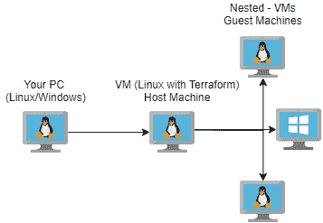

*图 3 —嵌套虚拟机(使用 draw.io 创建)*

主机使用的 OS 是 **Ubuntu 18.04.3 仿生 64 位**。选择这个版本是因为它是 Ubuntu 的长期支持(LTS)发行版，并且将主要在 Terraform 将被长期使用时使用。另一个原因是本文中使用的许多软件包都有稳定的 ubuntu 版本。

**系统规格** 这些是**您的电脑的最低规格**:

> 8 GB RAM
> 64 位处理器，带 4 个 vcore
> 200 GB 存储

这些是我们用于**主机**的推荐规格:

> 4 GB RAM
> 64 位处理器，带 4 个 vcore
> 60gb 存储

如果可能，具有更多 vCores 的更快 CPU 将显著加快 Terraform 工作流的速度。强制性要求是支持硬件/嵌套加速虚拟化的**CPU**(需要英特尔 VT-x 或 AMD-V)。这需要能够在我们的主机中高效地创建新的虚拟机。**如果指南在虚拟机内完成，则需要嵌套虚拟化**。可以在裸机 Ubuntu 机器上测试对适当 CPU 指令的支持，如下所示:

```
$ lscpu | grep Virtualization
```

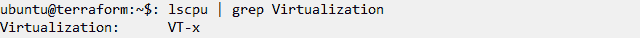

我们的物理机(**您的 PC** )基于英特尔，我们完全支持硬件加速虚拟化。AMD 机器将显示 AMD-V。如果物理机器不支持加速和嵌套虚拟化，则输出为空白。

**如果您的电脑使用 64 位 Windows 8 或 10**，VMWare Workstation 中的嵌套虚拟化应该已经可以访问。

**如果您的 PC 使用 GNU/Linux 机器**，我们必须指示物理机器上的 KVM(虚拟机管理程序)为我们启用嵌套虚拟化(仅适用于 VT-x 或 AMD-V)。确保所有其他虚拟机都已关闭，然后启用并验证支持，如下所示:

```
$ sudo rmmod kvm-intel && sudo modprobe kvm_intel nested=1$ cat /sys.module/kvm_intel/parameters
```

如果物理机有 AMD CPU，用 kvm_amd 替换 kvm_intel。

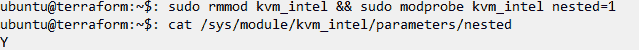

如果输出显示“Y”或“1”，则可以安全地继续使用指南

# 4.下载和安装 Terraform

[返回目录](#29e6)

本章描述了如何在 Linux 主机系统上下载和安装 Terraform。该软件将从 Terraform 的官方网站下载:

> [***www.terraform.io/***](http://www.terraform.io/)

下载的文件是一个 zip 文件。要解压缩该文件，需要一个名为 unzip 的程序。生成的文件是一个独立的可执行文件。然后这个文件将被移动到 *'/usr/local/bin'* 目录，这样程序就可以在整个系统中被广泛调用。

我们还制作了第一个提供商 KVM 的视频。在每一章你都会找到一段视频，视频中有该章的确切链接。

1.转到[***www.terraform.io/***](http://www.terraform.io/)并点击下载 CLI，下载用于 Linux 64 位的 Terraform。

2.按下下载按钮后，会出现一个标签。点击保存文件。默认情况下，该文件将保存在' *~/Downloads/'* 目录下。

**解压下载安装 Terraform** 文件需要解压后才能使用。这将使用不会自动安装的 unzip 程序来完成。

1.启动控制台

2.使用以下命令安装 unzip

```
$ sudo apt install unzip
```

3.进入下载文件夹，使用下面的命令提取下载的文件。这将在下载目录中提取一个名为 terraform 的可执行文件。

```
$ cd ~/Downloads/$ unzip terraform_0.12.12_linux_amd64.zip
```

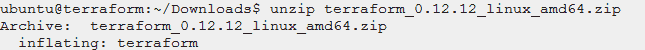

**测试安装** 将“*terra form”*移动到一个名为*“/usr/local/bin”*的用户程序目录下。此目录是为用户安装的软件保留的。此操作将使您可以从系统中的任何目录运行 Terraform。

1.将未归档的可执行文件移动到 *'/usr/local/bin'* 。这个目录是普通用户运行 terraform 的地方。放置*‘terra form’*可执行文件将使得从系统的任何地方调用它成为可能。这是可能的，因为目录自动具有路径导出。

```
$ sudo mv terraform /usr/local/bin/terraform
```

2.通过运行以下命令测试 terraform 是否安装正确。如果输出了 terraform 的版本，那么这意味着可执行文件被正确链接并且可以被找到。

```
$ terraform -v
```


# 5.创建您的第一个 Terraform 项目

[返回目录](#29e6)

本章描述了如何建立一个简单的 Terraform 项目，其中一个小的测试代码将用于测试 Terraforms 的功能。该测试配置将打印*‘hello world’*。之后，我们将通过一个管理文件的简单示例来讨论如何使用 Terraform 来管理基础设施。本章的目的是安装和测试 Terraform，以显示它的一些代码语法和用法。

本章描述了如何建立一个简单的 Terraform 项目，其中一个小的测试代码将用于测试 Terraforms 的功能。该测试配置将打印*‘hello world’*。之后，我们将通过一个管理文件的简单示例来讨论如何使用 Terraform 来管理基础设施。本章的目的是安装和测试 Terraform，以显示它的一些代码语法和用法。

1.创建一个新目录并进入该目录。这个目录是我们放置创建新基础设施所需的配置文件的地方。

```
$ mkdir ~/terraform_project/$ cd ~/terraform_project/
```

2.使用下面的命令初始化 Terraform 项目。这将使 terraform 搜索扩展名为'**'的配置文件。在它被调用的目录中。在这种情况下，目录为 *'~/terraform_project/'* 。此外，这将在我们的工作空间中生成一些隐藏文件，Terraform 将使用这些文件来保存和更改基础架构。**

```
$ terraform init
```

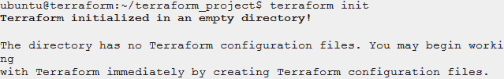

**创建新的 Terraform 配置
本节介绍 Hashicorp 脚本语言的部分语法，该语言用于创建 Terraform 代码。将创建一个 terraform 配置文件，并使用该文件打印“ *hello world* ”。之后，您将学习如何读取文件。这对以后加载配置文件很有用。**

1.进入项目，使用您最喜欢的编辑器创建一个新文件。为了让 terraform 识别新的配置文件，该文件必须有一个'**。tf** 扩展名。

```
$ nano test.tf
```

2.将下面的代码复制粘贴到打开的文件中并保存。请注意，该语法需要如下所示放置的花括号。这也称为范围。代码将以字符串的形式输出“文本”的值。输出后面的引号表示*“text”*可以根据用户的喜好进行修改，如果在代码中没有提前定义的话。

```
output “text” {
 value = “hello world”
}
```

3.初始化项目后，使用新配置运行 terraform。输出应该与下面的输出相同。

```
$ terraform apply
```

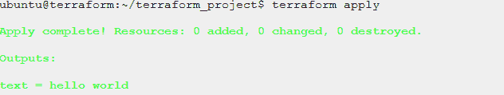

4.也可以读取文件。通过编辑 **test.tf** 文件并添加下面的代码来实现。这段代码将从给定的路径中读取一个文件，并将其内容作为字符串输出。使用花括号中的`***file(“/example_path/”)***` 函数读取内容。该函数需要路径。正如您在下面看到的，它期望我们的项目工作区中有一个文件。注意 ***${}*** 用于调用字符串内的函数。在这种情况下，它是一个返回路径到 **test.tf** 文件目录的函数。除了这些功能，请注意标签( **#** )。这用于在代码中编写注释，在运行代码时会被否定。

```
# test.tf
output “text” {
 value = file(“${path.module}/text.txt”)
}
```

5.保存 ***test.tf*** 文件，并创建需要读取的 ***text.txt*** 文件。确保添加文本并保存该文件。

```
$ nano ~/terraform_project/text.txtOutput: Hello world from text
```

6.再次运行以下命令查看输出。

```
$ terraform apply
```

**使用 Terraform 管理资源** 如本文所述，Terraform 用于管理云基础设施的各种资源的生命周期。资源是节点，可以是存储磁盘、虚拟机、网络接口等等。在本节中，我们将假设文件是我们想要管理的资源。通过使用 Terraform 创建和销毁文件，我们可以了解更多关于 Terraform 的使用。

Terraform 代码中的资源编写如下:

```
resource **“<resource_type>” “<resource_name>”** {
}
```

`“<*resource_type>”*` 对应于必须由某种提供者提供的资源类型。因为我们还没有提供者，所以我们将使用类型为`*“null_resource”*`的资源。此资源类型对应于“空”提供程序，并且是自动安装的。这使得 Terraform 能够跟踪未知对象的生命周期(“HashiCorp，Null Resource”，2019f)。“< *资源名称* >”是用户自定义的名称。该名称在代码范围内必须是唯一的。假设它被称为`“*node1*”`，那么这将意味着不存在其他类型为`“*null_resource*”`且名称为 `“*node1*”`的资源。

我们将使用上面的描述来创建一个简单的示例资源，该资源使用本地供应器来创建文件。这些功能使我们能够从代码中调用主机中的命令。

1.进入项目

```
$ cd ~/terraform_project/
```

2.编辑 *test.tf* 文件。在这个文件中，我们将定义一个新的资源。

3.移除文件中的任何其他现有代码。将下面的代码添加到文件中。这将使创建资源成为可能。

```
# test.tf
resource **“null_resource” “node1”** {
 # add provisioners here
}
```

4.现在已经可以运行 Terraform 了，但是这当然除了管理一个`“*null_resource*”`之外什么也不会做。为了使其有用，我们将添加置备程序。在“**# add provisioners here”**下添加以下代码，使其在`“*node1*”`的范围内。进行下一步解释。

```
# add provisioners here
 provisioner **“local-exec”**{
 command = “echo >> ${path.module}/node1.txt”
 }provisioner **“local-exec”**{
 command = “rm ${path.module}/node1.txt”
 when = destroy
 }
```

5.现在添加了两个本地置备程序。如前所述，这些函数用于在主机上执行命令。这里使用的`‘provisioner’` 函数属于`“local-exec”` **类型。**它期待一个将在解释器上运行的命令，在 ubuntu OS 上默认为`**‘/bin/sh’**`。在本例中，第一个函数运行一个命令，在我们的' *test.tf'* 文件的目录中创建一个名为' *node1.txt* 的新文本文件，第二个函数运行一个命令，从调用它的目录中删除一个名为' *node1.txt* 的文件。请注意，只有在调用 Terraform destroy 时，才会调用第二个函数。这是用`‘when = destroy’`配置的

6.保存文件并运行`“*terraform init*”`。您将在输出中看到，Terraform 将搜索提供者“ *null* ”来创建类型“ *null_resource* ”，因为我们之前没有在项目中安装它。

```
$ terraform init
```

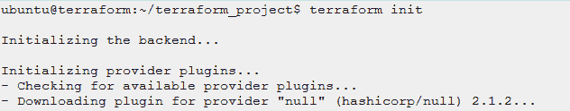

7.用`“*terraform apply*”`应用地形配置。您将看到一个新的资源将被添加。键入' *yes'* 确认这一点。

```
$ terraform apply
```

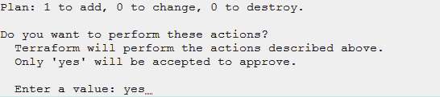

8.现在，使用下面的命令在项目目录中搜索创建的文件“ *node1.txt* ”，以验证文件的创建是否成功。该命令还会列出一些其他文件和一个隐藏目录。这些项目`(**.terraform/, terraform.tfstate and terraform.tfstate.backup**)` 被 Terraform 用来管理资源的生命周期。删除这些将导致 Terraform 不知道创建了哪些资源，这意味着如果需要，您必须手动删除所有资源。

```
$ ls -al ~/terraform_project/
```

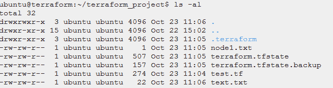

9.最后，使用`‘*terraform destroy’*`摧毁资源。您会看到有一个资源被标记为销毁。键入*‘yes’*确认销毁。

```
$ terraform destroy
```

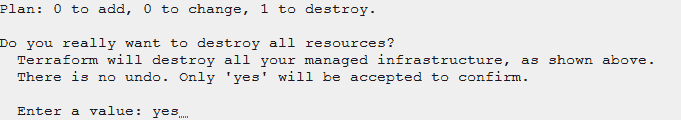

在本章中，您学习了如何使用 Terraform 来管理单个资源。当需要配置的多个资源开始发挥作用时，Terraform 代码最有用。此外，本章没有使用实际的资源提供者。在从现在开始的章节中，用 Terraform 创建和破坏基础设施的概念会被大量使用。

# 6.正在为 libvirt 安装 KVM 和 Terraform 提供程序

[返回目录](#29e6)

现在已经安装了 Terraform，并且已经完成了一些测试。可以采取进一步的步骤来调配虚拟机。为此，将使用 KVM 虚拟机管理程序。此外，与用于管理 KVM 的虚拟化库(libvirt)的交互需要作为提供者添加到 Terraform 中。

**下载/安装 KVM 并启用 libvirt-service** KVM 是 ubuntu 18.04 的标准下载包。KVM 依赖于几个包。主包是 qemu-kvm 和 libvirt-bin。这些包是虚拟化所必需的。本章将指导您完成 KVM 及其依赖项的安装。

1.启动控制台并更新您的系统以获取新的软件包源。

```
$ sudo apt update
```

2.使用以下命令下载/安装 KVM 和所需的软件包。这将安装许多软件包，可能需要相当长的时间。除了 KVM 软件包之外，还将安装一些其他有用的工具。 *Bridge-utils* 用于调试网络中的问题，主要是桥接网络。Virtinst 是一个可以用来创建虚拟机的工具。

```
$ sudo apt -y install qemu-kvm libvirt-bin virt-top libguestfs-tools virtinst bridge-utils
```

3.启用`“*vhost_net*”`内核模块。这个模块允许 libvirt 直接调用子系统，而不是使用来自用户空间的调用。这将主要提高虚拟机的性能，而不是使用 libvirt 服务的先决条件。

```
$ sudo modprobe vhost_net
```

4.使用`**‘**lsmod**’**`验证是否加载了“ *vhost_net* ”模块，这将列出当前加载的模块，并使用`‘grep’`(‘全局正则表达式’)在模块列表中查找“ *vhost_net* ”模块。运行以下命令并比较输出，验证模块是否已激活。

```
$ sudo lsmod | grep vhost
```

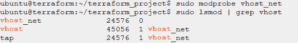

5.使用以下命令启动 libvirt 服务，并在下次启动时启用自动启动。

```
$ sudo systemctl enable — now libvirtd
```

6.通过运行以下命令并搜索 **active (running)** 来验证 libvirt 状态。

```
$ sudo systemctl status libvirtd
```

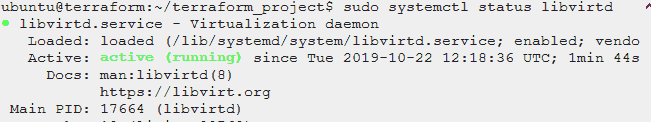

7.用下面的命令安装**虚拟管理器**。这是一个 GUI 程序，可以用来管理用 libvirt 创建的各种虚拟机。如果仅从控制台运行，则不需要安装此程序。

```
$ sudo apt -y install virt-manager
```

8.重启你的主机。

**安装 GOlang 和 Git** Golang 是 Google*【Google，The Go Programming Language】，2019*制作的开源编程语言。它以方便著称，因为它提供了跨平台支持。对于这些指令，它将用于从 GitHub 构建各种 terraform 提供者。我们只使用 GO 编译器来构建和安装插件。

1.运行以下命令来安装 GOlang 和 Git。

```
$ sudo apt -y install golang git
```

**安装 Terraform lib virt provider** 要使用 terra form 与 KVM 交互，需要提供程序。该提供者将处理我们的 terraform 配置，并调用 libvirt 库所需的函数，然后 lib virt 库将告诉 KVM 执行某些任务。该提供程序将像其他提供程序一样从 Github 安装。安装也与其他提供商非常相似。在此之前，需要安装一些特定于 terraform-provider-libvirt 的包。

1.使用 go 安装 terraform-provider-libvirt 需要安装 libvirt-dev 依赖项。

```
$ sudo apt -y install libvirt-dev
```

2.使用以下命令导出 GO 路径。这些是提供者将搜索的目录，以便可以构建它。函数*‘export’*是一个可以用来导出当前 shell 的某些路径的函数。从`*~/.bashsrc*.`启动时已经自动添加了许多路径

```
$ export PATH=$PATH:/usr/lib/go/bin$ export GOPATH=/usr/lib/go/
```

3.使用下面的命令在 GOPATH 的目录中创建并进入一个新目录。以下代码中描述的格式似乎是安装 terraform 提供程序的标准，因为提供程序将在下面显示的目录中搜索构建文件。

```
$ sudo mkdir -p $GOPATH/src/github.com/dmacvicar/$ cd $GOPATH/src/github.com/dmacvicar/
```

4.克隆官方 git 存储库。

```
$ sudo git clone [https://github.com/dmacvicar/terraform-provider-libvirt.git](https://github.com/dmacvicar/terraform-provider-libvirt.git)
```

5.进入提供者的目录，用下面的命令构建它。“make”命令将编译提供程序,“make install”将把它安装在我们的 GOPATH 中。这最多需要 30 秒。

```
$ cd terraform-provider-libvirt$ sudo make install
```

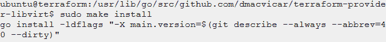

6.构建的结果是一个保存在＄GOPATH/bin 中的可执行文件。进入这个目录，用下面的命令检查版本。输出应该类似于下图。

```
$ cd $GOPATH/bin/$ ./terraform-provider-libvirt -version
```


**添加提供者作为插件** 我们想使用 libvirt 作为我们的 Terraform 提供者。插件需要专门添加到*' ~/. terra form . d/plugins '*目录中。这是 terraform 初始化时搜索第三方插件的目录。

1.在`‘*~/terraform.d*’`中新建一个名为“*插件*的目录，链接`‘*/usr/lib/go/bin/’*` *中的`‘*terraform-provider-libvirt’*` 可执行文件。*同样，命令`*‘ln’*` 用于防止系统中出现重复的可执行文件。此外，当'`/*$GOPATH/bin/’*` 中的实际文件发生变化时，无需采取进一步的步骤。

```
$ mkdir ~/.terraform.d/plugins$ sudo ln -s /usr/lib/go/bin/terraform-provider-libvirt ~/.terraform.d/plugins/$ ls -l ~/.terraform.d/plugins/
```

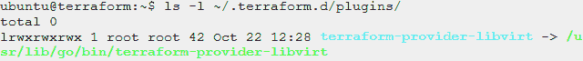

# 7.使用 Terraform 和 KVM 创建虚拟机

[返回目录](#29e6)

本章将介绍如何创建新的虚拟机、分配计算资源以支持虚拟机，以及最终使用 terraform 的 terraform-libvirt-provider 插件配置虚拟机。

配置主要是我们想要放入机器的资源，例如内核数量和内存大小。除此之外，机器中的用户必须进行配置，以便我们在创建后登录。为此，我们将使用 SSH 密钥。创建机器并登录后，将在创建的虚拟机上运行一个可以计算给定精度的 Pi 的测试服务器，以展示其功能。

**设置权限** 首先，我们需要确保 libvirt 服务有权创建、读取和写入用户文件，以便为虚拟机分配空间。

1.Libvirt 需要主机的用户权限才能分配计算资源。运行以下命令将您的用户添加到 libvirt 和 KVM 组。将*‘Ubuntu’*改为你主机的用户。

```
$ sudo usermod -aG libvirt,kvm ubuntu
```

2.我们当前的部分尚未启用这些组。使用`‘su — ${user}‘` 命令*重新登录到您的用户。*之后，使用 **id** 命令列出用户所属的组。

```
$ su — ubuntu$ id -nG
```


3.通过编辑一个可以在`*‘/etc/libvirt/qemu.conf*’`找到的文件，关闭 libvirt 的 SElinux 安全驱动程序。需要关闭安全驱动程序，因为它会阻止 libvirt 创建 libvirt-domain。打开文件。

```
$ sudo nano /etc/libvirt/qemu.conf
```

4.用 **CTRL+W** 搜索，将`‘security_driver=”selinux”’`改为`‘security_driver = “none”’`。


5.用 **CTRL+X** 退出并保存，按 **Y** 然后**进入**

6.最后，重新启动 libvirt 服务以使更改生效

```
$ sudo systemctl restart libvirtd
```

**设置项目工作区** 该项目是一个位于`‘*~/kvm_project/*’`的目录。将要添加的目录是*图像*和*下载*。稍后将需要这些目录。映像目录是保存新虚拟机的位置。下载目录是克隆图像的地方。

1.进入项目目录，使用以下命令创建两个名为`‘*downloads/*’`的新目录。

```
$ mkdir ~/kvm_project/$ cd ~/kvm_project/$ mkdir downloads
```

2.创建一个新目录来保存图像。这是虚拟机磁盘的位置。因此，需要将它放在不易接近的地方。

```
$ sudo mkdir -p /libvirt_images/
```

**下载映像** 需要一个您希望在客户机上运行的操作系统映像。任何操作系统都可以使用。对于本指南，我们将使用 ubuntu 18.04 云图像。我们建议使用云类型的图像，因为这可以大大减少下载和克隆的时间。

1.使用以下命令将图像下载到项目中的下载目录。

```
$ cd ~/kvm_project/downloads$ wget [https://cloud-images.ubuntu.com/bionic/current/bionic-server-cloudimg-amd64.img](https://cloud-images.ubuntu.com/bionic/current/bionic-server-cloudimg-amd64.img)
```

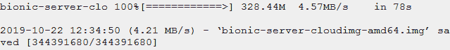

**下载网址**:[https://cloud-images.ubuntu.com/bionic/current/](https://cloud-images.ubuntu.com/bionic/current/)

2.下载需要一段时间。您只需启动一个新的控制台，就可以继续其他步骤。

**生成 SSH 密钥** 登录客户虚拟机需要 SSH 密钥。SSH 密钥成对出现。一个公钥和一个私钥。私钥从不共享，并保存在`~/.ssh`目录下。公钥也保存在目录`~/.ssh`中。与私钥不同，公钥应该是可共享的。当用户想要使用 SSH 登录到一个来宾虚拟机时，该虚拟机必须拥有经过授权的公钥。这时公钥被添加到客户机的`*‘~/.ssh/authorized_keys’*`文件中的公钥列表中。要创建密钥，可使用名为`‘*ssh-keygen’*` 的程序。

1.运行以下命令来生成 SSH 密钥。当要求输入密码时，按两次 enter。不需要密码，只需按回车键。没有指定选项，因为所需的文件和密钥将放在`~/.ssh/`中。

```
$ ssh-keygen
```

2.通过运行以下命令并比较输出，查看所创建密钥的权限，以验证权限是否正确更改。你会看到两把钥匙。其中一个密钥是公钥和私钥。区别可见于 ***。pub*** 扩展公钥。因为这是我们要共享的，所以也需要读写。

```
$ ls -al ~/.ssh/
```

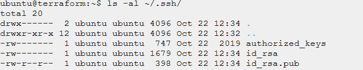

**按照第 5 章**中的讨论，设置一个平台配置来配置一个客户虚拟机** 。tf** 文件用于在 Terraform 中配置基础设施。在本节中，将创建一个新的 terraform 配置文件。代码的目标是创建一个新的虚拟机，并分配支持虚拟机所需的资源。要创建虚拟机，需要一个映像。这是在本章第一节下载的图像。此外，还需要配置要创建的虚拟机中的用户。这将在下一节中完成，但是对用户配置文件的调用将在本节中完成。

1.进入项目目录。

```
$ cd ~/kvm_project/
```

2.使用您喜欢的编辑器创建一个新的 terraform 配置文件。

```
$ nano libvirt.tf
```

3.首先需要的是提供者'*terra form-lib virt-provider*'。要在代码中实现这一点，需要添加一个调用。这是通过添加下面的代码行来完成的。这段代码将连接到 QEMU Hypervisor。添加这些行后不要关闭编辑器，后面会有更多的说明。

```
# libvirt.tf
# add the provider
provider **“libvirt”** {
 uri = “qemu:///system”
}
```

4.创建一个 libvirt 池。这是为虚拟机映像留出的存储量。*名称*参数用于标识一个池。池类型“dir”提供了管理目录中文件的方法。这些文件可以是特殊的磁盘格式，如 **' *qcow'*** 或 **' *vmdk'*** 。最后，path 参数是存储的位置以及机器图像的保存位置。我们选择`*‘/libvirt_images/ubuntu-pool/’*` *作为路径。*运行代码时，如果目录不存在，将创建一个新目录。(默认的池目录是`“*/var/lib/libvirt/images*”`。在指南中，将使用目录“ */libvirt_images/* ”

```
# create pool
resource **“libvirt_pool” “ubuntu”** {
 name = “ubuntu-pool”
 type = “dir”
 path = “/libvirt_images/ubuntu-pool/”
}
```

5.为虚拟机映像磁盘创建新资源。添加以下几行来创建新的图像资源。这将创建一个新的映像，方法是从给定的源克隆它，并将其保存在上一步中创建的池的路径中。来源可以是一个目录，甚至是实际下载的 HTTP URL。请注意，给定的格式应该与池类型相匹配。

```
# create image
resource **“libvirt_volume” “image-qcow2”** {
 name = “ubuntu-amd64.qcow2”
 pool = libvirt_pool.ubuntu.name
 source =”${path.module}/downloads/bionic-server-cloudimg-amd64.img”
 format = “qcow2”
}
```

6.创建云初始化磁盘并加载云初始化配置。该磁盘将用于与来宾虚拟机共享在`‘*cloud_init.cfg’*` 文件中找到的用户数据。将创建一个映像，并将其保存在我们将要创建的虚拟机所在的存储池中。关于云初始化文件的更多解释将出现在下一节，在这里将创建*云初始化. cfg* 文件。添加以下几行。

```
# add cloudinit disk to pool
resource “libvirt_cloudinit_disk” “commoninit” {
 name = “commoninit.iso”
 pool = libvirt_pool.ubuntu.name
 user_data = data.template_file.user_data.rendered
}# read the configuration
data “template_file” “user_data” {
 template = file(“${path.module}/cloud_init.cfg”)
}
```

7.创建新的 libvirt 域。这是添加支持客户机的资源的地方。这基本上是创建虚拟机的地方，它将决定所创建的机器的性能以及网络功能。根据可用的资源，您可以更改内存和 vcpu 的名称。使用的网络是 libvirt 创建的*‘default’*网络，它已经具有 DHCP 功能。建议保持控制台设置不变。这方面的更多内容将在下一章介绍。将下列行追加到您的配置文件中。

```
# Define KVM domain to create
resource **“libvirt_domain” “test-domain”** {

 # name should be unique!
   name = “test-vm-ubuntu”
   memory = “1024”
   vcpu = 1
 # add the cloud init disk to share user data
   cloudinit = libvirt_cloudinit_disk.commoninit.id# set to default libvirt network
   network_interface {
   network_name = “default”
 }console {
   type = “pty”
   target_type = “serial”
   target_port = “0”
 }disk {
   volume_id = libvirt_volume.image-qcow2.id
 }graphics {
   type = “spice”
   listen_type = “address”
   autoport = true
 }
}
```

8.这个脚本现在可以用来创建一个新的虚拟机。保存它，并继续使用'**'设置 cloud-init。**.”部分，以便在创建时使用云初始化配置登录虚拟机。

**设置 cloud-init 用于在创建时配置客户虚拟机系统** 在本节中，cloud init 将用于在客户虚拟机上配置用户。对什么是云初始化的简短描述:

*“Cloud-init 是跨平台云实例初始化的行业标准多分发方法。它受到所有主要公共云提供商、私有云基础架构的配置系统和裸机安装的支持。”*

*(“云初始化，云初始化 19.2 文档”2019a)*

首先，我们将创建一个名为“*cloud _ init . CFG”*的文件。Terraform 不会自动加载该文件。要加载数据，需要从'**'进行调用。tf** 配置文件。在最后一节，第 7.5 章第六步，可以找到对' *cloud_init.cfg '的调用。*cloud init 的语法是' ***yaml '。*** 语法不能处理制表符。因此，仅使用空格在代码中创建结构。建议使用两个空格代替制表符。这一点很重要，因为 Terraform 不会处理云初始化配置的配置错误。

1.进入项目目录，创建一个名为' *cloud_init.cfg '的新文件。*

```
cd ~/kvm_project/nano cloud_init.cfg
```

2.添加下面的代码并注意下面的解释。

```
#cloud-config
users:
 — name: **terraform_guest**
 sudo: ALL=(ALL) NOPASSWD:ALL
 groups: users, admin
 home: /home/**terraform_guest**
 shell: /bin/bash
 ssh_authorized_keys:
 — **ssh-rsa XXXX**
```

3.这段代码用于设置我们将要创建的虚拟机的用户。确保更改所有粗体标记的零件。

*name* 参数是将要添加的用户名。添加更多的名称参数将导致多个用户。在*名称*参数下，设置用户数据。最重要的是' *ssh_authrozed_keys'* 参数。该参数需要一个公钥列表，这些公钥将被添加到目录' *~/中的' *authorized_keys'* 下。客户机的 ssh/authorized_keys'* 。这样，我们将能够在同一个目录中使用我们的私钥登录到用户。

要得到大众只需运行: ***猫~/。主机上的 ssh/id_rsa.pub*** 。

4.最后，当创建虚拟机时，我们将让云 init 为我们下载一些包。注意下面的配置。这将下载包和 *python* 和 *git* 。

```
# install packages
packages:
 — qemu-guest-agent
 — git
```

**配置来宾虚拟机** 现在项目已经设置好，可以使用 Terraform 创建一个新的虚拟机。本节将向您介绍启动和运行机器的命令。

1.初始化项目工作环境。

```
$ terraform init
```

2.使用以下命令应用更改。确保键入' *yes'* 以确认更改。如您所见，将添加四种资源。它们是 libvirt 池、libvirt 磁盘、云初始化磁盘和 libvirt 卷。应用 Terraform 后，将保存这些资源并记住它们，以便管理这些对象的生命周期。

```
$ terraform apply
```

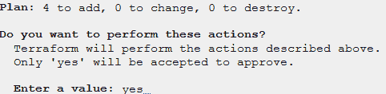

3.在机器制造完成之后。从输出中可以看出，机器由四个资源组成。我们希望验证我们的所有资源是否都是正确创建的。我们将通过一组*【virsh】*命令。这是一个从命令行创建和管理 libvirt 资源的工具。首先运行以下命令，列出用 libvirt 创建的所有虚拟机(域)。属性域列表中的一个条目与使用 Terraform 代码创建的条目同名。在这种情况下*‘test-VM-Ubuntu’*

```
$ virsh list — all
```

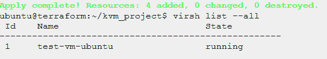

4.我们为该域的存在创建了一些其他资源。它们是 libvirt 池、libvirt 卷和云初始化磁盘。正如 7.5 章所讨论的，机器的磁盘(libvirt 卷)和云初始化磁盘需要在同一个池中共享云初始化配置。为此，我们创建了一个名为*‘Ubuntu-pool’的池。*运行以下命令列出现有池。

```
$ virsh pool-list — all
```

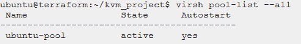

5.要列出在特定池中运行的现有卷，请运行以下命令。如你所见，这些是我们在第 7.5 章代码中定义的' *libvirt_volume'* 和'*lib virt _ cloud _ init _ disk '*。它们也在我们希望它们在的目录中。该目录是`‘*/libvirt_images/ubuntu-pool/’.*`

```
$ virsh vol-list **ubuntu-pool**
```

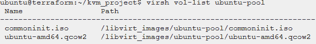

6.列出目录`*‘/libvirt_images/ubuntu-pool’*`中的卷文件。

```
$ sudo ls /libvirt_images/ubuntu-pool/
```

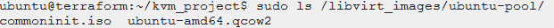

7.现在，我们确信代码正在按预期工作，我们可以继续尝试登录。登录到我们创建的机器的唯一方法是使用 SSH。为此，我们需要知道机器在哪个网络中，它有什么 IP 地址。使用下面的命令列出所有 libvirt 网络。这将列出 libvirt 提供的*‘默认’*网络。我们在域的网络接口下配置我们的虚拟机连接到第 7.5 章中的默认网络。

```
$ virsh net-list –-all
```

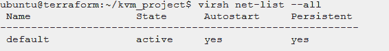

8.最后，尝试 pinging 客户机。首先找到 DHCP 租给它的 IP 地址。这不会总是立即发生，因为机器可能仍在启动。使用以下命令，它需要网络名称。我们在第 7.5 章中将其设置为'*默认'*。当然，也可以使用上一步获得的名称找到网络。

```
$ virsh net-dhcp-leases **default**
```

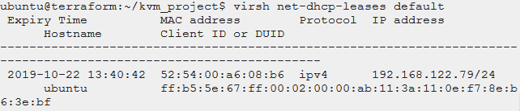

9.Ping 上一步中找到的' *IP 地址'*。如果客人能找到主人，我们将使用这个来使用户。记下此 IP 地址，因为它将在下一部分中使用。

```
$ ping **192.168.122.79**
```

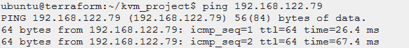

**在来宾虚拟机上运行测试服务器** 在最后一部分，创建了一个虚拟机。我们配置了两种登录方式。一种方法是只使用用户名和密码，另一种方法是使用在本章的云初始化部分配置的 SSH 密钥。我们将使用后一种方法登录到机器上，下载、安装并运行一个名为 PiCalc 的测试程序。

PiCalc 是一个 HTTP 服务器，用它可以计算出给定精度的圆周率。这将通过使用名为 mpmath 的 Python 数学库和 web 框架 Bottle 来实现。这是一个没有依赖关系的轻量级 python with 框架。该程序将从 Github 下载:

> [【https://github.com/krebsalad/PiCalcPy.git】T4](https://github.com/krebsalad/PiCalcPy.git)

1.启动终端模拟器。

2.首先，虚拟机的 *IP 地址*需要使用 SSH 登录。在主机上运行以下命令，查看租用的 IP 地址。

```
$ virsh net-dhcp-leases default
```

3.使用在云初始化中配置的来宾用户名和从上一步获得的 *IP 地址*登录到来宾虚拟机。确保***terra form _ guest***与本章“云初始化”一节中创建的用户相匹配。另外，**<192 . 168 . 122 . 79>**应该是客户机器的 IP 地址。

```
$ ssh **terraform_guest**@**192.168.122.79**
```


4.检查是否按照我们在 cloud_init 文件中指定的方式安装了 git，如果尚未安装 python，则检查是否在客户机中安装了 python。这些将用于创建 python 服务器。您会注意到已经安装了 git。这要感谢我们在云初始化部分添加的云初始化包更新参数。

```
$ dpkg -s git | grep Status$ dpkg -s python | grep Status
```

5.从 Github 克隆 PiCalc 服务器。这有一个 python 项目，将用于安装和运行 PiCalc 服务器。

```
$ git clone [https://github.com/krebsalad/PiCalcPy.git](https://github.com/krebsalad/PiCalcPy.git)
```

6.进入'*pic acpy/'*,运行下面的命令，安装服务器的依赖项。这将安装 mpmath，一个数学库和瓶子。如前所述，Bottle 是非常轻量级的，因为它不需要 python 已经拥有的其他依赖项。这可以从它只需要运行一个 python 文件的事实中看出。需要安装 Mpmath，这需要 *sudo* 权限。

```
$ cd PiCalcPy/$ sudo python install_picalc.py$ ls -a
```


7.打开名为 *'picalc_server.py'* 的文件。该文件包含运行服务的代码。

```
$ nano picalc_server.py
```

8.注意' *picalc_server.py'* 的内容。内容也可以在下面找到。这个脚本将等待一个对路由 **http:// < IP > : <端口> /PiCalc/ < p >的 HTTP 请求。**在最后一行' *run(host=ip_addr，port=8080)'* 中设置 **IP** 。 ***p*** 代表**精度**，用于确定我们想要的圆周率的小数位数。该脚本将使用一个名为' *socket'* '的 python 标准库自动获取您当前的 IP。

```
**# picalc server.py**from bottle import route, run, template
from mpmath import mp
import socket
import timehostname = socket.gethostname()
ip_addr = socket.gethostbyname(hostname)@route(‘/PiCalc/<p>’)
def index(p):
 # set time
 start_time = time.time()# read precision value
 precision = int(p)# handle non ints
 if(str(type(precision)) != “<type ‘int’>”):
 print(str(type(precision)))
 return str(“error, precision was not an int”)# set precision val and calculate pi
 mp.dps = precision
 pi = mp.pi# end time
 processing_time = time.time() — start_time# return txt
 return str(“Server ip: “+ip_addr+ “\nTime took: “+ str(processing_time) + “ seconds\nPI = “ + str(pi) + “\n”)# function to run picalc on port 8080 by default
def run_server(port_num=8080):
 run(host=ip_addr, port=port_num)
```

9.退出编辑器，用下面的命令运行测试程序。

```
$ sudo python run.py mode=server
```

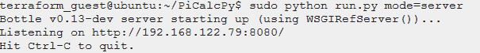

10.通过启动新的终端并输入以下命令，从您的主机向服务器发送请求。(如果您的主机上有 GUI，您也可以通过浏览器发送请求。只需在浏览器中键入以下命令，无需' *curl* ')

```
$ curl **192.168.122.79**:8080/PiCalc/100
```

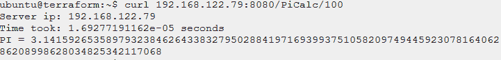

11.现在我们了解了如何调配虚拟机，我们可以更深入地了解如何调配多个虚拟机。现在，通过键入*‘exit’*退出客户机上的 SSH 会话。

12.最后，在主机上使用以下命令销毁域及其资源。要正确做到这一点，它需要位于初始化 terraform 的目录中。在我们的例子中 *'~/kvm_project/'* 。当要求删除所有内容时，键入*‘yes’*。

```
$ terraform destroy
```

# 8.供应和流程编排

[返回目录](#29e6)

本章将涵盖云技术的不同方面，例如服务器的自动创建(也称为配置)，以及组合不同的虚拟机来创建单个服务(一种编排形式)。这将通过一个示例来完成，在该示例中，总共将创建三台虚拟机。两台机器将提供一个 web 服务，而一台机器将对此服务的请求进行负载平衡。这意味着所有请求都将通过带有负载均衡器的机器，然后负载均衡器将决定以循环方式处理请求的机器。

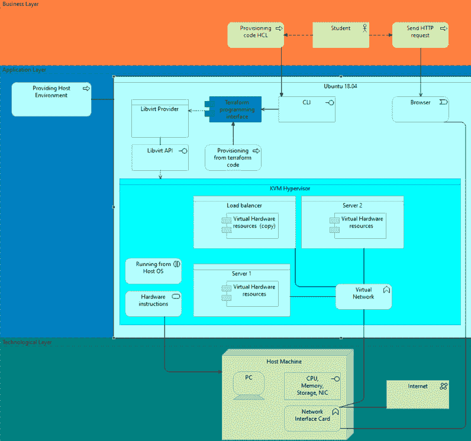

*图 4 —配置多个虚拟机的架构(使用 Archi 制作)*

见上图架构。这是第 2 章中使用的架构的变体，但显示了更多关于我们当前情况的信息。可以看出，目标是用户(学生)或任何其他人都可以向客户机发送 HTTP 请求。该请求将首先在您机器的网络接口卡上可用。然后，网卡将根据数据包必须发送到的请求目的地进行搜索。在虚拟机管理程序的帮助下，硬件应该已经知道目标网络，因为它在主机的 NIC 和虚拟机管理程序的虚拟网络接口之间创建了所谓的“桥”。在此网桥上，将启用地址转换(NAT ),以便可以从主机网络访问虚拟机。此外，网桥将充当域名解析(DNS)的中间媒介，并使用动态主机配置协议(DHCP)为虚拟机提供 ip 地址。在本章中，我们将尝试通过 Terraform 代码提供所有这些来实现这一点。这将展示一个很好的例子，说明如何用一个简单的负载平衡例子来使用 Terraform 创建这样的云基础设施。

本章的第一节将介绍如何配置在引导时运行服务器的虚拟机。相同的典型程序将用于测试虚拟机。之后，在第二部分中，将讨论更多关于 libvirt 提供的虚拟网络，其中将创建自定义桥接网络。第三、第四和第五节将讲授如何使用可以从一个集中位置重用的模块，目的是使配置更易于管理。最后，第六部分将结合所有信息来创建多个虚拟机，这些虚拟机对典型服务进行负载平衡。

要遵循本章中的说明，先决条件是成功完成第 7 章，因为在本章中，我们将在该章中创建的代码的基础上进一步构建。我们将在这些文件中添加一些代码或移动上述文件。

**为服务器配置虚拟机** 为了能够创建本章的最终目标，即负载平衡的典型服务，如果机器中的典型服务器被自动创建并运行，将会非常有用。这样，我们就不必登录虚拟机来启动服务器。为了实现这一点，必须在 *cloud_init.cfg* 文件中进行一些编辑。我们将添加一些软件包，这些软件包是典型服务器安装和运行所需要的，但我们也将在安装后添加配置来运行服务器。

1.编辑 *cloud_init.cfg* 和下面的 **yaml** 配置。这将尝试在计算机创建后安装软件包。这个功能之前在第 7.8 章展示过，git 安装在虚拟机上。注意，我们添加了 python wget，这两个程序用于安装 PiCalc 服务。

```
# cloud-init configuration
# install packages
packages:
 — qemu-guest-agent
 — git
 — python
 — wget
```

2.为了在安装后启动服务器，我们必须运行一些 *bash* 命令。幸运的是， *cloud init* 也能做到这一点。也添加下面的配置。如你所见，这将运行我们在第 7.8 章中使用的相同命令来创建 PiCalc 服务器。

```
# cloud-init configuration
# run command after boot
runcmd:
 — [“cd”, “/home/terraform_guest”]
 — [“git”, “clone”, “https://github.com/krebsalad/PiCalcPy.git"]
 — [“cd”, “PiCalcPy”]
 — [“python”, “install_picalc.py”]
 — [“python”, “run.py”, “mode=server”,”&”]
```

这些附加功能应该足以在服务器启动时自动运行它。通过在项目中初始化 Terraform 并应用配置来测试这一点。当创建的机器启动时，步骤 I 中的包将被安装。完成后，服务器的安装应该会自动开始，之后它将会运行。如果您想在启动之前看到所有安装的输出，您可以使用下面的命令进入虚拟机的控制台。(建议为此启动新的终端)。如前所示，第一个命令将列出您系统上的机器。记下您要登录的机器的 id，并用机器的 id 替换“*虚拟控制台”*后面的数字。现在您将能够看到安装的输出。

```
$ virsh list — all$ virsh console **2**
```

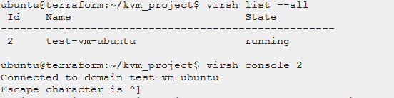

安装完成后，通过从 CLI 或主机浏览器向 IP 地址发送 HTTP 请求来测试服务器。您可以使用'***virsh net-DHCP-leases default***'命令找到您可以找到的 ip。

```
$ curl VM_Guest_ip:8080/PiCalc/100
```

完成服务器测试后，请确保在继续下一步操作之前销毁已创建的基础架构，因为我们将构建更改更多的配置。

**创建 libvirt 桥接网络** 在本节中，将使用 libvirt 和 Terraform 创建一个虚拟桥接网络。网桥是一种网络设备，能够将多个通信网络组合成一个网络。网络设备将用于为我们将要创建的虚拟机提供 IP 地址。这将使用 DHCP 来完成。注意下面的草图，在这里可以找到本节将要创建的场景。这里可以看到有一个虚拟网络和一个连接到该网络的客户机。网桥将在给定的范围内提供一个 IP 地址给 toe 机。网桥可以通过主机与外部网络通信。使用 NAT 可以做到这一点。外部的所有通信都将虚拟网络视为主机。

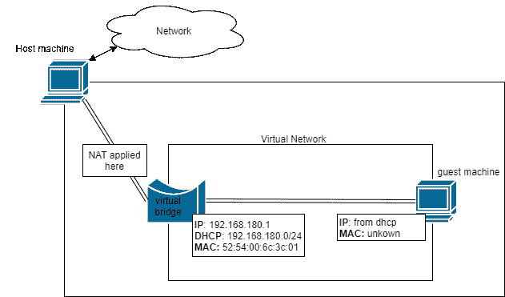

*图 5 —用图纸 io 制作的桥接网络*

到目前为止，我们一直使用 libvirt 提供的*‘默认’*网络。该网络也是一个基于 NAT 的带 DHCP 的桥接网络。我们将基于*【默认】*网络进行配置，目的是在下一节深入探讨之前，了解更多相关信息。

libvirt 网络是使用 XML 文件定义的。XML 的语法要求你按照下面的 **< /section >来定义节。**注意，开头的/是用来结束标签的。如果不存在，下面的所有部分将成为该部分的成员。要结束这种行为，重复该部分并关闭它也是可行的。例如:

```
<**section**> arguments <**/section**>
```

幸运的是，libvirt 会在我们的语法中寻找错误，这将有助于调试我们配置中的错误。通过运行以下命令查看默认网络的配置。这将打印网络的配置。

```
$ virsh net-dumpxml default
```

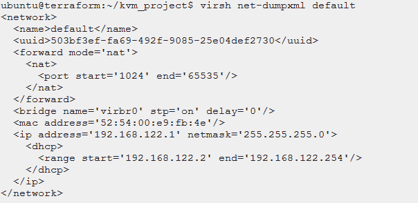

该配置采用 XML 格式。复制输出，因为我们将使用此配置来创建我们自己的网络。在项目目录中创建一个名为'*lib virt _ network _ config . XML '*的新文件，并粘贴从上一步复制的 *'default'* 网络的配置。该文件将用于定义新网络。我们将不得不编辑一些值，以便它适用于我们的新网络。

```
$ nano ~/kvm_project/libvirt_network_config.xml
```

我们必须改变的第一个 XML 标记是网络的名称。这是由标记' *<名>和'<名/ >'之间的。*将名称*‘默认’*改为*‘典型 _ 网络’。*该行应如下所示

```
<name>picalc_net</name>
```

现在完全移除<uuid>标签。这个标签由 libvirt 在创建网络时生成。</uuid>

*<转发模式= 'nat' >* 标签不需要更改。这将为我们的网络提供网络地址转换(NAT)。这是与我们主机中的其他虚拟网络通信所必需的，因此也需要能够与互联网通信。

*<桥名..>* 必须改。网桥是网络接口，所有进出网络的数据包都要经过它。需要更改的选项是 *'name='* 选项，因为它用于识别桥梁，在您的机器中应该是唯一的。这将不得不从*【virbr 0】*改变，例如*【virbr 1】*。除了这个选项之外，还有“标签上的*‘STP =’。确保此选项打开，因为它有助于防止网络中的任何环路，而且还会让数据包选择最可靠的路径到达其目的地。我们不需要改变这个选项。*

```
<bridge name=’virbr1' stp=’on’ delay=’0'>
```

*< mac 地址… >* 标签用于在机器级别识别虚拟网络接口。地址本身必须是唯一的。这意味着我们从默认地址复制的 mac 地址也必须改变。将 mac 地址更改为有效的 mac 地址。注意下面的例子。

```
<mac address=’52:54:00:6c:3c:01'/>
```

*< ip 地址… >* 标签用于设置网络接口的 ip 地址。这个 IP 应该是网络中机器的网关地址。此外，网络掩码必须是有效的掩码。在我们的例子中，我们将使用与默认网络相同的网络掩码，即 */24，*，但是我们将把网络的子网改为网络 *192.168.180.0* 。按如下方式更改标签。

```
<ip address= ‘192.168.180.1’ netmask=’255.255.255.0'>
```

如您所见，在 IP 地址标记中还有子成员标记 *< dhcp >* 。这个标签将为我们定义的网络中的所有客户端提供一个 IP 地址。重要的是，该标签中的范围是我们定义的子网内的有效地址。在我们的例子中，这将如下所示。

```
<dhcp>
   <range start=’192.168.180.2' end=’192.168.180.254'/>
</dhcp>
```

最后，我们将配置一个DNS 服务器。这是必需的，因为我们主机中的虚拟网络将无法解析域地址，因为它隐藏在网桥接口之后。幸运的是，接口本身就在我们的主机中，可以找到 DNS 服务器。这意味着我们网络中的客户端将能够通过简单地使用网络接口来解析域名。我们唯一需要配置的是来自虚拟网络中客户端的解析请求通过接口传递。这是通过将我们的网络接口 IP 定义为 DNS 服务器来实现的。

```
<dns enable=’yes’/>
```

现在配置已经完成。使用以下命令保存文件、定义并启动网络。

```
$ virsh net-define ~/kvm_project/libvirt_network_config.xml$ virsh net-start picalc_net$ virsh net-list — all
```

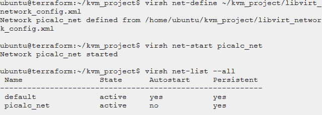

为了测试网络，您可以使用项目' *~/kvm_project'* 创建一个虚拟机。但是在初始化之前，必须在 Terraform 配置中进行一些更改，以便客户机的网络接口连接到我们称为“picalc_net”的虚拟网络。这在第 7 章步骤 VII 中有简要讨论。要更改配置中的网络，请编辑 *'libvirt.tf'* 文件，并将 *'libvirt_domain'* 资源中 *'network_interface'* 下的*' network _ name = " default " '*更改为'*network _ name = " picalc _ net "*'。

最后，初始化并应用 Terraform 配置。创建客户机时。运行下面的命令来获取 DHCP 租用的 IP。租用的 IP 应该在之前定义的范围内，即 **192.168.180.2/24** 到 **192.168.180.254/24。**

```
$ virsh net-dhcp-leases picalc_net
```

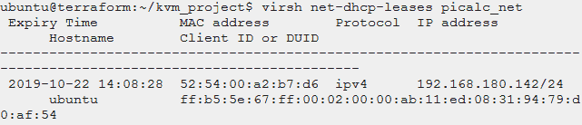

完成测试后，确保用 Terraform 毁坏机器。不要删除网络配置文件，因为这将在下一节及以后的内容中用到。

要停止正在运行的 libvirt 网络，请运行以下命令。

```
$ virsh net-destroy picalc_net
```

要删除非活动的现有网络，请运行以下命令。

```
$ virsh net-undefine picalc_net
```

要搜索现有的活动或非活动网络，请运行以下命令。

```
$ virsh net-list — all
```

**为 libvirt 网络** 创建定制的 Terraform 模块在本章中，Terraform 将在最后一章中用于创建相同的网络。这样可以使用 Terraform 管理网络的生命周期。terraform-provider-libvirt 确实提供了 libvirt 网络资源，但自 2019 年 10 月起，它不支持将静态主机用于 DHCP，我们将需要提供负载平衡的 PiCalc 服务。

为了能够从文件创建网络并管理其生命周期，我们必须创建一个模块。模块是放置 Terraform 配置文件的目录。一个模块需要至少一个带有**的文件。tf'** 扩展。然后，通过调用目录，可以从另一个 Terraform 配置文件中调用该模块。

在您的项目中创建一个目录“/*modules/’*，然后在 modules 目录中创建一个名为“ */libvirt_picalc_network/* ”的新模块目录。

```
$ mkdir -p ~/kvm_project/modules/libvirt_picalc_network/
```

将我们在上一章(8.2)中创建的网络配置 XML 文件移动到这个新目录中。我们将使用这个网络配置文件从 Terraform 代码创建相同的网络。

```
$ mv ~/kvm_project/libvirt_network_config.xml ~/kvm_project/modules/libvirt_picalc_network/libvirt_network_config.xml
```

在“*/lib virt _ pi calc _ network/*”目录下添加并编辑一个名为“*pi calc _ net . TF”*的新文件。该文件将包含定义和运行网络所需的配置，但也会在收到指示时销毁和取消定义网络。

```
$ nano ~/kvm_project/modules/libvirt_picalc_network/picalc_net.tf
```

添加下面的代码。这是为了确保在创建网络之前 libvirt 正在运行。

```
# make sure qemu is running
provider **“libvirt”** {
 uri = “qemu:///system”
}
```

为了让 terraform 在调用*‘apply’*或*‘destroy’*时执行所需的调用，我们必须创建一个资源。为此，Terraform 提供了一个名为*‘null _ resource’*的资源，该资源有一个 Terraform 将管理的唯一 ID。在资源中添加了一个*【本地执行】*类型的*【供应】*。这是一个有用的函数，可以用来在本地执行命令。还有选择使用哪个解释器的选项。我们将使用标准的 *'/bin/bash'* 来调用一些 virsh 命令。请注意，有两个置备程序。其中一个供应器将在*‘地形应用’*运行时运行，第二个供应器将在*‘地形破坏’*运行时运行。

```
# let terraform manage the lifecycle of the network
resource **“null_resource” “picalc_network”** {

 # when terraform apply
 provisioner **“local-exec”** {
 command = “”
 interpreter = [“/bin/bash”, “-c”]
 }# when terraform destroy
 provisioner **“local-exec”** {
 when = “destroy”
 command = “”
 }
}
```

在应用 terraform 配置时使用的置备程序中添加以下命令。这是一个单行命令，它结合了用于定义和启动 libvirt 网络的多个命令。*'****&&'***表示后面的命令只有在前面的命令成功时才会执行。使用的命令在第 8.2 章中讨论。

```
command = “virsh net-define ${path.module}/libvirt_network_config.xml && virsh net-autostart picalc_net && virsh net-start picalc_net”
```

现在添加一些命令来破坏网络。同样，这些是在第 8.2 章中使用的命令，用于取消现有网络的定义，但现在在一行中。使用下面的代码就可以做到这一点。

```
command = “virsh net-undefine picalc_net && virsh net-destroy picalc_net”
```

保存配置文件。项目的最终结构应该如下所示

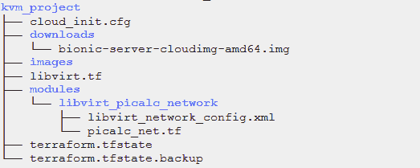

为了测试模块，我们可以简单地在模块的目录中初始化并应用 terraform。这不会对项目的配置产生任何影响。

```
$ cd ~/kvm_project/modules/libvirt_picalc_network$ terraform init$ terraform apply
```

验证网络是否是使用以下命令创建的

```
$ virsh net-list -–all
```

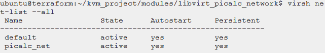

如果您想在这个网络上测试虚拟机，请进入项目目录 init 并应用更改。注意虚拟机的网络接口的网络名应该是 ***picalc_net* 。**这也在上一章讨论过，应该已经配置好了。

要破坏网络，调用目录'*lib virt _ pical c _ network '*中的' *terraform destroy'* 。在本章中，我们只从它的目录中创建了模块。但是也可以从不同的文件中调用它。这种方法将在后面讨论。

**使用静态 IP 配置客户机** 最终目标是创建一个多虚拟机服务，其中一个虚拟机对发送给其他虚拟机的请求进行负载平衡。为此，负载平衡机器需要知道所述机器的 IP 地址。您可能已经注意到，IP 地址是由 DHCP 服务器在给定的范围内随机给出的。这意味着，即使我们为一台机器提供负载平衡服务，它也不会立即知道它应该为哪个 IP 地址提供负载平衡器，因此我们必须手动搜索 IP 地址并将其连接到负载平衡器。

幸运的是，DHCP 可以根据 MAC 地址为主机分配固定的 IP 地址。在本章中，我们将使用这种行为来静态设置我们要配置的虚拟机的 IP 地址，方法是在创建虚拟机之前分配 MAC 地址。下面的草图显示了我们想要配置的情况。

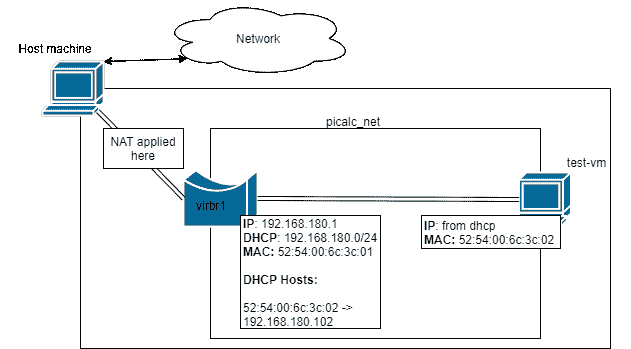

*图 6 —基于使用 draw.io 制作的 MAC 地址的 DHCP 静态主机*

使用 DHCP 中的主机功能，我们可以让具有固定 MAC 地址的客户端获得一个预定义的 IP。在资源调配的情况下，这意味着如果我们总是希望虚拟机获得相同的 IP 地址，则应该在创建虚拟机时静态设置 MAC 地址。本章将通过在 Terraform 代码中配置 MAC 地址来解决这个问题。

要正确完成这一部分，需要了解如何创建 libvirt 网络。注意第 8.2 和 8.3 章中的这些主题。假设使用第 8.3 章中创建的相同配置。

1.编辑'*lib virt _ network _ config . XML '*文件。

2.在 DHCP 标记中添加下面的粗体行。这将确保 IP 地址 *192.168.180.102，*只租给与给定 MAC 地址匹配的机器，在本例中是***52:54:00:6c:3c:02***。

```
<**dhcp**>
   <**range** start=’192.168.180.2' end=’192.168.180.254'/>
   <**host** mac=’52:54:00:6c:3c:02' ip=’192.168.180.102'/>
</**dhcp**>
```

3.虚拟机也需要设置为上面的 MAC 地址。这可以在用于创建虚拟机的 terraform 配置文件中完成。在这个文档中，直到现在，它都被称为 **libvirt.tf** 。编辑该文件，并将下面的粗体行添加到' *libvirt_domain'* 模块中的' *network_interface'* 下。此处添加的 mac 地址应该与上一步添加的主机 MAC 地址相匹配。

```
network_interface {
network_name = “picalc_net”
mac = “52:54:00:6c:3c:02”
}
```

4.现在测试项目。确保我们在上一章创建的**正在运行。之后，通过在主项目工作区中进行初始化和规划，使用虚拟机测试该配置。**

**5.使用以下命令验证 IP 是否按预期租用。**

```
**$ virsh net-dhcp-leases picalc_net**
```

**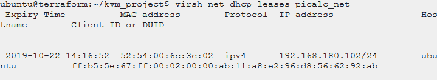**

****使用模块和变量** 本章将描述如何创建一个用于供应虚拟机的 Terraform 模块。目标是创建一个模板，通过简单地改变值就可以创建不同的 ubuntu 机器。通过使用变量，可以重复使用模块，并从一个集中的位置设置它们。**

**在本章中，我们将使用前面章节中使用的' **libvirt.tf** '文件来创建虚拟机。我们将把这个文件做成一个可重复使用的模块。因此，在进行本部分之前，必须完成本章中的所有说明，以便能够准确地遵循指南。**

**创建一个名为' *ubuntu-module'* 的新模块目录。该目录将包含创建虚拟机所需的文件。**

```
**$ mkdir -p ~/kvm_project/modules/ubuntu-module/**
```

**将文件' *libvirt.tf'* 移动到模块目录。我们将改变*‘lib virt . TF’*文件，使其可重复使用。**

```
**$ mv ~/kvm_project/libvirt.tf ~/kvm_project/modules/ubuntu-module**
```

**kvm_project 的树形结构应该如下所示:**

**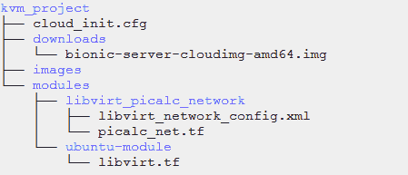**

**用你最喜欢的编辑器编辑 *'libvirt.tf'* 文件。我们将从添加变量开始。变量用于设置值。除了文件本身之外，这些变量可以从其他 Terraform 模块中设置。也可以从其他 *'* ***来做。tf*** *'* 文件。注意下面的代码。这段代码定义了一个名为*‘机器名’*的变量。我们定义的变量属于字符串类型。这可以使用'*类型'*参数来定义。当需要许多变量时，description 参数非常有用。它应该描述变量的用途。将下面的变量定义添加到' *libvirt.tf'* 的顶部。该变量将用于设置文件的各种值。**

```
**#libvirt.tf
variable **“machine_name”** {
}**
```

**当重用一个模块时，变量是有用的，因为有些值需要是唯一的，这样模块才能被重用。在 *'libvirt.tf'* 文件中，许多值必须使用变量进行更改。我们将在下面介绍所有这些在文件中必须是唯一的值。**

**首先，从*‘lib virt _ pool’*开始。创建多台计算机时，池的名称必须是唯一的。此外，池保存其图像的目录必须是唯一的。要使用一个变量*‘var’*自变量被使用。这提供了对当前模块中所有变量的访问。使用它，我们可以从不同的文件中设置值。以下面的例子为例。如果变量*‘machine _ name’*在初始化时被设置为’*Ubuntu _ 1’*，那么池的名称将是’*Ubuntu _ 1 _ pool’*，路径将是’*/lib virt _ images/Ubuntu _ 1 _ pool’*。**

```
**resource **“libvirt_pool” “ubuntu”** {
 name = “${var.machine_name}_pool”
 type = “dir”
 path = “/libvirt_images/${var.machine_name}_pool/”
}**
```

**在*‘lib virt . TF’*文件中必须更改的第二个资源是*‘lib virt _ volume’*。注意下面的例子。唯一需要动态的值是*名称*值，因为它用于管理机器的生命周期，并且是图像文件的名称。根据变量进行更改将有助于防止名称冲突。我们还将更改路径值。这是因为我们移动了模块的目录。正因为如此， *path.module* 函数不会返回我们下载的路径。如下所示更改这些值**

```
**resource **“libvirt_volume” “image-qcow2”**{
 name = “${var.machine_name}_image.qcow2”
 pool = libvirt_pool.ubuntu.name
 source = “${path.module}/../../downloads/bionic-server-cloudimg-amd64.img” 
 format = “qcow2”
}**
```

**第三个必须更改的资源是*‘lib virt _ domain’*。注意下面的例子。该名称应再次更改，因为它必须是唯一的。可以为此资源创建新变量。例如，创建用于设置内存的变量。**

```
**resource **“libvirt_domain” “test-domain”** {
   name = “${var.machine_name}_domain”
   memory = “1024”
   vcpu = 1
   …**
```

**在编辑更多组件之前，我们将创建三个新变量，用于设置*‘lib virt _ domain’*的网络接口和机器的用户配置。如上一章所述，我们可以设置网络接口的 MAC 地址，以便我们的机器获得一个固定的 IP 地址。为了使多台机器都可以这样做，有一个变量来设置 MAC 地址和网络是很有用的。除了网络接口的变量之外，能够为虚拟机设置不同的用户配置也很重要。为此，我们将使用变量*‘用户数据路径’。*添加以下变量。**

```
**variable **“network_name”** {
}variable **“mac_address”** {
}variable **“user_data_path”**{
}**
```

**现在使用两个新添加的变量来设置*【网络接口】*的*【网络名称】*和*【MAC】*，这两个变量可以在*【lib virt _ domain】*下找到。注意下面的例子**

```
**network_interface {
   network_name = “${var.network_name}”
   mac = “${var.mac_address}”
}**
```

***‘用户数据路径’*变量必须指向*‘cloud _ init . CFG’*文件。为此，我们必须更改用户数据文件的加载位置，以便可以从可变路径加载它。注意下面的例子**

```
**data **“template_file” “user_data”** {
   template = file(“**${var.user_data_path}**”)
}**
```

**最后，保存 *'libvirt.tf'* 文件并关闭。该模块可以重复使用而不会产生名称冲突。为了使用该模块，将在项目的主目录中创建一个新文件。该文件将用于调用多个模块，因此将被命名为 *main.tf* 。进入目录并创建文件。**

```
**$ cd ~/kvm_project/$ nano main.tf**
```

**在这个文件中，我们将调用模块并设置我们之前添加的变量。注意下面的例子。我们在前面章节中用来设置 mac 地址和网络的相同值在这里被重复使用。我们还将机器名设置为“ *ubuntu_1”。*云初始化的路径在这个文件的目录中。这意味着我们可以使用' *path.module'* 函数来获取我们当前的目录。**

```
**module **“ubuntu-module-1”** {
   # load the module
   source = “./modules/ubuntu-module/”
   # set the variables
   machine_name = “ubuntu_1”
   network_name = “picalc_net”
   mac_address = “52:54:00:6c:3c:02”
   user_data_path = “${path.module}/cloud_init.cfg”
}**
```

**确保添加后保存文件。项目的最终结构应该如下所示。**

**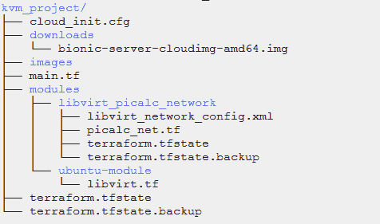**

**在' **main.tf'** 文件所在的项目工作区中，通过运行' *terraform init'* 和 *'terraform apply'* 来测试代码。这应该会创建一个新的虚拟机。结果应该类似于上一章，其中创建的机器根据给定的 MAC 地址获得一个租用的 IP。这当然只有在网络已经运行的情况下才有效。完成测试后，确保摧毁基础设施。此外，销毁并取消定义 libvirt 网络，因为从现在开始我们也应该能够从' *main.tf'* 文件创建网络。**

****编排示例:负载平衡** 在本章中，在第 8.3 章中创建的名为 *'libvirt_picalc_network'* 的模块和在第 8.5 章中创建的名为 *'ubuntu_module'* 的模块将被合并，以创建一个单独的 picalc 服务。ubuntu 模块将用于创建三个独立的虚拟机，它们将被放置在同一个网络中。其中一个虚拟机将作为其他两个机器的负载平衡器，它将接收针对典型服务器的 HTTP 请求，然后决定哪个服务器将以循环方式处理该请求。注意下面的草图和解释。**

**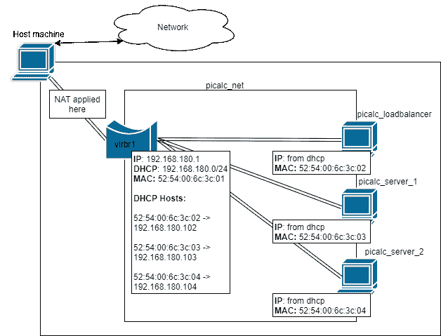**

***图 7 —负载平衡器网络接口配置(使用 draw.io 制作)***

**为了能够为运行 PiCalc 服务器的虚拟机提供负载平衡服务，使用静态 IP 地址将非常有用。第 8.4 章讨论了使用 DHCP 协议实现这一点的方法。在这里，主机在创建之前被设置为 MAC 地址，以便它在网络上可用时获得固定的 IP 地址。这也可以在上面的草图中看到，并将在所有机器上完成。**

**负载平衡服务将从名为*‘main . TF’*的单一 Terraform 配置文件中运行。这个文件是在上一章中创建的。在开始操作前清除其内容。新增加的内容将是对*‘lib virt _ picalc _ network’*的一次调用以创建网络，对*‘Ubuntu-module’*的三次调用以创建三个虚拟机。除了主文件中的这些附加内容，我们将创建一个特定于负载平衡器的新用户配置文件，以便在创建时启动其服务。这将在一个名为*‘cloud _ init _ lb . CFG’*的新文件中完成。**

**1.编辑 *'main.tf'* 并清除其内容。**

**2.添加网络模块定义，以便在同一个' *main.tf'* 文件中创建和管理网络。**

```
**# run the network
module **“picalc-network-module”** {
   source = “./modules/libvirt_picalc_network/”
}**
```

**3.使用下面的示例代码添加这三个模块。它们将用于创建虚拟机。第一个模块将创建一个虚拟机，我们在其中运行一个脚本来实现负载平衡。这将在下面的步骤中讨论。第二个和第三个模块将创建一个典型的服务器。这是可能的，因为我们当前的用户数据配置， *cloud_init.cfg，*被配置为在启动时设置一个典型服务器，如第 8.1 章中所创建的。这也是负载平衡器的配置文件不同的原因，因为它不需要在启动时运行典型服务器。除了用户配置文件，请注意添加到每台机器的 mac 地址。这些地址当然可以是任何其他有效的 mac 地址。**

```
**# load balancer
module **“picalc-lb”** {
   # load the module
   source = “./modules/ubuntu-module/”
   # set the variables
   machine_name = “loadbalancer”
   network_name = “picalc_net”
   mac_address = “52:54:00:6c:3c:02”
   user_data_path = “${path.module}/cloud_init_lb.cfg”
}# picalc server 1
module **“picalc-server-1”** {
   # load the module
   source = “./modules/ubuntu-module/”
   # set the variables
   machine_name = “server_1”
   network_name = “picalc_net”
   mac_address = “52:54:00:6c:3c:03”
   user_data_path = “${path.module}/cloud_init.cfg”
}# picalc server 2
module “picalc-server-2” {
   # load the module
   source = “./modules/ubuntu-module/”
   # set the variables
   machine_name = “server_2”
   network_name = “picalc_net”
   mac_address = “52:54:00:6c:3c:04”
   user_data_path = “${path.module}/cloud_init.cfg”
}**
```

**4.负载均衡器的虚拟机已经可以用上面的例子创建了。我们只需要创建一个新的 *cloud_init.cfg* ，它是特定于负载均衡器的，因为我们不希望在机器上运行相同的典型服务器。通过将*‘cloud _ init . CFG’*文件复制并粘贴到与*‘cloud _ init _ lb . CFG’*相同的目录中来实现。**

```
**$ cp ~/kvm_project/cloud_init.cfg ~/kvm_project/cloud_init_lb.cfg**
```

**5.打开并编辑 *'cloud_init_lb.cfg'* 文件。**

**6.更改 *'runcmd:'* 下的部分，以便在启动时创建负载平衡器。使用下面的代码示例来实现这一点。可以看出，与前面的指令使用了相同的 PiCalc git 存储库。程序的使用方式略有不同。要安装负载平衡器，需要一个额外的' *lb'* 选项。此外，要运行服务器，我们必须将模式设置为 **lb** ，并使用 **lb_config** 选项添加一些配置。下一步中关于 **lb_config** 选项的更多信息。**

```
**# run command at boot
runcmd:
   - [“cd”, “/home/terraform_guest”]
   - [“git”, “clone”, “https://github.com/krebsalad/PiCalcPy.git"]
   - [“cd”, “PiCalcPy”]
   - [“python”, “install_picalc.py”, “lb”]
   - [“python”, “run.py”, “mode=lb”, “lb_config=      [options]\nbuffer_size=4096\n\n[mappings]\n**80=192.168.180.103:8080,192.168.180.104:8080”,** “&”]**
```

**7.负载平衡器非常容易配置。所使用的负载平衡器称为 pumpkin lb*(“Savannah t .，PumpkinLB A simple，fast，pure-python load balancer”，(2019a)* ，可以使用从 github 克隆的典型示例进行安装。负载平衡器的工作方式如下。首先可以在**【选项】**标签后面给出一些选项。我们以字节**将缓冲区大小设置为 **4096** 。**选项后跟随着**【映射】**标签。这需要为传入消息公开一个端口，以及一个或多个 IP 地址，包括要监听的端口。在我们的例子中，我们需要改变这些来匹配在网络定义中静态配置的 IP 地址。请按照以下步骤进行。**

**8.打开网络配置，根据步骤 III 中定义的 MAC 地址和上一步中的负载平衡器配置添加两台新的静态主机。**

```
**$ nano ~/kvm_project/modules/libvirt_picalc_network/libvirt_network_config.xml**
```

**9.将下面的粗体标记行添加到您的配置中，以便新添加的主机也能获得 DHCP 租用的固定 IP 地址。请注意，添加的 IP 地址是服务器的 IP 地址。我们之前已经添加了负载平衡器虚拟机的地址。在任何情况下，请确保主机的 MAC 地址与步骤 III 中给出的相应地址匹配，并且主机的 IP 地址与步骤 VII 中设置的地址匹配。请注意示意图 7 中完整的主机表和相应的主机。**

```
**<dhcp>
   <range start=’192.168.180.2' end=’192.168.180.254'/>
   <host mac=’52:54:00:6c:3c:02' ip=’192.168.180.102'/>
   **<host mac=’52:54:00:6c:3c:03' ip=’192.168.180.103'/>
   <host mac=’52:54:00:6c:3c:04' ip=’192.168.180.104'/>** </dhcp>**
```

**10.现在，保存文件并退出。**

**11.Terraform 配置应该可以运行了。但是在运行' *main.tf* '文件之前，确保不存在与我们要创建的域名、网络或池同名的域名、网络或池是非常有用的。通过使用本文档中学习到的各种调试命令来实现这一点。关于这些命令的更多信息也可以在第 13 章**中找到。故障排除**。此外，如果您的主机有所有可用的资源，因为三台客户机将同时运行，这将非常有用。这应该适用于少于 4 个内核的情况，但是一些进程交换会发生很多，使它非常慢。在主机是虚拟机的情况下，当有太多的进程交换时，它可能会崩溃。**

**12.进入主工作区 *'~/kvm_project'* ，运行' *terraform init* ，然后运行 *'terraform plan'* ，规划配置。您将看到总共创建了 13 个资源，其中 4 个用于第一个 PiCalc 服务器，另外 4 个用于第二个 PiCalc 服务器，另外 4 个用于负载平衡器，最后一个用于 libvirt 网络。如果你不记得这些资源是什么，请注意第 7 章。**

**13.通过在主工作区运行*‘terra form apply’*来运行配置。当您键入*‘yes’*时，基础架构将被创建。**

**14.在机器被创建并且地形被完成之后继续这里。使用*‘虚拟控制台<n>’*启动三个新的终端来监控虚拟机的启动。使用*“虚拟列表—全部”*命令，根据控制台的编号更改 *< n >* 。为创建的每个虚拟机打开多个控制台。在这里，你必须等到机器完全启动。完成后不要按回车键，因为当 cloud init 安装完成时，您可以看到服务器是否正在运行。**

**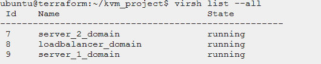**

**15.使用*‘virsh net-DHCP-leases picalc _ net’*确保所有机器都获得了 ip 租约**

**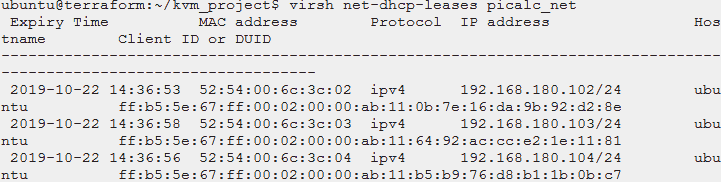**

**16.最后，通过向'*192 . 168 . 180 . 102:80/PiCalc/100*'发送 HTTP 请求来测试 PiCalc 负载平衡服务。这是我们为负载平衡器设置的 iP 地址。这样做多次，你会注意到连续请求后返回的 IP 地址不同。**

**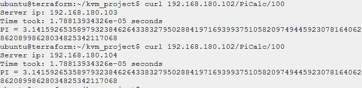**

# **9.正在为 docker 安装 Docker 和 Terraform 提供程序**

**[返回目录](#29e6)**

**本章解释了 Docker provider 插件在 Terraform 中的用法。Docker 主要用于互联网上的云服务中，以封装各种应用程序。这使得它成为使用 Terraform 实现自动化的完美候选，因为 docker API 很容易获得，并且可以与 Docker Swarm 和 Docker Compose 一起使用。(官方)Docker 提供者插件使得通过 Terraform 与 Docker 引擎交互成为可能。**

**我们将在本章中继续使用相同的主机环境(Ubuntu 18.04)，并假设 Go 和 Git 已安装(如前面 6.3 章所述)。**

**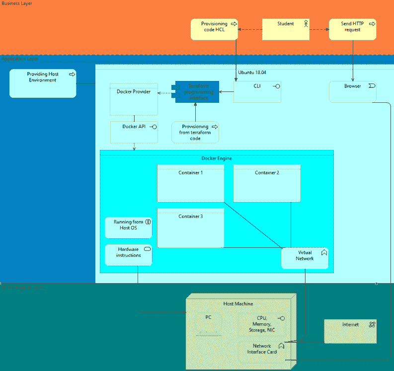**

***图 8 —静态主机(使用 Archi 制作)***

**见上图。在本章中，我们将使用 Docker provider 插件创建 3 个复制容器。这些容器将由 Terraform 创建，作为 Docker 服务运行**

**覆盖网络。目标是部署一个 docker 映像并对其进行水平缩放。容器复制通常用于保持尽可能高的正常运行时间。必须事先创建图像，因为 Terraform 不提供基于 docker 文件的图像自动生成。构建我们的架构的过程将包括生成包含一个示例应用程序(例如，PiCalc)的 docker 映像。接下来，我们将配置和规划我们的 Terraform 服务来使用这个映像并复制它，并创建一个 Docker 网络。**

****安装 docker 引擎
我们需要手动添加库，因为 Ubuntu 的库中没有 Docker。****

**1.打开一个终端模拟器，将官方 Docker 存储库添加到 APT(为此，我们下载 Docker 公钥，将其添加到 APT，然后安装' docker-ce '**

```
**$ curl -fsSL [https://download.docker.com/linux/ubuntu/gpg](https://download.docker.com/linux/ubuntu/gpg) \ | sudo apt-key add -$ sudo add-apt-repository \“deb [arch=amd64] [https://download.docker.com/linux/ubuntu](https://download.docker.com/linux/ubuntu) bionic stable”$ sudo apt update$ sudo apt install -y docker-ce**
```

**2.启用并启动 Docker 引擎服务:**

```
**$ sudo systemctl enable — now docker**
```

**3.验证 Docker 服务已启动并正在运行**

```
**$ sudo systemctl status docker**
```

**Systemd 应该给出关于容器引擎运行的结果:**

**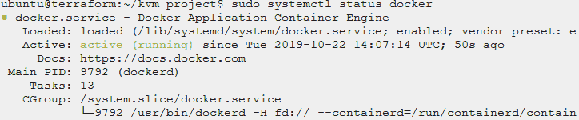**

**4.从这里开始，可以启动新的容器，但是在此之前，我们必须配置我们的 Terraform 用户，使其拥有使用 Docker 服务的权限。为此，我们必须将我们的用户添加到 docker 组。**

**5.将我们的 Terraform 用户添加到 docker 组，让 Terraform 在没有 root 用户的情况下使用 Docker。将*‘Ubuntu’*改为运行 Terraform 的主机用户。**

```
**$ sudo groupadd docker #in case its not created by default$ sudo usermod -aG docker ubuntu**
```

**6.强烈建议注销并重新登录系统(或从当前会话启动新会话)，然后通过检查组的输出来验证用户是否已添加到组中。**

```
**$ su — ubuntu$ groups**
```

**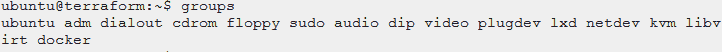**

**7.验证用户是否被允许运行 Docker。为此，将执行一个小的“hello world”测试。**

```
**$ docker run hello-world**
```

**这应该输出典型的 Docker 'Hello from Docker '文本。**

**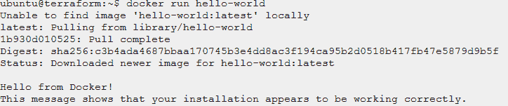**

****编译和安装 Docker 提供程序****

**1.导出我们的路径变量，以防以前没有这样做过。**

```
**$ export PATH=$PATH:/usr/lib/go/bin$ export GOPATH=/usr/lib/go**
```

**2.根据我们的路径创建源目录。我们将在这些目录中克隆源代码，类似于第 6.4 章。(如果本章已经完成，目录“terraform-providers”应该已经存在)。**

```
**$ sudo mkdir -p $GOPATH/src/github.com/terraform-providers$ cd $GOPATH/src/github.com/terraform-providers**
```

**3.克隆官方 git 存储库。**

```
**$ sudo git clone github.com/terraform-providers/terraform-provider-docker.git**
```

**4.进入提供者的目录，用下面的命令构建它。在这个 makefile 中,“make”默认目标安装提供程序。**

```
**$ cd terraform-provider-docker$ sudo make**
```

**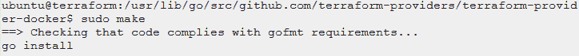**

**5.通过运行验证插件是否已安装。GO 可执行路径已经在我们的路径环境中，所以它可以从任何目录直接运行。**

```
**$ terraform-provider-docker -version**
```

**该命令应该输出一条关于其用法的警告消息:**

****

**6.将插件符号链接到 Terraform 插件目录，以便 Terraform 使用它。**

```
**sudo ln -s /usr/lib/go/bin/terraform-provider-docker ~/.terraform.d/plugins/**
```

# **10.使用 Terraform 部署 Docker 示例**

**[返回目录](#29e6)**

**本章将通过指导用户完成步骤和配置文件，演示 Terraform 必须通过 Docker provider 插件提供的一些基本功能。**

**通过 Terraform 与 Docker 进行交互与 Terraform 的传统用法不同，因为它不再是基础设施即服务，而是直接在运行 Terraform 的同一台主机上部署容器化的应用程序。如果人们寻求将松散应用程序的部署与分布在多个 Terraform 模块上的基础设施的其余部分统一起来，或者如果其他 Terraform 模块依赖于在早期部署或后期部署期间碰巧在 Docker 容器中的某个应用程序，这是有意义的。**

**随着 Docker 在我们的 Ubuntu 18.04 主机上的安装如第 9 章所述完成，我们将继续两个例子:**

*   **带有默认测试页面的简单容器化 Apache web 服务器。**
*   **我们自己生成的映像，它将被初始化为带有副本的 Docker 服务(因此是自动负载平衡的)。在我们的示例中，一个名为“PiCalc”的 NodeJS 应用程序将用于分发请求。**

**必须指出的是，在本文档制作时，Terraform 没有提供与 Docker 合成和 Docker 文件使用的集成。这意味着我们不能基于配置来构建我们的映像。因此，第二个示例我们将直接使用 Docker 通过 Docker Compose 构建我们的映像，并使用 Terraform 运行它。或者，这可以通过使用远程执行或本地执行置备程序来实现，如前面第 5.3 章所述。我们不会使用它，而是直接使用 Docker。**

****使用 Docker Hub** 构建一个简单的 web 服务器示例第一个示例演示了实际上只需要很少的配置就可以启动并运行 Docker 容器，并且所使用的 Docker 映像可以根据用例用许多其他映像替换。将创建一个类似于第 5.3 章的资源。**

**1.在 Terraform 工作目录下创建一个新文件夹，我们称之为‘docker _ web’**

**2.进入项目目录，创建一个名为' *cloud_init.cfg '的新文件。***

```
**$ cd ~/docker_web/$ terraform init**
```

**最后一个命令的输出将通知用户 Terraform 在当前的空目录中初始化成功，我们准备继续。**

**3.用你喜欢的编辑器创建一个新的 terraform 模块，我们称它为‘main . TF ’,因为我们遵循 Terraform 为最小模块推荐的文件名。**

```
**$ nano main.tf**
```

**4.在我们解释时，将下面的代码片段附加到文件中。**

```
****#main.tf** provider **“docker”** {
   host = **“unix:///var/run/docker.sock”**
}
#…**
```

**5.首先，我们将提供者设置为运行 Docker 守护进程的主机。理论上可以使用任何外部 docker 主机(如 Azure、AWS 或 libvirt 虚拟机)，但为了简单起见，我们直接连接到我们的本地 Docker 守护进程，如第 9 章所配置的。**

```
**resource **“docker_image” “httpd”** {
   name = **“httpd:2.4”**
}#prints the used contained ID for demonstration, optional
output **“Docker Image”** {
   value = **“Using ${docker_image.httpd.latest}”**
}
#…**
```

**6.接下来，我们为包含我们想要使用的应用程序的 docker 映像定义一个 Terraform 资源。这里接受的参数与 docker run 相同。这意味着，如果指定的映像不是本地安装的，它将自动从 Docker Hub 获取它。对于这个例子，我们使用的是官方的 Apache 镜像版本 2.4。**

```
**resource **“docker_container” “webserver”** {
   name = **“webserver”**
   image = “${docker_image.httpd.latest}”
   count = 1 #we come back to this optional variable later!
   ports {
      internal = **80**
      external = **80**
   }
}**
```

**7.最后，我们使用 docker_image 资源创建资源来制作 Docker 容器。我们的 docker_image.httpd 资源对象的属性 latest 包含一个带有 SHA256 ID 的字符串，它表示在命令' $docker images '的输出中看到的图像的名称。Terraform 只接受此格式作为“image =”属性的有效输入。在添加您自己的本地图像时，注意不要创建不明确的图像名称，还要确保 Terraform 不会删除任何图像(在第二个示例中有更多相关内容)**

**8.“端口”块指定 Docker 将从容器向外界转发哪些端口。在当前版本的提供程序插件中只能使用一个端口块。**

**9.为了便于参考和更好地理解，完整的上述脚本将实现完全等同于:**

```
**#docker run — name webserver -p 80:80 apache:2.4**
```

**10.通过运行以下命令应用 Terraform 配置:**

```
**$ terraform apply**
```

**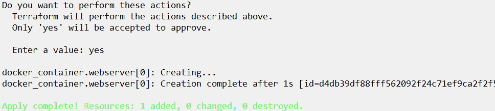**

**11.出现提示时输入“yes”后，Terraform 现在将创建容器并打印其完整的 SHA256 ID。这可以在检查例如' $ docker ps '以及' $ docker stats '的输出时使用，以了解容器已启动并正在运行。**

**12.浏览器连接到 IP terra form 的结果应该如下。请注意，要输入的 IP 可能会因您的主机网络配置而异。**

****

**13.在继续下一个示例之前，在我们的项目文件夹中使用以下命令删除基础结构:**

```
**$ terraform destroy**
```

**14.这将停止并清理任何 Docker 容器。请注意，它还会清除之前本地或通过 Docker Hub 远程提取的图像。**

****使用定制容器和负载平衡构建可伸缩的 Docker 服务。** 我们已经在第一个例子中看到了如何基于 Docker Hub 的可下载容器轻松创建容器。然而，它提供了较低的灵活性和定制性。**

**虽然可以使用“count =”属性创建多个容器，但在我们的情况下这不是很有用，可能会导致端口冲突，并且不提供负载平衡。**

**为了解决这个问题，将使用第二个示例，我们创建自己的本地 Docker 映像，运行前面提到的 PiCalc NodeJs 示例应用程序。它还将展示 Docker Compose 中常用的更高级、更有用的代码块。结果将是 4 个 Docker 容器一起工作，每个容器都有 25%的最大 CPU 负载和 100MB 分配的 RAM 来同时计算典型的请求。这通过减少队列时间提高了性能，并通过冗余实现了增强的可用性。**

**因为 Terraform 完全是脚本驱动的，所以基于脚本(换句话说，Docker 文件)构建我们自己的 Docker 应用程序是有意义的。然而，目前还不可能自动完成映像构建过程，因此我们将手动运行$ docker image create。**

**该示例将由以下步骤组成:**

**1.基于示例 Docker 文件生成我们的 Docker 图像**

**2.创建并规划(但尚未应用)我们的 Terraform 配置文件。**

**3.将主机添加到 Docker 群组。**

**4.应用(运行)Terraform 模块，并在浏览器中验证结果。**

**1.为我们的示例创建一个新的项目文件夹:**

```
**$ mkdir terraform-docker-picalc$ cd terraform-docker-picalc**
```

**2.为了创建我们自己的图像，我们必须基于 order 文件生成一个图像。这是一个文本文档，包含了组装图像所需的所有 shell 命令。它还包含从现有图像派生图像的特殊字段，以及执行我们任务的命令。**

**3.用您喜欢的名为 Dockerfile 的编辑器创建一个新文件，并将以下内容添加到该文件中:**

```
****#Dockerfile** FROM node:10
MAINTAINER terraform_user
WORKDIR /app
RUN git clone [https://github.com/pb12/PiCalc](https://github.com/pb12/PiCalc) .
RUN npm install
CMD [ “node”, “server.js” ]**
```

**4.简而言之，这个 Docker 文件将从 Docker Hub 中提取一个现有的(基于 Ubuntu Linux 的)映像，并将官方 Git 库克隆到一个文件夹/应用程序中。因为已经使用了为使用 NodeJS 而设计的基础映像，所以不需要额外的步骤，NodeJS 应用程序可以立即用 CMD 语句执行。**

**5.构建并安装供本地使用的映像。我们将这个图像命名为“picalc ”,并为它分配一个标签“git”。**

```
**$ docker image build -t picalc:git .**
```

**6.输出应该以“成功构建了 a46004371aeb”和“成功标记了 picalc:git”结束。因为 docker 容器的惟一 SHA256 ID 在每次构建映像时都会发生变化，所以输出也会发生变化。Terraform 将使用该 ID，如第 10.1 章步骤 IV 所示。**

**7.现在我们已经手动构建了我们的映像，因为在编写本指南时，提供者插件没有提供这样的功能。但是，我们也可以指示 Terraform 在将来使用“null_resource”为我们运行该命令，如第 5.3 章所示:**

```
****#optional code snippet, not required for the next step** resource “null_resource” “create_local_image” {
   provisioner “local-exec” {
      command = “docker image build -t picalc:git .”
   }
}**
```

**8.每当 Terraform 创建我们的 Docker 基础设施时，这将创建我们的形象。但是因为图像创建过程并不总是保证总是成功的，所以它可能会在将来突然使 Terraform 应用过程失败，因此我们不推荐这种解决方法。**

**9.使用您喜欢的编辑器创建一个名为“main.tf”的新文件，将下面的代码片段添加到该文件中，我们将详细解释它们。**

```
**$ nano main.tf**
```

**第一段:**

```
****#main.tf**resource “docker_image” “picalc_image” {
   name = “picalc:git”
   keep_locally = true #We don’t want Terraform to remove our local           image
   #depends_on = [null_resource.image_create_local] #if the NR is   used
}
#…**
```

**第一个资源类似于第 10.1 章中的前一个例子。然而这一次，一个不同的图像将被用于容器，也就是我们刚刚构建的那个。与 Docker CLI 类似，它将首先在本地搜索容器，如果映像在本地不存在，它将搜索 Docker Hub。**

**每当本地图像与 Terraform 一起使用时，属性 keep_locally 必须设置为 true(默认为 false)。如果使用默认值，在 Terraform 破坏基础设施后，本地保存的 Docker 映像版本(下载的或构建的)将被删除。**

**第二个也是最后一个片段:**

```
**resource **“docker_service” “app-server”** {
   name = **“picalc-service”**task_spec {
   restart_policy = {
      condition = **“on-failure”** #if it crashes, container will respawn
  }
   container_spec {
      image = **“${docker_image.picalc_image.latest}”**
}
   resources {
      limits {
         nano_cpus = **250000000** #~25% load, 1*10^-9 CPU shares in ns
         memory_bytes = **100000000** #100MB, same as 100*10⁵ bytes
    }
  }
}mode {
   replicated {
    replicas = **4**
  }
}
  endpoint_spec {
    ports {
      target_port = “**80**”
      published_port = “**80**”
    }
  }
}**
```

**最后一个资源实际上定义了我们的 Docker 服务。它由几个必需和可选的块组成。必须注意，这些块**必须具有这些确切的名称**，并且包含最少的必需属性。最小 docker 服务由至少一个任务规范(task_spec)和一个端点规范(endpoint_spec)块组成。**

**10.在 task_spec 中，我们为 Docker 设置了重启策略，并为服务中的容器指定了使用的映像。我们还使用块资源来防止容器占用所有的 CPU 执行时间。这是 PiCalc 在尽可能利用 CPU 的情况下同时处理 4 个请求所必需的。**

**模式块指定制作容器的 4 个副本，以便在我们的服务中使用。它不同于上一个示例中使用的 count =,因为这次它将在 aa 服务中创建，而不是单独创建。副本在虚拟负载均衡器后面一起工作(感谢 Docker Swarm 在后台为我们工作)。最后，我们在 ports 块中定义了要转发的端口，类似于前面的示例。**

**11.作为参考，Terraform 配置现在实现了相同的直接 Docker 命令:**

```
**# docker service create — publish 8080 \
 — name picalc-service \
 — cpus 0.25 \
 — memory 100M \
 — restart-condition=”on-faillure” \
 — mode replicated \
 — replicas=4 \
picalc:git**
```

**或者，它将完全替换此 Docker 合成文件，如果它将被使用:**

```
****#docker-compose.yml, for reference only** version: “3”
services:
   myservice:
      image: picalc:git
      deploy:
      replicas: 4
      resources:
      limits:
         cpus: “0.25”
         memory: 100M
      restart_policy:
      condition: on-failure
      ports:
      - “80:80”
      networks:
      - net1
networks:
   net1:version: “3”
services:
   myservice:
   image: picalc:git
   deploy:
   replicas: 4
   resources:
   limits:
      cpus: “0.25”
      memory: 100M
   restart_policy:
   condition: on-failure
   ports:
   - “80:80”**
```

**12.启动我们的基础设施。为此，我们需要在项目文件夹中初始化 Terraform。这可能是一些缺失的插件。**

```
**$ terraform apply**
```

****

**使我们的主机成为 Docker 群管理器，这必须手动完成，因为提供商不能**

```
**$ docker swarm init**
```

****

**现在应用配置，这可能需要一些时间。出现提示时，输入“是”。**

```
**$ terraform apply**
```

**13.现在是时候在浏览器中检查最终结果了。我们将发送一个请求来计算圆周率的前 5000 位小数，作为我们服务的演示工作负载。执行请求时，检查以下各项的输出:**

```
**$ docker stats**
```

**14.这个命令监控容器的资源利用情况。**

**15.现在发送请求，输入您的主机 IP 地址，后跟/？n =小数。其中 decimals 是要计算的π的小数位数。**

****

**其中一个容器现在正在处理请求，CPU 上限在我们的 Terraform 配置中配置。可以打开多个浏览器选项卡并发送更多请求来查看工作负载的分布情况。**

# **11.正在为 Windows 安装 Azure CLI 和 Terraform**

**[返回目录](#29e6)**

**在本章中，我们将安装使用 Terraform 在 Azure provider 中部署资源所需的工具。所需的工具是 Azure CLI。这将用于通过 Azure provider 来验证我们自己，该提供程序可用于 Terraform。我们将在下一章深入讨论之前安装这些工具。此外，本章中还有在 Windows 10 上安装 Terraform 的说明。在整个指南中使用的同一台机器上，仍然可以遵循这些说明。**

****安装 Terraform (Windows 10)** 在本节中，我们将为 Windows 10 安装 Terraform。当使用 Azure 时，在 Windows 上使用 Terraform 提供了更简单的工作流程。我们从官方网站安装 Terraform，然后我们必须将其设置为全局路径。**

**1.为 Windows 10 下载 [Terraform](https://www.terraform.io/downloads.html)**

**下载包含一个可执行文件。把它放在任何你喜欢的文件夹里，并记下路径。**

**2.转到控制面板->系统和安全->系统->高级系统设置->环境变量。**

**3.搜索变量“Path”并双击它。**

**4.单击新建并添加 Terraform 的路径(不带。exe 文件)后添加分号(；)在最后一个条目上。**

**例如:`C:\Users\<user-name>\Terraform\`**

****

***图 9 —配置环境变量(截图)***

**5.现在可以去 Powershell 用 Terraform 了。**

****

****注意:**如果您收到未安装 Terraform 的错误信息。PATH 环境变量设置不正确。**

****安装 Terraform (Windows 10)** 我们将需要为 Terraform 使用 Azure CLI 来初始化您的帐户。有了它，你就可以直接在 Terraform 上使用你的账户，而不用去 Azure 门户网站。**

**1.下载 [Azure CLI](https://docs.microsoft.com/en-us/cli/azure/install-azure-cli-windows?view=azure-cli-latest) 并安装。**

**2.重新启动 Powershell。仅重启 Powershell 并不总是有效，建议同时重启您的计算机或虚拟机。**

**3.运行登录命令:`az login`**

**默认浏览器将会打开，在那里你可以使用你的 Azure 凭据登录。**

****

# **12.使用 Terraform 在 Microsoft Azure 上调配功能应用程序**

**[返回目录](#29e6)**

**在本章中，我们将在 Windows 上的 Microsoft Azure 中创建一个典型的应用程序。这次我们选择了 Windows，因为我们已经在 Linux 中做了所有的事情。所以我们想证明这在 Windows 中也是可能的。当然你也可以在 Linux 上这样做，但是你必须自己做。**

**微软 Azure 是众所周知的云计算服务。它提供不同云服务的使用，包括计算、分析、存储和网络服务。我们主要通过 Azure 来使用它，因为可以创建一个学生帐户。学生可以使用学生 Azure，他们将获得€100，000 信用点来购买 Azure 资源。这当然是指南这一部分的先决条件。**

**使用 Azure 将帮助您了解更多有关使用 Terraform 进行远程供应的信息。**

****为 Azure 创建 Terraform 配置** 如前所述，为 Terraform 进行的配置是在扩展名为. tf 的配置文件中完成的，这些配置可以用两种格式编写:HashiCorp 配置语言(HCL)，或 JavaScript 对象符号(JSON)。HCL 是 HashiCorp 创造的一种语言，它对机器友好，但对人类来说容易阅读。JSON 是一种众所周知的语言，具有与 HCL 相同的方面，但有时当配置由机器生成时更好。你可以选择你想用哪一个，但是在这一章我们将继续使用 HCL。**

**我们将制作一个基本的 Azure provider 块。**

1.  **创建一个名为`kvm_project/`的新项目工作区**

**2.在项目目录中创建一个名为`main.tf`的空文件**

**3.下面的代码将告诉我们将使用哪个提供者**

```
**provider **“azurerm”** {
   version = “=1.34.0”
}**
```

**version 参数是可选的，用于将提供程序约束到特定版本甚至某个范围。这将阻止提供程序下载新的提供程序，这可能会破坏更改。**

**4.在下一节中，我们将创建一个资源块。资源块有两个字符串参数，如下所示。**

```
**resource **“<resource_type>” “<resource_name>”** {
   name = “HelloWorld”
   location = “westeurope”
}**
```

**5.将步骤 2 和 3 中的代码复制粘贴到我们在步骤 1 `main.tf`中创建的文件中。**

**不要忘记更改资源类型和资源名称。将 **azurerm_resource_group** 中的`<resource_type>`和 `<resource_name>`更改为您想要的任何名称。我们就称之为`rg`。**

****使用 Terraform 提供 Azure 资源** terra form 的三个重要命令是:terraform init、terraform plan 和 terraform apply。第一个命令用于新配置，初始化本地设置和数据。**

**使用第二个命令，可以看到您将要进行的所有更改。Terraform apply 将执行配置文件中描述的所有更改。**

**1.转到您创建配置文件的项目文件夹**

**2.使用命令:`terraform init` Terraform 将下载提供者插件。**

****

**3.现在使用`terraform apply`，我们不必运行`terraform plan,`，因为我们没有改变基础设施。确保您已经使用`az login`登录，否则命令将会失败。**

**4.转到*portal.azure.com*并点击左侧的*资源组*面板。您将在这里找到您在上一章中定义的资源组。在我们的例子中，我们将其命名为`HelloWorld.`**

**5.摧毁用`terraform destroy`创建的资源组。这应该会开始破坏资源。过一会儿，资源组也将在 Azure portal 中消失。**

****使用 Terraform** 创建一个作为 Azure 函数应用的 PiCalc 服务器。在本节中，我们将创建一个 Azure 函数应用，并在其上运行 PiCalc 服务器。在这一章中，我们将使用我们创建的两个不同的 docker 映像，它们都有彼此不同的实现。其中一个基于 NODE|10 Docker 映像，另一个基于最新发布的 Python Docker 映像。这些映像被配置为在启动时启动一个典型的服务器，并将成为 Azure Function 应用程序的配置，该应用程序使用 Linux 容器作为站点配置。**

**两个映像中服务器的实现是不同的，基于 python 的 Docker 映像将运行我们在本文中使用的相同的典型 Python 服务器。在 NODE variant 上将运行我的老师 Pieter Burghouwt 爵士创建的 PiCalc 应用程序，我们必须感谢他创建了这个应用程序。下面我们将展示用于创建这些映像的 docker 文件，这些映像可以在启动时运行典型的服务器，当然还有用于创建基于这些映像的 Azure Function 应用程序的 Terraform 代码。**

****Dockerfiles** 首先，我们将研究用于创建图像的两个 Dockerfiles。Dockerfile 文件的使用已经在第 10 章解释过了。注意下面的 docker 文件和它们后面的解释。**

****Nodejs****

```
****FROM** node:**10**
**MAINTAINER** Nitesh
**EXPOSE** **8080**
**COPY** /PiCalc ./PiCalc
WORKDIR /PiCalc
RUN npm install
CMD [ **“node”**, **“server.js”** ]**
```

**首先，我们下载一个名为 node:10 的图像。然后，我们将 app 文件复制到容器中，并将 shell 实例的目录更改为 PiCalc app 目录。运行命令总体上用于安装应用程序或软件包。CMD 命令允许您设置一个默认命令，该命令只有在您运行 container 而没有指定命令时才会执行。**

****Python****

```
****FROM** python
**MAINTAINER** Nitesh
**EXPOSE** **8080**
**COPY** /PiCalcPy ./PiCalcPy
WORKDIR /PiCalcPy
RUN python install_picalc.py
CMD [ **“python”**, **“run.py”**, **“mode=server”** ]**
```

**基本上我们在这里做的和上面差不多。这种流程安装也非常类似于我们在第 8 章“云初始化配置”中配置虚拟机运行的方式。这里我们还调用了相同的命令来运行 PiCalc 服务器。**

**执行这两个 After 文件后，我们为它们创建了两个新的映像。你可以在 DockerHub 的[和](https://hub.docker.com/r/ineshi/picalcpy)[找到它们。在下一节中，这些将用于创建一个 Azure 函数应用程序。](https://hub.docker.com/r/ineshi/picalc19)**

**在 GitHub 上可以找到 PiCalc 代码: [PiCalcPy](https://github.com/krebsalad/PiCalcPy) 和 [PiCalc19](https://github.com/pb12/PiCalc) 。**

**我们不打算解释代码，它非常简单，基本的 Python 和 JavaScript。第七章已经解释了一个重要的部分。另外，请留意上述存储库中的 README.md 文件以获取更多信息。**

****配置 Terraform 模块部署典型功能 App** 在本节中，我们将创建一个新的配置。该配置将是一个包含. tf 文件的 Terraform 模块，该文件将包含部署 Azure 功能应用程序的代码。模块目录将被称为 modules/azure_picalc_function/**

**创建上述文件和目录。编辑`modules/azure_picalc_function/deploy.tf`文件。在这个文件中，我们将添加代码。**

**首先创建一个 Azure 资源组。这个资源组将包含我们的服务将在哪里托管的信息。在我们的例子中，我们将把＄{ var . location }设置为“westeurope”。资源组不会增加你在 Azure 中的成本。**

```
**resource **“azurerm_resource_group” “main”** {
   name = “${var.prefix}-resource”
   location = “${var.location}”
}**
```

**添加 Azure 存储帐户。**

***“存储帐户为您的 Azure 存储数据提供了一个唯一的命名空间，您可以通过 HTTP 或 HTTPS 从世界任何地方访问该命名空间*”。*(《微软，Azure 存储帐户概述》，2019c)***

**这是将部署 function App 的位置。请注意，resource_group_name 应该与资源的名称匹配。在下面的代码中，这是通过使用名称变量`azurerm_resource_group`来确保的。**

```
**resource **“azurerm_storage_account” “main”** {
   name = “${var.prefix}sa”
   resource_group_name = “${azurerm_resource_group.main.name}”
   location = “${azurerm_resource_group.main.location}”
   account_tier = “Standard”
   account_replication_type = “LRS”
}**
```

**在资源组中添加 Azure 应用服务计划。这将决定你在 Azure 上的消费计划，并将极大地定义将要创建的服务的性能，但同样也会极大地增加成本。请注意，下面的类型是“FunctionApp ”,这意味着我们将要运行的映像必须是 Linux 发行版的变体。其他选项有 FunctionApp、Linux 和 elastic 或 Windows。当种类设置为 Linux 时，reserved 必须设置为 true**

**此外，有可能改变层和大小，这当然会改变你目前支付的价格。请参见下图了解不同的选项:**

********

```
**resource **“azurerm_app_service_plan” “main”** {
   name = “${var.prefix}-asp”
   location = “${azurerm_resource_group.main.location}”
   resource_group_name = “${azurerm_resource_group.main.name}”
   kind = “FunctionApp”
   reserved = “true”sku {
    tier = “Standard”
    size = “S1”
 }
}**
```

**添加一个功能 app。这将部署典型服务。在下面的代码中，在 site_config 下可以看到设置了一个 linux_fx_version 值。这将拉一个 Docker 图像，并将其作为功能应用程序运行。本例中安装的 docker 映像是节点变体。**

```
**resource **“azurerm_function_app” “main”** {
   name = “${var.prefix}-function”
   location = “${azurerm_resource_group.main.location}”
   resource_group_name = “${azurerm_resource_group.main.name}”
   app_service_plan_id = “${azurerm_app_service_plan.main.id}”
   storage_connection_string = “${azurerm_storage_account.main.primary_connection_string}”# set picalcpy image as server example
   site_config {
   linux_fx_version = “DOCKER|ineshi/picalcpy:latest”
   #linux_fx_version = “DOCKER|ineshi/picalc19:latest”
 }app_settings = {
   “WEBSITES_ENABLE_APP_SERVICE_STORAGE” = “false”
   “DOCKER_REGISTRY_SERVER_URL” = “https://index.docker.io"
  }
}**
```

**如第 8 章所述，可以使用模块，以便可以从集中位置设置地形配置的变量。在上面的代码中，我们添加了几个变量，但从未定义它们。在本章中，我们将使用不同的方法创建一个单独的。包含变量和值的模块目录中的“tf”文件。例如，我们可以将这个新文件模块命名为/azure _ pi calc _ function/variables . TF**

**创建上面提到的文件，将下面可以找到的代码粘贴到 variables.tf 中，变量的语法是一样的。请注意，我们为所有变量设置了默认值。这将确保即使没有从调用模块的地方设置变量，代码也可以运行。**

```
**variable **“prefix”** {
   description = “The prefix used for all resources in this example”
   default = “picalc” 
}variable “**location**” {
   description = “The Azure location where all resources in this example should be created”
   default = “westeurope” 
}**
```

**要运行配置，您必须调用模块。编辑 main.tf 并添加以下代码来启动该模块。**

```
**module **“function_app_test**” {
   source = “./modules/azure_picalc_function/”
}**
```

**最后用 `‘*terraform init’*` 和`*‘terraform apply’*`运行配置。转到 Azure portal，然后点击*‘资源组’*，点击名为*‘典型资源’*的资源组。您将看到以下内容:**

****

**通过启动浏览器并根据您使用的 PiCalc 图像搜索以下 URL 之一来测试 PiCalc。加载要花很长时间，因为功能 App 要初始化各种东西。**

**(在本章给出的示例代码中，我们使用了`“DOCKER|ineshi/picalcpy:latest”`，但是您也可以使用`“DOCKER|ineshi/picalc19:latest”`作为站点配置。)**

```
**# PiCalcPy
[https://picalc-function.azurewebsites.net/PiCalc/100](https://picalc-function.azurewebsites.net/PiCalc/100)PiCalc19
[https://picalc-function.azurewebsites.net/?n=100](https://picalc-function.azurewebsites.net/?n=100)**
```

**上述 URL 的输出应该类似于以下输出(忽略下图中的 IP):**

****

# **13.解决纷争**

**[返回目录](#29e6)**

**本章将介绍使用 Terraform 和本指南中提到的提供商时可能出现的常见问题。这将在三个部分中完成，在这三个部分中可以找到使用提供程序时可能发生的问题的解决方案。在这些部分中，还将讨论一些可用于调试这些问题的工具。**

****调试 terra form provider libvirt** 使用 libvirt provider 时出现的大多数错误都与 lib virt 资源的创建有关。创建资源时，提供程序可能会因为各种问题而失败。因此，了解一些有助于调试这些问题的命令是很有用的。注意下面的命令及其描述。**

****

****常见问题和可能的解决方案****

> ****问题 1****
> 
> ****Error: virError(Code=38，Domain=7，Message= '无法将套接字连接到'/var/run/libvirt/libvirt-sock ':没有这样的文件或目录')，位于 libvirt.tf 的第 1 行，在提供程序“libvirt”中:1:提供程序“lib virt”{****

**当 libvirt 未启动时，可能会发生此问题。使用以下命令验证 libvirt 是否已启动:**

```
**$ sudo systemctl status libvirtd**
```

**如果它没有运行，请确保启动它。使用 systemctl 启动命令。**

> ****问题二****
> 
> ****错误:virError(Code=38，Domain=7，Message= '无法将套接字连接到'/var/run/libvirt/libvirt-sock ':权限被拒绝')****

*   **libvirt 在运行吗？**
*   **您的用户在 libvirt 组中吗？如果没有重做第 7.1 章设置权限**
*   **如果在虚拟机上，并且您刚刚第一次安装了 libvirt，请确保重新启动机器并重试。**

****第 7 章的一个常见问题** 如第 7 章所述，通过 libvirt 和 Terraform 部署 KVM 时，即使只出现了一个错误，也会出现某些问题，并且这些问题会相互影响。这里描述了已知的解决方案。问题 3 到 7 都是相关的，确保如果出现一个问题，在再次使用 Terraform Apply 之前，首先使用每个问题的所有已知解决方案。**

> ****问题 3****
> 
> ****错误:创建 libvirt 域时出错:…。无法打开“/tmp/terra form _ lib virt _ provider _ images/image . qcow 2”:权限被拒绝)****

**在 Libvirt 提供程序上应用 Terraform 计划时，可能会出现此问题。**

*   **这意味着无法访问该文件。确保被拒绝的文件的目录具有用户权限。该目录是否存在？因为 terraform 不能创建文件，除非它在/tmp/中。**

**您可以使用 chmod 命令更改 images 文件夹的权限。**

*   **确保/etc/libvirt/qemu.conf 中的 security_driver 设置为“none ”,而不是“selinux”**

**如果进行了更改，不要忘记重新启动 libvirt 服务:**

```
**$ sudo systemctl restart libvirtd**
```

> ****问题 4****
> 
> ****错误:定义 libvirt 域时出错:virError(Code=9，Domain=20，Message= '操作失败:域“ubuntu-domain”已经存在，uuid 为 56 A0 FCC 3-E8 a2–4 EAE-a9e 0-b 94 b 9 fc 2e 284 ')****

**在 Libvirt 提供程序上应用 Terraform 计划时，可能会出现此问题。经常发生在第七章。**

*   **这意味着您试图创建的资源已经存在。确保使用 virsh undefine 命令之一销毁所述资源。例如，当一个域已经存在时，如上例所示，运行以下命令。**

```
**$ virsh destroy ubuntu-domain**
```

> ****问题 5****
> 
> ****错误:创建 libvirt 卷时出错:virError(Code=90，Domain=18，Message = ' storage volume ' Ubuntu-amd64 . qcow 2 ' exists has ')****

**和**

> **e**Error:为 cloudinit 设备 commoninit.iso 创建 libvirt 卷时出错:virError(Code=90，Domain=18，Message = ' storage volume ' common init . iso '已存在')****

**当试图删除错误的地形图时，可能会出现此错误。经常发生在第七章。**

*   **由 Libvirt 创建的卷仍然附加到映像，并防止使用相同的卷名应用新的 Terraform。因此，需要移除这些:**

```
**$ virsh vol-delete commoninit.iso — pool ubuntu-pool && virsh vol-delete ubuntu-amd64.qcow2 — pool ubuntu-pool**
```

> ****问题 6****
> 
> ****错误:错误存储池“ubuntu-pool”已经存在****

**确保您也删除了创建的池，首先暂停它，然后删除它。经常发生在第七章。**

*   **删除在 Terraform 过程中创建的 libvirt 池:**

```
**$ virsh pool-destroy ubuntu-pool && virsh pool-undefine ubuntu-poolPool ubuntu-pool destroyed**
```

> ****问题 7****
> 
> ****错误:错误您的虚拟机名称已经存在****

*   **删除正在运行的虚拟机**

```
**$ virsh undefine your_vm_name**
```

# **文献学**

**“云初始化，云初始化 19.2 文档”，(2019a)。检索于 2019 年 10 月 15 日，来自[https://cloudinit.readthedocs.io/en/latest/](https://cloudinit.readthedocs.io/en/latest/)**

**“码头工人，什么是集装箱？”，(2019a)。检索于 2019 年 10 月 10 日，来自[https://www.docker.com/resources/what-container](https://www.docker.com/resources/what-container)**

**“Docker，为什么是 Docker？”，(2019b)。检索于 2019 年 10 月 10 日，来自[https://www.docker.com/why-docker](https://www.docker.com/why-docker)**

**“Docker，PayPal 与 Docker Enterprise 的使用案例”，(2019c)。检索于 2019 年 10 月 10 日，来自[https://www.docker.com/customers/paypal](https://www.docker.com/customers/paypal)**

**“Duncan Mac-Vicar P .，dmacvicar/terra form-provider-lib virt”，(2019a)。检索于 2019 年 9 月 30 日，来自[https://github.com/dmacvicar/terraform-provider-libvirt](https://github.com/dmacvicar/terraform-provider-libvirt)**

**“glitterlabs，Terraform UI”，(2019a)。检索于 2019 年 10 月 20 日，来自[http://www.glitterlabs.com/terraform_ui/index.html](http://www.glitterlabs.com/terraform_ui/index.html)**

**“谷歌，Go 编程语言”，(2019)。检索于 2019 年 10 月 10 日，来自 https://golang.org/**

**“哈希公司，简介—地形”，(2019 年 a)。检索于 2019 年 9 月 30 日，来自 https://www.terraform.io/intro/index.html**

**“HashiCorp，带 Armon Dadgar 的 HashiCorp Terraform 简介”，(2018b)。检索于 2019 年 10 月 11 日，发自[https://www.youtube.com/watch?v=h970ZBgKINg&t = 148s](https://www.youtube.com/watch?v=h970ZBgKINg&t=148s)**

**“HashiCorp，README.md — HCL 是 HashiCorp 配置语言”，(2019b)。检索于 2019 年 10 月 11 日，来自[https://github.com/hashicorp/hcl](https://github.com/hashicorp/hcl)**

**“码头供应商 hashi corp”(2019 c)。检索到 2019 年 10 月 10 日，[https://www.terraform.io/docs/providers/docker/index.html](https://www.terraform.io/docs/providers/docker/index.html)**

**“HaschiCorp，Azure 提供商”，(2019d)。检索于 2019 年 10 月 20 日，[https://www.terraform.io/docs/providers/azurerm/index.html](https://www.terraform.io/docs/providers/azurerm/index.html)**

**“HaschiCorp，Azure 提供程序:使用 Azure CLI 进行身份验证”，(2019e)。检索于 2019 年 10 月 20 日，[https://www . terraform . io/docs/providers/azure RM/auth/azure _ CLI . html](https://www.terraform.io/docs/providers/azurerm/auth/azure_cli.html)**

**“HashiCorp，空资源”，(2019f)。检索到 2019 年 10 月 10 日，[https://www.terraform.io/docs/providers/null/resource.html](https://www.terraform.io/docs/providers/null/resource.html)**

**“libvirt，KVM/QEMU 虚拟机管理程序驱动程序”，(2019a)。检索于 2019 年 10 月 15 日，来自[https://libvirt.org/drvqemu.html](https://libvirt.org/drvqemu.html)**

**“libvirt，虚拟化 API”，(2019b)。检索于 2019 年 9 月 30 日，来自[https://libvirt.org/](https://libvirt.org/)**

**“微软，什么是云计算”，(2019a)。检索于 2019 年 9 月 30 日，来自[https://azure . Microsoft . com/nl-nl/overview/what-is-cloud-computing/](https://azure.microsoft.com/nl-nl/overview/what-is-cloud-computing/)**

**《微软，什么是 Azure》，(2019b)。检索到 2019 年 10 月 20 日，[https://azure.microsoft.com/en-us/overview/what-is-azure/](https://azure.microsoft.com/en-us/overview/what-is-azure/)**

**《微软 Azure 存储账户概述》(2019c)，2019 年 10 月 23 日检索，来自[https://docs . Microsoft . com/en-us/Azure/storage/common/storage-account-overview](https://docs.microsoft.com/en-us/azure/storage/common/storage-account-overview)**

**“梅尔。宝洁公司。t，云计算 p2–3 的 NIST 定义，(2011a)。检索于 2019 年 9 月 30 日，来自[https://nvl pubs . NIST . gov/NIST pubs/Legacy/SP/nistspecialpublication 800-145 . pdf](https://nvlpubs.nist.gov/nistpubs/Legacy/SP/nistspecialpublication800-145.pdf)**

**“Redhat，KVM 是什么？”，(2019a)。检索于 2019 年 9 月 30 日，来自[https://www.redhat.com/en/topics/virtualization/what-is-KVM](https://www.redhat.com/en/topics/virtualization/what-is-KVM)**

**“Savannah T .，PumpkinLB 一个简单、快速、纯 python 的负载平衡器”，(2019 A)2019 年 10 月 20 日检索，[https://github.com/kata198/PumpkinLB](https://github.com/kata198/PumpkinLB)**

**“开放组，欢迎使用 ArchiMate 3.0.1 规范，一个开放组标准”，(2019a)。检索于 2019 年 10 月 11 日，来自[https://pubs.opengroup.org/architecture/archimate3-doc/](https://pubs.opengroup.org/architecture/archimate3-doc/)**

**“开放组，Archi 开源 ArchiMate 建模”，(2019b)。检索于 2019 年 10 月 11 日，来自[https://www.archimatetool.com/](https://www.archimatetool.com/)**