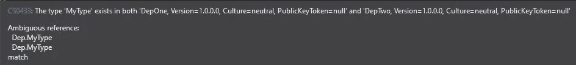
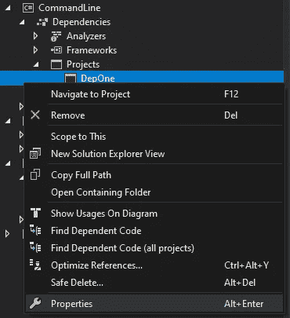
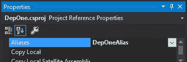

# 如何在 C#中跨具有相同完全限定类型名的程序集使用两种类型

> 原文：<https://itnext.io/how-to-use-two-types-across-assemblies-with-the-same-fully-qualified-type-names-in-c-38ce4c902c2?source=collection_archive---------0----------------------->


我最近面临一个相当棘手的挑战。我的应用程序引用了两个项目，这两个项目都公开了具有相同名称和相同命名空间的特定类型。

该设置的大致轮廓如下:

```
CommandLine
   - Program.csDepOne
    - MyType.cs (Namespace: Dep)DepTwo
    - MyType.cs (Namespace: Dep)
```

所以现在让我们试着使用它。在我们的命令行项目中，我们像这样使用类型:

```
using Dep;namespace CommandLine
{
    public class Program
    {
        public static void Main(string[] args)
        {
            var instanceOne = new MyType();
            var instanceTwo = new MyType();
            ...
        }
    }
}
```

嗯，这不太管用:



我们的命令行项目引用了 DepOne 和 DepTwo，并且都在同一个名称空间中提供了类型 *MyType* 。

通常的方法肯定是修复名称空间，给两个 *MyType* 类一个合适的、可区分的名称空间。

不过，如果这样不行，我们也不算倒霉！

# 救援的外部别名！

对于这种情况，我们可以利用一个非常奇特的特性:Extern alias([https://docs . Microsoft . com/en-us/dot net/cs harp/language-reference/keywords/Extern-alias](https://docs.microsoft.com/en-us/dotnet/csharp/language-reference/keywords/extern-alias))。

这将为编译器创建一个别名，以便能够消除这两种类型，即使使用相同的完全限定类型名。

遗憾的是文档有点差，最近一次更新是在 2015 年。我们可以这样使用它:



如果您使用的是 Visual Studio，设置 extern 别名非常容易。只需右键单击您引用的两个(或多个)项目中各自的依赖项，然后单击 Properties。



现在，在打开的属性中，我们可以设置一个任意的别名，以便稍后在代码中使用。

可悲的是，如果你不使用 VS，MS 文档没有说明这样做的方法。然而，这很简单。这是。添加别名后的 csproj:

```
<Project Sdk="Microsoft.NET.Sdk">
    <PropertyGroup>
        <OutputType>Exe</OutputType>
        <TargetFramework>net5.0</TargetFramework>
    </PropertyGroup>
    <ItemGroup>
        <ProjectReference Include="..\DepOne\DepOne.csproj">
            <Aliases>DepOneAlias</Aliases>
        </ProjectReference>
        <ProjectReference Include="..\DepTwo\DepTwo.csproj">
            <Aliases>DepTwoAlias</Aliases>
        </ProjectReference>
    </ItemGroup>
</Project>
```

如您所见，我们所需要的只是分别带有所需名称的 *<别名>* 标签。

太好了。所以现在让我们使用它。我们现在需要做的就是用我们刚刚定义的别名向源文件添加一个外部别名。然后我们可以使用范围解析操作符来使用这些别名:

```
extern alias DepOneAlias;
extern alias DepTwoAlias;namespace CommandLine
{
    public class Program
    {
        public static void Main(string[] args)
        {
            var instanceOne = new DepOneAlias::Dep.MyType();
            var instanceTwo = new DepTwoAlias::Dep.MyType();
            ...
        }
    }
}
```

开始了。现在我们的代码可以编译了，我们已经成功地使用了两个具有相同完全限定类型名的类型。

虽然这是一个你自己的代码可能永远也不会用到的奇特特性，但是在处理大量的 NuGet 包时，这种情况绝对有可能发生。想象一下在一个. Net Framework 项目中工作，该项目可能引用相同功能的. Net Framework 和. Net 标准实现。碰撞绝对不是不寻常的。

所以，正如我提到的——更多的是一种“奇异”的东西，但是当你需要它的时候，知道这一点是非常好的！