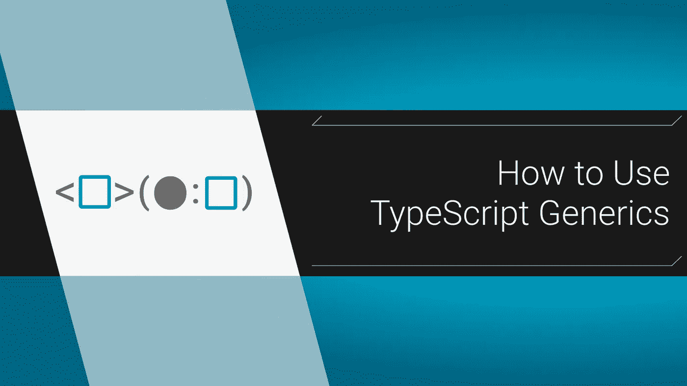

# 如何使用 TypeScript 泛型

> 原文：<https://itnext.io/how-to-use-typescript-generics-6c0c09e049c3?source=collection_archive---------1----------------------->

## 关于 TypeScript 最佳特性之一的快速教程



就像 Ruby 中的`[@@](https://stackoverflow.com/questions/5890118/what-does-variable-mean-in-ruby)` [语法](https://stackoverflow.com/questions/5890118/what-does-variable-mean-in-ruby)一样， ***的`<>`TypeScript 泛型*** 让我有点紧张，所以我就直截了当地尽量长时间避开它们。但是，事实证明我是一个大懦夫，因为泛型实际上非常简单和方便。

# 泛型放松了僵化的函数

泛型所做的只是让函数更加灵活。为了演示我们为什么需要这样做，让我们编写一个*镜像函数*。它只会返回我们放入的内容:

```
const **mirror1** = (**thing**: ***string***) {
  return **thing**;
}**mirror1**('*hello*');
> '*hello*'
**mirror1**(12) // breaks
```

一个好的开始，却是一面可怕的镜子；这只反映了`strings`。我们*希望*它返回我们放入的任何东西。**这**就是泛型发挥作用的地方。

# 添加类型参数

您可以将类型定义为参数，方法是将它放在`()`之前的`<>`中:

```
const **mirror2** = <*MirrorType*>(
  **thing**: *MirrorType* ): *MirrorType* => {
  return **thing**;
}**mirror1**<*number*>(12);
**mirror1**<*string*>('*hi*');// non arrow version: 
function **mirror3**<*MirrorType*>(
  **thing**: *MirrorType* ): *MirrorType* {
  return **thing**;
}
```

我们所做的就是告诉我们的函数我们想要使用哪种类型，然后我们可以在任何地方引用它。因此，当我们说`<number>`时，这意味着它期望我们的参数是一个`number`，并且它也将返回一个`number`类型(尽管，在这种情况下，返回是隐式的)。在现实世界中，事情并不总是这么简单。

# 现在就开始幻想吧

下面我们只对我们的参数中的*一个*使用一个泛型:

```
const **copyMachine** = <*CopyType*>(
  **itemToCopy**: *CopyType*,
  **numOfCopies**: *number,*
) => {
  ***return*** Array(**numOfCopies**)
    .fill(**itemToCopy**);
}**copyMachine**<*string*>('*hi*', 3);
> [*'hi', 'hi', 'hi'*]
// more [array tricks in this link](https://stackoverflow.com/questions/34937349/javascript-create-empty-array-of-a-given-size/41246860#41246860)
```

您也可以使用多种类型:

```
interface **MagicTypes**<*Type1*, *Type2*> {
  firstItem: *Type1*;
  secondItem: *Type2*;
}const **magicMirror** = <*Type1*, *Type2*>(
  arg1: *Type1*,
  arg2: *Type2*,
): ***MagicTypes***<*Type1*, *Type2*> => ({
  firstItem: **arg1**,
  secondItem: **arg2**,
});
```

哈哈，在丫身上拉了个鬼祟，扔了个*泛型* [*接口*](https://www.tutorialsteacher.com/typescript/typescript-interface) 用在我们的返回值里。没错，你也可以使接口通用化。泛型让你可以像对待另一种参数一样对待类型，所以它们被用在很多地方，尤其是[类](https://www.tutorialsteacher.com/typescript/typescript-generic-class)。

# 需要传入类型吗？

令人惊讶的是，你不知道。你总是需要*定义*它们，然而，如果一个参数是一个基本类型，TS 就能搞清楚:

```
const **mirror2** = <*MirrorType*>(
  **thing**: *MirrorType* ): *MirrorType* => {
  return **thing**;
}
// still works
**mirror2**('*hi*'); 
```

本质上，TS 对自己说:“没有传递`MirrorType`，但是给定的`thing`值是一个`string`。这意味着`MirrorType`一定是一只`string`这种类型的逆向工程对于基本值来说很方便。只要参数类型是基本的，就不需要传入泛型类型参数。你实际上*使用类型参数的唯一原因是如果你有一个[接口](https://www.tutorialsteacher.com/typescript/typescript-interface) ( *接口*是定义对象内部类型的一种方式，点击那个链接可以快速入门)。*

# 有和没有接口

下面是 TS 如何对镜像函数的参数对象进行类型检查:

```
**mirror**({
  name: '',
  mood: '*happy*',
  isHungry: 0,
});// default TS types:
{
  name: *string*;
  mood: *string*;
  isHungry: *number*;
}
```

这很好，但假设界面实际上是:

```
type ***NumberBoolean*** = 0 | 1;
interface ***PersonType*** {
  name: *string*;
  mood: 'happy' | 'sad';
  isHungry: ***NumberBoolean***;  
};
```

这更加具体，并给我们带来了一些额外的好处。要使用此接口，请将其传入:

```
**mirror**<***PersonType***>({
  name: '',
  mood: '*happy*',
  isHungry: 0,
});
```

现在 TypeScript 知道`isHungry`永远不可能是像`34`那样的数字，而`mood`只有 2 个选项。

# 关于 JSX 的警告

在你开始定义自己的泛型之前，在`.tsx`文件中创建泛型**箭头** 函数时要小心。虽然 TypeScript 编译器可以使用通用函数来处理*，就像 React 中的`useState<Interface>`，但是当*定义*它们*时就会出错。* TS 会突然认为 type 参数是一个 jsx HTML 标签。有两个选项可以解决这个问题:[不使用箭头功能](https://stackoverflow.com/a/41112368)，或者[扩展{}](https://stackoverflow.com/a/41112882) 。*

## 常规函数

如果你不关心`this`绑定，你可以使用一个普通的函数:

```
const **mirrorTSX** = **function**<*ThingType*>(
    **thing**: *ThingType*
) {
  return **thing**;
}// works! **mirrorTSX**(12); 
```

## 扩展{}

使用`extends`关键字告诉 TS 编译器它没有读取 HTML:

```
const **mirrorTSX** = <*ThingType* ***extends*** *{}*>(
    **thing**: *ThingType*
) => {
  return **thing**;
}**mirrorTSX**('*hi*');
```

在`.tsx`文件中定义泛型*并不常见，但是当你得到这个错误却不知道为什么的时候，这真的很烦人。我希望这能为你节省至少 25 分钟的谷歌搜索时间。*

# 最后

我们只是粗略地浏览了一下这个惊人特性的表面，但是它已经足够让您开始工作了。对于一个 [*多*深潜，查看这篇文章](https://medium.com/@rossbulat/typescript-generics-explained-15c6493b510f)。然而，他们说最好的学习方法是实践，所以走出去，变得非常普通。它对我来说确实很有用。

大家编码快乐，

麦克风