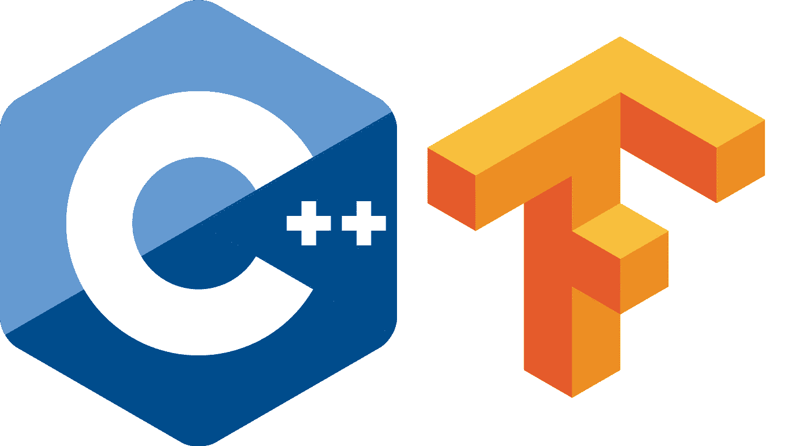

# 如何使用 TensorFlow 2.0 和 XCode 使用您的 C++ muscle(不使用 Bazel 构建)

> 原文：<https://itnext.io/how-to-use-your-c-muscle-using-tensorflow-2-0-and-xcode-without-using-bazel-builds-9dc82d5e7f80?source=collection_archive---------1----------------------->



这篇文章将描述如何在 Mac 上使用 TensorFlow 用 C++编写代码，同时绕过 Bazel builds，我觉得 Bazel builds 用起来太麻烦了。

# 首先，坦白一点:

我在 90 年代学的是计算机科学。因此，我的编程思想深受 C++的影响，c++是我喜欢和偏爱的语言。当每个人都开始用 Java 编写代码时，我已经进入了管理岗位，所以我没有经历迁移到大多数人所说的第三代语言(指的是在内部建立一个框架)的过程。我喜欢 C++的美学，随着它最近的发展(主要是将 STD 作为语言的一部分)，我认为它也克服了指针相关错误的缺点，这些错误过去常常导致崩溃和内存泄漏。

根据 T2 Stack Overflow 最近的调查，Python 是发展最快的主流编程语言。它不在列表的顶端，但是超过 40%的开发者在使用它。C++正在被 23.5%的人使用。也许我是守旧的。好了，我说了。

当我对机器学习产生兴趣的时候，我不得不学习 Python。这是必须的，因为大多数框架不支持任何其他语言，这使得 Python 成为该领域事实上的语言。Python 不错，不要误会。它还包含一些来自 C++的概念，其内部也是用 C++ (AFAIK)编写的。然而，空白和缩进对我来说很难理解。因此，当我听说 TensorFlow 2.0 将在 c++ API 中包含一些重大改进时，我不得不去了解一下。

我用苹果电脑，我猜你们中的一些人也用。这仍然不是主流，但它更容易弥合 Windows 和 Linux 之间的差距。

# 没有巴泽尔怎么办

**这篇文章将解释如何在 Mac 上开始使用 TensorFlow 2.0 Alpha，使用一个可以使用 XCode 的独立项目，而不使用终端中的 Bazel builds。**

你可以在网上找到的大多数说明都是关于 Bazel 构建的。我发现 Bazel 有点麻烦，不太直观，所以我将向您展示如何从 Bazel 开始构建基本框架，然后如何继续用 XCode 开发 C++代码，而不需要每一步都使用终端。

# 开始吧！

要实现这一目标，您需要完成以下工作:

> 1.安装一些先决条件
> 
> 2.从源代码构建 TensorFlow 2.0 Alpha
> 
> 3.构建一些其他依赖项
> 
> 4.创建一个 XCode 项目并配置它
> 
> 5.编译一个测试项目来验证所有的东西都正确安装了

这里的一些说明摘自 [TensorFlow 安装指南页面](https://www.tensorflow.org/install/source)。

开始时的要求:

> 1.XCode 9.2 及以上(我有 10.2)
> 
> 2.[自制](https://brew.sh/)
> 
> 3.Python 2 或 3(我有 3.6.5)
> 
> 4.Pip(如果您没有 pip，请运行“sudo easy_install pip”)

# 先决条件

打开终端窗口并开始安装:

```
pip install -U --user pip six numpy wheel setuptools mockpip install -U --user keras_applications==1.0.6 --no-depspip install -U --user keras_preprocessing==1.0.5 --no-deps
```

# 安装 Bazel:

遵循这里的说明，但是如果你使用 MAC OS——继续这个:

## 安装 XCode 命令行工具:

> 1.前往 https://developer.apple.com/download/，向下滚动并点击查看更多下载。
> 
> 2.在左边的小搜索框中，写下“命令行”,然后按回车键。
> 
> 3.选择适当的 XCode 版本，然后点按+号。
> 
> 4.单击链接下载并安装 dmg 文件。

## 接受许可协议

这是一个棘手的部分。说明说你只需要运行:

```
sudo xcodebuild -license accept
```

但是这对我不起作用。环顾四周，这是最安全的顺序，可以帮助你通过这一部分:

```
sudo xcode-select -s /Applications/Xcode.app/Contents/Developersudo xcodebuild -license
```

现在输入您的本地密码，应该会显示许可协议。

使用空格键向下滚动(如果你喜欢，可以读出来)，最后输入“同意”并按回车键。

## 安装 bazel

> 1.转到这个 [URL](https://github.com/bazelbuild/bazel/releases) 并搜索您拥有的相关操作系统。对于 MacOS，这应该是 bazel-0.24.1-installer-Darwin-x86 _ 64 . sh(或者是一个更新的版本，这意味着 0 . 24 . 1 会有所不同)
> 
> 2.将此文件下载到您的个人目录并打开终端
> 
> 3.运行以下两个命令(假设您是主目录，并且 sh 文件在那里):

```
chmod +x bazel-0.24.1-installer-darwin-x86_64.sh./bazel-0.24.1-installer-darwin-x86_64.sh — user
```

> (同样，如果您有不同的版本，请更改命令)
> 
> 4.检查 bazel 是否正常工作:

```
bazel version
```

> 如果不是，请检查您的路径，它可能缺少$(HOME)/bin

# 再安装几个包:

```
Brew install autoconf automake libtool cmake
```

# 下载并安装 TensorFlow

首先创建一个保存所有代码的文件夹。我将向你展示如何将你的项目从框架中分离出来，所以选择一个不会让你困惑的结构。

在我家下面有一个主文件夹，我把它命名为“Code ”,在它下面有我的项目。我在它下面新建了一个文件夹，名为 Tensorflow2。这是框架代码。

## 下载框架代码

> 1.打开终端和 cd 到目录
> 
> 2.下载源文件:

```
git clone [https://github.com/tensorflow/tensorflow.git](https://github.com/tensorflow/tensorflow.git)cd tensorflow
```

> 3.这会让你从主人那里得到代码。如果您想要一个发布分支(目前还不是一个发布)，您可以查看它。示例:

```
git checkout v2.0.0-alpha0
```

## 安装ˌ使成形

> 1.在“终端”中的相同位置(在 tensorflow 目录下，这是您的根文件夹)，运行

```
./configure
```

> 2.现在到了脚本向您提问的部分，您需要回答
> 
> 3.它会告诉你是否找到了 bazel 以及版本，并询问 python 的位置。
> 
> 4.找到它的最简单的方法是打开一个新的终端窗口并键入

```
which python3
```

> (用你用来运行 python 的任何东西替换 python3，运行“python 3–version”来查看它是什么版本)
> 
> 5.然后它会问你一堆关于各种特性的特殊支持的其他问题。我为除了一个之外的所有选择了默认。
> 
> 6.那个是关于 CPU 特性的。它会要求你用 bazel 提供“编译时使用的优化标志”。这很重要，原因有二:
> 
> a.它会让你的模型跑得更快
> 
> b.它将消除每次运行代码时显示的一些警告。
> 
> 7.我是在能够运行我的项目之后才发现这一点的，所以我不得不返回并再次运行 configure，并在提示输入这些标志时键入“-mavx -mavx2 -mfma -msse4.2”。不确定你如何能在前面找到，试着看这里的或这里的的[。因此，我建议首先将它保留为默认设置，如果您收到运行时警告，请返回并再次进行配置，然后再次编译框架。](https://github.com/lakshayg/tensorflow-build)
> 
> 8.完成配置过程，如果你有一个 GPU 阅读[这个](https://www.tensorflow.org/install/source#configuration_options)。

## 编译框架

最后，我们到了可以开始建造东西的时候了。让我们构建稍后将链接到项目中的框架库。

我们需要构建 C++ API 和框架。

重要提示:接下来的两个命令需要几个小时才能完成。它会最大化你的 CPU 使用率，耗尽你的电池。一定要勾搭上，好好休息。

在根文件夹中运行:

```
bazel build -c opt — verbose_failures //tensorflow:libtensorflow_cc.so
```

接下来编译框架:

```
bazel build -c opt — verbose_failures //tensorflow:libtensorflow_framework.so
```

如果这两个成功而没有错误(有很多警告，这是正常的)，您将在文件夹(根文件夹)/bazel-bin/tensorflow/中找到这两个库。我们将需要这些与我们的项目联系起来。

如果您还记得，我们首先配置了 CPU 特性，这应该会使这个版本针对您的个人情况进行优化。但是，如果您遇到 CPU 特性错误，比如下面的故障排除部分，请尝试使用与您需要的标志相匹配的命令行 bazel 选项重新运行框架构建。在我的情况下，我应该运行:

```
bazel build -c opt — copt=-mavx — copt=-mavx2 — copt=-mfma — copt=-msse4.2 — verbose_failures //tensorflow:libtensorflow_framework.so
```

# 获取和构建依赖项

在创建项目之前，我们还需要下载一些东西。

从根文件夹运行:

```
tensorflow/contrib/makefile/download_dependencies.sh
```

它会将文件下载到 tensor flow/contrib/makefile/downloads/

## 构建 protobufs

运行以下命令:

```
cd tensorflow/contrib/makefile/downloads/protobuf/./autogen.sh./configuremakemake install
```

# 创建 XCode 项目

现在打开 XCode 并创建一个 C++项目。我在我家下面的代码文件夹中创建我的。

我把我的项目叫做“TF2example”。我将在 home 下有一个文件夹:

```
~/Code/TF2example/TF2example/
```

(main.cpp 文件将位于该位置)。

现在在该目录下创建两个子文件夹:include 和 lib。

我们希望将头文件复制到 include，将库文件复制到 lib。

我的文件夹是这样构建的:

```
~/Code/ Tensorflow2/tensorflow/ tensorflow/ bazel-binTF2example/TF2example/ include/ lib/
```

让我们复制库文件(您可能需要在 cp 命令之前执行 sudo):

```
cd ~/Codecp Tensorflow2/tensorflow/bazel-bin/tensorflow/libtensorflow_cc.so TF2example/TF2example/lib/cp Tensorflow2/tensorflow/bazel-bin/tensorflow/libtensorflow_framework.so TF2example/TF2example/lib/cp /usr/local/lib/libprotobuf.a TF2example/TF2example/lib/
```

现在复制标题:

```
cp -r Tensorflow2/tensorflow/bazel-genfiles/* TF2example/TF2example/includecp -r Tensorflow2/tensorflow/tensorflow/cc TF2example/TF2example/include/tensorflowcp -r Tensorflow2/tensorflow/tensorflow/core TF2example/TF2example/include/tensorflowcp -r Tensorflow2/tensorflow/third_party TF2example/TF2example/includecp -r /usr/local/include/google TF2example/TF2example/includecp -r Tensorflow2/tensorflow/tensorflow/contrib/makefile/downloads/absl/absl TF2example/TF2example/includecp -r Tensorflow2/tensorflow/bazel-tensorflow/external/eigen_archive/unsupported TF2example/TF2example/includecp -r Tensorflow2/tensorflow/bazel-tensorflow/external/eigen_archive/Eigen TF2example/TF2example/include
```

# 测试项目代码

首先，让我们复制 tensorflow 2.0 附带的示例代码:

```
cp Tensorflow2/tensorflow/tensorflow/cc/tutorials/example_trainer.cc TF2example/TF2example/
```

现在回到 XCode，用我们刚刚复制的 example_trainer.cc 替换你的 main.cpp。

# 测试项目配置

在 XCode 中，在左侧的项目导航器中选择项目名称。主屏幕将显示项目设置。确保您选择的是项目，而不是目标。

选择“构建设置”选项卡并滚动到“搜索路径”。

在“标题搜索路径”中添加$(PROJECT _ DIR)/tf2 example/include(如果有不同的名称，请更改)。

如果您没有看到该项目，您可能处于“基本”视图。改为“全部”。

在“库搜索路径”中添加$(PROJECT_DIR)/TF2example/lib

在“链接”下搜索“运行路径搜索路径”并添加$(PROJECT_DIR)/TF2example/lib

转到“构建阶段”选项卡(如果需要，根据您的视图切换到目标)并打开“将二进制文件与库链接”部分。两者相加。所以我们之前复制的文件(libtensorflow_cc.so 和 libtensorflow_framework.so)。

请注意，您需要单击“添加其他…”按钮，并选择 lib 下的文件。

现在尝试构建项目并运行它。

如果一切正常，您应该在输出窗口中看到一串 x 和 y 值，它们是由示例程序创建的多线程写入的。

如果您有编译错误、链接错误或运行时错误，请尝试在下面的故障排除部分或文章评论中寻找帮助，这样我可以看看我是否能有所帮助。

# 解决纷争

## 苹果十字工具

如果您得到一个关于“Apple CROSSTOOL”的错误，这意味着您没有成功接受命令行工具的许可协议。

在根文件夹中运行以下命令:

```
bazel clean — expungesudo xcode-select -s /Applications/Xcode.app/Contents/Developersudo xcodebuild -licensebazel clean –expunge
```

再次运行巴泽尔构建。

## CPU 特性

运行项目时，您会得到类似“TensorFlow 库不是

已编译为使用 SSE4.2 指令，但这些指令在您的计算机和

可以加快中央处理器的运算速度。"

这意味着您需要再次运行 configure 并设置您在消息中看到的正确标志。我加了“-mavx -mavx2 -mfma -msse4.2”。

文档显示您也可以将它添加到 bazel build 命令中，但这对我没有用，我必须再次进行配置并重新构建框架。所以归档吧。

还要注意，如果您选择了错误的标志，您可能会得到一个运行时错误，该错误不会表明它与 CPU 特性有关。安全总比后悔好。

## 动态库加载程序

如果在运行时出现“dyld library not loaded”错误，请检查您是否正确设置了 Runpath 搜索路径，如果设置了，您可能需要使用 install_name_tool 命令来使其工作。