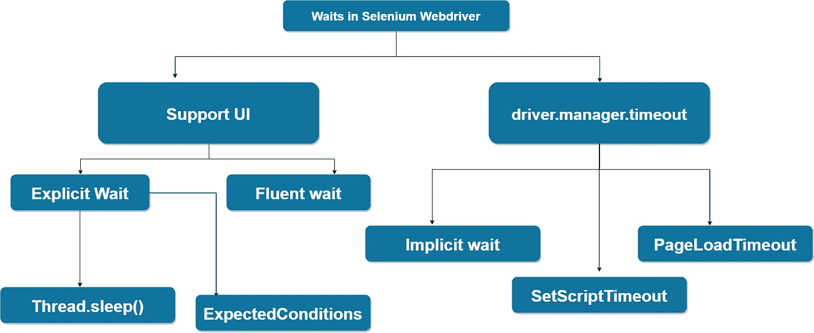

# 如何在 Selenium 中使用隐式和显式等待？

> 原文：<https://itnext.io/how-to-using-implicit-and-explicit-waits-in-selenium-d1ba53de5e15?source=collection_archive---------0----------------------->


在使用 Selenium WebDriver 时，定位器可以说是需要掌握的最重要的技能之一。根据 locators，你需要掌握的不是 WebDriver 命令，而是理解和建模你的应用程序以获得正确的等待策略。如果你弄错了，你可能会在执行中有无意义的长时间延迟，或者由于等待的不确定性而有一个古怪的检查。

Selenium Web 驱动程序中有显式和隐式等待。

等待是让自动任务执行经过一段时间后再继续下一步。您应该选择使用显式或隐式等待。

**警告**:不要混合隐式和显式等待。这样做会导致不可预测的等待时间。例如，将隐式等待时间设置为 10 秒，显式等待时间设置为 15 秒，可能会导致 20 秒后超时。这可能会导致不可预测的等待时间。例如，设置 10 秒的隐式等待和 15 秒的显式等待会导致 20 秒的超时。



T **hread。睡眠()**

特别是，这种**睡眠**模式是显式等待的一个例子。因此，这实际上并不是 Selenium WebDriver 的一个特性，但它是大多数编程语言中的一个常见特性。

线程。Sleep()做了你认为它会做的事情，它让线程休眠。所以当你的程序运行时，在大多数情况下，程序会被自动检查，它们运行在一个线程上。
所以当我们调用线程时。我们指示我们的程序在一段时间内什么也不做，只是睡觉。
测试中的应用程序要做什么并不重要，我们不在乎，我们的检查正在打盹！

```
Thread.sleep(5000);
```

提供的值以毫秒为单位，因此这段代码将使检查休眠 5 秒钟。

我不鼓励你使用 Thread.sleep()，但是你必须意识到这一点。

**不过这些都不重要，不要用这个！为什么？**

有 3 个主要原因:

1.动作执行得更快，其余时间在垃圾桶里。
2。这一行动花费了更长时间，测试也失败了。
3。我会放 1 slip，因为这样更快更容易。这里不会痛…我甚至会把它包在一个方法里，命名为…稳定超时(Time)。之后，破窗规则将发挥作用，稳定超时的失误将充斥我们的生活。

IT21【implicit】等待— 全球。

隐式(间接、隐藏)等待在搜索操作之外的代码中设置一次，在更改之前一直有效。默认值为 0，表示不等待。隐式等待隐式地应用于所有后续的搜索操作(也就是说，隐式地，而不是在搜索方法中直接指定)。

```
*/**
 * The class Waiter.
 */* **public class** Waiter {

    */**
     * The value for WebDriver.
     */* **private** WebDriver **driver**;

    */**
     * The constant DELAY.
     */* **private static final int *DELAY*** = 10;

   */**
     * Method startDriver.
     */* @BeforeTest(alwaysRun = **true**)
    **public void** startDriver() {
        **driver** = **new** ChromeDriver();
        **driver**.manage().timeouts().implicitlyWait(***DELAY***, TimeUnit.***SECONDS***);
        **driver**.get(**"example url"**);
    }

    */**
     * Method Example testing.
     */* @Test(description = **"Will be executed until the element is found or until the allotted timeout value is 10 seconds."**)
    **public void** exampleTesting() {
        **driver**.findElement(By.*id*(**"bestLocator"**));
    }

    */**
     * Method stop driver.
     */* @AfterTest(alwaysRun = **true**)
    **public void** stopDriver() {
        **if** (**driver** != **null**) {
            **driver**.quit();
        }
    }
```

在本例中， **driver.findElement()** 将被执行，直到找到该元素，或者直到分配的超时值为 10 秒。

E 特别是，即使是“睡眠”模式(等待和什么都不做)也是显式等待的一个例子，但是不鼓励使用它。

实际上，我们建议您将 Web 驱动程序等待与减少等待的 Expected Conditions 类的方法结合使用。如果元素在 Web 驱动程序等待初始化期间指定的时间之前出现，Selenium 将不会等待，而是继续执行测试。

```
**public class** Waiter { */**
     * The value for WebDriver.
     */* **private** WebDriver **driver**; */**
     * The value for WebDriverWait with initialization.
     */* **private final** Wait<WebDriver> **webDriverWait** = **new** WebDriverWait(**driver**, 5, 1000);}
```

**5** —第二个参数以秒为单位指定超时时间。

**1000** —第三个参数指定在下一次调用之前等待的时间(以毫秒为单位)，以检查元素是否存在(默认为 500)。

此外，您还可以修改等待调用，并在等待失败时显示一条消息。

```
**public class** Waiter { */**
     * The value for WebDriver.
     */* **private** WebDriver **driver**; */**
     * The value for WebDriverWait with initialization.
     */* **private final** Wait<WebDriver> **webDriverWait** = **new** WebDriverWait(**driver**, 5).withMessage(**"Element was not found"**); }
```

您还可以使用另一个选项来创建等待对象:

```
*/**
 * The class Waiter.
 */* **public class** Waiter { */**
     * The value for WebDriver.
     */* **private** WebDriver **driver**; */**
     * The value for WebDriverWait with initialization.
     */* **private final** Wait<WebDriver> **wait** = **new** FluentWait<WebDriver>(**driver**);
}
```

在搜索过程中，WebDriver 定期在浏览器中轮询 DOM 模型中的元素。有许多例外情况:

*   StaleElementReferenceException—如果在搜索时 DOM 中有一个项目，但是过了一段时间，在调用它时，DOM 已经更改。
*   NoSuchElementException —如果调用时该项不在 DOM 中。
*   ElementNotVisibleException 如果在 DOM 中找到该项，但在页面上不可见。
*   MoveTargetOutOfBoundsException-如果项目已更改坐标。

为了避免这些异常，必须将异常的描述传递给 ignition 方法:

```
**final** Wait<WebDriver> **wait** = **new** WebDriverWait(driver, 5).ignoring(StaleElementReferenceException.**class**, ElementNotVisibleException.**class**);
```

**预期条件**包含默认实现的预期规则列表:

*   可见性元素定位(通过定位器)
*   (WebElement 元素)的可见性
*   textToBePresentInElement(按定位器，字符串文本)
*   titleContains(字符串标题)
*   presenceOfElementLocated(按定位器)
*   presenceOfAllElementsLocatedBy(按定位器)
*   不可见元素定位(通过定位器)
*   invisibilityOfElementWithText(按定位器，字符串文本)
*   elementToBeClickable(按定位器)
*   stalensesof(web element 元素)
*   alertIsPresent()

所有功能的完整描述可在[链接](https://seleniumhq.github.io/selenium/docs/api/py/webdriver_support/selenium.webdriver.support.expected_conditions.html)获得

```
wait.until(ExpectedConditions.presenceOfElementLocated(By.id(**"smth"**)));
```

在上面的例子中，我们期望元素出现在 id 定位器等于 **smth** 的 **DOM** 模型中。

等待项目的另一种方法可以如下实现:

```
*/**
 * The class WaitCondition.
 */* **public class** WaitCondition {

    */**
     * The constant DELAY. This is delay for WebDriverWait is seconds.
     */* **private static final int *DELAY*** = 5;

    */**
     * The private value webDriverWait.
     */* **private** WebDriverWait **webDriverWait**; */**
     * The value for WebDriver.
     */* **private** WebDriver **driver**; */**
     * The constructor.
     */* **public** WaitCondition() {
        **webDriverWait** = **new** WebDriverWait(driver, ***DELAY***);
    }

    */**
     * Wait for visibility of element located by web element.
     *
     ** ***@param locator*** *the locator.
     ** ***@return*** *the web element.
     */* **public** WebElement waitForVisibilityOfElementLocatedBy(**final** By locator) {
        **return webDriverWait**.until(ExpectedConditions.*visibilityOfElementLocated*(locator));
    }
```

并且可以被调用如下:

```
*/**
 * The constant SELECT_WEEKEND. This is css selector for ui automation script.
 */* **private static final** By ***SELECT_WEEKEND*** = By.*cssSelector*(**"td[class='calendarWeekend']"**); */**
 * Select weekend current convert page.
 *
 ** ***@return*** *the current convert page.
 */* **public** CurrentConvertPage selectWeekend() {

    **final** WaitCondition waitCondition = **new** WaitCondition();
    waitCondition.waitForVisibilityOfElementLocatedBy(***SELECT_WEEKEND***).click();

    **return this**;
}
```

负面状态可以被**而不是**捕捉到:

```
**public boolean** waitForNotPresenceOfElementLocated(By locator){
    **return webDriverWait**.until(ExpectedConditions.*not*(ExpectedConditions.*presenceOfElementLocated*(locator)));
}
```

对于 web 应用程序测试自动化中常见的情况，ebDriver API 有非常丰富的不同种类的期望。为了简化等待时间值的配置，它们通常在启动参数中执行，或者存储在属性文件中。

在您的功能测试中使用这些例子来提高它们的性能和稳定性。

最后，我想给你举几个有用的例子:

有时我们需要等待页面加载。通过等待文档状态来等待页面加载。

1.  使用 Java 和 AssertEquals 实现。

```
*/**
 * The class Waiter.
 */* **public class** Waiter {

    */**
     * The value for webDriver.
     */* WebDriver **driver**;

    */**
     * Method checkThatPageIsCompletelyLoaded.
     */* **public void** checkThatPageIsCompletelyLoaded() {

        JavascriptExecutor javascriptExecutor = (JavascriptExecutor) **driver**;
        *assertEquals*(**"complete"**, javascriptExecutor.executeScript(**"return document.readyState"**));
    }

}
```

2)使用 WebDriver 实现。

Webdriver 中有一个用于此目的的方法 pageLoadTimeout。

它的用法示例如下:

```
*/**
 * The class Waiter.
 */* **public class** Waiter {

    */**
     * The private valuer driver.
     */* **private** WebDriver **driver**;

    */**
     * The constant DELAY.
     */* **private static final long *DELAY*** = 60;

    */**
     * Method start.
     * This method wait page load at 60 second.
     * If the DOM does not load within 60 seconds, you will get a TimeoutException.
     */* @BeforeTest
    **public void** start() {
        **driver**.manage().timeouts().pageLoadTimeout(***DELAY***, TimeUnit.***SECONDS***);
    }

}
```

WebDriver API 提供了在网页上设置 JavaScript 执行预期的能力。

它的用法示例如下:

```
*/**
 * The class Waiter.
 */* **public class** Waiter {

    */**
     * The value for webDriver.
     */* WebDriver **driver**;

    */**
     * The constant DELAY.
     */* **private static final long *DELAY*** = 30;

    */**
     * Method Start. This method sets the query completion timeout limit for executeAsyncScript.
     */* **public void** start() {
        **driver**.manage().timeouts().setScriptTimeout(***DELAY***, TimeUnit.***SECONDS***);
    }

}
```

此外，项目中的所有等待者都可以用作一个**枚举**:

```
*/**
 * The enum Wait condition.
 */* @RequiredArgsConstructor
**public enum** WaitCondition {

    */**
     * Visible wait condition.
     */* ***visible***(ExpectedConditions::*visibilityOfElementLocated*),

     */**
     * Enabled wait condition.
     */* ***enabled***((Function<By, ExpectedCondition<?>>) ExpectedConditions::*elementToBeClickable*),

     */**
     * Present wait condition.
     */* ***present***(ExpectedConditions::*presenceOfElementLocated*),

     */**
     * All visible wait condition.
     */* ***allVisible***(ExpectedConditions::*visibilityOfAllElementsLocatedBy*),

     */**
     * All present wait condition.
     */* ***allPresent***(ExpectedConditions::*presenceOfAllElementsLocatedBy*),

    */**
     * Value to be wait condition.
     */* ***valueToBe***((BiFunction<By, String, ExpectedCondition<?>>) ExpectedConditions::*textToBe*);

    **private** BiFunction<?, ?, ExpectedCondition<?>> **type**;

    <T, V> WaitCondition(**final** Function<T, ExpectedCondition<?>> type) {
        **this**((T arg1, V arg2) -> type.apply(arg1));
    }

    */**
     * Method getType.
     *
     ** ***@param <T>*** *the type parameter.
     ** ***@param <V>*** *the type parameter.
     ** ***@param <R>*** *the type parameter.
     ** ***@return*** *the type.
     */* @SuppressWarnings(**"unchecked"**)
    **public** <T, V, R> BiFunction<T, V, R> getType() {
        **return** (BiFunction<T, V, R>) **type**;
    }
}
```

并且可以被调用如下:

```
**public void** click(**final** By locator) {
    click(locator, ***visible***);
}
```