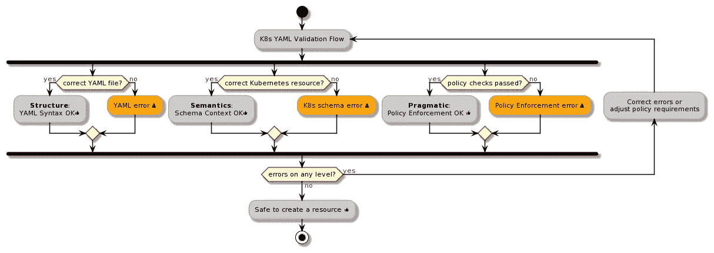
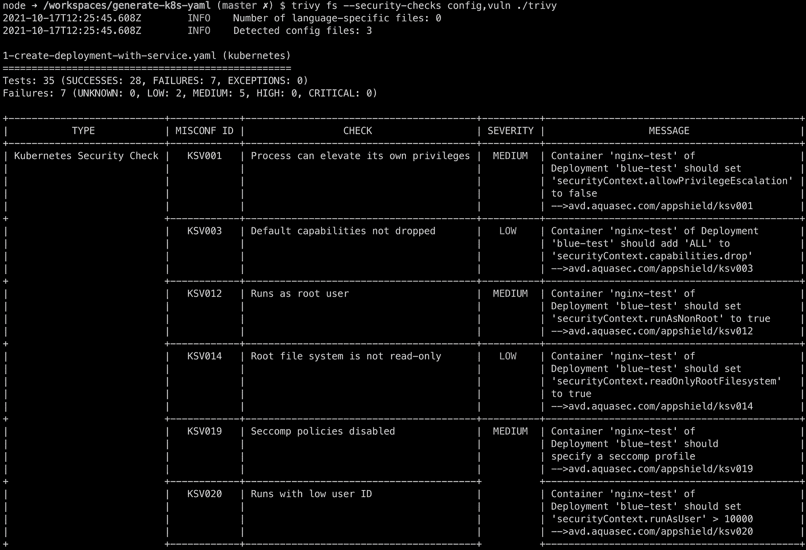
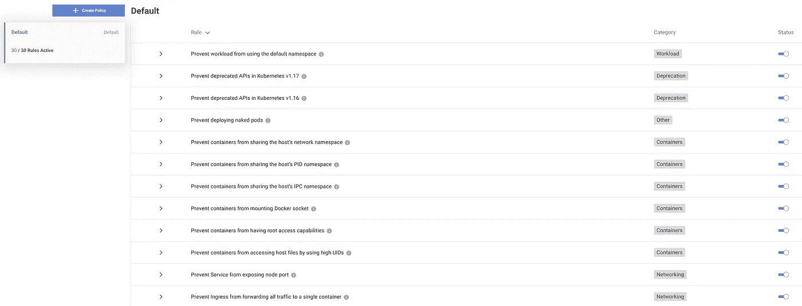

# 如何验证 Kubernetes YAML 文件

> 原文：<https://itnext.io/how-to-validate-kubernetes-yaml-files-9a17b9a30f08?source=collection_archive---------3----------------------->

图片由[穆罕默德·哈桑](https://pixabay.com/users/mohamed_hassan-5229782/?utm_source=link-attribution&utm_medium=referral&utm_campaign=image&utm_content=4576720)拍摄，来自[皮克斯拜](https://pixabay.com/?utm_source=link-attribution&utm_medium=referral&utm_campaign=image&utm_content=4576720)

## 在 Kubernetes 上开发

## 介绍

在[之前的文章](/how-to-create-kubernetes-yaml-files-abb8426eeb45)中，我们已经学习了如何创建 Kubernetes YAML 文件。现在，让我们看看如何确保我们创建的文件不仅是有效的 YAML，更重要的是遵守 Kubernetes 开发的最佳实践。

本文旨在作为验证 Kubernetes 清单文件的指南。如果您是开发人员、软件架构师、安全专家，或者只是对学习更多关于创建和管理 Kubernetes 清单的质量保证过程感兴趣，那么这篇文章就是为您准备的。

## 左倾哲学

[左移](https://devopedia.org/shift-left)运动，或者我喜欢称之为“向左扩展”,最初是为了让开发人员能够负责并拥有软件生命周期的端到端过程。

如果做得好，这意味着创建工具和支持组织结构，通过允许开发团队对他们创建和维护的软件拥有完全的所有权和控制权，来设置开发团队的成功。做错意味着大多数时候把所有的责任都“甩”给开发人员，并希望得到最好的结果。

本着向左扩展的精神，创作和管理 Kubernetes 产品的过程也应该是开发团队的责任。

Kubernetes 已经有了一个强大而复杂的验证资源的流程，其形式为以下工具:

*   [准入控制器](https://kubernetes.io/docs/reference/access-authn-authz/admission-controllers/)
*   通过[开放策略代理](https://www.openpolicyagent.org/)、 [Kyverno](https://kyverno.io/) 或 [Kubewarden](https://www.kubewarden.io/) 等工具实施策略
*   [pod 安全策略](https://kubernetes.io/docs/concepts/policy/pod-security-policy/?spm=a2c4g.11186623.2.14.703c8b7fMCIbrz)(在 1.21 中已弃用)

这些工具很棒，但是它们属于集群操作层，更适合作为一个平台，而不是适合标准开发人员工作流程的工具。

我们接下来要看的是各种工具和方法，它们将验证过程的起点转移到开发工作流程，从而大大提高整个系统的质量。

**圣杯的移位验证留下来的是为了** [**让非法状态无可替代**](https://fsharpforfunandprofit.com/posts/designing-with-types-making-illegal-states-unrepresentable/) **。对于像 YAML 这样的非静态类型语言来说，这很难做到，但是使用正确的工具，这是可以做到的。**

> 服务或产品的质量不是你投入的东西。它是客户或顾客从中得到的。
> 
> —彼得·德鲁克

## 你将学到什么

阅读本文后，您将了解到:

*   了解验证左移对最终产品的影响
*   验证 Kubernetes YAML 文件的不同方法有哪些
*   在 CI/CD 管道中自动化验证流程的好处是什么
*   了解专门用于验证不同种类的 YAML 文件的工具

## 先决条件

如果你想继续下去，并得到你的手脏与 YAML，你需要:

*   带有[远程开发扩展](https://github.com/Microsoft/vscode-remote-release)的 VS 代码
*   [docker 桌面](https://www.docker.com/products/docker-desktop)或任何替代品(需要能够运行容器)
*   克隆[该存储库](https://github.com/Piotr1215/generate-k8s-yaml)

请注意，存储库使用了一个 [devcontainer](https://code.visualstudio.com/docs/remote/containers) ，其中包含了运行示例构建所需的所有工具和配置。因此，图像很大，所以请在运行容器之前对其进行相应的修改。

## 我们需要验证什么？

让我们更仔细地看看验证过程。我们可以将验证过程分为 3 个不同的类别:

*   **YAML 语法的结构验证**。这是验证文件是否为有效 YAML 的最简单步骤。这总是一个很好的起点，如果我们的文件有 YAML 错误，我们希望尽快知道，甚至更好，完全防止错误。
*   **K8s 模式的语义验证**。下一步是验证文件是否是正确的 Kubernetes YAML 文件。这个验证是由 Kubernetes 自动完成的，但是在这个过程中有点太晚了。记住，我们要向左移动。这个领域中一个有趣的工具是库贝瓦尔。
*   **资源的实用验证**。最后一个类别是验证过程从不同的上下文中查看文件的地方。我们希望检查文件和配置是否存在安全漏洞、性能问题、是否符合最佳实践、版本控制方案等等。最适合执行这种验证的工具是**政策。**在这里，我想重点介绍两个工具，trivy 和 datree。两者都带来了独特的视角和功能。

K8s YAML 验证。来源:作者

## 使用 trivy 进行安全检查

特里维可以扫描 YAML 文件的安全漏洞，错误配置和更多。每张支票都有一个网页，解释背后的原因及其严重性。这里唯一的问题是检查是“静态的”，我们不能直接影响是否应该跳过其中的任何一项(通过设置严重性标志，这在一定程度上是可能的)

K8s 部署文件的繁琐扫描。来源:作者

## 使用 datree 执行策略

[Datree](https://www.datree.io/) 采取了不同的方法，开发者可以打开或关闭策略。

可以看到 datree 首先检查文件是否是有效的 YAML，然后根据 Kubernetes 模式验证内容。这满足了我们的结构->语义->语用验证流程！

datree 策略检查。来源:作者

每个检查都与一个可配置的策略集相关联。可以打开和关闭策略，以满足个性化验证方案的需求。

这使我们更接近于将验证过程左移，并授权开发人员控制整个过程。

## 通过 CI/CD 管道实现自动化

每一个重复开发过程的最终目标都是自动化它。将来自 datree 和 trivy 的验证规则添加到我们的 CI 管道中很容易。它们提供了与所有主要 git 提供商的丰富集成，如 GitHub、GitLab 以及 Helm 安装插件等。

## 结束语

Kubernetes 的故事对开发者来说仍有许多不足之处。我很高兴看到创建了一些工具来解决在 Kubernetes 上开发的一些困难。像 datree 这样的工具特别关注并支持左移运动。

开发人员完全控制着他们的软件生命周期、工具和组织结构，旨在授权和支持开发团队完成他们创造令人惊叹的软件的使命。这是对我们所有人都有利的未来。