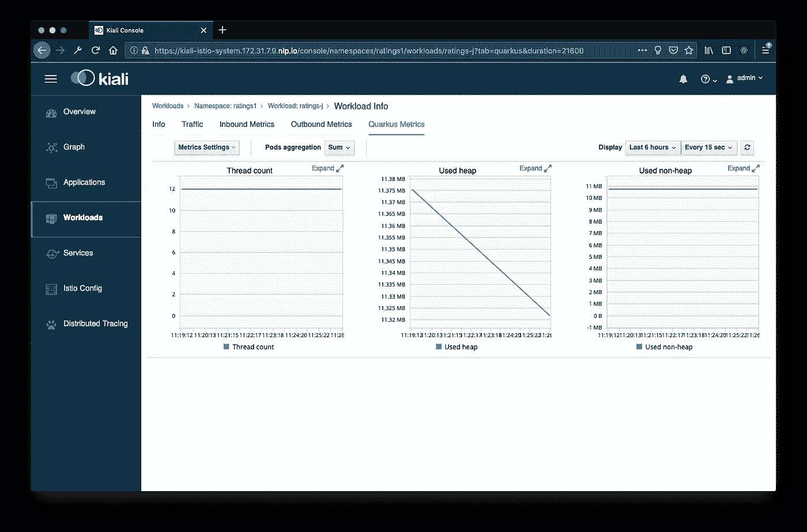
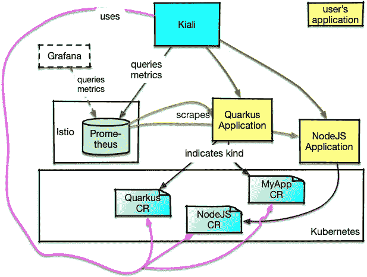

# 如何在 Kiali 中查看应用指标

> 原文：<https://itnext.io/how-to-view-application-metrics-in-kiali-482bd1733942?source=collection_archive---------3----------------------->

多亏了[乔尔·塔克沃里安](https://medium.com/u/ba87ae253897?source=post_page-----482bd1733942--------------------------------)和[基亚利团队](https://medium.com/kialiproject)中其他人的工作，基亚利现在能够展示应用指标的定制遥测仪表板。这些控制面板可用于应用程序和工作负载。



具有自定义指标(“Quarkus 指标”)的工作负载的屏幕截图

此功能在 Kiali 版中提供。要使用它，您需要一个能够以 Prometheus 文本格式公开遥测数据的运行时。在我们开始之前，让我们看看这一切是如何工作的。

下图用黄色显示已部署的应用程序，用绿色显示 Prometheus 数据库，用蓝绿色显示与 Kiali 相关的资源。图表下方描述了项目之间的线条。



仪表板功能的架构

安装 Kiali 时，系统中会安装一个新的自定义资源定义(CRD)*【monitoring dashboard . monitoring . Kiali . io*。除此之外，还为流行的运行时部署了许多仪表板定义的定制资源，如 [Quarkus](https://quarkus.io) 、 [Thorntail](https:://thorntail.io/) 、 [Vert。X](https://vertx.io) 或 Node.js *(*1)* 。这些定义显示在白色的蓝绿色方框中。
为你自己的项目创建这样的定制资源也是很容易的——我们稍后会讲到。Kiali 使用这些定制资源作为模板来填充 UI 中的实际仪表板选项卡(洋红色线条)。

在下一步中，您需要向被检测应用程序的 Kubernetes 部署对象添加附加信息:

```
**apiVersion**: extensions/v1beta1
**kind**: Deployment
[...]
**spec**:
  **template**:
    **metadata**:
      **annotations**:
        **kiali.io/runtimes**: quarkus,my-app
        **prometheus.io/port**: "9080"
        **prometheus.io/scheme**: http
        **prometheus.io/scrape**: "true"
```

*kiali.io/runtimes*注释 *(*2)* 定义了在 Kiali 控制台中显示的仪表板，在图中用棕色线表示。
*的人指示普罗米修斯要取数据(*刮*)，用什么方式(*方案*)，在什么端口(*端口*)。如果您不指定一个*路径*，Prometheus 将从您的应用程序上的 */metrics* 端点开始抓取。普罗米修斯[文档包含选项的完整列表](https://prometheus.io/docs/prometheus/latest/configuration/configuration/#scrape_config)。
图中绿色实线表示刮削。*

*现在，让我们看看如何编写自定义仪表板定义。为此，我在我的应用程序中定义了一个计数器，并通过 [MicroProfile Metrics](https://github.com/eclipse/microprofile-metrics) 公开它。*

```
*$ curl  -HAccept:text/plain localhost:8080/metrics/application
*# TYPE application:ratings_endpoint_get_rating counter* application:ratings_endpoint_get_rating 2.0*
```

*有了这些信息，我们现在就可以创建自定义资源了。创建一个新文件 *myApp.yaml* 并添加以下内容(或者更好:什么与你的应用匹配):*

```
***apiVersion**: "monitoring.kiali.io/v1alpha1"
**kind**: MonitoringDashboard
**metadata**:
  **name**: my-app
**spec**:
  **title**: App Rating
  **charts**:
    - **name**: "Ratings calls"
      **unit**: ""
      **spans**: 6
      **metricName**: "application:ratings_endpoint_get_rating"
      **dataType**: "raw"
    - **name**: "Ratings rate"
      **unit**: ""
      **spans**: 6
      **metricName**: "application:ratings_endpoint_get_rating"
      **dataType**: "rate"*
```

*为了使这个仪表板定义对所有名称空间可用，通过*ku bectl apply-f myapp . YAML-n istio-system 部署它。*如果您将它部署到除 *istio-system* 之外的名称空间，它将仅可用于该名称空间中的部署。*

*下一次屏幕刷新后，您将看到两个控制面板的两个选项卡:*

**

*我们的新仪表板“应用评级”现已可见*

*上面的定义具有仪表板的名称，因为它出现在部署的 *metadata.name* 中。 *Spec.title* 显示选项卡的标题，下面显示各个图表。跨度决定了图表的宽度(由于 Bootstrap 使用了，因此全宽为 12 个跨度[),名称和单位为自由文本。显然,“metricName”提供了指标的名称。在我们的例子中，我只使用了一次。在第一种情况下，它显示原始数据(即计数器被碰撞的频率)。第二种情况显示变化率(即除以时间的变化率)。
源文件](https://www.w3schools.com/bootstrap4/bootstrap_grid_system.asp)[kiali _ monitoring _ types . go](https://github.com/kiali/kiali/blob/master/kubernetes/kiali_monitoring_types.go)显示了其他可用选项，但最好还是看一下[提供的仪表板定义示例](https://github.com/kiali/kiali/tree/master/deploy/dashboards)。*

## *来自未知的流量？*

*如果你在一个简单的 Istio 环境中运行上述程序，一旦你标记了你的抓取应用，你可能会突然看到来自未知的流量进入它们。这是因为默认的 Istio 规则没有将其过滤掉。我已经更新了[关于这个主题的文章](/where-does-the-unknown-taffic-in-istio-come-from-4a9a7e4454c3)，其中也展示了如何在 Istio 配置中重新配置规则。
此外，您还可以使用 Kiali 0.15 中新的“隐藏”功能来隐藏 UI 中的未知流量。*

## *结论*

*新的仪表板功能让您可以看到对您重要的实际应用程序的指标。您可以在 Kiali 中轻松查看这些数据，但由于该功能使数据在 Prometheus 中可用，因此也可以使用 Prometheus UI 或 Grafana 等其他工具查看数据。由于该特性完全不依赖于 Istio(它只使用自带的 Prometheus)，我可以想象它可以很容易地放入一个单独的模块中，由其他工具引入。*

## *脚注*

**)1 在 0.15 版本中，您必须手动安装它们，而在 0.16 版本以后，安装程序会负责安装。要安装定义，请转到[https://github . com/kiali/kiali/tree/v 0 . 15 . 0/deploy/dashboards](https://github.com/kiali/kiali/tree/v0.15.0/deploy/dashboards)并通过 *kubectl apply -f ** 安装文件*

**2)在我使用的版本中，逗号后面不能有空格来分隔多个定义。这个要求以后会放宽。*