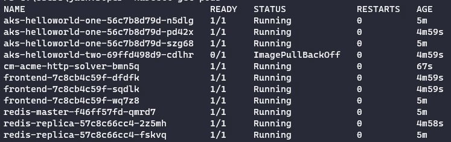
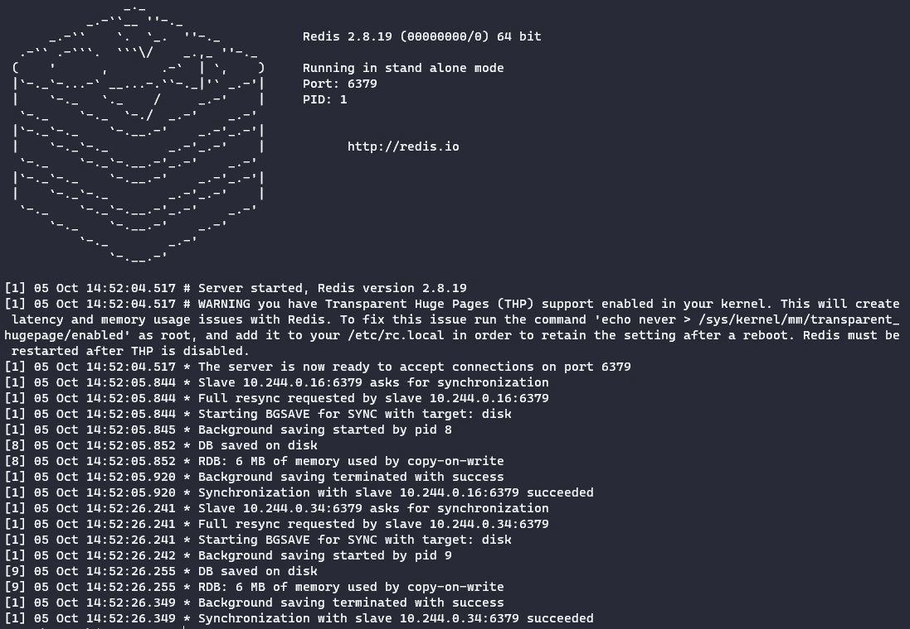
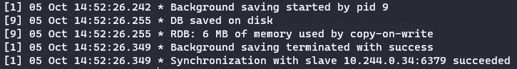
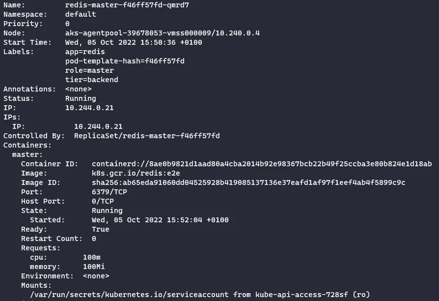
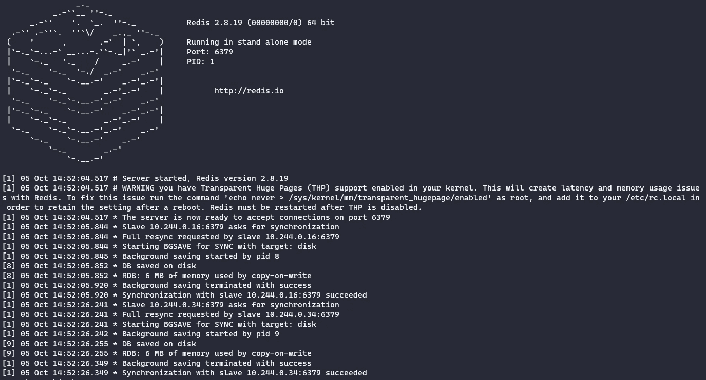

# 如何使用 Kubectl 查看 Kubernetes Pod 日志

> 原文：<https://itnext.io/how-to-view-kubernetes-pod-logs-with-kubectl-e60b284102c1?source=collection_archive---------3----------------------->

查看 Kubernetes (K8S)中的日志对于排除故障和了解集群的各个组件中发生的事情非常重要。在本文中，我们将关注如何使用`kubectl logs`命令行工具查看 pod 日志。


乔纳斯·史密斯在 [Unsplash](https://unsplash.com/s/photos/container?utm_source=unsplash&utm_medium=referral&utm_content=creditCopyText) 上拍摄的照片

## 什么是 kubectl？

`kubectl`是一个命令行工具，允许您对 K8S 集群运行命令。您可以使用`kubectl`来部署应用程序、检查和管理集群资源以及查看日志。

## 设置 kubectl 别名

使用`kubectl`时，多次输入会很快变得令人厌烦。为了缩短这个时间，你可以设置一个别名(如果你考虑参加 Kubernetes 管理员(CKA)认证考试，时间很紧，强烈建议你设置一个别名以节省时间！).下面的例子设置了一个名为`k`的别名，因此所有以后的命令都是针对名为‘my-namespace’的名称空间运行的。

```
alias k="kubectl --namespace my-namespace"k logs
```

## Kubectl 日志命令快速参考

1.  打印 pod 的日志

```
kubectl logs <pod_name>
```

2.打印 pod 最近 6 小时的日志

```
kubectl logs --since=6h <pod_name>
```

3.获取 pod 的最近 50 行日志

```
kubectl logs --tail=50 <pod_name>
```

4.打印 pod 的日志并跟踪新日志

```
kubectl logs -f <pod_name>
```

5.打印 pod 中容器的日志

```
kubectl logs -c <container_name> <pod_name>
```

6.将 pod 的日志输出到名为“pod.log”的文件中

```
kubectl logs <pod_name> > pod.log
```

7.查看以前出现故障的 pod 的日志

```
kubectl logs --previous <pod_name>
```

8.查看 pod 中所有容器的日志

```
kubectl logs <pod_name> --all-containers
```

## Kubectl 记录带有示例的命令参考

您可以使用`kubectl get pods`命令查看集群上的窗格。如果您的 pod 在默认名称空间之外运行，请添加`--namespace <namespace name>`标志。通过添加`<my-label>=<my-value>`，您还可以根据需要使用标签来过滤结果。

我在我的 Azure Kubernetes 服务(AKS)集群上运行了以下 pods:



`kubectl logs`显示来自容器的标准输出和错误流的日志。如果您正在为容器配置日志记录，您将需要确保输出被写入这些输出，以便通过以下命令正确显示。

1.  我对名为 redis-master-f46ff57fd-qmrd7 的 redis-master pod 的日志感兴趣。

```
kubectl logs redis-master-f46ff57fd-qmrd7
```



由于我的 pod 刚刚启动，我可以看到 pod 启动时创建的日志。这显示了 pod 中的所有日志。

2.打印 pod kubectl 日志的最后 10 分钟的日志—since = 10m redis-master-f 46 ff 57 FD-qmrd 7。

```
kubectl logs --since=10m redis-master-f46ff57fd-qmrd7
```

没有显示任何内容，因为在过去 10 分钟内没有生成任何日志！将时间更改为 15 分钟显示了所有日志。

```
kubectl logs --since=15m redis-master-f46ff57fd-qmrd7
```

3.要仅查看日志的最后 5 行:

```
kubectl logs redis-master-f46ff57fd-qmrd7 --tail 5
```



4.我想关注我添加的任何新日志`-f`

```
kubectl logs -f redis-master-f46ff57fd-qmrd7
```

日志显示在示例 1 中，任何新生成的日志将持续流动并自动显示在我的终端中，直到我退出(例如，在 Windows PowerShell 中使用 CTRL+C)。

5.现在我想在 redis-master-f46ff57fd-qmrd7 中打印一个容器的日志。我首先需要使用`kubectl describe`命令查看哪些容器正在 pod 中运行:

```
kubectl describe pod redis-master-f46ff57fd-qmrd7
```



这显示了一个名为 master 的容器。

```
kubectl logs -c master redis-master-f46ff57fd-qmrd7
```



6.现在让我们将一个 pod 的日志输出到一个名为“pod.log”的文件中

```
kubectl logs redis-master-f46ff57fd-qmrd7 >> pod.log
```

使用`cat`查看日志

```
cat .\pod.log
```

7.查看以前出现故障的 pod 的日志

```
kubectl logs --previous redis-master-f46ff57fd-qmrd7
```


这里我看到一个错误，确认 pod 中以前的容器没有被终止。

8.如果我有多个容器，我可以使用`--all-containers`标志查看所有容器的日志。

```
kubectl logs <pod_name> --all-containers
```

## 摘要

`kubectl logs`命令使您能够从您的资源中访问日志。在本文中，我们重点介绍了一些从 pod 获取日志的示例。

如图所示，您可以查看当前日志，不断将新的 pod 日志流式传输到您的终端，并使用不同的命令选项从以前终止的 pod 访问日志。Kubectl 从容器的标准输出和错误流中收集日志。

想要更多 Kubernetes 内容？在这里查看我在 K8S [上的其他文章](https://jackwesleyroper.medium.com/kubernetes-k8s-related-articles-index-54718769e390)！

干杯！🍻

[](https://www.buymeacoffee.com/jackwesleyroper) [## Jack Roper 正在 Azure、Azure DevOps、Terraform、Kubernetes 和 Cloud tech 上写博客！

### 希望我的博客能帮到你，你会喜欢它的内容！我真的很喜欢写技术内容和分享…

www.buymeacoffee.com](https://www.buymeacoffee.com/jackwesleyroper) 

*最初发表于*[*space lift . io*](https://spacelift.io/)*。*