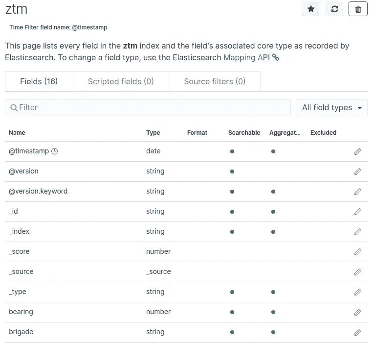
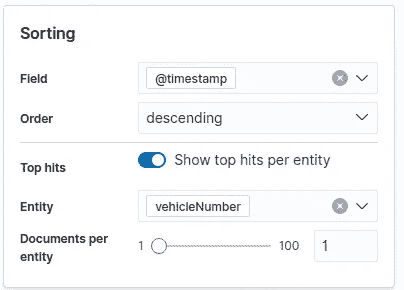
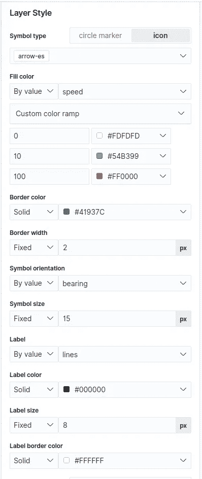
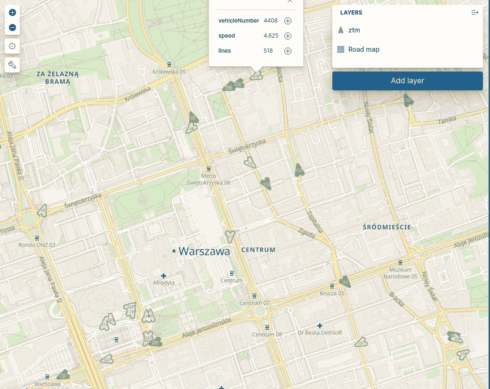

# 如何在 Docker 上使用 Kibana、Elasticsearch、Logstash (Elastic Stack)和 Kafka 流来可视化公共交通

> 原文：<https://itnext.io/how-to-visualize-public-transport-using-kibana-elasticserach-logstash-elastic-stack-and-kafka-eabc6975255a?source=collection_archive---------3----------------------->


您是否考虑过分析和可视化地理数据？为什么不试试 Elasticsearch？所谓的。ELK(elastic search+log stash+ki Bana)或 Elatic Stack 不仅仅是一个 NoSQL 数据库。这是一个完整的系统，允许实时存储、搜索、分析和可视化来自任何来源的数据。在这种情况下，我们将使用华沙公共交通位置的公开数据。在这个故事中，我将使用[这个故事](https://medium.com/@zorteran/calculating-speed-bearing-and-distance-using-kafka-streams-processor-api-9e95834b9e3d)中提到的[dockered](https://medium.com/@zorteran/dockerizing-a-kafka-streams-app-6a5ea71fe1ef)Kafka Streams 应用程序。

# 环境

docker-compose 包含 Elasticsearch、Kibana、Zookeeper、Kafka、Logstash 和我上传到 Docker Hub 的应用程序 Kafka Streams。Kafka 用户急切地等待摆脱 Zookeeper :-)。

```
version: '3.3'
services:
    elasticsearch:
        image: docker.elastic.co/elasticsearch/elasticsearch:7.7.0
        restart: unless-stopped
        environment:
        - discovery.type=single-node
        - bootstrap.memory_lock=true
        - "ES_JAVA_OPTS=-Xms512m -Xmx512m"
        ulimits:
            memlock:
                soft: -1
                hard: -1
        volumes:
        - esdata:/usr/share/elasticsearch/data
        ports:
        - 9200:9200

    kibana:
        image: docker.elastic.co/kibana/kibana:7.6.2
        restart: unless-stopped
        depends_on:
            - elasticsearch
        ports:
            - 5601:5601
        volumes:
            - kibanadata:/usr/share/kibana/data

    zookeeper:
        image: 'bitnami/zookeeper:3'
        ports:
            - '2181:2181'
        volumes:
            - 'zookeeper_data:/bitnami'
        environment:
            - ALLOW_ANONYMOUS_LOGIN=yes

    kafka:
        image: 'bitnami/kafka:2'
        ports:
            - '9092:9092'
            - '29092:29092'
        volumes:
            - 'kafka_data:/bitnami'
        environment:
            - KAFKA_CFG_ZOOKEEPER_CONNECT=zookeeper:2181
            - ALLOW_PLAINTEXT_LISTENER=yes
            - KAFKA_CFG_LISTENERS=PLAINTEXT://:9092,PLAINTEXT_HOST://:29092
            - KAFKA_CFG_LISTENER_SECURITY_PROTOCOL_MAP=PLAINTEXT:PLAINTEXT,PLAINTEXT_HOST:PLAINTEXT
            - KAFKA_CFG_ADVERTISED_LISTENERS=PLAINTEXT://kafka:9092,PLAINTEXT_HOST://localhost:29092
        depends_on:
            - zookeeper

    ztm_kafka_streams:
        image: "maciejszymczyk/ztm_stream:1.0"
        environment:
          - APPLICATION_ID_CONFIG=awesome_overrided_ztm_stream_app_id
          - BOOTSTRAP_SERVERS_CONFIG=kafka:9092
        depends_on:
          - kafka

    logstash:
        image: docker.elastic.co/logstash/logstash:7.7.0
        volumes:
            - "./pipeline:/usr/share/logstash/pipeline"
        environment:
            LS_JAVA_OPTS: "-Xmx256m -Xms256m"
        depends_on:
            - elasticsearch
            - kafka

volumes:
    esdata:
        driver: local
    kibanadata:
        driver: local
    zookeeper_data:
        driver: local
    kafka_data:
        driver: local
```

# 数据流

让我们解释一下这个场景中的数据流是什么样子的:

1.  Python 脚本下载 API 数据并上传到 Apache Kafka
2.  Kafka Streams 应用程序处理记录，添加速度、旋转和距离，然后在下一个主题中保存它们
3.  Logstash 从 topic 中提取记录，将字段(lat，lon)放入 location 对象，以便 Elasticsearch 可以将其索引为 geo_point(在 Kafka Streams 中我忘记了)。他将记录放入弹性搜索
4.  弹性搜索使用 ILM 索引记录
5.  我们在基巴纳观察地图上正在发生的事情。

# Python 脚本

我不得不承认，我用 Python 写了一个带有无限循环的粗糙脚本，而不是用 Apache Airflow 写的。这种概念验证和附带项目的魅力:-)。阿帕奇气流将有单独的职位。剧本中需要的令牌可以在这里获得:【https://api.um.warszawa.pl/#

# 卡夫卡溪流

您将在之前的故事中了解 Kafka Streams 应用程序([这个](https://medium.com/@zorteran/calculating-speed-bearing-and-distance-using-kafka-streams-processor-api-9e95834b9e3d?source=your_stories_page---------------------------)和[那个](https://medium.com/@zorteran/dockerizing-a-kafka-streams-app-6a5ea71fe1ef))。

# Logstash

我忘记了 geo_point 字段需要特定的 JSON 模式。Logstash 除了将数据从 Kafka 转移到 Elasticsearch 之外，还修复了这个错误。最终，我认为最好改进卡夫卡流。然后，您可以用另一个应用程序替换 Logstash，例如 Kafka Connect。

```
input {
    kafka {
        topics => "ztm-output"
        bootstrap_servers => "kafka:9092"
            codec => "json"
    }
}
filter {
    mutate {
        add_field => {
            "[location][lat]" => "%{lat}"
            "[location][lon]" => "%{lon}"
            }
        remove_field => ["lat","lon"]
    }
}
output {

    elasticsearch {
            hosts => ["elasticsearch:9200"]
            index => "ztm"
    }
} 
```

# 弹性搜索

我没有像 ztm-2020.05.24、ztm-2020.05.25 那样将记录放入索引中，而是使用了索引生命周期管理机制。它允许您自动化索引的生命周期。它会自动进行汇总，并根据您配置策略的方式更改索引属性(热-暖-冷体系结构)。假设我希望在索引达到 1GB 或 30 天后进行转存。

```
PUT _ilm/policy/ztm_policy
{
  "policy": {
    "phases": {
      "hot":{
        "actions": {
          "rollover": {
            "max_size": "1gb",
            "max_age": "30d"
          }
        }
      }
    }
  }
} 
```

您还需要一个带有适当映射的模板，ztm_policy 将与该模板挂钩。如果没有映射，Elasticsearch 不会猜到 geo_point 的位置和时间字段将是纯文本。

```
PUT _template/ztm_template
{
  "index_patterns": ["ztm-*"],
  "settings": {
    "number_of_shards": 3,
    "number_of_replicas": 1,
    "index.lifecycle.name":"ztm_policy",
    "index.lifecycle.rollover_alias": "ztm"
  },
  "mappings": {
    "properties": {
      "[@timestamp](http://twitter.com/timestamp)": {
        "type": "date"
      },
      "[@version](http://twitter.com/version)": {
        "type": "text",
        "fields": {
          "keyword": {
            "type": "keyword",
            "ignore_above": 256
          }
        }
      },
      "bearing": {
        "type": "float"
      },
      "brigade": {
        "type": "keyword"
      },
      "distance": {
        "type": "float"
      },
      "lines": {
        "type": "keyword"
      },
      "location": {
        "type": "geo_point"
      },
      "speed": {
        "type": "float"
      },
      "time": {
        "type": "date",
        "format":"MMM d, yyyy h:mm:ss a"
      },
      "vehicleNumber": {
        "type": "keyword"
      }
    }
  }
} 
```

现在是时候用合适的别名创建第一个索引了。

```
PUT ztm-000001
{
  "aliases": {
    "ztm": {
      "is_write_index":true
    }
  }
}
```

# 基巴纳

索引模式使用[@时间戳](http://twitter.com/timestamp)字段作为记录的参考时间点。从 API 中获取的时间会有所偏移，并且有所延迟。



## 地图

我们使用索引模式 ztm 和位置字段添加一个地图，然后添加一个新层。



我们只想看到每辆车的最新记录



已更改的属性:
-符号类型=箭头-es
-填充颜色=取决于车速
-符号方向=取决于车辆旋转
-标签=行号

# 它还活着！



API 不允许更频繁的采样，但是效果仍然很有趣。

# 贮藏室ˌ仓库

[https://github.com/zorteran/wiadro-danych-kafka-to-es-ztm](https://github.com/zorteran/wiadro-danych-kafka-to-es-ztm)