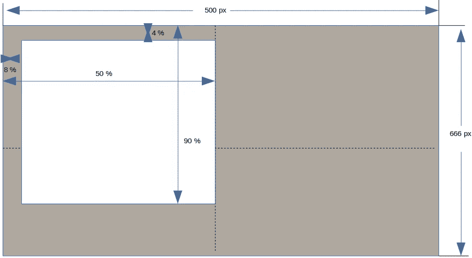
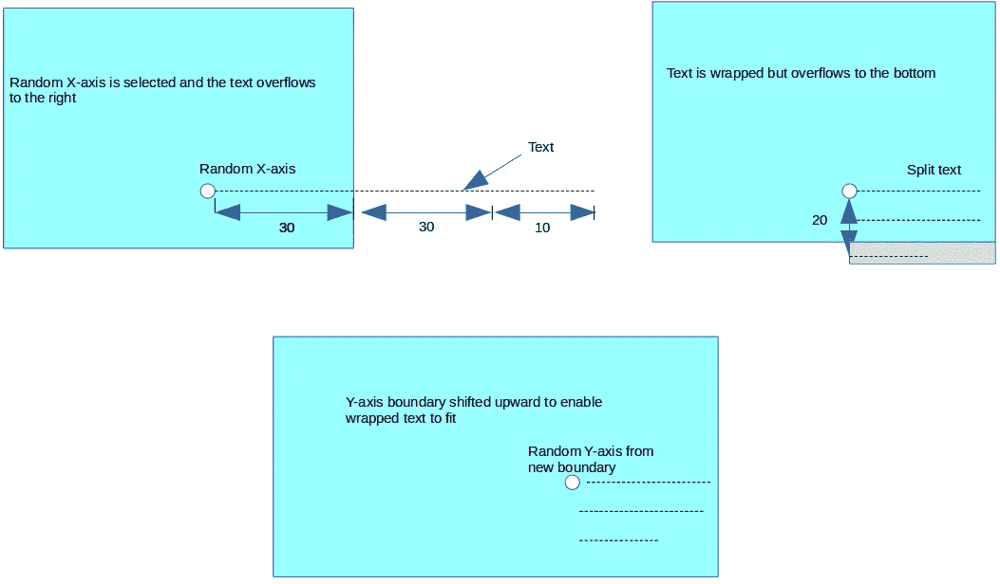
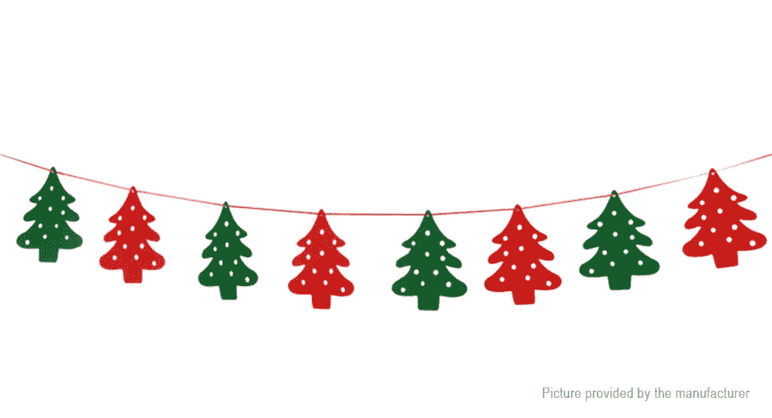

# 如何使用 Python 在图像上换行

> 原文：<https://itnext.io/how-to-wrap-text-on-image-using-python-8f569860f89e?source=collection_archive---------0----------------------->


[https://hap tik . ai/tech/put-text-on-images-using-python-part 2/](https://haptik.ai/tech/putting-text-on-images-using-python-part2/)

在进行 Udacity 项目“ [Meme Generator](https://github.com/Eyongkevin/PYND/tree/master/02_meme_gen_starter/src) ”的时候，该项目接收图片并在随机位置给图片加上引号，我做了额外的工作来实现一个功能，如果引号的长度超过图片的宽度，它会自动换行。该功能在项目标题中不是必需的，因为默认的引号足够短，可以在一行中容纳图像。试图用 Python Pillow 实现这一点并不可行，因为它不会自动绘制文本并将其推到新的一行。在其他手动操作中，我需要计算文本的宽度和高度，确定随机位置，然后适当调整文本，使其不会溢出

> 这篇文章中的代码可以在这个 [repo](https://github.com/Eyongkevin/How-to-Wrap-Text-on-Image-using-Python) 中找到。另外，查看` [Meme Generator](https://github.com/Eyongkevin/PYND/tree/master/02_meme_gen_starter/src) `项目，看看我是如何在这个项目中实现这项技术的。我建议您阅读本文并自己运行代码。这样你会理解，甚至取得更好的效果。

## 解释技术

当我们用代码弄脏我们的手时，我将解释我用来完成它的技术。我考虑了以下标准:

**加载图像**

我们将使用扩展库`[pillow](https://pillow.readthedocs.io/en/stable/)`在图像上绘制文本。我们将使用 pillow 中的以下类:

*   [图像](https://pillow.readthedocs.io/en/stable/reference/Image.html):为我们的文本创建一个图像对象
*   [ImageDraw](https://pillow.readthedocs.io/en/stable/reference/ImageDraw.html) :创建绘图上下文
*   [图像字体](https://pillow.readthedocs.io/en/stable/reference/ImageFont.html):我们将在图像上绘制的文本的字体

所以，我用代码加载了图像

```
from PIL import Image, ImageDraw, ImageFont#create image object from the input image path
try:
    image = Image.open('./eyong.jpg')   
except IOError as e:
    print(e)
```

> 确保[枕头](https://pypi.org/project/Pillow/)已安装。此外，您可以用您自己的图像的路径替换`./eyong.jpg`。考虑使用`.jpg`作为开始

**随机定位**



这个项目( [Meme Generator](https://github.com/Eyongkevin/PYND/tree/master/02_meme_gen_starter/src) )要求我们在一张图片上随机选择一个引用的位置。这是非常重要的，因为它将决定我将如何分割文本。正如我们从上图中看到的，白色矩形是图像上随机选择位置的区域。我决定让它更靠左，因为文本将是左对齐的，我们不想让我们的文本从图像的最右边开始。

底部是 90% ,因为默认情况下报价将有一个主体和一个作者，所以如果主体只占一行，那么作者将被下推一行。如果我们将它设为 100%,并且碰巧随机选择的 y 轴落在最底部，那么作者将不会在图像上可见。正如我们将在后面看到的，Y 轴将根据另外两个标准而变化。

**调整图像大小**

图像的宽度调整为 500 像素，并自动生成高度，同时保持纵横比(项目要求)

```
# Resize the image 
width = 500
img_w = image.size[0]
img_h = image.size[1]
wpercent = (width/float(img_w))
hsize = int((float(img_h)*float(wpercent)))
rmg = image.resize((width,hsize), Image.ANTIALIAS)
```

> 您可以在这里使用任何宽度，但重要的是，高度是由宽度生成的，并且纵横比保持不变。

**计算 X 边界，将文本分割成多行并计算 Y 边界**

后来，我计算了 x 轴边界，然后随机生成 x 点:

```
# Set x boundry
# Take 10% to the left for min and 50% to the left for max
x_min = (rmg.size[0] * 8) // 100
x_max = (rmg.size[0] * 50) // 100
# Randomly select x-axis
ran_x = randint(x_min, x_max)
```

> 我们需要在 other 中导入 randint 来使用它
> 
> `from random import randint`

计算 Y 轴边界有点棘手。我们需要知道文本的行数和行高。

文本的行数由文本长度和随机选择的 X 轴决定。考虑下面的图片:



考虑左边的图像，想象我们在那个位置随机选择了 x 点和 y 点。假设文本大约 40 个字符长，从 x 点到图像右边界的距离是 30px。我们注意到文本会溢出。此时，我们可以在最大 30 个字符的长度内拆分我们的文本。因此，我们得到的分割将有 3 行长度分别为 30、30 和 10 的文本。

然而，分割后，我们看到文本行溢出到图像的底部(图像在右边)。当从 y 点到图像底部的高度比拆分生成的行数乘以行高要短时，会发生这种情况

结果将是为 Y 轴定义一个新的边界，这样任何随机生成的点都不会导致底部溢出。我用下面几行代码做到了这一点:

根据随机选择的 X 点和文本的字体大小分割文本

```
# Create font object with the font file and specify desired size
# Font style is `arial` and font size is 20
font_path = 'font/arialbd.ttf'
font = ImageFont.truetype(font=font_path, size=20)text = "This could be a single line text but its too long to fit in one."lines = text_wrap(text, font, rmg.size[0]-ran_x)
line_height = font.getsize('hg')[1]
```

> 在代码行`line_height = font.getsize(‘hg’)[1]`中，我们找到了行的权重。这将用于添加适当的行距。我们选择了`h`，因为它像`t`、`l`等一样向上延伸。我们也选择`g`，因为它向下延伸，就像`y`、`p`等。因此`hg`覆盖了所有英文字符的高度范围。

让我们定义执行拆分的`text_wrap`

逻辑非常简单:

*   如果文本短于最大宽度，那么它可以放在一行中。不拆分返回
*   使用空格分割文本以获得每个单词
*   当宽度小于最大宽度时，通过添加单词来创建短文本。

现在我们已经有了分割的文本和线宽，我们准备寻找垂直(Y 轴)位置边界和随机生成的 Y 点

```
y_min = (rmg.size[1] * 4) // 100   # 4% from the top
y_max = (rmg.size[1] * 90) //100   # 90% to the bottom
y_max -= (len(lines)*line_height)  # Adjust
ran_y = randint(y_min, y_max)      # Generate random point
```

现在我们有了在图像上绘制文本的所有参数。我使用了一个循环，在每次插入新的一行时，用垂直位置和行高来增加当前的垂直位置。

```
#Create draw object
draw = ImageDraw.Draw(rmg)#Draw text on imagecolor = 'rgb(255,0,0)'  # Red color
x = ran_x
y = ran_y
for line in lines:
    draw.text((x,y), line, fill=color, font=font)

    y = y + line_height    # update y-axis for new line# Redefine x and y-axis to insert author's name
author = "- Eyong Kevin"
y += 5                       # Add some line space
x += 20                      # Indent it a bit to the right
draw.text((x,y), author, fill=color, font=font)
rmg.show()
```

输出图像将如下所示:


使用 Python 的标题图像(Eyong Kevin 的图像)

## 结论

我们看到图像中的文本是可读的，并且格式良好。我相信有很多方法，甚至更好的方法来解决这个问题。我愿意接受任何改进这项技术或任何比这项技术更好的其他技术的建议。所以，请在下面的评论中告诉我。

提前祝圣诞和新年快乐。



[https://www . fast tech . com/product/6198406-Christmas-tree-style-bunting-banner-flag](https://www.fasttech.com/product/6198406-christmas-tree-styled-bunting-banner-flag)

参考

[使用 Python 在图像上放置文本—第 2 部分](https://haptik.ai/tech/putting-text-on-images-using-python-part2/)