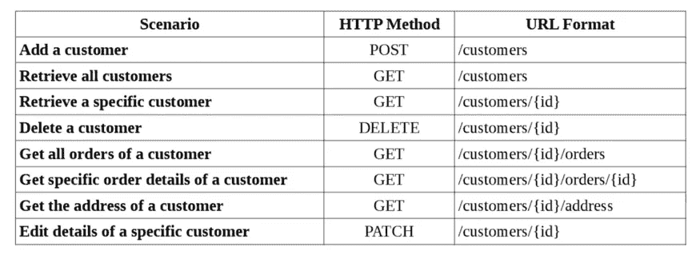

# 如何编写一个干净的 API

> 原文：<https://itnext.io/how-to-write-a-clean-api-9466e9ba3f55?source=collection_archive---------1----------------------->


## REST API 或 RESTful API(无论什么)和其他东西的最佳实践

我实际上是一名前端开发人员，但我也遭受了糟糕的 API 响应。

所以据我所知，我想做一个小向导。如果我知道有什么不对的地方，请告诉我。

## 清洁 API 的关键要求

*   简单(扁平比嵌套好。)
*   保持一致(开始前标准化风格)
*   确保安全(实施 HTTPS 并验证内容类型与)
*   轻量级(缩小和压缩你的回答)
*   允许筛选、排序和分页
*   使用正确的 HTTP 方法(GET / POST / PUT..。)
*   使用正确的响应状态(不要对所有事情都使用`200`！)

最重要的是..。

## 无论你做什么，都要记录下来！

你可能是世界上最好的 API 设计者，但是没有文档，你的 API 就像死了一样。

可以使用 API 设计工具如 [Swagger](https://swagger.io)

## 让我们来谈谈一些语法规则

# 1.避免文件扩展名

## **不良**:

```
/users/{id}/pending-orders.json
```

## 好:

```
/users/{id}/pending-orders
```

# 2.避免删节

## 不好:

```
/users/{id}/tel-no
```

## 好:

```
/users/{id}/phone-number
```

# 3.避免行话

## 不好:

```
/users/{id}/pan
```

## 好:

```
/users/{id}/card-number
```

# 4.集合使用复数名称

## 不好:

```
/user
```

## 好:

```
/users
```

# 5.使用名词而不是动词

别忘了！HTTP 方法的存在是有目的的！

## 不好:

```
GET  /getusers
POST /updateuser/{userId}
```

## 好:

```
GET /users
PUT /users/{userId}
```

# 6.对 URL 使用烤肉串大小写

## 不好:

```
/systemOrdersor /system_orders
```

## 好:

```
/system-orders
```

# 7.将 camelCase 用于 JSON

## **不良**

```
{
  user_name: "ehe"
}
```

## **好的**

```
{
  userName: "ehe"
}
```

# 8.想想未来，考虑版本控制

## 不好:

```
http://api.domain.com/users
```

## 好:

```
http://api.domain.com/v1/users
```

# 9.接受极限和偏移参数

在`GET`操作中始终接受`limit`和`offset`参数。

## 好:

```
GET /shops?offset=5&limit=5
```

这是因为它是前端分页所必需的。

# 10.将 URL 中的关系用于嵌套资源

## 示例:

获取属于商店 5 的产品 13 的详细信息。

## 不好:

```
GET /products/20?shopId=5
```

## 好:

```
GET /shops/2/products/31
```

# (奖励)考虑监控

这不是强制性的，但是建议这样做

`/health`:检查 API 的健康状态

`/version`:用最新版本号响应请求

`/metrics`:提供一些指标，比如平均响应时间。

# 12.(奖金 2)示例表

这张表几乎很好地解释了一切



[https://medium . com/linkit-intecs/rest-resource-naming-best-practices-cbee 65 f 37 a 62](https://medium.com/linkit-intecs/rest-resource-naming-best-practices-cbee65f37a62)

# 参考

[https://google.github.io/styleguide/jsoncstyleguide.xml?showone = Property _ Name _ Format](https://google.github.io/styleguide/jsoncstyleguide.xml?showone=Property_Name_Format)

[](https://nordicapis.com/10-best-practices-for-naming-api-endpoints/) [## 命名 API 端点的 10 多种最佳实践|北欧 APIs |

### 仔细考虑命名 API 端点有很多理由。为 API 端点选择合理的名称可以…

nordicapis.com](https://nordicapis.com/10-best-practices-for-naming-api-endpoints/) 

# 感谢您的阅读！

那是一篇很长的文章，而你大老远跑来这里！你太棒了！请不要忘记鼓掌(也可能你不知道鼓掌可以达到 50 次，只是在你走的时候点击)