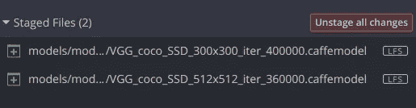
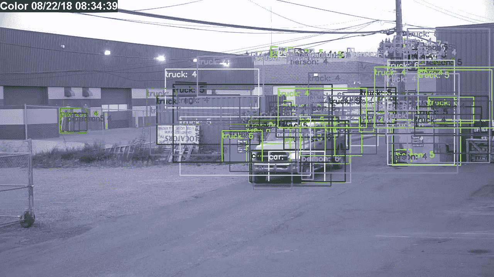
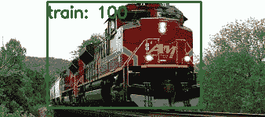

# 如何用 OpenCV 写一个 Node.js CLI，用神经网络模型进行图像分类

> 原文：<https://itnext.io/how-to-write-a-node-js-cli-using-opencv-with-neural-network-models-for-image-classification-57785d6f09fe?source=collection_archive---------1----------------------->


使用 SSD Coco 模型的分类图像(对！这是我的卡车。)

**TL；DR:** 在这篇文章中，我们将学习 3 件事(这些是我在为 Github 创建项目时不得不忍受的挣扎):

1.  如何使用 git-lfs (Git 大文件系统)将大文件上传到 GitHub 项目中。
2.  如何创建节点 CLI(命令行界面)
3.  如何用深度神经网络进行图像分类

我为每个领域创建了一个部分，所以请全部阅读，或者阅读您感兴趣的部分。

# 背景故事

在我们开始之前，先了解一下这一切是如何发生的。在我工作的地方，我们使用内部摄像机进行分析(比如检测石油或天然气泄漏)。当出现警报时，会从 MPEG 流中获取快照。然后，我团队中的另一名程序员编写 Python 代码，对这张快照进行分类。我很好奇 Node 是否也能做同样的事情。我以前从未使用过神经网络，所以这将是一个挑战。我开始使用 [tensorflow.js](https://js.tensorflow.org/) ，但是我在尝试将我们现有的模型转换成 tfjs-node 包所要求的“网络友好”模型时遇到了问题。

然后发现了 [Vincent Mühler](https://medium.com/u/ffd42e31db07?source=post_page-----57785d6f09fe--------------------------------) 在 Medium 上写的这篇优秀的文章《 [**Node.js 遇上 OpenCV 的深度神经网络 Tensorflow 和 Caffe**](https://medium.com/@muehler.v/node-js-meets-opencvs-deep-neural-networks-fun-with-tensorflow-and-caffe-ff8d52a0f072) 的乐趣》。它通过节点包 [opencv4nodejs](https://github.com/justadudewhohacks/opencv4nodejs) 向我介绍了 OpenCV。从那以后，事情开始有了更好的结果。

在我把我的包和一个不错的 readme markdown 放在一起之后，我在把这个项目放到 Github 上时遇到了问题。模型文件太大！然后我了解了 [git-lfs](https://git-lfs.github.com/) (Git 大文件系统)。经过几天的努力(当时带宽有限——我在露营),我让它工作了。然后是 npm(叹气)问题。我试过 *npm publish* ，但是打包后上传到注册表失败，出现“javascript 堆内存不足”。再说一次，它实在太大了！

我还没有在 npm 注册表上找到它。我需要探索不同的方法。如果你已经用一个大的软件包完成了这个任务，请随时让我知道你是如何做到的。

# Github 和大文件

首先，GitHub 有一定的局限性。从他们的[文档](https://help.github.com/articles/what-is-my-disk-quota/)来看，“我们严格限制文件大小超过 100 MB”。好吧，那么，当模型肯定比那个大的时候，这个就不行了。

进入 [git-lfs](https://git-lfs.github.com/) 。这个小宝石允许你跟踪 git 和 GitHub 中的大文件。虽然是免费的，但它有一些限制，如果你超过这些限制，GitHub 将开始[收费。而且，git-lfs 还可以和 Gitkraken 一起使用——额外奖励！](https://help.github.com/articles/about-storage-and-bandwidth-usage/)



LFS 在吉克拉肯的支持

注意到文件末尾的 **LFS** 了吗？完美。

好吧，所以事情并不顺利。在将大文件放入存储库之前，您必须初始化 git-lfs，并告诉它为您的项目跟踪哪种文件。在这里阅读它[。](https://help.github.com/articles/configuring-git-large-file-storage/)

# 使用节点创建 CLI

我相信你听说过 CLI——命令行界面。它允许用户通过计算机程序与计算机进行交互。通过使用 Node 创建 CLI，可以像运行计算机上的本机编译程序一样运行该包。

例如，要运行我的名为“classify”的节点包，您通常需要执行以下操作(在 classify 文件夹中):

*节点 index.js【参数】*

您可以将软件包全局安装到节点生态系统中，它会将软件包添加到路径中。要安装(从分类文件夹),请执行以下操作:

*npm 安装-分类*

这将使用名称“classify”在当前文件夹中安装软件包。

现在，您可以从命令行发出如下语句:

*分类-图像<图像文件路径> -滤镜。/filter.txt - confidence 50*

## CLI 输出

所有 CLI 都应该有一个输出，以便用户可以理解如何使用它。在这种情况下，“分类”将如下所示:

```
classifyClassifies an image using machine learning from passed in image path.Options--image imagePath     [required] The image path.                                                    
--confidence value    [optional; default 50] The minimum confidence level to use for classification (ex: 50 for 50%).                                                             
--filter filterFile   [optional] A filter file used to filter out classification not wanted.        
--quick               [optional; default slow] Use quick classification, but may be more inaccurate.                                                                   
--version             Application version.                                                          
--help                Print this usage guide.
```

当然，有一些软件包可以帮你做到这一点。我使用了[命令行用法](https://github.com/75lb/command-line-usage)和[命令行参数](https://github.com/75lb/command-line-args)来为我完成这项工作。

但是，在我们开始之前，如何使用 Node 运行 JavaScript 文件，而不在命令行上指定 Node 呢？

它与 Linux 系统上所有脚本的第一行有关。这是使用 she-bang 符号指定脚本解释器的地方:

```
#!/usr/bin/env node
```

这告诉环境使用“node”作为该脚本的解释器，并且在创建 CLI 时应该始终位于 JavaScript 文件的顶部。

## 命令行用法

相当容易使用，它定义了用户将看到什么。

代码如下:

然后，为了输出结果，代码如下所示:

`console.log(usage)`

## 命令行参数

同样，相当容易使用。请确保您处理并验证了所有内容:

您会注意到对于`--version`命令，我们所要做的就是读入我们的 package.json 并输出版本。这样，我们只需要在一个地方维护它。

剩下的处理是检查是否使用了一个选项，如果使用了，就验证它，等等。

一旦我们收集了分类处理所需的所有数据，我们就可以开始分类了。

# 利用 OpenCV 进行图像分类

现在，我们已经收集并验证了从用户与 CLI 的交互中收集的参数，真正的乐趣可以开始了。高级处理没有您想象的那么困难:

不算太坏。您应该注意到，这是我们使用一些用户收集的数据来基于置信度进行过滤的地方，并且过滤文件(如果有的话)。

但是，**预测**函数是大部分工作返回预测的地方。而且，不仅仅是**预测**功能。提取数据还需要其他几个支持函数。

让我们来看看这是如何做到的:

首先，你要知道这些模特都是经过训练的。一个是 300x300，一个是 512x512。300x300 型号更快。数据少了。512x512 速度较慢，总体预测更准确，因为数据更多。

您会注意到，在上面的函数中，我们必须调整输入图像的大小，以匹配模型中训练图像的大小。如果图像不是正方形，那么我们必须填充它。白色更常用，因为它比使用黑色有较少的问题。

然后，图像被转换为“blob”并传递给“net.setInput”。你会记得，我们以前有这个代码:

```
// initialize model from prototxt and modelFile
let net
if (dataFile === 'coco300' || dataFile === 'coco512') {
  net = cv.readNetFromCaffe(prototxt, modelFile)
}
```

以防你忘记了。(对，我知道是全局的，应该传进去了)。

现在，您会注意到前面函数中的最后一件事是提取结果:

此时，您可以访问“索引”(与分类类别相关)、分类的“置信度”以及已识别对象的“矩形”区域。这些是我们的“预测”，然后进行过滤。

您可能还记得上面的这段代码(作为复习):

```
// write updated image with new name
updateImage(imagePath, img, predictions)
```

这样做的目的是用过滤后的预测向文件中写入一个新的图像，这样用户就可以看到对象及其置信度。有几个功能可以实现这一点:

我不打算深入讨论这些函数，因为它们是非常普通的 JavaScript(并且有很好的注释)。

## 警告

你应该总是使用某种过滤。始终使用置信度。我一般用 50，但 30 可能是我能出的最低价格。为什么？你问？因为事情是这样的:



无置信度过滤分类

如果图像非常“繁忙”,你会得到很多分类。其中大部分是伪造的。大多数人都有信心级别< 10\. Try playing around with the confidence level. See what works best for you. Remember, this is the same image as the first image in this article (did I make you go back and look?)

## Examples


Unclassified Train



Classified Train


Unclassified Royals


Classified Royals

Show some teeth Harry! You might have been 100% a person. All jokes aside, this has been fun. I’m still in learning mode. And there’s a devilish amount to learn. I hope what I have written helps you on your path if you have the same interest.

The complete project can be found on [GitHub](https://github.com/hawkeye64/classify) 。

> *这是我第二篇关于媒体的文章，也是我第一篇关于代码的大文章。如果你喜欢你所看到的，给我一些掌声，我以后会做得更多。感谢你花时间阅读我要说的话。*