# (第二部分。)如何在 Unity 中编写一个简单的 3D 角色控制器

> 原文：<https://itnext.io/how-to-write-a-simple-3d-character-controller-in-unity-1a07b954a4ca?source=collection_archive---------0----------------------->

这是我的游戏开发系列的第二部分。设置行走(和其他动画)见[第一部分](https://medium.com/@janjilecek/basics-of-3d-animation-in-unity-tutorial-d2d6ff3bc6b7)。

这将是一个第三人称控制器，所以我将相机放在肩膀上，并将其作为一个子对象分配给玩家。

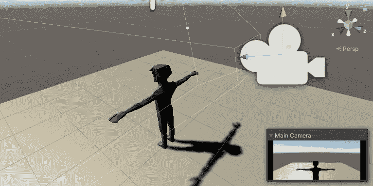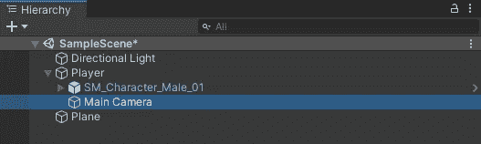

我为资产中的脚本创建了一个文件夹。然后我创建 PlayerController 脚本。

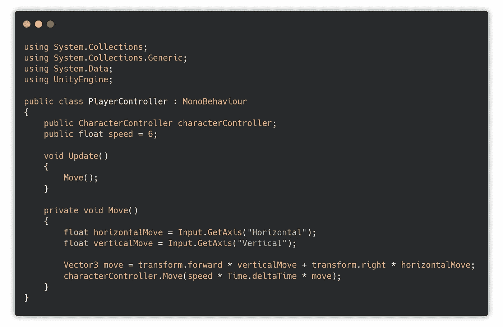

这将通过使用内置函数来移动角色。

现在，我需要将角色控制器添加到玩家对象中，并编辑碰撞器胶囊以适应它。

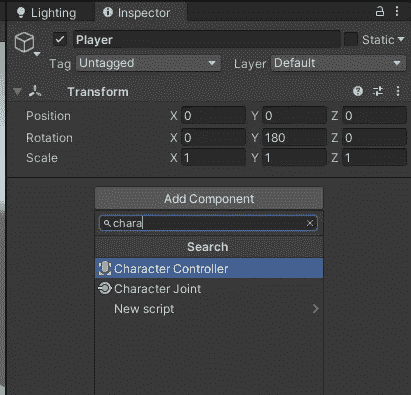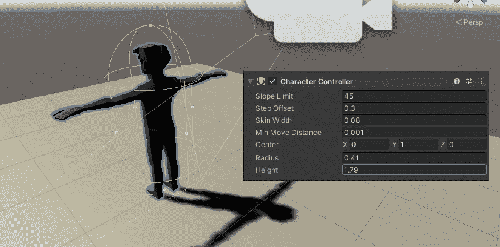

接下来，我将玩家控制器分配给玩家对象，并添加角色控制器。

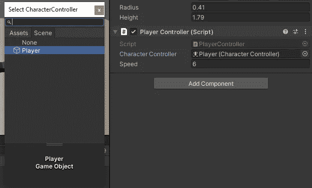

在测试移动之前，我在空场景中添加了一些占位符对象，这样看起来和走动起来会更有趣一些。

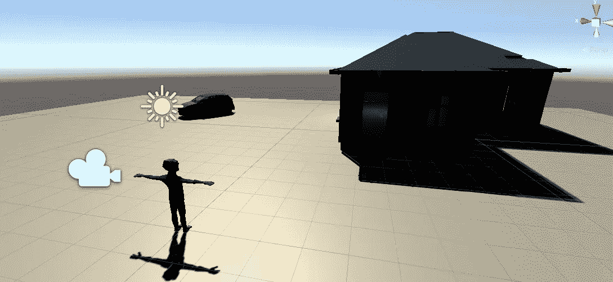

当我玩这个场景时，我可以用经典的 W-A-S-D 控件自由移动。

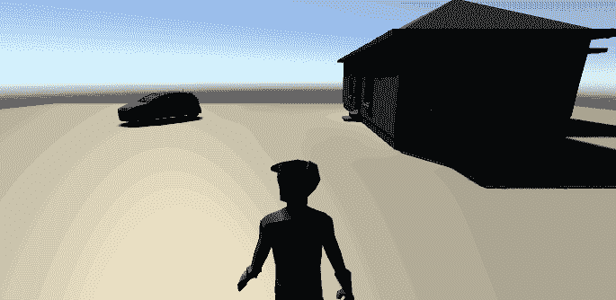

我需要添加的另一件事是重力，这样角色在踏上楼梯后就不会保持漂浮，我还需要添加行走动画、角色旋转和用鼠标四处张望。

重力

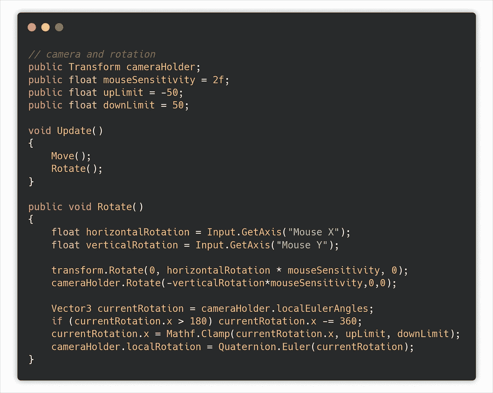

相机旋转

我还在播放器控制器脚本中将主摄像机分配给摄像机支架。

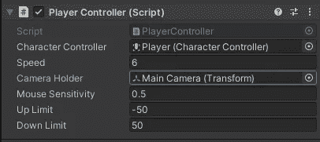

最后的步骤是动画。动画控制器有两个动画——空闲和行走。我在它们之间创造来回的过渡。

我在动画器中添加了一个新的参数*正在行走*(按钮，new Bool):

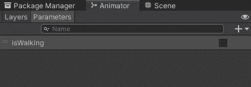

然后我给转换添加条件:

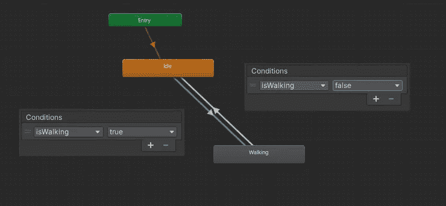

用代码调用它。

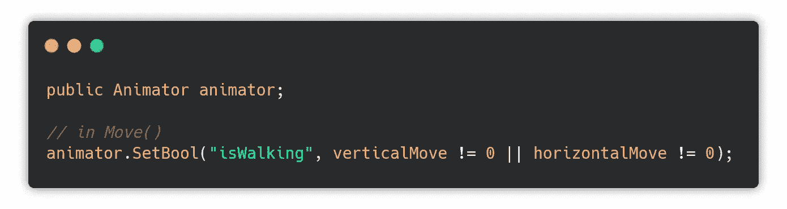

我需要做的最后一件事是给 Animator 变量赋值。

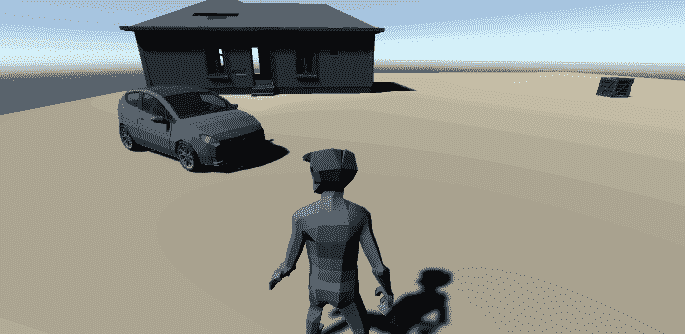

决赛成绩

我的 [github](https://github.com/janjilecek/unity_tutorial/blob/master/Assets/Scripts/PlayerController.cs) 上的播放器控制器代码。

如果你刚刚开始学习如何开发游戏，你可以关注我的关于 Unity 初学者开发的 Skillshare 课程:

 [## 完整指南:Unity 2020 中的动作恐怖 3D 游戏

### 解锁无限制访问此技能共享课程以及由来自世界各地的创作者讲授的数千门课程…

www.skillshare.com](https://www.skillshare.com/tedx?teacherRef=896200912&via=teacher-referral&utm_campaign=teacher-referral&utm_source=ShortUrl&utm_medium=teacher-referral&t=Complete-guide-Action-horror-3D-game-in-Unity-2020&sku=418230537)