# 如何为 Flutter 编写和发布一个理想的软件包

> 原文：<https://itnext.io/how-to-write-and-publish-an-ideal-package-for-flutter-da3215bb7d98?source=collection_archive---------4----------------------->

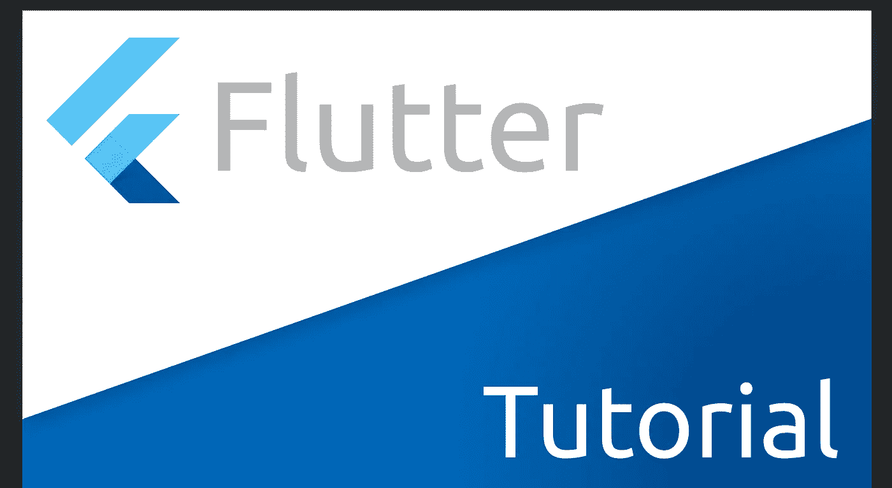

我觉得(或者希望？)，大多数开发人员都希望至少一次与社区分享他们的知识或代码。可以肯定的是，所有开发人员都使用其他开发人员创建的内容。我对此的看法是——如果你能为别人做些事情，而且不会占用你太多时间，那就去做吧。此外，当你发布你的自行车给大众听时，你应该把它们按顺序排列。你将不得不画它们。我得给齿轮上润滑油。这意味着你将得到比以前更好的代码。

# 从什么开始自行车大师的作品在飘动？

简短的回答——来自 [pub.dev](https://pub.dev/) 。更长的答案来自阅读文档。顺便说一下，这里的[是。让我们从头开始——在 Flutter 中，您可以有两种类型的包:](https://flutter.dev/docs/development/packages-and-plugins/developing-packages)

1.  实际上—包装(省道包装)
2.  和插件(插件包)

它们有一些区别——Dart 包只能有 Dart 代码和对 Flutter 的依赖。相反，插件是一个包，它可以与本机代码连接。该本机代码可以是:

*   Java 语言(一种计算机语言，尤用于创建网站)
*   科特林
*   目标-C
*   迅速发生的
*   最近，我们可以在这里添加 C++ / C /等等。因为 Flutter 正式踏上了桌面的土地。

也有不使用平台代码的变化，但是仍然通过 FFI 使用相同的 plus(с++)。这很可能是因为插件。但实际上，在本文的背景下，这并没有起到太大的作用。此外——这两种类型都将被一个词——**包**所称呼，而不会划分为子类型。

我们做了一点介绍——让我们继续。正如同一文档所建议的，要开始编写包，您需要运行以下命令:

```
flutter create --template=package my_package_name
# or
flutter create --template=plugin my_plugin_name
```

我将使用 IDE 的功能。使用 Android Studio / IDEA 的用户可以进行以下操作:

1.  创建新项目

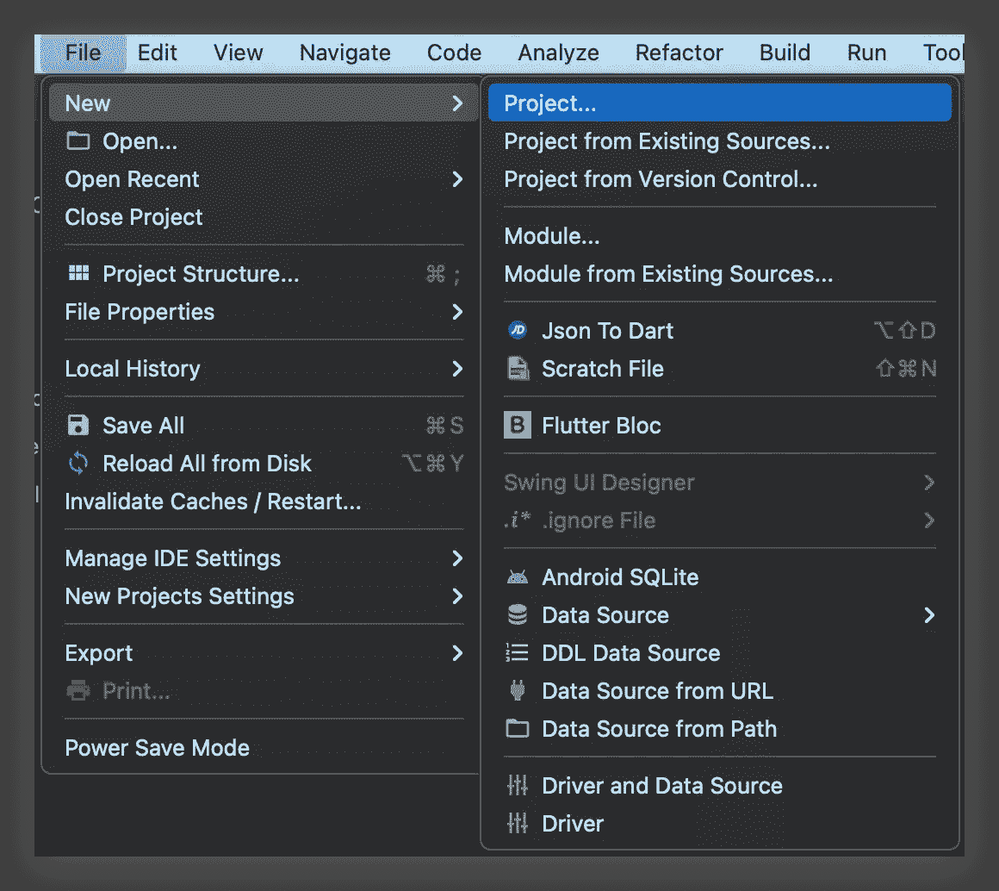

1.  我们选择 Flutter 作为基础(事先——你必须安装 [Flutter](https://plugins.jetbrains.com/plugin/9212-flutter) + [Dart](https://plugins.jetbrains.com/plugin/6351-dart) 插件)

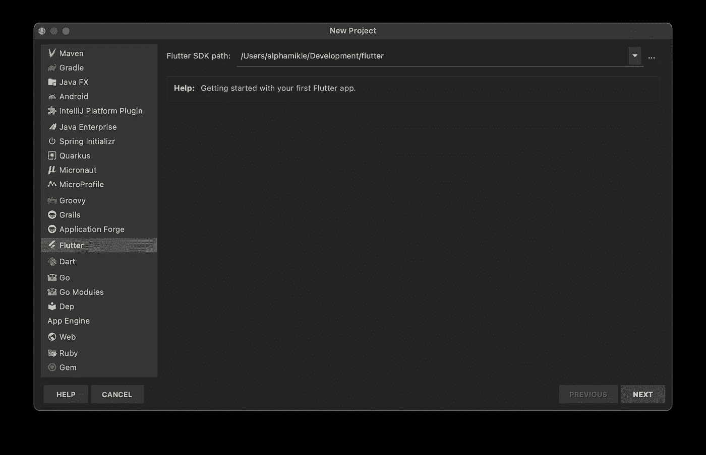

1.  我们选择项目的类型——插件/包(我们根据我们的任务选择其余的属性)

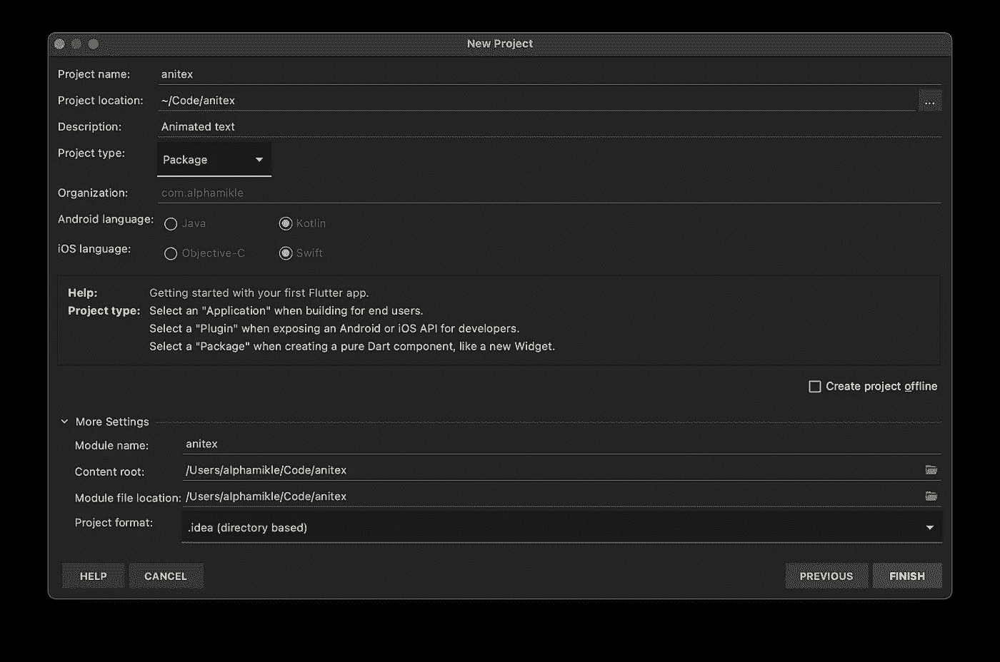

非常好。项目已创建，下一步是什么？

# 我写了一个包，如何发布它？

慢慢来，牛仔！在发布包之前，有一些事情需要记住:

*   您的*发布的*包将永远保持这种状态(只要 [pub.dev](https://pub.dev/) 存在)
*   您的包必须至少满足一些最低的代码质量要求
*   对于软件包的每个新版本，您必须在文件`CHANGELOG.md`中指定更改
*   在发布之前——有必要小心地将文件`LICENCE`与许可证(ha-ha)放在一起，根据许可证，它将在您的项目的根目录中可用
    `pubspec.yaml`在您的项目中必须包含必填字段，其中包含有关您的项目的信息
*   您的包的所有依赖项都应该发布在 [pub.dev](https://pub.dev/) 上

让我们不按顺序讨论所有这些要点。

# 代码质量

所有发布的包都会根据几个代码质量标准自动评分。让我们更详细地考虑一下:

## 有必要记录项目中的所有公共字段和方法

这里的一切都很简单——我们需要使用`///`来处理您漂亮的库的用户可以使用的一切。例如，像这样:

```
/// Describes a one cell of animated text:  
/// We change "100" to "250"  
/// Then, we have 3 animated tokens in not reversed flow:  
///  1th  2th 3th  
/// | 2 | 5 | _ |  
/// | 1 | 0 | 0 |  
/// | _ | _ | _ |  
class AnimatedToken {  
  AnimatedToken({  
  @required this.top,  
  @required this.center,  
  @required this.bottom,  
  @required this.direction,  
  @required this.topSize,  
  @required this.centerSize,  
  @required this.bottomSize,  
  this.axisY,  
  this.axisYOld,  
  this.axisX,  
  this.axisXTween,  
  this.opacity,  
  this.opacityOld,  
  });  

  /// | top |  
 /// | center | /// | bottom |  final String top;  

  /// | top |  
 /// | center | /// | bottom |  final String center;  

  /// | top |  
 /// | center | /// | bottom |  final String bottom;  

  /// Describes in which direction this token will move  
  final Direction direction;  

  /// Size of top letter  
  final Size topSize;  

  /// Size of center letter  
  final Size centerSize;  

  /// Size of bottom letter  
  final Size bottomSize;  

  /// Animation in Y axis for new letter  
  Animation<double> axisY;  

  /// Animation in Y axis for old letter  
  Animation<double> axisYOld;  

  /// Animation in X axis for the same letter (old == new)  
  Animation<double> axisX;  

  Tween<double> axisXTween;  

  /// If token is Direction.bottom - opacity ween will be from  
 /// If Direction.top - 0 -> 1  Animation<double> opacity;  

  /// If token is Direction.bottom - opacity ween will be from  
 /// If Direction.top - 0 -> 1  Animation<double> opacityOld;  

  @override  
  String toString() => '''AnimatedToken {  
 top: $top -> $topSize  
 center: $center -> $centerSize  
 bottom: $bottom -> $bottomSize  
 direction: $direction  
 }''';  
}
```

我不会说这种做法能让你在一段时间后理解什么是什么，但它也能帮助你的软件包的用户。例如，在同一个 IDEA / Android Studio 中，可以在 hover 上显示代码的注释(就像在 VSCode 中一样)。

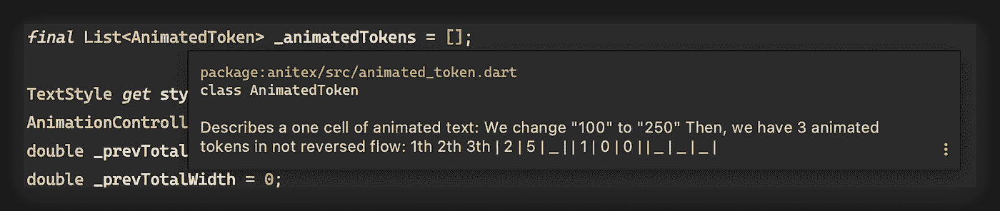

## 建议使用`dart fmt` -根据推荐参数配置的代码格式化程序

这里的一切都很简单。我们使用依赖关系 [pedantic](https://pub.dev/packages/pedantic) 或 [effective_dart](https://pub.dev/packages/effective_dart) (我个人更喜欢 pedantic，因为它开箱后更加严格)。然后我们创建文件`analysis_options.yaml`，并在其中使用我们的依赖关系:

```
include: package:pedantic/analysis_options.yaml
```

如果您对代码的外观有个人偏好，那么您可以添加/重新定义 linter 规则。这将帮助[这个](https://dart-lang.github.io/linter/lints/index.html)和[这个](https://dart.dev/guides/language/analysis-options)资源。顺便说一下，您不仅可以定制 linter 规则，还可以定制一般的语言规则(有一些保留)。这是通过块中的操作来完成的:

```
include: package:pedantic/analysis_options.yaml  

analyzer:  
  strong-mode:  
	implicit-dynamic: false  
    implicit-casts: false  
  errors:  
    todo: ignore  
    mixin_inherits_from_not_object: ignore  
    sdk_version_async_exported_from_core: ignore  
    missing_required_param: error  
    division_optimization: error  
    must_call_super: error  
    always_put_required_named_parameters_first: error  
    avoid_positional_boolean_parameters: error  
    unnecessary_await_in_return: error  
    invalid_use_of_protected_member: error  
    # ...

linter:  
  rules:
    # ...
```

[这里](https://github.com/dart-lang/sdk/blob/3c55d8bb3ebaeddab2f1d577c4371ed149075242/pkg/analyzer/lib/error/error.dart)有一个可以控制的可能错误/情况的完整列表。你可以像一个真正的疯子一样配置一切——我喜欢这种产生一些警告错误的能力，原则上不允许项目运行，例如，如果代码中有对@protected 字段和方法的调用。

做完这些之后，你的代码很可能会大放异彩——你会看到所有应该提前修复的问题。另外，您可以配置 IDE 来完全自动格式化代码，并且不用担心在某个地方您不小心放了两个空格而不是一个花括号挂在了错误的行上。要做到这一点，你只需要这样做:

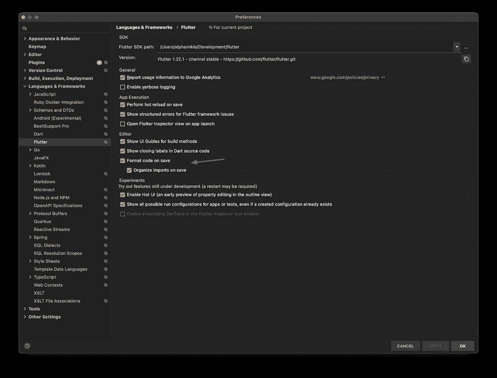

在这样的操控后工作会愉快得多。

构成软件包评估的完整参数列表如下所示:

1.  附带文件

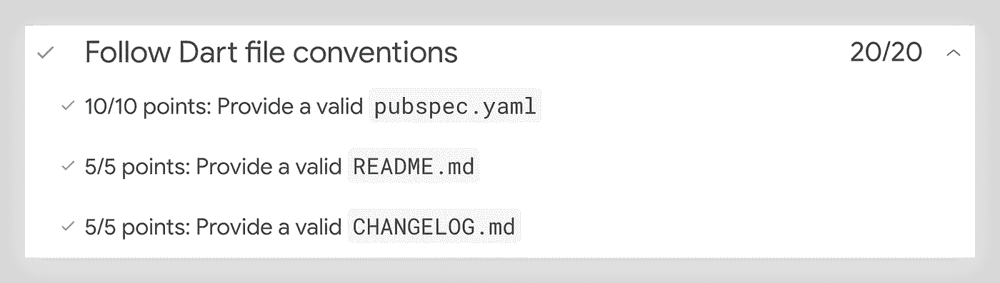

1.  记录您的代码。本段中重要的一点与示例项目有关，它应该位于您的包的 example 文件夹中，并在这个示例中反映您应该如何使用您的包。

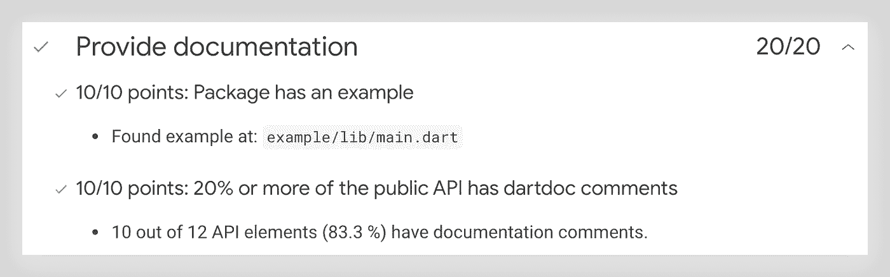

1.  支持所有平台。这也可能会有问题，例如——标准库的某些部分不能在 Web 上使用——所以不可能得到某些包的所有可能的点。此外，有趣的是，在 Flutter 2 发布后，出现了对桌面平台的支持，对于这样的软件包，现在有一个关于它们支持的说明。此外，这样的包应该立即编写为空安全(Dart> = 2.12)

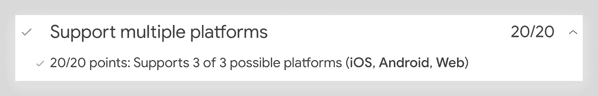

1.  静态分析

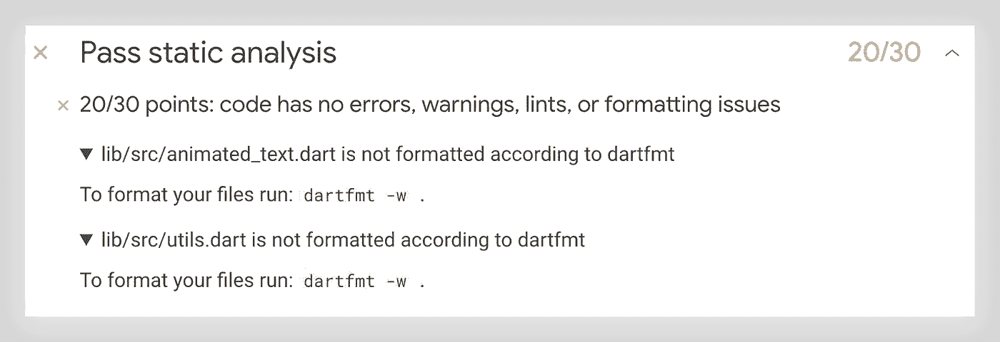

1.  最后一点——新的依赖。作为保持你的包装的动力

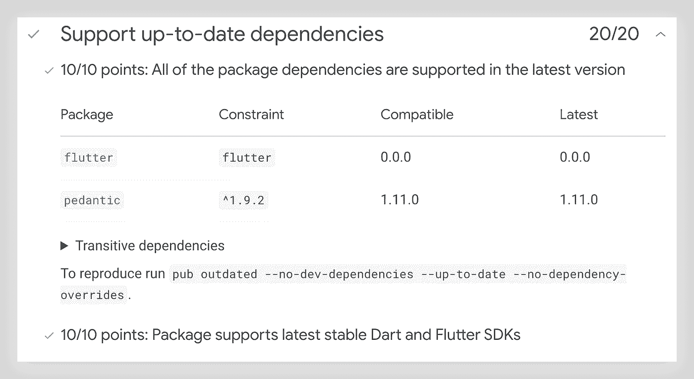

# 变更日志

每个包的更新(以及第一个版本的发布)都应该伴随着对所做更改的描述。为此，项目必须有一个描述变更的特殊文件(`CHANGELOG.md`)。它非常简单，看起来像这样:

```
## [1.1.0] - Add opacity sub-animation for tokens and curves manipulation  
## [1.0.1] - Add demo gif and update readme  
## [1.0.0] - First release
```

对于每个新版本，根据给定的模板在顶部添加一行，一切都会好的。

# 许可证

一切也很简单。我们来举个例子——这里的。我们正在寻找一个合适的许可证，接受它的文本，表明我们是作者，你就大功告成了。

# 公共规范

您可以熟悉这个配置的[文档](https://dart.dev/tools/pub/pubspec)，或者只看一个例子(它反映了发布所必需的字段):

```
name: anitex  
description: Anitex is a implicitly animated text widget, which animates on passed text changes  
version: 1.2.0  

repository: https://github.com/alphamikle/anitex  
homepage: https://github.com/alphamikle/anitex  

environment:  
  sdk: ">=2.7.0 <3.0.0"  
  flutter: ">=1.17.0 <2.0.0"  

dependencies:  
  flutter:  
  sdk: flutter  

dev_dependencies:  
  flutter_test:  
  sdk: flutter  
  pedantic: ^1.9.2  

flutter:
```

# 出版过程

你可以这样做:

```
pub publish
```

执行该命令的结果将是一个简短报告的输出，例如，如下所示:

```
...
...
Package validation found the following potential issue:
* ./CHANGELOG.md doesn't mention current version (2.0.0).
  Consider updating it with notes on this version prior to publication.Publishing is forever; packages cannot be unpublished.
Policy details are available at https://pub.dev/policyPackage has 1 warning.. Do you want to publish anitex 2.0.0 (y/N)?
```

此处显示了一份报告，但并不是一切都正常——包存在问题，这意味着绝对不值得以这种形式发布它，因此，为了避免不愉快的情况，您应该在发布前使用以下命令:

```
pub publish --dry-run
```

它将显示相同的问题，或他们的缺席，这里:

```
...
...
Package has 0 warnings.
```

而当你看到珍爱的`0 warnings`，那么你就可以发布这个包了。还有哪些细微差别？你需要在同一个 [pub.dev](https://pub.dev/) 上注册(使用谷歌账户)。当您执行 publish 命令时，系统会提示您登录控制台。

# 这是永远

即使从来没有人使用过你的包(我希望不是真的)，Google 也不会允许你直接从 pub.dev 中移除你的包(可能只是通过支持，但我没有试过)。但是，如果你认为发布那个包是一个错误，那么你可以把它标记为*不支持*。它将有一个明亮的盘子，告诉你所有的潜在粉丝，你头脑中的这个产品将不再发展。

你可以更进一步，让包*不在列表中*——它将退出常规搜索，但在高级搜索中仍然可用——这是私有包和公共包的结合。

此外，在管理软件包的管理面板中，您可以创建一个所谓的发布者——一种抽象的人，以他的名义发布软件包。方便各种社区/公司，但不给什么特殊利润(给个徽章)。为此，您还需要在**中购买一个域名。dev** zone(您不仅可以在其中)，发布者将链接到该 zone。

# 还有什么？

你发布了包——你集了 110 或者 130 分，但是没人用……这就是最有意思的事情开始了——推广。你可以写文章，用大量的例子说明你的软件包是如何使用的，并详细解释为什么它比另一个非常相似的解决方案更好。在带有字母 **M** 的参考资料中，你可以找到许多类似计划的文章。你至少可以从同事开始，或者，如果你对自己和自己的决定有信心，可以在工作项目中使用它。至少取得一些名气之后，你可以试试运气，去，比如——[这里](https://github.com/Solido/awesome-flutter)。这是一个有趣的 Flutter 开源解决方案的集合，您的大软件包可能也在那里！

# с结论

他们不是很多——在 Flutter 生态系统中发布库的过程看起来非常简单，与社区共享您的工作的想法非常高尚，并且在我看来，这是*必须的*，因为每个开发人员都使用了其他开发人员的脑力劳动成果，并且会非常公平——做出自己的贡献。此外，亲爱的朋友，这对你很有用——来自开源社区的新朋友，求职的新机会(许多人力资源正在 GitHub 上寻找开发人员),以及简单地将自己培养成一名技术专家。