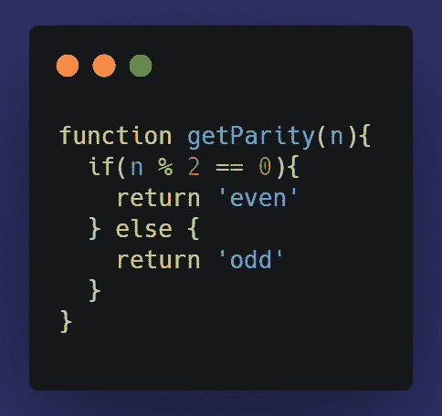
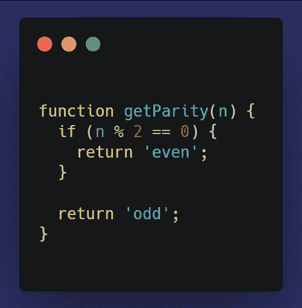
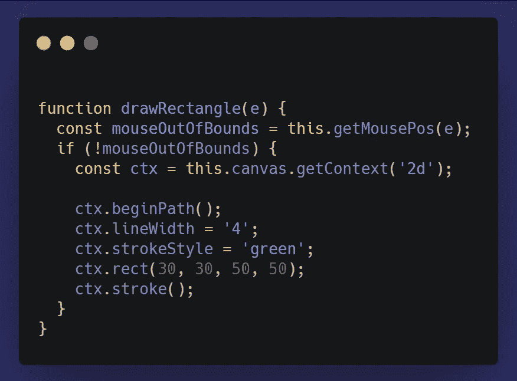
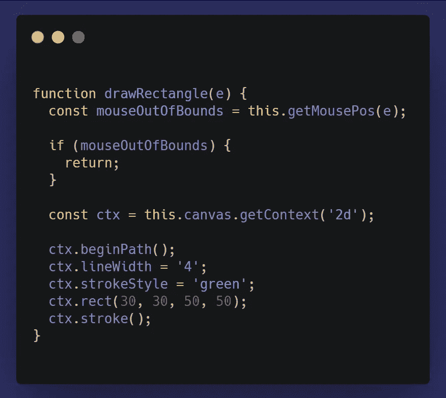
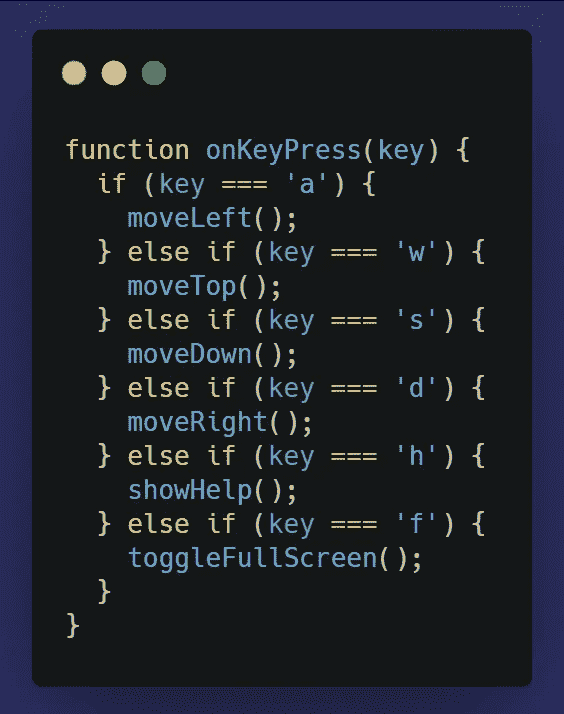
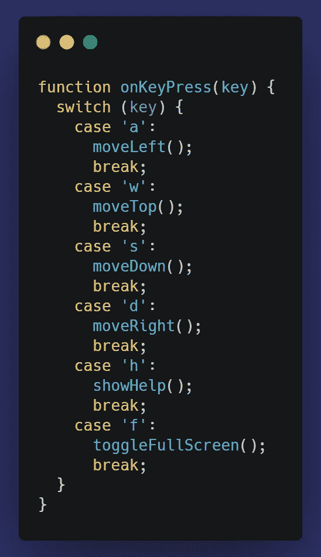
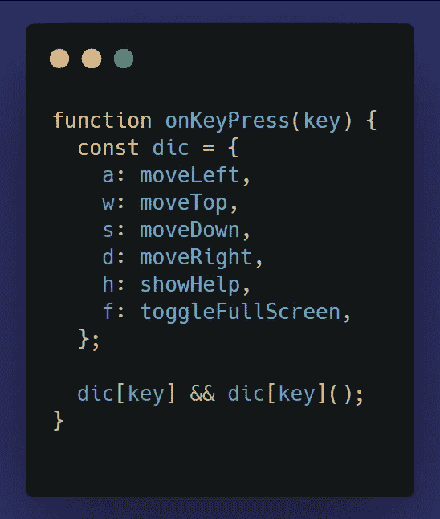

# 如何写出更好的条件表达式

> 原文：<https://itnext.io/how-to-write-better-conditional-expressions-712c3dd014db?source=collection_archive---------0----------------------->


照片由[乔恩·泰森](https://unsplash.com/@jontyson?utm_source=unsplash&utm_medium=referral&utm_content=creditCopyText)在 [Unsplash](/s/photos/left-or-right?utm_source=unsplash&utm_medium=referral&utm_content=creditCopyText) 上拍摄

编写条件代码可以被视为非常简单明了的事情，您只需学习一次，然后就一直这样做。

然而，即使是最简单的事情也可以改进。

以下是一些可以用来编写更好的条件表达式的小技巧:

# 用简单的 If 替换 If/Else



上面的代码说明了当我们有一个函数根据给定的条件返回不同的结果时的情况。

`return`语句停止一个函数的执行，并从该函数返回一个值。这意味着 return 语句之后的代码将不会被执行。

因此，我们可以像这样轻松地重写上面的代码:



在这种情况下，不需要其他条件分支，因为如果第一个条件被评估为**真**，则返回值**偶数**，并且函数执行停止。

# 将大部分代码放在条件分支之外



上面的代码说明了只有在满足条件的情况下我们才必须运行某个代码的情况。

这种方法的问题是，函数的执行可能变得难以理解，尤其是如果 **if** 分支中的代码很长。

更明确的方法如下:



我们不是将整个代码放在一个条件分支中，如果鼠标没有越界，这个分支就会运行，而是检查鼠标位置是否无效，如果是，我们就停止函数的执行，否则，我们就让它继续执行。

# 当有太多条件时，使用开关



当我们必须处理多个条件分支时，就像上面的例子一样，编写 **If/Else** 对并不是最好的选择。

因为我们检查同一个变量的值，所以我们可以使用**开关轻松地将其转换为更清晰的形式。**



# 当条件分支中的代码只是一行时，使用字典

当我们只需要在满足某个条件的情况下执行一个函数时，就像上面的代码一样，我们可以进一步改进，我们可以使用字典来代替 **Switch 语句。**



就书面代码而言，该词典提供了最清晰、最短的版本。

这里，我们将函数引用保存在一个对象中，然后基于`key` 值调用所需的函数，但前提是该键有值。

`dic['a']`将返回`moveLeft`，`dic['w']`将返回`moveTop`以此类推。

但是，如果没有与`key`值匹配的属性，那么它将返回`undefined`，因此我们需要在尝试调用该函数之前检查该键是否有值。

这是通过`dic[key] && dic[key]();`完成的，这与

```
if(dic[key]){
  dic[key]();
}
```

# 结论

即使是最小的事情也可以改进，写条件表达式就是其中之一。关键是要一直寻找更好更新的解决老问题的方法，谁知道呢，也许有时候你会有所发现。